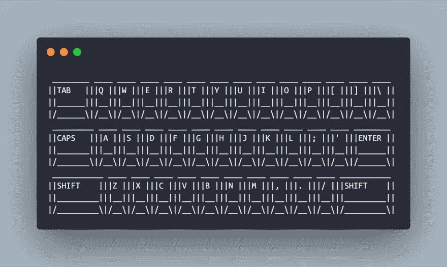

# 让我兴奋的 JavaScript 一行程序

> 原文：<https://dev.to/healeycodes/javascript-one-liners-that-make-me-excited-56aj>

掸掉你的三重表情，我们要进去了。

一行程序很难维护(有时甚至很难理解)，但这并不妨碍它们酷得要命。写了一个简洁的解决方案后，会有某种满足感。

这是我最近最喜欢的一些收藏。它们都将在您的开发控制台中运行，所以打开它并尝试它们。我希望你能在评论中分享一些你自己最喜欢的！

#### 日历黑客

阿里·斯皮特尔最近在推特上发布了这个消息。它解决了我多次面临的一个问题。如果你把负号换成正号，它会给你接下来的七天。

```
// Create an array of the past seven days, inclusive
[...Array(7).keys()].map(days => new Date(Date.now() - 86400000 * days)); 
```

Enter fullscreen mode Exit fullscreen mode

#### 随机 ID 生成

这是我在构建原型时创建唯一 id 的常用功能。过去我甚至见过有人在生产中使用它。这不安全，但是...还有更糟糕的随机生成函数。

```
// Generate a random alphanumerical string of length 11
Math.random().toString(36).substring(2); 
```

Enter fullscreen mode Exit fullscreen mode

#### Quines

A [quine](https://en.wikipedia.org/wiki/Quine_(computing)) 是一个输出自己源代码的程序。奎因一直令我着迷。我已经用不同的语言完成了几次我自己的 quines，但是细节是游戏的名字。

我为你挑选了一些获胜者。这三个分别归功于[妈妈趣味横生](https://codegolf.stackexchange.com/a/60148/78322)、[pleases and](https://codegolf.stackexchange.com/a/270/78322)和[彼得·奥尔森](https://codegolf.stackexchange.com/a/3173/78322)。

```
// $=_=>`$=${$};$()`;$()
$=_=>`$=${$};$()`;$()

// eval(I="'eval(I='+JSON.stringify(I)+')'")
eval(I="'eval(I='+JSON.stringify(I)+')'")

// For those who like their quines via alert
// (function a(){alert("("+a+")()")})()
(function a(){alert("("+a+")()")})() 
```

Enter fullscreen mode Exit fullscreen mode

#### 刮查询参数

谈论不可维护的代码。这将页面的查询参数转换为 78 字节的对象。感谢[亚历克斯·洛尔](https://dev.to/lexlohr)的代码高尔夫它(和齐翊也是)。

`?foo=bar&baz=bing => {foo: bar, baz: bing}`

```
// Set the current page's query parameters to `q`
q={};location.search.replace(/([^?&=]+)=([^&]*)/g,(_,k,v)=>q[k]=v);q; 
```

Enter fullscreen mode Exit fullscreen mode

我想看看一个微型机器人这么努力的工作。

#### 工作时钟

只需一点 HTML，你就可以用源代码创建一个可以一口气读出来的时钟。在一位同事的挑战下，我写了这篇文章。它每秒滴答一次，用当前时间更新页面。

```
<body onload="setInterval(()=>document.body.innerHTML=new Date().toGMTString().slice(17,25))"></body> 
```

Enter fullscreen mode Exit fullscreen mode

#### 洗牌列阵

在皮托尼斯塔带着他们的`import random`、`random.shuffle(array)`解决方案出现之前，我们将享受我们所拥有的。这有一个好处，即成为无限循环的可能性极小(取决于实现)。[米歇尔·亨德里克斯](https://dev.to/elmuerte)在这里帮助我们拯救了一些角色👍。[不在生产中使用](https://www.robweir.com/blog/2010/02/microsoft-random-browser-ballot.html)。

```
// Return a shuffled copy of an Array-like
(arr) => arr.slice().sort(() => Math.random() - 0.5) 
```

Enter fullscreen mode Exit fullscreen mode

#### 生成随机十六进制代码

ES7 的 [padEnd](https://developer.mozilla.org/en-US/docs/Web/JavaScript/Reference/Global_Objects/String/padEnd) 是一个祝福。与`padStart`一起，他们使得数字到字符串的转换变得更加容易。将十六进制值直接写入 JavaScript 代码也总是非常简洁。

```
// Generate a random hex code such as `#c618b2`
'#' + Math.floor(Math.random() * 0xffffff).toString(16).padEnd(6, '0'); 
```

Enter fullscreen mode Exit fullscreen mode

#### 体面地通过面试

臭名昭著的面试问题答案。我研究过，我不认为它能比这更短。

```
for(i=0;++i<101;console.log(i%5?f||i:f+'Buzz'))f=i%3?'':'Fizz' 
```

Enter fullscreen mode Exit fullscreen mode

#### 删除重复项

这只适用于原语，但它仍然很漂亮。 [Set](https://developer.mozilla.org/en-US/docs/Web/JavaScript/Reference/Global_Objects/Set) 接受任何可迭代的对象，比如数组`[1,2,3,3]`，并删除重复的对象。扩展操作员进行设置`[1,2,3]`。

```
// Remove duplicates from the iterable `arr`
[...new Set(arr)] 
```

Enter fullscreen mode Exit fullscreen mode

#### 一个真实到你可以品尝的键盘

好吧，我真的不认为这是一句俏皮话，但它太好了，不能不包括。edc65 的精湛 codegolf 解决方案。它简洁到了一个错误，离它的生命只有一英寸之遥，但我们应该沐浴在它的光辉中。

```
// Return a ***3D*** ASCII keyboard as string
(_=>[..."`1234567890-=~~QWERTYUIOP[]\\~ASDFGHJKL;'~~ZXCVBNM,./~"].map(x=>(o+=`/${b='_'.repeat(w=x<y?2:' 667699'[x=["BS","TAB","CAPS","ENTER"][p++]||'SHIFT',p])}\\|`,m+=y+(x+'  ').slice(0,w)+y+y,n+=y+b+y+y,l+=' __'+b)[73]&&(k.push(l,m,n,o),l='',m=n=o=y),m=n=o=y='|',p=l=k=[])&&k.join`
`)() 
```

Enter fullscreen mode Exit fullscreen mode

它打印:
[](https://res.cloudinary.com/practicaldev/image/fetch/s--ja1K0qVN--/c_limit%2Cf_auto%2Cfl_progressive%2Cq_auto%2Cw_880/https://thepracticaldev.s3.amazonaws.com/i/y431t235u8k8owjmqhpa.png)

太神奇了。

* * *

加入我的关于编程和个人成长的[时事通讯](https://buttondown.email/healeycodes)的 150 多人注册！

我发关于科技的微博。