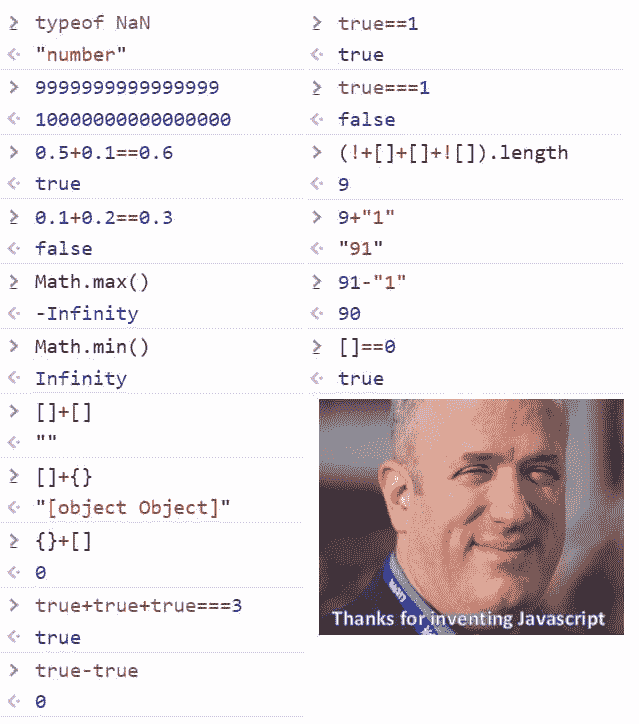

# 来自互联网的一张图片中的 JavaScript 怪癖

> 原文：<https://dev.to/mkrl/javascript-quirks-in-one-image-from-the-internet-52m7>

最近我在谷歌图片上偶然发现了这张照片:

[](https://res.cloudinary.com/practicaldev/image/fetch/s--Ysm3UtDq--/c_limit%2Cf_auto%2Cfl_progressive%2Cq_auto%2Cw_880/https://thepracticaldev.s3.amazonaws.com/i/4n583bhdqnz03mq3t13v.png)

顺便说一下，照片上的人是 Brendan Eich，JavaScript 的创始人，Mozilla 项目的联合创始人。

即使有些例子与语言本身并不真正相关，考虑到它对于一些只具有经典“严格语言”编程背景的人来说没有太大意义，我仍然觉得给它一个简短的细分足够有趣。

## 击穿

从“无聊”的部分开始:

#### 浮点运算

```
> 9999999999999999
< 10000000000000000

> 0.5+0.1==0.6
< true

> 0.1+0.2==0.3
< false 
```

Enter fullscreen mode Exit fullscreen mode

这没什么好奇怪的，这是一个已经存在了很长时间的老概念。当然，这与 JavaScript 的“特性”无关。我不会在这里解释它，我只会留下一个链接，链接到这个伟大的专门解释浮点数学的网站。

#### 不是数就是数

```
> typeof NaN
< "number" 
```

Enter fullscreen mode Exit fullscreen mode

“南”到底是什么？事实上，它是一个特定值的表示，不能在数字类型的限制内表示(事实上，唯一的 JS 数字原语是`float`)。NaN 是在 IEEE 754 浮点标准中引入的。

所以，它只是一个在这种特定环境下，计算机无法计算的数字。

#### 类型转换

JavaScript 是一种动态类型语言，这导致了最讨厌的“为什么它这样”调试会话，对于那些不熟悉静默(隐式)类型强制的人来说。

简单的部分:与`===`
严格相等

```
> true === 1
< false 
```

Enter fullscreen mode Exit fullscreen mode

严格相等比较两个值。在进行比较之前，这两个值都不会隐式转换为其他值。如果这些值具有不同的类型，则认为这些值不相等。布尔变量不等于 1，1 是一个数字。

另一方面，还有这个:

```
> true == 1
< true 
```

Enter fullscreen mode Exit fullscreen mode

这是*隐式类型强制*的一个例子。当您将运算符应用于不同类型的值:`2+'2'`、`'true'+false`、`35.5+new RegExp('de*v\.to')`或者将一个值放入期望它是某种类型的特定上下文中时，就会触发隐式类型强制，例如`if (value) {`(强制为`boolean`)。

JavaScript 类型转换并不是最琐碎的部分，所以我建议进一步阅读阿列克谢·萨莫什金的这篇伟大的文章和 T2 的这篇关于等式比较的 MDN 小文档。还有这个[平等比较备忘单](https://dorey.github.io/JavaScript-Equality-Table/)可能会派上用场。

无论如何，让我们回到我们的照片。

```
> [] + []
< "" 
```

Enter fullscreen mode Exit fullscreen mode

JS 中有两种类型的变量:对象和原语，原语有`number`、`string`、`boolean`、`undefined`、`null`和`symbol`。其他的都是对象，包括函数和数组。

当执行带有调用隐式转换的运算符的表达式时，整个表达式将被转换为以下三种基本类型之一:

*   线
*   数字
*   布尔型

原语转换遵循某些规则，这些规则[非常简单](https://www.w3schools.com/js/js_type_conversion.asp)。

对于对象:在`boolean`的情况下，任何非原始值总是被强制为`true`。对于`string`和`number`，正在运行下面的内部操作 [ToPrimitive(input，PreferredType)](https://tc39.github.io/ecma262/#sec-toprimitive) ，其中可选的`PreferredType`为`number`或`string`。这将执行以下算法:

1.  如果输入已经是一个原语，就按原样返回它
2.  否则，输入将被视为对象。调用`input.valueOf()`。如果结果是原语，则返回。
3.  否则，调用`input.toString()`。如果结果是原语，则返回它。
4.  否则，抛出一个 TypeError。

如果`PreferredType`是`string`，交换 2 和 3。

看看上面在实际 JavaScript 中的伪实现，加上布尔转换(最初是由 Alexey Samoshkin 通过前面提到的文章提供的[)。](https://gist.github.com/samoshkin/baf070ab19b73f4f39ec54149fb37c30#file-js-to-primitive-internal-js) 

```
function ToPrimitive(input, preferredType){

  switch (preferredType){
    case Boolean:
      return true;
      break;
    case Number:
      return toNumber(input);
      break;
    case String:
      return toString(input);
      break
    default:
      return toNumber(input);  
  }

  function isPrimitive(value){
    return value !== Object(value);
  }

  function toString(){
    if (isPrimitive(input.toString())) return input.toString();
    if (isPrimitive(input.valueOf())) return input.valueOf();
    throw new TypeError();
  }

  function toNumber(){
    if (isPrimitive(input.valueOf())) return input.valueOf();
    if (isPrimitive(input.toString())) return input.toString();
    throw new TypeError();
  }
} 
```

Enter fullscreen mode Exit fullscreen mode

所以，到最后，原来的`[] + [] == ""`被解释为:

```
ToPrimitive([]) + ToPrimitive([]) 
```

Enter fullscreen mode Exit fullscreen mode

两个数组都返回空字符串作为`toString([])`的结果。最终结果是两个空字符串的串联。

现在，上:

```
> [] + {}
< "[object Object]" 
```

Enter fullscreen mode Exit fullscreen mode

因为`String({})`导致了`[object Object]`，所以结果是`""`和`"[object Object]"`的简单串联。很简单。这到底是怎么回事？

```
> {} + []
< 0 
```

Enter fullscreen mode Exit fullscreen mode

原来，JavaScript 将第一个`{}`解释为代码块！当从头到尾解析输入时，它将`{`视为块的开始，然后立即关闭`}`。因此，使用我们的伪实现，前面的例子将被评估为如下:

```
ToPrimitive(+[]) 
```

Enter fullscreen mode Exit fullscreen mode

..也就是 0。`+`是一元前缀运算符，将操作数转换为数字。

松散相等`==`和二元`+`操作符总是触发默认的`preferredType`，该操作符假定数字转换(返回字符串的日期除外)。这就解释了`true+true+true===3`和`true==1`。因此，正如预期的那样，`true===1`返回`false`,因为表达式左侧没有操作符，并且`===`不会触发隐式类型强制。与`[]==0`相同，大致相当于`Number([]) == 0`。

一切都带来了有趣的例子，就像我们这里的例子一样

```
> (!+[]+[]+![]).length
< 9 
```

Enter fullscreen mode Exit fullscreen mode

打破它

*   (!+[]) + [] + (![])
*   ！0 + [] +假
*   真+ [] +假
*   真+“”+假
*   "混蛋"

“truefalse”。长度=== 9

很简单。

最后(老实说，也是最不重要的):

#### Math.max() < Math.min()？

```
> Math.max()
< -Infinity
> Math.min()
< Infinity 
```

Enter fullscreen mode Exit fullscreen mode

这个*可能*被认为是一个小的语言缺陷，从一个需要某些参数的函数返回一种意想不到的结果。

但实际上这背后有一点实际的数学计算。

让我们猜测一下`Math.max()`是如何工作的，并把另一个假想的脚本写成实际的 JavaScript:

```
Math.max = function () {
  let temp = -Infinity;
  for ( let i = 0; i < arguments.length; i++ ) {
    let num = Number(arguments[i]);
    if ( num > temp ) {
      temp = num;
    }
  }
  return Number(temp);
} 
```

Enter fullscreen mode Exit fullscreen mode

现在，当没有参数被传递时，返回`-Infinity`是有意义的。

`-Infinity`是`Math.max()`的一个[身份元素](https://en.wikipedia.org/wiki/Identity_element)。二元运算的单位元素是在将所述运算应用于两个元素之后，保持任何其他元素不变的元素。

所以，0 是加法的恒等式，1 是乘法的恒等式。`x+0`和`x*1`永远是`x`。在`-Infinity`和`x`中，`x`永远是最大数。

查理·哈维有一篇非常精彩的文章深入探讨了这个话题。

* * *

综上所述，隐式类型强制是一个非常重要的概念，你应该时刻牢记在心。避免松散的平等。想想你在比较什么，尽可能使用显式转换。如果上述内容让您感到害怕，请考虑切换到 TypeScript:)

如果你想看更多的“wtf”JavaScript，有一个很棒的资源，字面上叫做 [wtfjs](https://github.com/denysdovhan/wtfjs) ，也可以通过`npm`作为手册获得。