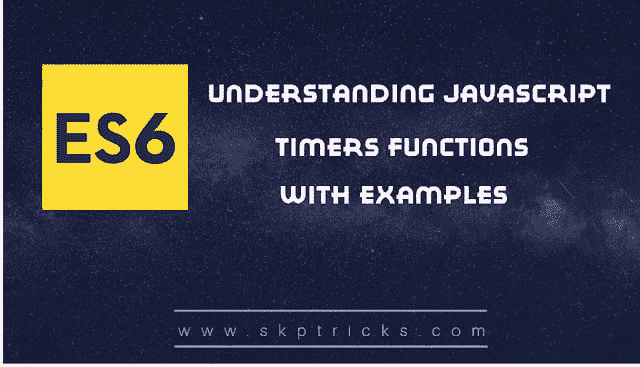

# 带有示例的 JavaScript 计时器

> 原文：<https://dev.to/skptricks/javascript-timers-with-examples-159f>

帖子链接: [JavaScript 定时器示例](https://www.skptricks.com/2018/12/javascript-timers-with-examples.html)

本教程解释了如何使用 javaScript 定时器功能。JavaScript 提供了一对方便的窗口对象方法:setTimeout()和 setInterval()。这些允许您在将来的某个时候运行一段 JavaScript 代码。如果我们想延迟 Javascript 代码的执行，那么我们需要使用时间间隔函数。这些时间间隔称为定时事件。JavaScript 代码块是同步执行的。但是有一些 JavaScript 本地函数(定时器)允许我们延迟执行，我们可以创建一种异步的行为。

让我们看看 javascript 中不同类型的定时器函数:
setTimeout 允许在时间间隔后运行一次函数。
setInterval 允许以运行之间的间隔定期运行功能。
clearTimeout 将停止当前运行的定时器功能。

[JavaScript 定时器示例](https://www.skptricks.com/2018/12/javascript-timers-with-examples.html)

