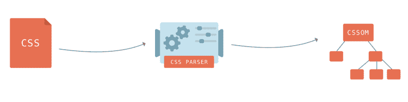
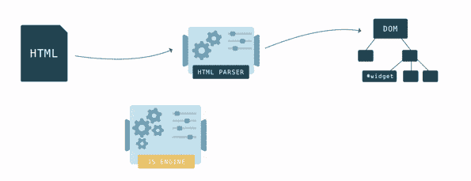
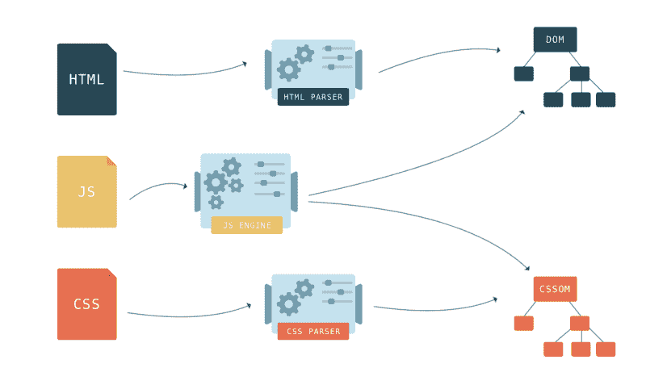

# JavaScript:浏览器会发生什么？

> 原文：<https://dev.to/azkar_moulana/javascript-what-happens-with-the-browser-3cdn>

理解浏览器如何处理我们的 JavaScript 代码非常重要。作为 web 开发人员，它给了我们极大的理解，让我们真正了解 JavaScript 发生了什么。

因此，简而言之，所有的语言，不管是什么编程语言，都是人类可读的格式。这是程序员遵循的语言语法。然而，你的电脑不能理解这一点。它能理解的只是所谓的字节码或 1 和 0。

所以，现在我想对你大部分时间使用的每个应用程序多了解一点。它由许多不同的应用程序组成，控制程序的某些方面。它看起来像一个程序，但实际上是由许多不同的程序组成的。

***“比如浏览器有 3 个我们感兴趣的主程序。”*T3】**

第一个程序是 DOM 解释器。这将获取您的超文本标记语言文档或 HTML 文档，并将其转换并显示在浏览器中。

接下来，我们有另一个程序，它是浏览器的一部分，是 CSS 解释器。这将采用 CSS 代码和样式的网页，使它看起来很好。

最后，我们有了另一个叫做 JavaScript 引擎的小程序。这个 JavaScript 引擎程序在不同的浏览器中可以有不同的名字，但它们只是浏览器 JavaScript 引擎的代号。比如火狐有蜘蛛猴，谷歌 Chrome 有 V8 引擎，Safari 有 Nitro，IE 有 Chakra。

等待我的下一篇文章来深入解释 JavaScript 引擎；)

所以，程序的名字并不重要，它是一个 JavaScript 引擎，它的工作是获取从 web 服务器下载的 JavaScript 文件，解释它们，并将其编译成可以在用户计算机上运行的字节码。这就是我们称之为客户端的原因，因为所有的东西都被下载到客户端的计算机上，无论是 HTML、CSS 还是 JavaScript，都在客户端的计算机上进行解释。

因此，这三个主要的迷你程序被称为实时编译器或 JIT 编译器。因此，这仅仅意味着下载到计算机上的源代码是从文件成功下载并在用户的计算机上编译时开始实时编译的。所以，再一次把它转换成字节码，这样它就可以显示了。

这就是浏览器所发生的一切。所以，希望这能让你对 JavaScript 有更多的了解。

注意，当用户下载 HTML、CSS 和 JavaScript 文件时，它们是人类可读的格式。所以任何人都可以看源代码。然而，这是网络开放的全部意义，它是灵活的，可扩展的。所以实际上没有办法阻止某人查看源代码，老实说，我通过查看其他人的源代码学到了很多。因此，通过开放的网络和跨许多不同平台的即时编译器，我们允许本地浏览器处理编译过程，我们只是简单地交付将被解释的文件。

* * *

点击 [@Azkar_moulana](https://twitter.com/Azkar_moulana) 关注我，了解关于 JavaScript、Angular、Node.js 等的有趣文章和聊天..