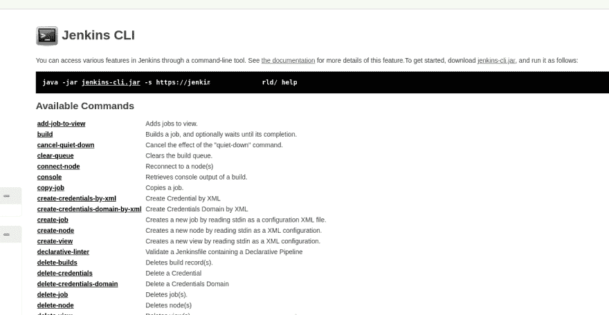
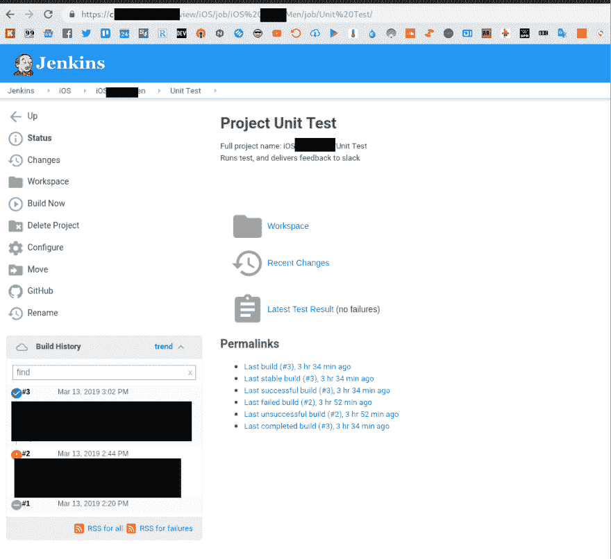

# Jenkins:将作业导入另一台服务器

> 原文：<https://dev.to/setevoy/jenkins-import-a-job-to-another-server-1dg>

[](https://res.cloudinary.com/practicaldev/image/fetch/s--ZNr-ArAg--/c_limit%2Cf_auto%2Cfl_progressive%2Cq_auto%2Cw_880/https://rtfm.co.ua/wp-content/uploads/2016/01/Jenkins.sh-600x600-e1453134979914.png) 我们有一个旧的 Jenkins，其中有一堆 iOS 作业需要复制到新的 Jenkins 实例中。

[文档](https://wiki.jenkins.io/display/JENKINS/Administering+Jenkins#AdministeringJenkins-Moving%2Fcopying%2Frenamingjobs)建议:

> 只需复制相应的作业目录，即可将作业从 Jenkins 的一个安装移动到另一个安装。

即，第一种解决方案是复制整个`jobs`目录或复制每个项目作业的目录。

这种方法的缺点(或优点——取决于具体的任务)是，随着一个作业的目录，它的整个历史、工件、日志等也将被复制。

另一个解决方案是使用 [Jenkins CLI](https://wiki.jenkins.io/display/JENKINS/Jenkins+CLI) 并允许复制完整作业的配置，但它将“从头开始”创建。

### 詹金斯 CLI

转到*管理 Jenkins > Jenkins CLI* 并下载 CLI 的 jar 文件:

[](https://rtfm.co.ua/wp-content/uploads/2019/03/Screenshot_20190313_111842.png)

[](https://rtfm.co.ua/wp-content/uploads/2019/03/Screenshot_20190313_111956.png)

下载:

```
$ sudo wget -O /usr/local/bin/jenkins-cli.jar https://jenkins.example.com/jnlpJars/jenkins-cli.jar 
```

检查一下——在`-auth`中传递你的*用户:传递*或*用户:api_token* ，在`-s`中——Jenkin 的主机 URL，这里使用 Jenkin 自己的 CLI 文件在本地运行:

```
root@jenkins:/backups# java -jar /data/jenkins/war/WEB-INF/jenkins-cli.jar -auth user:pass -s http://localhost:8080/ version
2.89.4 
```

现在将*单元测试*作业从 *iOS 项目名*目录导入到`Projectname_Unit_Test_job.xml`文件:

```
root@jenkins:/backups# java -jar /data/jenkins/war/WEB-INF/jenkins-cli.jar -auth user:pass -s http://localhost:8080/ get-job 'iOS Projectname/Unit Test' > Projectname_Unit_Test_job.xml 
```

检查文件内容:

```
root@jenkins:/backups# head Projectname_Unit_Test_job.xml
<?xml version='1.0' encoding='UTF-8'?>
<project>
<actions/>
<description>Runs test, and delivers feedback to slack</description>
<keepDependencies>false</keepDependencies>
<properties>
<com.coravy.hudson.plugins.github.GithubProjectProperty plugin="github@1.29.3">
<projectUrl>https://github.com/Projectname-dev/Projectname-iOS/</projectUrl>
<displayName></displayName>
</com.coravy.hudson.plugins.github.GithubProjectProperty> 
```

并将其导出到新的 Jenkins 服务器上的 *iOS Projectname* :使用`cat`读取文件内容，然后通过管道`|` :
将数据传递给 CLI

```
root@jenkins:/backups# cat Projectname_Unit_Test_job.xml | java -jar /data/jenkins/war/WEB-INF/jenkins-cli.jar -auth user:pass -s https://ci.example.com create-job 'iOS Projectname/Unit Test' 
```

检查一下:

[](https://rtfm.co.ua/wp-content/uploads/2019/03/Screenshot_20190313_183742.png)

完成了。

### 类似的帖子

*   <small>2017 年 02 月 08 日</small> [詹金斯:沙盒。RejectedAccessException:脚本不允许使用](https://rtfm.co.ua/jenkins-sandbox-rejectedaccessexception-scripts-not-permitted-to-use/) <small>(0)</small>
*   T002/09/2017 t1t2a zure:将附加驱动器连接到 VM 并迁移 Jenkins t3t
*   <small>10/18/2017</small> [詹金斯:миграцияrtfm 2.6–詹金斯管道для Ansible](https://rtfm.co.ua/jenkins-migraciya-rtfm-2-6-jenkins-pipeline-dlya-ansible/) <small>(8)</small>
*   <small>09/22/2017</small>[Jenkins:Pipeline，Groovy，ansi bleиVM provisioning](https://rtfm.co.ua/jenkins-pipeline-groovy-ansible-i-vm-provisioning/)<small>(0)</small>