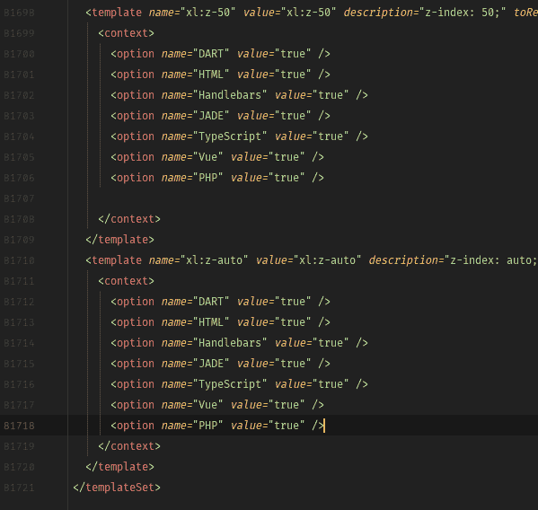

# Jetbrains 顺风 css 实时模板

> 原文：<https://dev.to/alicannklc/jetbrains-tailwind-css-live-template-1lc7>

兼容于:

*   智能理念

*   WebStorm 和 PhpStorm

*   安卓工作室

*   皮查姆

*   橡胶吗

*   AppCode

*   克利翁

*   戈格兰

*   骑手

[插件网址](https://plugins.jetbrains.com/plugin/12074-tailwindcss)
[顺风小抄](https://alicannklc.github.io/intellij-tailwind-css/) 

快乐编码