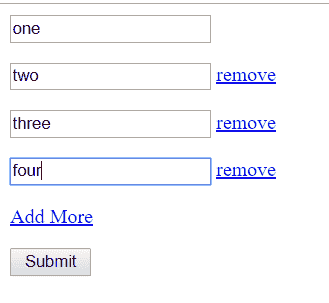

# 用 PHP 提交 Jquery 重复字段表单

> 原文：<https://dev.to/skptricks/jquery-duplicate-fields-form-submit-with-php-1e7d>

来源:[用 PHP 提交 Jquery 重复字段表单](https://www.skptricks.com/2019/05/jquery-duplicate-fields-form-submit-with-php.html)

本教程解释了如何用 PHP 将 jquery 复制/克隆字段值提交给表单。在这个例子中，我们将提供一个非常简单的例子，并使用现有的 jquery 插件，所以这里我们使用 relCopy.js jquery 插件来复制现有的字段。

[https://www.youtube.com/embed/n-d-ihUWjwc](https://www.youtube.com/embed/n-d-ihUWjwc)

[点击此处阅读更多信息](https://www.skptricks.com/2019/05/jquery-duplicate-fields-form-submit-with-php.html)