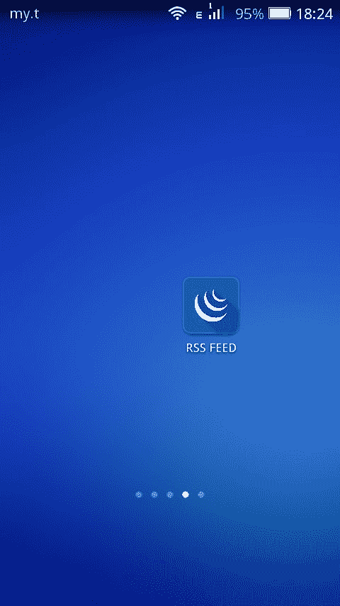
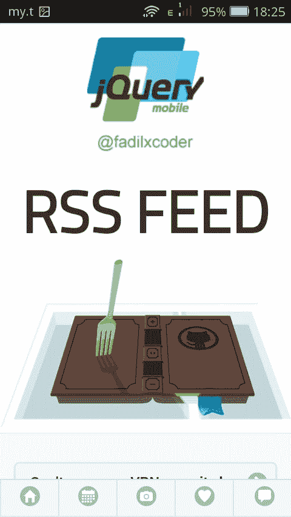
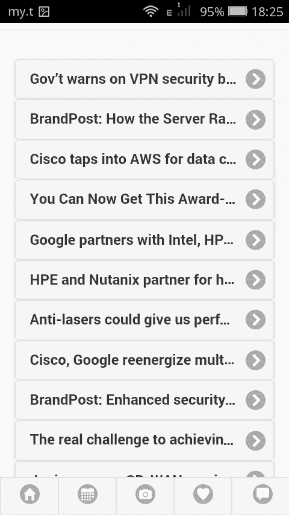
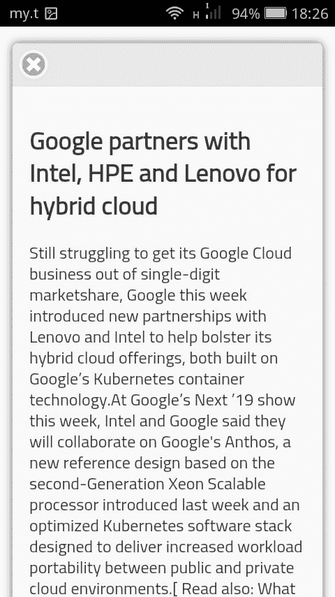

# 使用 XML、JSON、PhoneGap 和 PHP 开发 JQuery 移动应用程序

> 原文：<https://dev.to/fadilxcoder/jquery-mobile-app-development-by-using-xml-json-phonegap-and-php-36dj>

大家好，

在这几天里，我开发了一个基本的移动应用程序，它唯一的功能是显示它在网络上某个地方检索到的一些数据。我把它命名为“ **RSS 提要**

## 下面是它的样子！

<figure>[](https://res.cloudinary.com/practicaldev/image/fetch/s--z1PQDBjF--/c_limit%2Cf_auto%2Cfl_progressive%2Cq_auto%2Cw_880/https://thepracticaldev.s3.amazonaws.com/i/eiuoe8xo62dv5srxbdal.png) 

<figcaption>App 图标</figcaption>

</figure>

<figure>[](https://res.cloudinary.com/practicaldev/image/fetch/s--ReLgevwH--/c_limit%2Cf_auto%2Cfl_progressive%2Cq_auto%2Cw_880/https://thepracticaldev.s3.amazonaws.com/i/sntbsiqdn1hs0v6cr0c0.png) 

<figcaption>App 登陆页面</figcaption>

</figure>

<figure>[](https://res.cloudinary.com/practicaldev/image/fetch/s--UhV0cXCI--/c_limit%2Cf_auto%2Cfl_progressive%2Cq_auto%2Cw_880/https://thepracticaldev.s3.amazonaws.com/i/eg5ehprd2kx3lpnw2zwi.png) 

<figcaption>App 登陆页面(向下滚动一点)</figcaption>

</figure>

<figure>[](https://res.cloudinary.com/practicaldev/image/fetch/s--5kfcMDdi--/c_limit%2Cf_auto%2Cfl_progressive%2Cq_auto%2Cw_880/https://thepracticaldev.s3.amazonaws.com/i/fndlrj7f5b0weq87itkh.png) 

<figcaption>点击一篇文章&就会弹出</figcaption>

</figure>

## 让我们来看看到底发生了什么！

所以，有一个来自 IDG 的网站[网络世界](https://www.networkworld.com/)有一个 [RSS](https://www.networkworld.com/index.rss) 。通常，它们是 XML 格式的。

所以我正在做的是，我正在使用这些 XML，通过我的服务器上托管的 PHP 脚本将它们转换为 JSON，并将这些 JSON 发送到 JQuery 移动应用程序，并在那里显示它们，当用户单击特定文章的标题时，整篇文章就会弹出，以便他们可以阅读。

XML 文件的任何更新都会实时更新移动应用程序。

## 我是怎么算出来的？

### 建议

为了解决这个问题，我使用了 PhoneGap，你可以使用它轻松地创建 HTML、CSS 和 JavaScript 的移动应用程序。在开发过程中，当我在 localhost 上工作时，我也使用了 WampServer。最后，你需要一个主机和域名。

***psst，可以免费使用 [000Webhost](https://www.000webhost.com/) 虚拟主机***

1.  启动 PhoneGap 并构建一个空白项目
2.  检查 JQuery Mobile Demos 以了解使用哪个元素来开发移动应用前端。
3.  根据设计的线框建立一个静态移动应用程序。

完成这一部分后，就该处理 XML 了。我选择使用 JSON 而不是 XML 的唯一原因是因为我对 JSON 更放心。

我使用了一个 PHP 脚本将 XML 转换成 JSON。然后我把它上传到我的服务器上，就完成了。它正在返回 JSON 格式的数据。

##  [萨奎布](https://github.com/saqueib) / [ qrss](https://github.com/saqueib/qrss)

### 用于解析 RSS 提要并返回 JSON 的 PHP API 类 http://www . qcode . in/build-complete-RSS-feed-reader-app-PHP-RSS-JSON-API/

<article class="markdown-body entry-content container-lg" itemprop="text">

# qrss(RSS 新闻频道)

使用缓存选项将 RSS 提要解析到 json 的 API 类。

## 开始吧

获取`QRss`类并在 php 文件中使用 require。

```
require 'src/QRss.php';

// To fetch an RSS feed as json use
(new Qrss('https://news.google.com/?output=rss'))->json();

// For fresh copy you can use fresh() which will ignore cache
(new Qrss('https://news.google.com/?output=rss'))->fresh()->json()

// Get the feed ignoring validation adding novalidate()
(new QRss('https://en.blog.wordpress.com/feed/'))->novalidate()->json();

// There is also an option to get data in plain text using text() instead of json()
(new Qrss('https://news.google.com/?output=rss'))->text();
```

Enter fullscreen mode Exit fullscreen mode

## 覆盖分析器

您还可以扩展 parse 方法来定制输出。

```
class MyQrss extends QRss {
     protected function parse($xml)
     {
         // you have all the xml elements as SimpleXMLElement object
         //
```

…Enter fullscreen mode Exit fullscreen mode</article>

[View on GitHub](https://github.com/saqueib/qrss)

### 如何让他们说话？

为此，我使用 AJAX。因此，当你打开手机上的应用程序时，它会触发 AJAX 向服务器发送请求。服务器用 JSON 进行响应。

我所要做的就是遍历 JSON 并将它们添加到我的应用程序的列表视图中以便显示。

### 部署 APK

我使用 Adobe PhoneGap Build 编译文件并生成 APK，因此我下载了 APK 并安装在我的手机上。

搞定了。！！工作完全正常..

下面是 app 的链接，以防有人要查。

**[谷歌驱动链接](https://drive.google.com/open?id=1j5H20zifoI7lQ6Fbh_xQOLVso9nBwysn)**