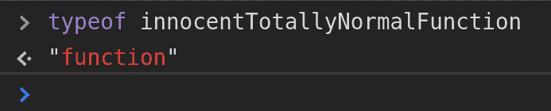
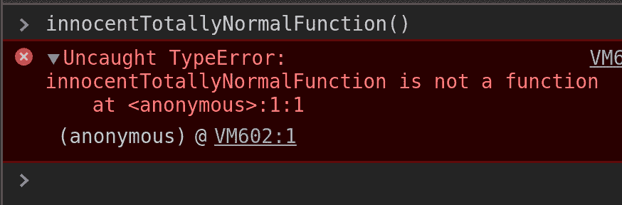
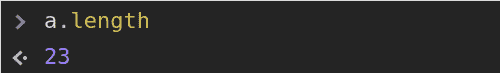
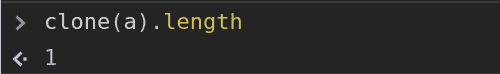
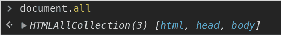
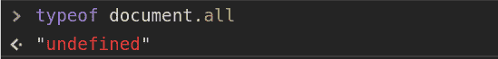
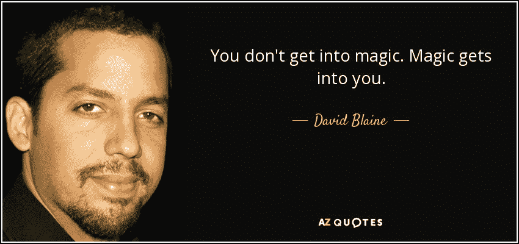

# JS 魔术给你的朋友留下深刻印象

> 原文：<https://dev.to/phenax/js-magic-tricks-to-impress-your-friends-1f81>

我叫胡迪尼 J.S. Magnifico。我将要在这里表演的是一组一定会让你大吃一惊的幻术和魔术！所以准备好大吃一惊吧！

> 这里展示的戏法是由训练有素的专业人员表演的。不要在家尝试这些特技。在你的办公室做它。建议观众自行判断。

我们走吧。

* * *

# 对于我的第一个魔术，我要让这个函数…消失！

这是我完全正常的，没有什么奇怪的，不要问我，函数。

[](https://res.cloudinary.com/practicaldev/image/fetch/s--mMRYlcYu--/c_limit%2Cf_auto%2Cfl_progressive%2Cq_auto%2Cw_880/https://phenax.github.io/img/blog/jsmagic/fn.jpg)

让我用布兰登·艾希的鼠标垫在上面晃一下……然后……嘣！

[](https://res.cloudinary.com/practicaldev/image/fetch/s--3FIfVtWj--/c_limit%2Cf_auto%2Cfl_progressive%2Cq_auto%2Cw_880/https://phenax.github.io/img/blog/jsmagic/fn-1.jpg)

不见了！函数不再是函数了。薛定谔的函数消失了！

***观众鼓掌***

谢谢大家！谢谢大家！

#### 它是这样工作的

```
const innocentTotallyNormalFunction = (() => {}).apply.bind();
// Works with any method's bind(); 
```

Enter fullscreen mode Exit fullscreen mode

很奇怪吧？它叫做 JavaScript，很多人在生产中使用它。这个不行的原因是因为。apply 方法需要函数的上下文，但。bind 将它定义为上下文。这意味着 apply 方法不知道它试图应用哪个函数。那么 apply 方法就有了身份危机，一切都变得一团糟。

* * *

# 魔法列表

这里我有一个克隆数组的函数。完全正常的生产就绪代码。

```
const clone = list => list.reduce((newList, item) => [...newList, item], []);

// Another clone implementation you can use is,
const clone = Object.values;

// Or if you wanna go old school...
const clone = list => {
  const newList = [];

  for(let index in list) {
    newList.push(list[index]);
  }

  return newList;
}; 
```

Enter fullscreen mode Exit fullscreen mode

这是一个普通的列表，里面没有任何可疑之处

[](https://res.cloudinary.com/practicaldev/image/fetch/s--4lF2_kPe--/c_limit%2Cf_auto%2Cfl_progressive%2Cq_auto%2Cw_880/https://phenax.github.io/img/blog/jsmagic/list.png)

我只是随便使用克隆函数来复制列表并检查新创建的列表的长度…

[](https://res.cloudinary.com/practicaldev/image/fetch/s--sX_hQxze--/c_limit%2Cf_auto%2Cfl_progressive%2Cq_auto%2Cw_880/https://phenax.github.io/img/blog/jsmagic/list-clone.png)

**魔法！！**

这个列表不再有 23 个条目。23 比 1！下一代压缩算法，问号？还是只是魔法？

[](https://res.cloudinary.com/practicaldev/image/fetch/s--56ZHaeI3--/c_limit%2Cf_auto%2Cfl_progressive%2Cq_66%2Cw_880/https://phenax.github.io/img/blog/jsmagic/how-did-you-do-that.gif)

#### 嗯，事情是这样的

这背后的概念并不是很多开发人员都熟悉的。阵列孔也称为空槽，是阵列中的空点。不，我不是在说未定义或空或 0。只是空的。

Ref: [阵孔/空槽](https://2ality.com/2015/09/holes-arrays-es6.html)、[稀疏阵](https://2ality.com/2012/06/dense-arrays.html)、

```
Array(5) // >> [<empty x 5>]

// In ES2015, you can also do
[,,,,,] // >> [<empty x 5>] 
```

Enter fullscreen mode Exit fullscreen mode

这将创建一个包含 5 项但没有任何值的数组。但是 javascript 不使用 undefined 作为默认值 tho。相反，它在数组中创建空槽(洞),但保持给定的长度。因此，当您使用 reduce 方法复制它时，它不会遍历空槽。所以新生成的数组更短。

* * *

# 薛定谔的魔法清单

我们要处理的列表是 document.all，它是一个文档中所有节点的列表。

[](https://res.cloudinary.com/practicaldev/image/fetch/s--8xktctJR--/c_limit%2Cf_auto%2Cfl_progressive%2Cq_auto%2Cw_880/https://phenax.github.io/img/blog/jsmagic/doc.png)

W3C 委员会，给我力量让这份名单消失吧！！！嘣！阿沙！哇卡-哇卡嘣！

[](https://res.cloudinary.com/practicaldev/image/fetch/s--8xjybuBB--/c_limit%2Cf_auto%2Cfl_progressive%2Cq_auto%2Cw_880/https://phenax.github.io/img/blog/jsmagic/doc-typeof.png)

***惊叹！！*T3】**

去做个核磁共振扫描吧，因为你小小的大脑刚刚爆炸了！

#### 大揭秘来了！

document.all 是一个非常老的不推荐使用的 api，它允许您遍历呈现给 DOM 的所有节点。返回 undefined 的表达式类型被设计为不支持该非标准特性的一部分。很奇怪，我知道。但这就是 javascript 的运行方式。

* * *

# 我们还无限吗？

我们来取个号，`let x: number`。

```
x + 1 === x; // >> true
x + 2 === x; // >> false 
```

Enter fullscreen mode Exit fullscreen mode

“刚刚发生了什么？”

我给 x 加了 1，值没变！然后我给它加了 2，然后…宇宙…就变了。

#### 看看这是如何工作的

```
const x = 1e16; // OR 1 * Math.pow(10, 16) OR 10000000000000000 
```

Enter fullscreen mode Exit fullscreen mode

这是故意的。它记录在 IEEE 754-2008 中。当数字如此之大时，它会将其向上舍入到最接近的偶数。

参考:IEEE 754 中的[舍入规则部分](https://en.wikipedia.org/wiki/IEEE_754#Rounding_rules)

* * *

# 一个“不是数”是数还是不是数？嗯，这不关你的事

```
typeof NaN === 'number' // >> true
NaN !== NaN // >> true 
```

Enter fullscreen mode Exit fullscreen mode

Wut？“不是数字”是数字，“不是数字”不等于“不是数字”

Javascript 是一种神奇的语言

#### 知道诀窍

NaN 是一种数值数据类型，但是当对其应用任何数学运算时，它表现为一个标识。

*“但是为什么 NaN === NaN 返回 false？”*

因为 Javascript 之神希望如此。如果===运算符的任一侧为 NaN，则运算返回 false。这就是它的工作方式。不要质疑。

* * *

# 检查你的列表是否有 1 个以上的项目

编程中非常复杂的问题。

一个正常的开发者会继续写类似于
的东西

```
const hasAtleast2Elements = x => x.length >= 2; 
```

Enter fullscreen mode Exit fullscreen mode

这个解有 13 个字符长。在现代的 javascript 世界中，13 个字符太多了。这是一个性能瓶颈。

让我们写一些大小更优化的东西

```
const hasAtleast2Elements = x => !isNaN(+x); 
```

Enter fullscreen mode Exit fullscreen mode

那里。10 个字符。好多了。我们删除了 23%的 JavaScript 代码！干得好。少 JavaScript 就是好 JavaScript

#### 这一行动背后的天才

我们将加载时间提高了 23%，但代价是什么呢？！这个功能是如何工作的？魔法？

[](https://res.cloudinary.com/practicaldev/image/fetch/s--3ZFWPAs2--/c_limit%2Cf_auto%2Cfl_progressive%2Cq_66%2Cw_880/https://phenax.github.io/img/blog/jsmagic/not-magic-science.gif)

如果列表中的项目数大于 1，应用于列表的+运算符将返回 NaN。

为什么会这样？嗯，铅字铸造。+[]等于+[]。toString()。

所以，

```
[].toString() === '' // >> +'' === 0
[1].toString() === '1' // >> +'1' === 1
[1, 2].toString() === '1,2' // >> +'1,2' === NaN (Cannot typecast as it is not a number) 
```

Enter fullscreen mode Exit fullscreen mode

* * *

* * *

今天就到这里吧！下次请收听，观看 Magnifico 在制作中使用魔法，并立即被解雇。

现在我要让自己消失。

…

…

…

为什么这是…等一下，伙计们…一些技术上的困难…

***噗***

[](https://res.cloudinary.com/practicaldev/image/fetch/s--LDO6w26U--/c_limit%2Cf_auto%2Cfl_progressive%2Cq_auto%2Cw_880/https://phenax.github.io/img/blog/jsmagic/blaine.jpg)