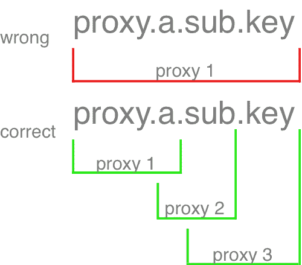

# JS 代理

> 原文：<https://dev.to/kyleparisi/js-proxies-gm0>

# 你可能在不知不觉中使用了代理

如果你用 Vuejs 或者据我所知，React 以前是使用代理的。代理就像赋予你的对象(仅仅是对象)超能力。让我用一个例子来描述你能做什么。

# Dyn

在之前的一篇文章中，我谈到了我对 dynamodb 的看法。

> 每次我看 Dynamodb SDK 文档时，我都会想‘伙计，这是一个过度工程化的烂摊子’。

API 不直观，每次都需要谷歌搜索。每个操作都需要一个 js 对象发送给 Dynamodb 的 API。这让我想知道是否可以用 js 代理来屏蔽 js 对象。我认为它提供了一个更干净、更令人难忘的界面。这个想法始于一个签名。

```
create[table] = {} 
```

我可以用这个简单的界面创建一个 dynamodb 记录吗？

```
const create = new Proxy(
  {},
  {
    get: function(target, name) {
      return target[name];
    },
    set: function(obj, prop, value) {
      const params = {
        TableName: prop,
        Item: value
      };
      obj.promise = docClient.put(params).promise();
    }
  }
); 
```

希望您可以看到上面生成了 dynamodb 的 docClient 所需的参数(所以我不必去查找它们)。如果您需要知道对象创建完成的时间，它还将承诺存储在对象中(`create.promise`)。

成功了。所以我对一个叫做 Dyn 的库做了更多的操作:

##  [凯莱帕里斯](https://github.com/kyleparisi) / [ dyn](https://github.com/kyleparisi/dyn)

### 从 dynamodb 中读取的实验库

<article class="markdown-body entry-content container-lg" itemprop="text">

# 同ＤＹＮＥ

超级原始的想法，一个图书馆与 dynamodb 交谈。目前不处理分页。js 代理的一个有趣的用法。

```
npm i @nargella/dyn
```

```
const Dyn = require("@nargella/dyn");
const AWS = require("aws-sdk");
AWS.config.region = "us-east-1";
const {
  reader,
  query,
  queryByIndex,
  queryAndFilter,
  scan,
  create,
  update,
  updateConditionally,
  del
} = new Dyn(new AWS.DynamoDB.DocumentClient());
```

一些数据见 [dyn_data](https://github.com/kyleparisi/dyn_data) 。

## 创造

```
// create[table] = {}
create.ProductCatalog = {
  Id: 500,
  Price: 222,
  ProductCategory: "Bicycle",
  Title: "99-Bike-212",
  BicycleType: "Hybrid",
  Brand: "Brand 212",
  Color: ["Red"],
  Description: "212 Description"
}
```

## 阅读

基本键/值:

```
// reader[table]({partitionkey: value, [sortkey: value]})
await reader.Movies({
```

…</article>

[View on GitHub](https://github.com/kyleparisi/dyn)

# 明白了

代理很酷，但有两件事让我措手不及。首先，根对象没有给你任何东西。在上面的例子中，我不能将`create`键代理给任何东西。其次，您不能将属性嵌套为单个代理定义。

[](https://res.cloudinary.com/practicaldev/image/fetch/s--RvARkSSv--/c_limit%2Cf_auto%2Cfl_progressive%2Cq_auto%2Cw_880/https://thepracticaldev.s3.amazonaws.com/i/tuoxz83gnwdaoxn9s09u.png)