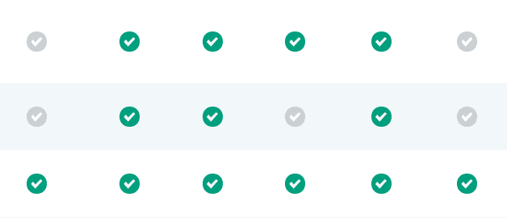

# JSCD:不需要新的轮子

> 原文：<https://dev.to/aritdeveloper/jscd-new-wheels-not-needed-2bdh>

在我新工作的这个星期，我再次意识到单独编码和作为团队的一部分编码之间的区别。

我的一个票证要求我向现有的表中添加一个新的数据列(指示某些产品是否提供免费试用)。如果有免费试用，会显示一个绿色的勾号；否则，会显示一个灰色的复选标记。

[](https://res.cloudinary.com/practicaldev/image/fetch/s--W_EAeXmF--/c_limit%2Cf_auto%2Cfl_progressive%2Cq_auto%2Cw_880/https://thepracticaldev.s3.amazonaws.com/i/08oycgdc7gkpjr6y4vrc.png)

在我们的数据库中，每个产品都有一个代表“真”的属性“t ”,或代表“假”的属性“f”。渴望展示我的 Ruby 技能，我一头扎进构建和实现一个新方法来完成我的任务。但是后来(谢天谢地！)我停顿了一下，问自己:*“Self，为什么不检查一下其他表列的绿色和灰色复选标记是如何生成的？”*我发现了下面的代码块:

```
<% @aspects.each.with_index(1) do |aspect, index|%>
    <td class="aspect-<%= index %>">
      <span class="icon-circle  <%= green_or_grey(@product_aspects[product.id], aspect.feature) %>">
        <i class="gg-check"></i>
      </span>
    </td>
  <% end %> 
```

Enter fullscreen mode Exit fullscreen mode

关键片段是包含了`green_or_grey`方法的`span`语句。如果`aspect.feature`包含在`@product_aspects[product.id]`数组中，这个方法返回`true`。然而，在我的例子中，我没有检查数组是否包含一个项；我在检查一个属性是否等于‘t’或‘f’。

我被难住了一会儿，然后我意识到我可以引用包含产品的`free_trial?`属性的一个元素数组，然后传入‘t’作为我的第二个参数。如果`product.free_trial? == 't'` :
，那么`green_or_grey`方法将返回`true`

```
<%= green_or_grey([product.free_trial?], 't') %> 
```

Enter fullscreen mode Exit fullscreen mode

在代码审查期间，我的队友热情地称赞我想出了一种使用现有方法的方法(当然我在 lol 内部感到所有的温暖和模糊)。然而更重要的是，我为自己花时间去理解、尊重和重用我得到的代码而感到自豪。目前，创建新代码可能感觉更容易，并保证一定程度的进展，但最终可能会不必要地膨胀和复杂化您的代码库。