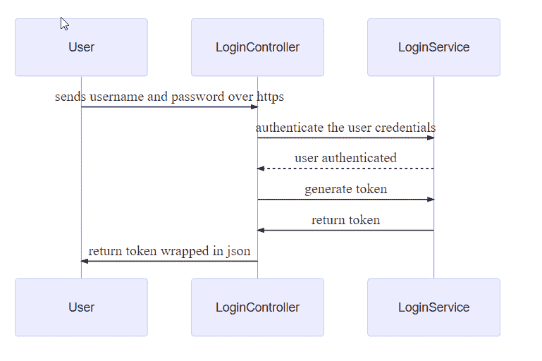

# 网络核心中的 JWT

> 原文：<https://dev.to/0xshetty/jwt-in-dotnet-core-9bg>

保护 API 的方法之一是使用 JWT。这就是它的工作方式，我们将创建一个具有 AllowAnonymous 操作的控制器。确保所有控制器都有 Authorize 属性，否则就会有潜在的漏洞。

[](https://res.cloudinary.com/practicaldev/image/fetch/s--uNJU9B7G--/c_limit%2Cf_auto%2Cfl_progressive%2Cq_auto%2Cw_880/https://thepracticaldev.s3.amazonaws.com/i/rr05xjzsnoi44ehhz8sx.png)

下面是动作方法

```
[AllowAnonymous]
[HttpPost]
public IActionResult Login([FromBody]User user)
{
    var authUserToken = _loginService.Login(user.Username, user.Password);

    if (authUserToken == null)
        return BadRequest(new { message = "Username or password is incorrect" });

    return Ok(new { AccessToken = authUserToken });
} 
```

Enter fullscreen mode Exit fullscreen mode

登录服务是另一个使用[微软实际生成 Web 令牌的实体。identity model . token](https://www.nuget.org/packages/Microsoft.IdentityModel.Tokens/)

```
private string GenerateJSONWebToken(User user)
{
    //secret token and the algorithm to use
    var secretToken = new SymmetricSecurityKey(Encoding.UTF8.GetBytes(_settings.SecretToken));
    var credentials = new SigningCredentials(secretToken, SecurityAlgorithms.HmacSha256);

    // creating a with one hour validity. 
    var token = new JwtSecurityToken(_settings.TokenIssuer,
    null,
    null,
    expires: DateTime.Now.AddHours(1),
    signingCredentials: credentials);

    return new JwtSecurityTokenHandler().WriteToken(token);
} 
```

Enter fullscreen mode Exit fullscreen mode

要生成令牌，我们需要传递一个秘密字符串，该字符串最好足够长，否则将无法生成。在这里，我们创建一个有效期为 1 小时的令牌。

生成的令牌将采用这种格式`xxxxx.yyyyy.zzzzz`，相当于 header.payload.signature。您可以使用 [jwt.io](https://jwt.io/) 来验证生成的令牌和签名。

现在，任何对 API 的请求都应该发送到下面的标题中

`Authorization:Bearer {{jwt}}`

它将被`Authorize`属性截获并被验证。

为了使 Authorize 属性工作，我们需要在 StartUp.cs 文件
中像这样使用 ConfigureServices 来调用 dotnetcore

```
services.AddAuthentication(a =>
{
    a.DefaultAuthenticateScheme = JwtBearerDefaults.AuthenticationScheme;
    a.DefaultChallengeScheme = JwtBearerDefaults.AuthenticationScheme;
}).AddJwtBearer(x =>
{
    x.RequireHttpsMetadata = false;
    x.SaveToken = true;
    x.TokenValidationParameters = new TokenValidationParameters
    {
        ValidateIssuerSigningKey = true,
        IssuerSigningKey = new SymmetricSecurityKey(secretToken),
        ValidateIssuer = false,// validate the server that generates the token
        ValidateAudience = false//validate the user who generates token is authorized
    };
}); 
```

Enter fullscreen mode Exit fullscreen mode

孙富在 Unsplash 上的照片