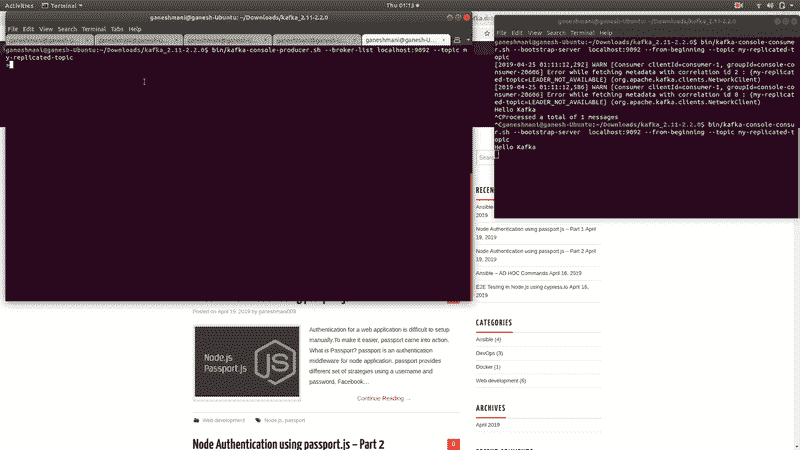

# 卡夫卡入门-卡夫卡系列-第 2 部分

> 原文：<https://dev.to/ganeshmani/kafka-getting-started-kafka-series-part-2-93g>

这是卡夫卡系列的第二部分。如果你想学习卡夫卡作品和卡夫卡建筑。阅读此处[卡夫卡建筑](https://cloudnweb.dev/2019/04/how-apache-kafka-works-kafka-getting-started-part-1/)

在本文中，我们将看到如何在本地配置 Kafka 并运行 Kafka 服务器。

### Kafka 节点设置

首先，在一台机器上，一个 **3 broker** Kafka 实例充其量是一个最小的、没有麻烦的工作。另外，**复制因子被设置为 2** 。

假设 A，B，C 是我们的卡夫卡经纪人。使用复制因子 2，A 中的数据将被拷贝到两个 B & C，B 中的数据将被拷贝到 A & C，C 中的数据将被拷贝到 A 和 B

### 先决条件

*   机器中安装的 java >= 1.8
*   在机器中设置 java 环境。[环境设置](https://hackernoon.com/setting-up-java-on-ubuntu-linux-and-windows-f60c910d39e3)
*   下载卡夫卡的二进制版本[这里](https://kafka.apache.org/downloads)

### 设置

同时，提取方便的地方的卡夫卡档案和 ***光盘*** 到里面。使用终端运行卡夫卡生态系统

首先，我们需要在终端运行卡夫卡动物园管理员。

### 什么是动物园管理员？

ZooKeeper 过去管理服务发现，并负责 Kafka Brokers 的领导选举。它将拓扑的变化发送到 Kafka，因此集群中的每个节点都知道新代理何时加入、代理何时死亡、主题何时被删除或添加等等。它提供了 Kafka 集群配置的同步视图。

<figure>[](https://res.cloudinary.com/practicaldev/image/fetch/s--NdYDieCA--/c_limit%2Cf_auto%2Cfl_progressive%2Cq_auto%2Cw_880/https://cloudnweb.dev/wp-content/uploads/2019/04/kafka_zookeeper.png) 

<figcaption>动物园管理员概述</figcaption>

</figure>

启动动物园管理员

```
bin/zookeeper-server-start.sh config/zookeeper.properties
```

### 卡夫卡经纪人

*   在 **Config** 文件夹中，会有一个 **server.properties** 文件。这是 kafka 服务器的配置文件。我们需要 3 个卡夫卡经纪人的例子。
*   复印一份。`$ cp config/server.properties config/server.bk1.properties`
*   在复制的文件中，进行以下更改

```
broker.id=1  #unique id for our broker instance
listeners=PLAINTEXT://:9093 #port where it listens 
log.dirs=/home/neoito/kafka-logs-1  #to a place thats not volatile 
```

*   此外，用同样的方法再复制 2 份。用一个类似 broker.id=2，broker.id=3 的连续数字更改上面的行
*   最后，像这样经营个体经纪人

```
$  bin/kafka-server-start.sh config/server.bk1.properties
$  bin/kafka-server-start.sh config/server.bk2.properties
$  bin/kafka-server-start.sh config/server.bk3.properties
```

之后，我们需要创建一个主题，生产者可以推送记录，消费者可以订阅/收听。

```
bin/kafka-topics.sh --create --zookeeper localhost:2181 --replication-factor 3 --partitions 1 --topic my-replicated-topic
```

上面的命令将在 Kafka Broker 中创建一个主题，其中一个分区的复制因子为 3

```
bin/kafka-console-producer.sh --broker-list localhost:9093 --topic my-replicated-topic
```

该命令将从命令行界面启动生成器，我们可以将记录推送到 Kafka Brokers。之后，我们需要从 cli 启动消费者。

```
bin/kafka-console-consumer.sh --bootstrap-server localhost:9093 --from-beginning --topic my-replicated-topic
```

它将启动端口 9093 中的消费者。 **- from-beginning** 命令将从头开始读取主题中的记录。

也就是说，如果我们在生产者 cli 中键入任何内容，我们都可以从消费者命令行中读取这些记录。

<figure>[](https://res.cloudinary.com/practicaldev/image/fetch/s--5j6ov4pP--/c_limit%2Cf_auto%2Cfl_progressive%2Cq_66%2Cw_880/https://cloudnweb.dev/wp-content/uploads/2019/04/kafka_demo_gif.gif) 

<figcaption>卡夫卡演示</figcaption>

</figure>

总之，我们现在可以订阅一个主题并收听记录，而不会丢失任何数据。它将在几个场景中有用。

我们将在下一篇博客中看到如何在 web 应用程序中使用 Apache Kafka。敬请期待！！！！！:-)