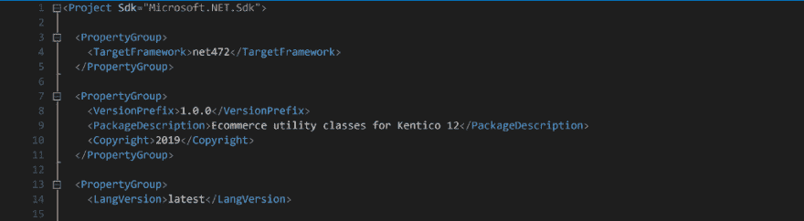
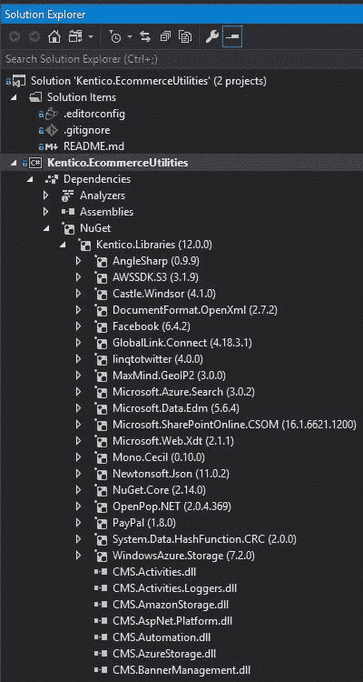
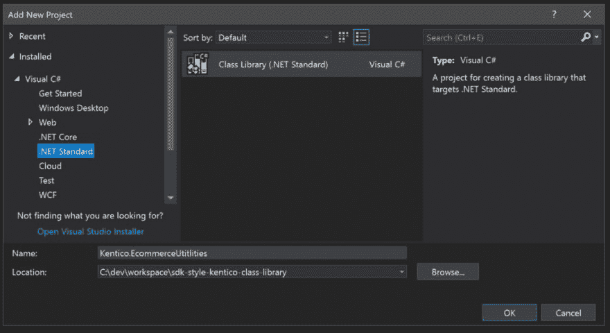

# 肯蒂科 12 级图书馆与现代。网络核心功能

> 原文：<https://dev.to/seangwright/kentico-12-class-libraries-with-modern-net-core-features-34n5>

## 三大。网络核心功能

。NET 在过去的几年里已经有了很大的发展。

从开发 ASP.NET 5 号开始，它最终成为了。NET Core/ASP.NET Core 以及后来的开发。NET 标准，我们已经看到了创新、发展和标准化。网络世界。

目前(截至 2019 年 4 月)，。NET Core 的最新官方运行时版本是 2.2(T1)，它带来的工具生态系统和开发人员工效学对任何人来说都是一股新鲜空气。NET 开发人员一直在使用。NET 完整框架。

自从。NET Core 在某种程度上是一个空白的开发工作，微软的工程师们能够考虑到现有(和老化)的抱怨和问题。NET 框架，以及围绕它的工具。

我最喜欢的三个特性。NET 核心是 [dotnet 命令行界面(CLI)](https://docs.microsoft.com/en-us/dotnet/core/tools/?tabs=netcore2x) ，项目文件中的 [NuGet `<PackageReference>`](https://docs.microsoft.com/en-us/nuget/consume-packages/package-references-in-project-files) 元素，以及新简化的[通用项目系统(CPS)](https://github.com/dotnet/project-system) 。

### 如何现代。和 Kentico 的网络工作？

你可能会问自己为什么我要谈论这个。NET Core good 当我们 Kentico 开发者还在用。NET 完整框架在我们的 CMS 和 MVC 项目。🤔

简单的回答是，我们可以拥有我们的蛋糕(酷。NET 核心特性)并吃掉它(将其集成到我们的 Kentico 项目中)。

下面我将详细说明如何利用这些特性。这将帮助我们改进我们的开发过程，并使我们的代码基础经得起未来的考验。

但是首先，介绍一下这三个特性，我们将利用它们来使我们的项目变得更好。

TLDR？跳到"**让我们建造一些东西吧！**“下面👇或者直接去[源码](https://github.com/seangwright/sdk-style-kentico-class-library)。

## 旧学校 vs 新学校:或者说——为什么这值得努力？🚵‍♀️

### [T1。网络核心 CLI](#net-core-cli)

[。NET Core CLI](https://docs.microsoft.com/en-us/dotnet/core/tools/?tabs=netcore2x) 通常只是经典 MSBuild 命令的包装，Visual Studio 通过其众多的菜单、选项和按钮隐藏了这些命令。然而，这并没有减少它给希望为他们的工具链更简单的开发人员带来的改进。NET 解决方案和项目。

您知道在命令行编译您的解决方案的 MSBuild 命令吗？MSBuild 甚至在你壳的`PATH`里吗？我已经开始头疼了！😖

安装[时。NET Core SDK](https://dotnet.microsoft.com/download) ，你自动获得 CLI 并添加到你的路径中。如果您想编译一个解决方案，只需打开一个命令提示符，进入您的解决方案所在的目录，然后键入`dotnet build`。是的，就这么简单。🎉

想要运行解决方案中所有单元测试项目的所有单元测试吗？键入`dotnet test`并提前打卡！或者运行`dotnet pack`为解决方案中的每个项目创建一个 NuGet 包(无需首先创建一个`.nupkg`)。

有了这些由 CLI 提供支持的有据可查的简单命令，意味着无论在何处。NET Core SDK，您可以在您的 CI/CD 环境中执行这些相同的命令，并获得与本地环境相同的结果。

### `<PackageReference>`

很久以来，。NET 开发人员下载了第三方库二进制文件，然后提交给源代码控制，因为没有一个包工件解决方案。然后出现了 NuGet，每个人都很高兴——我们有了可再生的依赖管理——除非它不起作用。然后就是咬牙切齿，敲键盘。👹

多年来，开发人员在 NuGet 的许多锋利的边缘上割伤了自己，其中我发现最痛苦的是以下这些:

1.  无法正确处理可传递的包依赖关系。`A -> B -> C`导致 C 在编译后不出现在`/bin`中，因为它没有被原始项目引用。👎
2.  随着时间的推移，这变成了一场维护的噩梦，因为每个已安装的包的可传递依赖项都被添加到了清单中。我安装包 A 然后 B，C，D，E 都加到我的`packages.config`。这使得很难跟踪你的代码依赖于什么，以及伴随而来的是什么。知道你能卸载什么变成了一个反复试验的单调乏味的任务。👎
3.  每次安装一个软件包，所有的噪音都会增加到你的`.csproj`中。不仅`packages.config`被条目填满，而且那些包的文件系统相对引用也被添加到您的`.csproj`文件中。如果你改变了你的项目目标框架，那些路径不会随之改变——祝你在混乱中好运。你最好的办法可能是删除所有的软件包，然后一个一个地重新安装。👎

解决了所有这些问题。

首先，它将所有项目的所有包存储在您的用户帐户路径下的一个文件夹中作为缓存，这对于不同解决方案/存储库中的项目之间的公共包重用非常有用。👍

第二，`packages.config`没了。🙏

第三，您的`.csproj`中对包的相对路径引用变成了包名和版本的声明性条目，这更容易维护，甚至可以手工编辑。

甚至可以现场手工编辑包声明——Visual Studio 将为您自动更新包！😄✨

所有可传递的包问题都消失了——您安装的包是唯一列出的包，并且它们所有的依赖项在构建后都正确地结束在您的`/bin`中。

软件包没有列出目标框架(假设它与您项目的目标框架相匹配),如果您想确保总是使用软件包的最新补丁，甚至允许版本的范围。

> 需要注意的是，`<PackageReference>`可以用在经典的常用项目系统(例如。一个典型的 ASP.NET 全框架应用`.csproj`，我们在 WiredViews 的所有项目中都使用它。但最好是与新的公共项目系统结合使用。
> 
> 有一个 Visual Studio [扩展来帮助将基于](https://marketplace.visualstudio.com/items?itemName=CloudNimble.NuGetPackageReferenceUpgrader) packages.config 的类库项目转换为`<PackageReference>`。

### 新建通用项目系统(CPS)

而 NuGet 包的`<PackageReference>`语法可以在繁体中使用。NET 完整的框架类库和应用程序，它实际上是要用在为。网芯。

最初的项目系统旨在跟踪项目的文件和资产，并为 Visual Studio 提供生成、清理和运行等过程的指令。它不是为手工编辑甚至是看而设计的。项目中的每个文件都被明确列出，许多 MSBuild 元数据、目标、道具和杂项设置都以一种随意的顺序包含在内。😟

显式文件枚举对于开发人员来说是一个常见的棘手问题，因为枚举是无序的，任何开发人员添加、重命名或删除文件都会导致对它的更改。合并冲突不可避免且始终如一。😵

有了新的 CPS，现在您的`.csproj`文件:

*   很少增长到一百行(即使是大型项目)。😃
*   默认情况下，假设包含项目中的所有文件。😄
*   使用可读的、有文档记录的、易于定制的 XML 元素和属性。😀
*   总的来说，尽量保持简单和不碍事。😁

> 有一个[命令行工具](https://github.com/hvanbakel/CsprojToVs2017)可以帮助您将现有的库转换成新的 CPS。最初转换我们的内部库时，我用它取得了很好的效果。你也可以用和我们在下面的例子中一样的方法创建新的项目，并复制你现有的代码文件。

CPS 的另一个有趣的功能是能够在 Visual Studio 解决方案资源管理器 UI 中查看任何引用项目、NuGet 包或程序集的整个可传递依赖关系图(以及确切的版本)。

这里有一个例子:

<figure> 

<figcaption>想知道为什么`Mono.Cecil`或`AngleSharp`在你的 Kentico 项目的`/bin`里？现在，您可以使用新的 CPS 来挖掘整个依赖关系树。</figcaption>

T9】</figure>

## 我们来建个东西:肯帝科图书馆！👊

考虑到这一背景…👩🏽‍🏫

我们将为 Kentico 构建一个极其简单的电子商务实用程序库，并构建一个 NUnit 单元测试项目来测试该库。

> 快速提醒:
> 
> 这些都没有被 Kentico 记录(或支持)。我经历了反复试验的过程，找出什么可行，什么不可行。
> 
> 我的公司, [WiredViews](https://www.wiredviews.com/) ,已经在我们的内部库上成功地使用了大部分这些特性大约 17 个月了(从 Kentico 10 开始)。
> 
> 您的里程数可能会有所不同，但标准用例应该工作得很好！

首先安装[。NET Core SDK](https://dotnet.microsoft.com/download)(VS 2017 的 v2.2.106 和 VS 2019 的 v2.2.203)和[。NET Framework 4.7.2 开发者包](https://www.microsoft.com/net/download/thank-you/net472-developer-pack)如果你还没有的话。

现在，使用您选择的命令行创建一个新目录(我更喜欢使用 [GitBash](https://gitforwindows.org/) ，并键入以下命令来创建一个新的解决方案文件:

`dotnet new sln --name Kentico.EcommerceUtilities`

在 Visual Studio 中打开该解决方案文件，右键单击该解决方案并选择`Add -> New Project`，然后选择一个. NET 标准类库项目模板。

> 快速提示:
> 
> 在 Visual Studio 中可以在命令行输入`start NameOfYour.sln`打开`.sln`文件。如果您已经在命令行上工作，这可以在切换到 VS 时节省一些时间。

<figure> 

<figcaption>。NET 标准与 Kentico 不兼容，但没关系——我们将编辑`.csproj`。的。NET 标准模板非常简单，所以它是一个很好的起点。</figcaption>

</figure>

如果你不习惯使用新的。NET 项目系统中，您可能会注意到一个惊喜:在 Visual Studio 中编辑项目的`.csproj`之前，您不需要“卸载”项目。💖

继续，右键单击我们创建的新`Kentico.EcommerceUtilities`项目，并选择`Edit Kentico.EcommerceUtilities.csproj`。

将以下代码复制并粘贴到您的`.csproj`中，我们将逐一讲解: