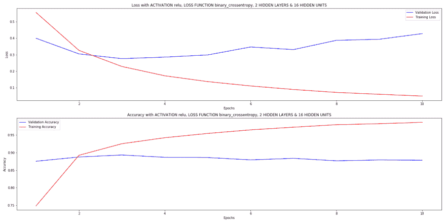

# 用简单的英语进行情感分析

> 原文：<https://dev.to/hydroweaver/keras-sentiment-analysis-in-from-the-book-in-plain-english-36hd>

[](https://res.cloudinary.com/practicaldev/image/fetch/s--gZpWXtN---/c_limit%2Cf_auto%2Cfl_progressive%2Cq_auto%2Cw_880/https://upload.wikimedia.org/wikipedia/commons/c/c9/Keras_Logo.jpg)

嗨德弗兹！

我正在努力学习 ML，最近买了[弗朗索瓦·乔莱](https://www.linkedin.com/in/fchollet/)的《用 Python 深度学习》这本书。

这是书中 IMDB 情感模型的一个实现，做了一些修改，我会试着解释我所知道的和我所做的，为我的代码道歉😓。

#### 前提

[](https://res.cloudinary.com/practicaldev/image/fetch/s--7ZvcYF_L--/c_limit%2Cf_auto%2Cfl_progressive%2Cq_66%2Cw_880/http://24.media.tumblr.com/eecfad666a96b0cb8442f40f9fd98fc5/tumblr_ms3u79OvgE1qc66bjo1_r1_500.gif)

1.  机器学习本质上使用数学方程，可以调整这些方程来做人类可以很容易做到的肤浅的事情。
2.  深度学习是用神经网络进行的机器学习，就像一层层的网格。每个网络都是一个数学方程，多层神经网络是多个数学方程叠加在一起。
3.  每个网络都有与之相关的权重，就像方程式中的系数一样。就像你说 **y = ax + b** ，那么 **a** 就是与 **x** 关联的权重。不要像吴恩达说的那样过于担心。😊
4.  当你把这些网络放在一起，并用数据训练它们时，它们就形成了 ML 领域中每个人所说的内部表示。
5.  这些内部表示是网络**根据它们接受训练的数据世界看到的**。把你自己想象成一只在地板上爬行的毛毛虫，你一生只知道你下面有东西在爬行，尽管你从未见过它，尽管你不知道它是什么，你显然不关心建造它的人类，但你知道**精神上**如果我在上面爬行，我就能移动。
6.  以同样的方式，这个模型试图了解情绪是积极的还是消极的。请记住，实际上**无法感受或理解这种情绪，但在标记数据的帮助下，这是可能的。**
7.  标签是监督学习的基石(机器学习的一部分，模型通过显示一些例子来学习)。这就像给一个孩子展示什么是汽车，然后他们就能像专家一样识别汽车，尽管机器学习模型在一般意义上明显落后。

#### 代码

**Keras btw 是什么？**:据我从书上和网上文章了解，是一个 API 规范，调用其他 ML 库的低层函数，比如 Tensorflow，CNTK 或者 Theano。简单地说，它让任何人都更容易使用低级别的库，而不会被细节所困扰。在一个给定的时间点，它可以使用其中的任何一个，你不需要改变你的代码！一个超级天真的观点是 Keras 是你的前端，Tensorflow/CNTK/Theano 是你的后端:)

### 导入东西

```
import numpy as np # for numerical arrays from keras import models #book told me to do it ! :) from keras import layers
from keras.datasets import imdb
from keras import optimizers
import matplotlib.pyplot as plt # for plotting 
```

### 获取数据

Keras 允许您直接将数据导入到您的程序中，没有任何麻烦。

```
(train_data, train_labels),(test_data, test_labels) = imdb.load_data(num_words = 10000) 
```

而且它很贴心，把数据分成了训练和测试。

### 训练和测试数据？

嗯，你可能听说过人们为了听起来酷而到处乱说**过拟合**、**过拟合**之类的话？这就是他们正在谈论的。当你得到一堆行，数千行(是的，把它想象成 excel 的行和列)的数据时，最好的想法是把它分成训练和测试。训练数据**训练**模型(神经网络层),测试数据用于查看模型实际上是否好。稍后您会看到更多相关内容。

### 标签？

下面我们来看一个简单的表格:

| 用户 | 年龄 | 会编码吗？ |
| --- | --- | --- |
| 杰弗里（男子名） | Twenty-one | 不 |
| 扬 | Twenty-two | 是 |
| 安德鲁 | Twenty-three | 是 |
| 我 | Thirty-one | 不 |
| 妈妈 | fifty-two | 不 |
| 爸爸 | Fifty-four | 不 |
| 兄弟 | Twenty-seven | 是 |

所以这里的标签是最后一列，**可以编码吗？**，更重要的是，当你要求模型查看这些时，你需要将它们二进制化，即 0 表示否，1 表示是。

让我们拆分这些数据:

训练数据: **train_data** 会是栏目用户&年龄， **train_labels** 会是 Can 码？

| 用户 | 年龄 | 会编码吗？ |
| --- | --- | --- |
| 杰弗里（男子名） | Twenty-one | 不 |
| 扬 | Twenty-two | 是 |
| 安德鲁 | Twenty-three | 是 |

测试数据: **test_data** 会是栏目用户&年龄， **test_labels** 会是 Can 码？

| 用户 | 年龄 | 会编码吗？ |
| --- | --- | --- |
| 我 | Thirty-one | 不 |
| 妈妈 | fifty-two | 不 |
| 爸爸 | Fifty-four | 不 |
| 兄弟 | Twenty-seven | 是 |

在我们的 IMDB 评论情感分析中，数据是这样的:

| 评论 | 标签 |
| --- | --- |
| 单词索引的第 1 行 | one |
| ... |  |
| 单词索引的第 N-1 行 | Zero |
| 单词索引的第 50，000 行 | one |

Word indices 是一个数组，保存一个单词在注释中出现的频率。

例如说:“肖申克的救赎可能是有史以来最好的电影”，基于英语语料库中单词的频率，这将被翻译成如下:

| ？ | ？ | six | Two hundred and thirty-nine | one | One hundred and fifteen | Seventeen | One hundred and twenty-three | one |
| --- | --- | --- | --- | --- | --- | --- | --- | --- |

最后一个值 1 实际上是说这是一个积极的评论，由一个人标记，在这种情况下，这是你真正的:)。如果您安装了 keras，您可以自己尝试一下:

```
from keras.datasets import imdb
s = "Shawshank Redemption is probably the best movie ever"
for word in s.split(' '):
    print(word_index.get(word, '?')) 
```

### 不是所有评论都是一样长的哥们！&向量化

是的，你是对的，所以我们用一种叫做 **one hot encoding** 的东西将这些乱七八糟的单词转换成一个标准长度的 10000 个元素的数组，还记得吗？:

```
num_words = 10000 
```

这将评论限制为只有那些频率超过 10，000 的词，即它们是最常用的。

```
x_train = np.zeros([len(train_data),10000])
for number, sequence in enumerate(train_data):
    x_train[number, sequence] = 1 
```

你也可以对测试数据这样做，因为你需要在测试一个 10，000 个元素的数组时保持一致性，对吗？

因此...

```
#in the book it is done as a function...but like right now.....ignore it x_test = np.zeros([len(test_data),10000])
for number, sequence in enumerate(test_data):
    x_test[number, sequence] = 1 
```

对标签进行矢量化处理(或者将它们做成 numpy 数组):

```
#vectorize labels y_train = np.asarray(train_labels).astype('float32')
y_test = np.asarray(test_labels).astype('float32') 
```

### 什么是验证？

现在到了我们分割**训练**数据的时候了！是啊，但为什么要这么做？

什么是过剩或不足？

[](https://res.cloudinary.com/practicaldev/image/fetch/s--vstfFPUa--/c_limit%2Cf_auto%2Cfl_progressive%2Cq_auto%2Cw_880/https://upload.wikimedia.org/wikipedia/commons/f/f0/04-05_Honda_Civic_LX_sedan.jpg)

如果一个模型过度拟合，这意味着它太接近它训练的数据，以至于它不能识别/分类/处理训练中遇到的以外的任何东西，就像说“我现在知道本田思域是什么了”，但当你看到任何不同的车时，你就说“那是本田思域！那是本田思域，那是本田思域！”

另一方面，当在一个不适合的场景中，它将是“我现在知道什么是本田思域”，但是无论何时你看到一辆新车，你都会说“那是什么？不是本田思域！这是辆车吗？什么事？”。

让我们做一些简单的数学计算:

Keras IMDB 数据为我们提供了 50，000 行或样本。

25，000 美元用于训练- > 15，000 美元用于实际训练这些神经网络，其余 10，000 美元用于验证。验证本质上是指使用训练得出的数据来调整模型，使其**工作**，每当我们进行一些更改并对这 15，000 个样本再次训练模型时，我们都会检查 10，000 个样本的验证集的结果。

请记住，我们从未接触过测试集中的其余 25，000 个，根本没有接触过！这就是机器学习的全部要点:**如何大量使用数据来训练模型进行概括，同时防止过度拟合和欠拟合**，因此**测试数据永远不会对训练模型有任何贡献。**

### 这一切机器学习在哪里？

1.  在这里，我们将定义模型和输入。
2.  我在程序的模型创建区域添加了一些 for 循环来测试不同类型的激活函数、损失函数、隐藏层和隐藏单元。

我给你看:

```
#model iterations activations = ['relu', 'tanh']

loss_func = ['mse', 'binary_crossentropy']

hidden_layer_units = [16, 32, 64]

hidden_layers = [1,2,3]

for activation in activations:
    for function in loss_func:
        for units in hidden_layer_units:
            for lyrs in hidden_layers: 
```

### 什么是激活函数？

Relu 或 tanh/sigmoid 是校正的线性单位和双曲线函数，它们将一些非线性(非线性是不在一条直线上的一种奇特说法)引入我们使用的数学方程。这些只不过是对神经网络网格的操作，以使那些**内部表示**最终主要学习输入数据的良好表示。再次不要太担心，我只是继续使用它们！

### 什么是损失函数？

想象一下，你的吉他导师告诉你，你刚刚演奏的即兴重复片段与 Slash 的演奏方式相差甚远！你怒了，对你来说听起来挺好的，但对导师来说不是！那么，你如何判断自己是否在进步呢？一种方法是录下你自己的演奏和聆听，然后利用反馈来改进，这样你就可以**缩小你和 Slash** 之间的差距。这就是损失函数要计算的。它试图最小化它**预测的**和实际标签之间的差异。

在这种情况下，应该是:

人类
评论:“肖申克的救赎是炸弹哟！”标签:1

模特
评论:“肖申克的救赎是炸弹哟！”预测值:0.85

正如你所看到的，这个模型可能已经训练好了，它的预测大约是 0.85 或 85%，也就是倾向于 1。

### 隐藏图层和隐藏单元？

这些项目将在书中更深入地讨论！😂但它们构成了深度学习的深层部分。假设您有 3 层:

第 1 层:接受 10，000 个元素数组的输入层
第 2 层:具有激活功能的中间(隐藏)层，接受来自第 1 层的 10，000 个元素的输入，并输出 16 个元素的输出。
第 3 层:具有激活功能的输出层，从第 2 层的 16 个元素中获取输入，并吐出 1 个元素的输出。

在上面的例子中，我们有一个 16 个单元的隐藏层。

我为循环添加这些的唯一原因是尝试所有的激活、损失函数等。如下图所示，遍历所有选项，找到最合适的选项。

### GO GO GO GO！

我们定义了模型，如果你看到上面的三层，下面的几行就是这么做的。中间的 for 循环只是在不同的迭代上添加层，这可能会返回更好的预测。

```
#print(activation, function, units, lyrs);
#write model model = models.Sequential()
model.add(layers.Dense(16, activation = 'relu', input_shape = (10000,)))

for i in range(0,lyrs):
    model.add(layers.Dense(units, activation = activation))    

model.add(layers.Dense(1, activation = 'sigmoid'))

#optimzers, loss etc. model.compile(optimizer = optimizers.RMSprop(lr = 0.001),
                              loss = function,
                              metrics = ['accuracy']) 
```

最后一行是添加另一个野兽，优化器，如果你以吉他为例，这就像说**你将如何**减少你和 Slash 之间的差异，通过:

1.  一天 24 小时练习？
2.  或者，把自己的灵魂卖给魔鬼？
3.  或者，叫 Slash 去你那里玩？

简单地说，优化器对损失函数进行处理，以降低模型的错误率，从而提高准确性。

```
history = model.fit(x_train_partial,
                    y_train_partial,
                    epochs = 10,
                    batch_size = 512,
                    validation_data=(validation_x_train, validation_y_train)) 
```

上面这条线是你在终端上看到奇迹发生的地方！**实战训练**，试试看，奇怪的满足感！😌

### 我们将何去何从？

嗯，模型训练部分已经完成了一半，这部分是看结果，准确性，模型是否过拟合或欠拟合等，然后改变你的参数。以下任何一项:

1.  学习率
2.  激活功能
3.  时期-你对训练数据进行了多少遍
4.  隐藏层
5.  隐藏单元
6.  损失函数

而这篇文章也就到此为止了，我还是没有找到合适的组合，虽然考虑到是书中第一个，我觉得这是个比较简单的问题！

这是模型的输出之一，36 种组合之一:

[](https://res.cloudinary.com/practicaldev/image/fetch/s--S15EOeXm--/c_limit%2Cf_auto%2Cfl_progressive%2Cq_auto%2Cw_880/https://thepracticaldev.s3.amazonaws.com/i/oxz27vxtyy8bw11tjol2.png)

代码如下:

水文编织者的 GIT

您可能需要更改路径来保存图像和模型。

## **自己去跑个模:)**又抱歉长文了！