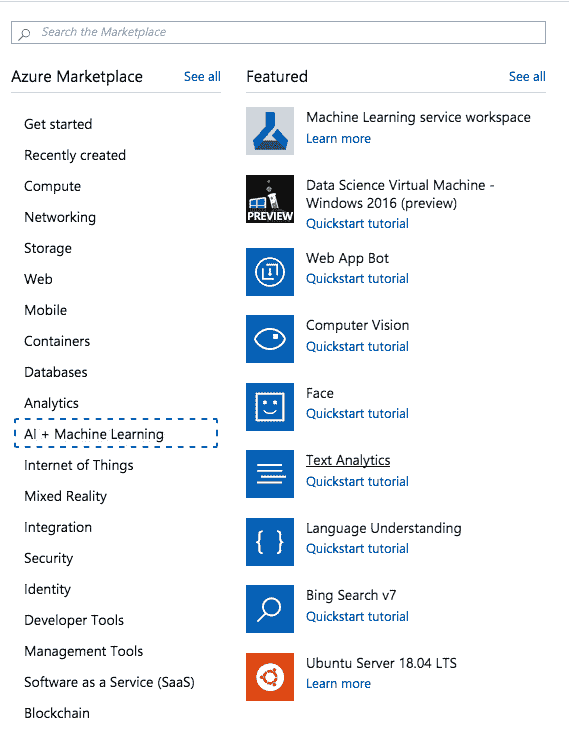
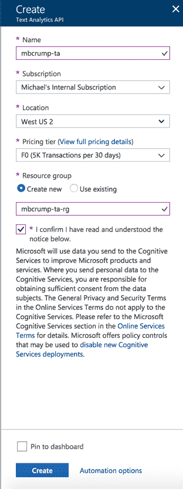
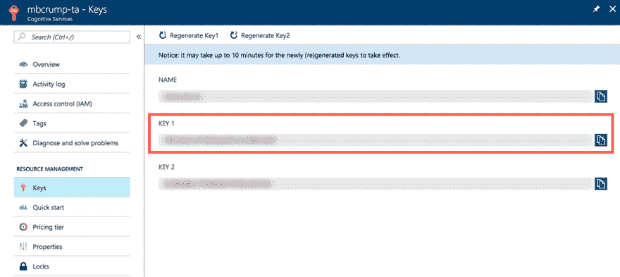
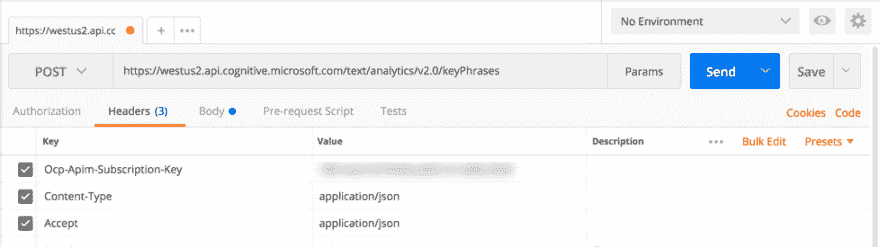

# 使用 Azure 认知服务提取关键短语

> 原文：<https://dev.to/azure/key-phrase-extraction-with-azure-cognitive-services-248>

*我们选择了由[迈克尔·克伦普](https://twitter.com/mbcrump)创造的我们最喜欢的技巧和诀窍，并在整个四月在 Azure 上提供新的技术内容！错过一天(或更多)？[赶上系列](https://dev.to/t/azureapril)。*

**没有天蓝色？** [抢免费订阅](https://azure.microsoft.com/en-us/free?&WT.mc_id=azureapril_devto-blog-cxa)。

我最近看了一下文本分析，它是由认知服务引入的，现在在 Azure 门户中。如果你打开 Azure 门户，寻找**人工智能和机器学习**，你会看到以下内容:

[](https://res.cloudinary.com/practicaldev/image/fetch/s--XW4Y29mS--/c_limit%2Cf_auto%2Cfl_progressive%2Cq_auto%2Cw_880/https://thepracticaldev.s3.amazonaws.com/i/2uy9p3jym81zcw66z1uu.png)

我们来给**文字分析**一个旋转。打开刀片并填写以下信息。确保选择如下所示的**空闲**层(F0 ):

[](https://res.cloudinary.com/practicaldev/image/fetch/s--Xt8MhY3Z--/c_limit%2Cf_auto%2Cfl_progressive%2Cq_auto%2Cw_880/https://thepracticaldev.s3.amazonaws.com/i/t3wp0j1cl7u7c0tpdutd.png)

选择**键**并复制键 1 的值。

[](https://res.cloudinary.com/practicaldev/image/fetch/s--z8yE4rcY--/c_limit%2Cf_auto%2Cfl_progressive%2Cq_auto%2Cw_880/https://thepracticaldev.s3.amazonaws.com/i/8utpjct0xwq1ore8mjrz.png)

我们将使用 [Postman](https://www.getpostman.com/) 进行测试。如果您还没有下载，请继续下载。完成后，您将根据您想要使用的内容使用以下端点之一。

```
https://westus.api.cognitive.microsoft.com/text/analytics/v2.0/sentiment
https://westus.api.cognitive.microsoft.com/text/analytics/v2.0/keyPhrases
https://westus.api.cognitive.microsoft.com/text/analytics/v2.0/languages 
```

出于学习目的，我们将使用**关键短语**端点。

什么是关键短语？他们自动提取关键短语，快速识别要点。

将`https://westus.api.cognitive.microsoft.com/text/analytics/v2.0/keyPhrases` url 复制到 Postman 中，并设置以下三个标题属性:

*   Ocp-Apim-Subscription-Key =应该是你的 Key 1(来自我们之前的讨论)。
*   Content-Type =将其设置为 application/json。
*   Accept =将其设置为 application/json。

您的屏幕应该如下所示:

[](https://res.cloudinary.com/practicaldev/image/fetch/s--vMT35-N7--/c_limit%2Cf_auto%2Cfl_progressive%2Cq_auto%2Cw_880/https://thepracticaldev.s3.amazonaws.com/i/k2on4fwbn2dhp3uihoin.png)

现在切换到**身体**，然后**原始**，并发布以下 JSON(来自我最近的一些推文):

```
{  "documents":  [  {  "language":  "en",  "id":  "1",  "text":  "Top 10 .NET Development Tweets that Broke the Web in 2017 - http://mcrump.me/2ot58Co  #dotnet"  },  {  "language":  "en",  "id":  "2",  "text":  "Setting up a managed container cluster with AKS and Kubernetes in the #Azure Cloud running .NET Core in minutes - http://mcrump.me/2op9mek  #dotnet"  }  ]  } 
```

现在按下**发送**，它将返回我的推文中的关键短语。

```
{  "documents":  [  {  "keyPhrases":  ["Web",  ".NET Development Tweets",  "dotnet"],  "id":  "1"  },  {  "keyPhrases":  [  "Kubernetes",  "Azure Cloud",  "minutes -",  "AKS",  ".NET Core"  ],  "id":  "2"  }  ],  "errors":  []  } 
```

想要更多的认知服务？查看我们的[快速入门和教程](https://azure.microsoft.com/en-us/try/cognitive-services/?WT.mc_id=azureapril_devto-blog-cxa)！

* * *

我们将在 4 月份每天发布文章，所以请继续关注或提前查看更多提示和技巧[现在](http://azuredev.tips)。