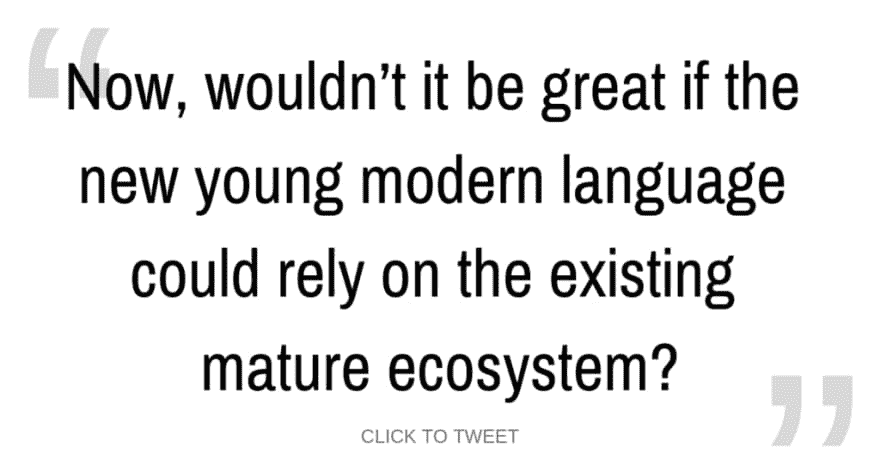
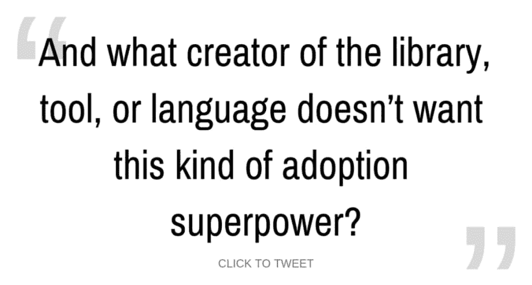

# 科特林:一门编程语言怎么可能同时如此年轻和成熟？

> 原文：<https://dev.to/waterlink/kotlin-how-can-a-programming-language-be-so-young-and-so-mature-at-the-same-time-25j>

在本文中，我们将探讨为什么具有现代特征的年轻编程语言不能被迅速采用。此外，我们还将看一个特殊的例子，它的具体参数正确，既年轻、现代又成熟，随时可以在小规模和大规模中采用。

*免责声明:部分细节有意省略。阅读时保持开放的心态。如果有些事情看起来很天真，或者不完全真实，请记住作者考虑了硬币的正反两面，以及硬币看不见的第三面。欢迎您发表评论进行更深入的讨论，这绝对值得您花时间去做！*

我们都知道，作为软件开发人员，我们大多数人都喜欢追逐闪亮的东西，就像我们喜欢构建它们一样。这对于编程语言来说没有什么不同。

如今，年轻的新编程语言如雨后春笋般涌现出来:

## 为什么现代新语言不能很快被采用？

年轻语言的一个显著特点是，创作者和社区有机会尝试不同的功能和设计，以潜在地修复现有成熟语言的一些问题。请注意，任何问题的任何解决方案都会带来至少两个更微妙的问题。所以这个持续改进的循环永远不会结束。

虽然年轻的语言可以探索更高级的特性和设计，但它们通常没有强大的库、框架和工具生态系统。此外，当社区开发这些工具时，人们仍然不得不学习它们，这意味着它们(尽管是暂时的)的生产力会大大降低。我甚至不打算谈论潜在的漏洞、错误等等。

现在，如果新的年轻的现代语言可以依赖于现有的成熟生态系统，那不是很好吗？如果使用现有的库、框架和工具是完全自然的，一点也不尴尬，那不是很棒吗？

如果你问我这些问题，我会告诉你，你也许在描述科特林。Kotlin 是一种编程语言，在这种语言中，您可以自然地使用 JVM 生态系统中的任何库、框架或工具，而不会有任何不便。

现在，以前也有语言可以做到这一点，比如 Scala、Groovy、Clojure 等等。而且都搞错了:自然使用。

## 为什么这些语言不想依赖现有的成熟生态系统？

要么使用相同的框架或库是不自然的，要么甚至不可能使用相同的工具。并且在有可能自然地使用相同的工具、框架和库的场景中；不知何故，社区的大多数人都去那里构建了新的工具、框架和库(我指的是你、Scala 和 sbt)。

我的预感是，这种情况的发生是因为这些新语言的大多数早期采用者(“承诺的 Java 替代品”)与 Java 语言和 JVM 生态系统有某种对立的关系。

他们讨厌它。

作为早期采用者，他们设置游戏场地，因为在新的年轻语言的最初几年，他们在社区中占绝大多数。通过这种方式，他们可以编写所有全新的闪亮工具、框架和库。他们是用这些语言在真实的公司和创业公司中启动新项目的人。

这样，社区风格就形成了:人们使用的独特的工具、框架和库集。有时，这些甚至被故意设计成从根本上不同于 JVM 社区中的旧替代方案。

这使得学习曲线非常陡峭，因此这种语言只被志同道合的人和可怜的开发人员采用，他们别无选择，只能维护已经使用这套工具的代码库。

## 如何吸引乐于利用现有生态系统的不同早期采用者？

科特林从根本上不同于这种方法。游戏规则第一条:“与 Java 和 JVM 生态系统的 100%双向互操作性。”

因此，这个社区吸引了那些不想以完全不同的方式做所有事情的人；相反，他们想要一种更现代的语言，并且他们想要传递他们的技能、知识和与 JVM 这样的成熟生态系统合作的经验。

这些早期采用者不想完全重写他们现有的代码库，因为它们很大，所以能够只用 Kotlin 编写新代码，用 Java 保留旧代码非常有帮助！

## 一个软件工程师同行的小故事

我要给你一个切实的例子:

克拉拉是一名软件工程师，在一家大公司工作，主要从事 Java、JVM 和 Spring Boot 方面的工作。克拉拉的专业水平很高，甚至可能更高:

*   她应用最佳软件实践，
*   知道如何迭代地设计简单的软件，
*   能解决你抛给她的任何复杂问题，
*   在编写代码时了解她的读者(她团队成员的当前水平和未来水平)，
*   优秀的沟通者和团队合作者，
*   教导和指导其他开发人员，
*   今天能担当起团队领导的角色，
*   过着终身学习的生活。

她目前的开发工作流程包括使用 Gradle 构建应用程序和自动化开发任务，她在 IntelliJ 这样的现代 IDE 中完成编码。她对这些工具和技术没有任何敌意。

恰恰相反:她爱他们！

不过，有时她会对所有这些很酷的现代编程语言的特性感到羡慕，在这些语言中，你可以有单行数据类，一般来说样板文件更少，空指针异常在每一步都不是可怕的威胁。

这是最近成为“生产就绪”的 Kotlin 编程语言

所以她尝试建立一个小的网络应用程序(比“Hello world”稍微复杂一点)。看起来她仍然可以使用相同的构建工具——Gradle；她仍然可以使用任何她喜欢的库，更重要的是，她可以使用同一个 web 框架——Spring Boot。

使用所有这些东西一点也不尴尬，感觉就像在他们的“家”环境——Java 中一样自然。

现在，她有了下一个问题:“这种语言很棒，但相当新…我现在必须失去我的 IDE 的所有伟大特性吗？”因为这就是大多数现代语言所发生的事情 IDE 支持远远落后了。

现在，她惊喜地发现:她需要的 95%的 IDE 特性都在那里，并且得到了支持:

*   基本和高级重构，
*   跳到定义，
*   查找用法，
*   从 IDE 运行应用程序和测试，
*   在当前上下文中运行单个测试，
*   调试器，
*   代码完成，甚至跨语言，
*   等等。

这很有意义，因为这种语言是由开发 IDE 的同一家公司开发的(JetBrains)。这肯定会确保工具至少在某种程度上跟上新的现代语言的速度。

“这一切听起来都很棒！”克拉拉想，“我现在必须完全按照科特林的方式重写我的工作申请吗？”

## 最重要的游戏规则促进收养

她在这里也感到惊喜。她真正需要做的只是添加 Kotlin Gradle 插件(单个文件中的几行更改)，她就可以开始向源代码库添加 Kotlin 文件了。所有用 Java 写的旧文件仍然可以正常工作。

此外，跨语言调用是开箱即用的:她可以从 Kotlin 调用 Java 代码，也可以从 Java 调用 Kotlin 代码；这一切都很自然。几乎在任何时候，调用代码都不会意识到它正在调用其中一个，因为没有区别。

这就是让“100%互操作性”从一开始就成为新的现代语言最重要的游戏规则的原因！

因此，如果你打算设计一种新的编程语言，我建议你考虑将它作为首要任务之一，因为它将允许更好的采用。哪个库、工具或语言的创造者不想要这种采用能力呢？；)

正如您所注意到的，Clara 并没有寻找一种完全不同的编码方法，相反，她正在寻找一种方法来保持 75%的良好性能，并可能使用该语言的一些更现代的特性来显著改善另外 25%的性能。

这可以通过让语言找出显而易见的东西来减少样板文件的数量，这样你就不必每次都指定它。这也可能是一个不同的决定，使一切都成为一个表达式，这使得特定的场景更符合人体工程学，阅读起来更舒服，例如，try-catch 块，其中您需要在“try”部分设置一个变量，并在“catch”部分重新引发一个增强的错误。

这些以及更多的东西都大大提高了可读性。

此外，拥有一级不可变变量和可空/不可空类型的能力消除了整个类可能的错误。太棒了！

## 站在巨人的肩膀上！

大多数现代语言都是为了独立使用而创建的，脱离了现有的库和工具生态系统，或者是设计使然，或者是被社区准则或文化“强迫”使用。

这些现代语言可能会被采用，但它们最终会消亡或停留在小范围内，因为大多数专业人士只会继续使用成熟的语言，因为它们对几乎所有东西都有更好的支持。这条规则很少有例外。

如果新的编程语言想要保持强大，它需要站在巨人的肩膀上。

因此，不要违背以前的成熟语言，做任何事情都不一样，尽可能多地利用成熟的生态系统，并在此基础上增加更多价值。这样，人们在学习这门语言时不必放弃任何东西，他们只会有所收获——这是一个真正的双赢局面！

> 这是否激起了你对科特林的好奇心？
> 
> 我已经写了一个 4 部分(共 350 页)“[终极教程:Kotlin](https://iwillteachyoukotlin.com) 入门”(+更多即将到来)，你可以通过成为我每月简讯的成员获得免费的奖金。
> 
> 除了 Kotlin，它还有很多好东西，比如 TDD、干净的代码、软件架构、业务影响、5 个为什么、验收标准、人物角色等等。
> 
> —在此注册并[开始学习如何构建成熟的 Kotlin 应用](https://iwillteachyoukotlin.com)！

## 谢谢，求求你！

非常感谢您阅读这篇文章！我希望你喜欢它。请在评论中告诉我你对此的看法！

此外，如果你能把这篇文章分享给你认为可能从中受益的朋友和同事，我会更高兴。或者你可以在你最喜欢的社交媒体上分享它！

欢迎你来[阅读我关于科特林的博客](https://iwillteachyoukotlin.com/blog/)，以及[我关于 TDD 和最佳软件工程实践的博客](http://www.tddfellow.com/)。

让我们在 LinkedIn 上联系吧:我每周发布简短的更新，关于软件开发人员的生产力和快乐、团队合作、心理健康，以及一些关于科特林的信息。

如果你想听更多我的观点，请在 Twitter 上关注我。

* * *

*最初发表于[iwillteachyoukotlin.com 博客](https://iwillteachyoukotlin.com/2019/01/07/kotlin-how-can-a-programming-language-be-so-young-and-so-mature-at-the-same-time/)。*

*封面图片来源:[像素](https://www.pexels.com/photo/forest-moss-mushrooms-tree-stump-62315/)T3】*