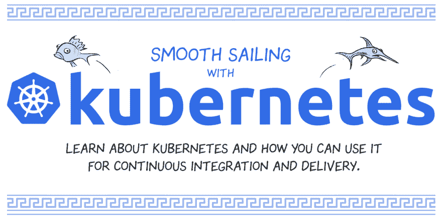

# 一言以蔽之的库伯内特

> 原文：<https://dev.to/soasme/kubernetes-in-a-nutshell-3p95>

# 概括地说

发表于[enqueuezero.com](https://enqueuezero.com/kubernetes-in-a-nutshell.html)

Kubernetes 是一个运行和协调容器化应用的系统。

这些应用程序部署在一个机器集群上。

作为 Kubernetes 用户，您可以定义应用程序应该如何运行。

您还可以定义应用程序应该如何与其他应用程序或外部世界进行交互。

* * *

Kubernetes 使用共享网络将机器服务器聚集到一个集群中。

主服务器控制整个集群。

**节点**是集群中的其他服务器。

* * *

作为 Kubernetes 用户，您可能最想让 Kubernetes 通过 HTTP APIs 或 CLI 运行容器。

换句话说，您为**主**服务器设置了一个期望的状态。

**主**服务器将所需状态与集群中的当前状态进行比较，并决定运行哪个节点。

**节点**服务器从**主**服务器接收指令，然后在运行时启动一个容器。

* * *

Kubernetes 在每个节点上运行**容器运行时**中的应用和服务。

每个节点安装一个**容器运行时**，比如`docker`、`rkt`。

**容器运行时**负责启动和管理容器。

**容器**为运行应用程序提供了一个隔离的环境。

* * *

除了容器运行时，**节点**服务器运行 **kubelet** 和 **kube-proxy** 。

**Kubelet** 与**主**通信以接收期望的状态。

**Kubelet** 控制**容器运行时间**来启动或销毁容器以匹配期望的状态。

Kube-proxy 将请求转发给本地主机或其他主机中的容器。

作为 Kubernetes 的用户，你不一定需要知道 **kubelet** 和 **kube-proxy** 的存在。

* * *

一个 **Pod** 是一个组中的一个或多个容器，它们应该总是在同一个**节点**上运行。

一个**舱**中的所有容器一起发射和销毁，或者共享一个生命周期。

一个 **pod** 中的所有容器共享它们的环境、卷和 IP 空间。

通常在一个**箱**中有一个主集装箱和一些可选的**边车集装箱**。

作为 Kubernetes 用户，您可以通过键入`kubectl get pods`来显示集群中的所有 pod。

* * *

一个**副本集**是在任何给定时间运行的一个或多个 pod 副本。

**副本集**中的**副本**号定义了应该在集群中调度多少个相同的 pod。

如果**复制品**的数量改变，控制器将启动或销毁容器以匹配期望的数量。

如果一个 **pod** 或底层**节点**，控制器将在集群中启动一个新的 **pod** 。

* * *

**部署**是**复制集**的理想状态。

**部署控制器**为滚动更新创建新的副本集，然后替换当前的副本集。

* * *

对于数据库应用，我们不能以随机的顺序直接杀死 pod。

而是经常杀光所有奴隶，最后让主人死去。

为了支持 pod 的订购和独特性，Kubernetes 提供了 **StatefulSet** 。

它创建了一组名为`db-0`、`db-1`、`db-2`等的 pod。

它为这些 pod 的排序和唯一性提供了保证。

* * *

对于像日志代理这样的应用程序，我们希望在每台主机上部署它们。

为了支持这样的特性，Kubernetes 提供了 **DaemonSet** 。

它确保所有(或一些)节点运行一个 Pod 的副本。

随着节点添加到集群中，单元也会添加到其中。

随着节点从集群中移除，这些 pod 将被垃圾收集。

删除 DaemonSet 将清理它创建的 pod。

* * *

一些 Kubernetes 对象是其他对象的所有者。

例如，复制集是一组单元的所有者。

当所有者被删除时，所拥有的对象也被垃圾回收。

* * *

如果你有一次性工作，Kubernetes 会提供**份工作**。

一个**作业**创建一个或多个 pod，并确保指定数量的 pod 成功终止。

当达到指定的成功完成次数时，作业本身就完成了。

删除作业将清理它创建的窗格。

* * *

如果一个豆荚想和其他豆荚交流怎么办？Kubernetes 提供**服务**。

一个**服务**是一个组件，充当 pod 的基本内部负载平衡器。

**服务**将一组 pod 公开为单个实体。当一个 pod 与一个服务通信时，该服务将请求代理到一个后端 pod。

* * *

一个**服务**有一个 DNS A 记录。

比如名称空间“default”中的**服务**“foo”有这样的域:“foo.default.svc.cluster.local”。

一个 **Pod** 也有一个 DNS A 记录。

例如，名称空间“默认”中 IP 为`10.81.1.101`的 **Pod** 具有这样的域:“10-81-1-101 . default . Pod . cluster . local”。

* * *

如果一个服务想要向外部世界公开自己，该怎么办？Kubernetes 提供**入口**。

**Ingress** 将来自集群外部的 HTTP 和 HTTPS 路由暴露给集群内的服务。

**入口控制器**启动**入口**软件，如 Nginx、F5、HAProxy 等。

* * *

如果容器死亡或节点崩溃，容器中的所有文件都将消失。

为了保存数据，Kubernetes 提供了**卷**来保存磁盘上的文件。

一个**卷**只是一个目录，里面可能有一些数据，可以被 Pod 中的容器访问。

当容器重新启动时，**卷**被重新装载到容器中，因此所有数据都被恢复。

* * *

**PersistentVolume** 是群集中已经预配置的一块存储。

**PersistentVolume** 是集群中的资源，就像节点是集群资源一样。

经常 **PersistentVolume** 使用类似 AWS EBS，Azure Disk，GCE PD 等云存储系统。

**持续卷**使卷脱离 Pod 生命周期。

* * *

一个**持续卷声明**是对**持续卷**的请求。

使用**持久卷**完成 pod 后，声明策略将确定是保留还是删除现有卷。

* * *

Kubernetes 是一个复杂的系统，有几十个概念。

官方文件提供了完整的概念指南。[https://kubernetes.io/docs/concepts/](https://kubernetes.io/docs/concepts/)

其他杀死脑细胞较少的资源。

 
[Kubernetes 得到一本童书](https://thenewstack.io/kubernetes-gets-childrens-book/)

 
[一帆风顺带着 k8s](https://cloud.google.com/kubernetes-engine/kubernetes-comic/)

 
[事件，库伯的 DNA](https://www.mgasch.com/post/k8sevents/)