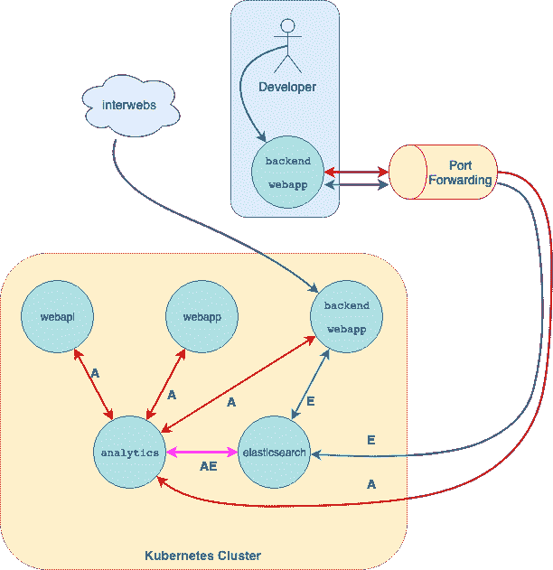

# Kubernetes 与 Rake 任务的集成

> 原文：<https://dev.to/fdocr/kubernetes-integration-with-rake-tasks-j0b>

Activek8s 是一个宝石，它依赖于某些约定来提供一个彻底的 [Kubernetes](https://kubernetes.io/) 集成在一组 Rake 任务上。gem 是一个项目的副产品，该项目利用 Kubernetes 来编排我们的服务和其他工具(Redis、CI/CD、logging 等)。这不是绝对的事实，这只是一个适用于我们团队和我们[在 GitHub](https://github.com/fdoxyz/activek8s) 上开源的解决方案。

## 动机

有一长串的理由说明 Kubernetes 可能是您项目的合适工具，同时您也可以找到一长串的理由说明您不应该跳进兔子洞。根据你的项目，两种观点可能都是正确的，这就是为什么我不打算为任何一种观点辩护。

**对于所有积极依赖 Kubernetes** 的人来说，我们试图找到一种方法来整合 it 和**拉平学习曲线**，这样我们的团队就可以专注于解决他们已经知道如何解决的问题，而不是深入“Kubernetes 宇宙”。

我们的团队主要在 Rails 上工作，所以我的解决方案是用 Rake 任务包装有点复杂的低级命令。该工具旨在依赖一些约定，同时试图保持高度的定制化。

## 目标&能力

在某些情况下，熟练使用 kubectl 可以让你走得更远，但比这更关键的是，不熟练使用 kubectl 的人将完全无助，无法解决简单的问题。这些是 Activek8s 能够执行的任务:

*   **部署**服务的新版本
*   **回滚**到服务的先前版本
*   **端口转发**部署在本地主机集群上的服务，用于“直接交互”(即调试或其他原因)
*   **端口转发**本地主机上的一组服务，用于与多个服务进行简单的“直接交互”
*   **端口转发**集群中部署的其他有用工具(即[基巴纳](https://www.elastic.co/products/kibana)部署)

**注:**在之前的特性列表中，术语“服务”指的是任何 Dockerized 项目。该项目可以用任何语言或框架编码，它不仅适用于 Rails 应用程序，甚至基于 Ruby 的项目，只要你可以用它构建一个工作 Docker 映像，你就可以使用这些 Rake 任务来管理它们。

## 如何部署和回滚

“详细”文档可以在[项目的自述文件](https://github.com/fdoxyz/activek8s)中找到。但是一个简单的部署将使用下面的命令

```
# Will deploy using the 'production' namespace and will use the container IMAGE_TAG 'prod-50'
rake ak8s:deploy['production','prod-50'] 
```

Enter fullscreen mode Exit fullscreen mode

假设最后一次部署引入了一个回归错误。您可以使用相同的`deploy`命令手动回滚，简单如:

```
# Will deploy using the 'production' namespace and will use the container IMAGE_TAG 'prod-49'
rake ak8s:deploy['production','prod-49'] 
```

Enter fullscreen mode Exit fullscreen mode

在我们的团队中，我们依赖于 CI 中的这些相同的 Rake 任务，就像这样，我们在我们的管道中获得了**连续部署**(我们使用[无人机 CI](https://drone.io/) 是因为他们惊人的 Docker 支持，对他们的赞誉)。

您还可以通过运行`rake k8s:delete['production','prod-49']`从集群中删除部署。

## 港口转发服务

在我看来，这是 gem 中最有趣的功能。当使用 SOA/微服务时，您必须处理一个更复杂的系统，那么如果您想在您的试运行或开发环境中调试一个问题呢？

我将用下面的假设图来解释我们最常见的用例:

[](https://res.cloudinary.com/practicaldev/image/fetch/s--zm82L-NA--/c_limit%2Cf_auto%2Cfl_progressive%2Cq_auto%2Cw_880/https://thepracticaldev.s3.amazonaws.com/i/dz4tit0mt3ovk610vdaf.png)

想象一个`backend webapp`项目依赖于另外两个服务(`analytics` &和`elasticsearch`部署)。通信是通过 HTTP 完成的，它们的两个 URL 都是使用一个`ENV`变量设置的，这里没有什么新奇的东西。

在 Kubernetes 集群内部，URL 可能类似于`http://analytics.dev.svc.cluster.local:3000`。在这种情况下，开发人员可以执行`rake ak8s:port_forward`，他们会在根目录下找到一个`services.env`文件，其中有一个 ENV 变量导出文件，您可以使用`. services.env`来获取。

这允许他们的本地`backend webapp`与开发环境中的服务直接通信，就像它被部署在集群中一样。这是通过使用类似于下面代码片段的`.ak8s.yml`配置来完成的:

```
dev:                      # The namespace where the serices live
  - name: webapp          # The name of all services to be port forwarded
  - name: backendwebapp
  - name: webapi
  - name: analytics
  - name: elasticsearch 
```

Enter fullscreen mode Exit fullscreen mode

我们发现这是一种更简单的方式让你涉足 Kubernetes 的土地。我们的团队已经按照他们的进度了解了 pod、服务、部署、配置图、秘密和许多其他更深入的术语的动态。

最重要的一点是，我们在这个过程中没有损失生产力，而且他们对与 Kubernetes 互操作服务集群进行交互感到很舒服。所有这些都比他们直接使用低级工具要快。

## Activek8s 路线图

我们希望在项目中添加许多重要的功能，但是尽管已经达到了这个舒适区，来自其他人的反馈却是我们所缺乏的。其中一些是:

*   包括适当的模板引擎(像 ERB 或类似的)
*   提高长期空闲连接的端口转发可靠性
*   一个简单的新项目初始化任务
*   rails 控制台直接连接到集群中的工作单元

再次感谢所有反馈，请随意浏览我们关于 GitHub 问题的。

## 结论

我们可能会陷入反模式架构，甚至以某种方式重新发明轮子(*cough* Helm *cough*)，但我们已经找到了适合我们的最佳点。

通过开源，我们只能希望比我们自己关起门来更好地改进项目。希望它在任何可能的方面有所帮助。

*本帖最初发表于[visualcosita.com](https://visualcosita.com/kubernetes-integration-with-rake-tasks/)T3】*