# 了解 Kubernetes，第三部分扩展我的应用程序

> 原文：<https://dev.to/azure/kubernetes-part-iii-scaling-1mmi>

在 [Twitter](https://twitter.com/chris_noring) 上关注我，很乐意接受您对主题或改进的建议/Chris

> 第三部分旨在展示如何扩展您的应用程序。我们可以很容易地设置我们想要的某个应用程序的副本数量，并让 Kubernetes 知道如何去做。这是我们定义一个所谓的*期望状态*。

当流量增加时，我们将需要扩展应用程序以满足用户需求。我们已经讨论了部署和服务，现在我们来谈谈扩展。

*   [第一部分——从第一部分开始，基础知识、部署和 Minikube](https://dev.to/azure/kubernetes-from-the-beginning-part-i-4ifd) 在这一部分中，我们将介绍 Kubernetes 的原因、一些历史和一些基本概念，如部署、节点、单元。
*   [第二部分-介绍服务和标签](https://dev.to/azure/kubernetes-part-ii-revisiting-pods-and-nodes-and-introducing-services-and-labeling-5fi7)在这一部分，我们将加深对 pod 和节点的了解。我们还引入了服务和标签，使用标签来查询我们的工件。
*   第三部分-缩放，**我们在这里**
*   [第四部分-自动缩放](https://dev.to/azure/kubernetes-from-the-beginning-part-iv-autoscaling-54l6)在这一部分中，我们将了解如何设置自动缩放，以便我们能够处理突然大量增加的传入请求

> 在 Kubernetes 的上下文中，缩放是什么意思？

我们得到更多的豆荚。安排到节点的更多单元。

现在是时候再次讨论*期望状态*了，我们在前面的部分已经提到过。

这是我们把控制权交给库伯内特的地方。我们需要做的就是告诉 Kubernetes 我们想要多少豆荚，剩下的由 Kubernetes 来做。

> 所以我们告诉 Kubernetes 我们想要的豆荚数量，这意味着什么？Kubernetes 为我们做了什么？

这意味着我们得到了应用程序的多个实例。这也意味着流量被分配到我们所有的豆荚，即。*负载均衡*。

此外，Kubernetes，或者更具体地说，Kubernetes 中的服务将监控哪些 pod 可用，并向这些 pod 发送流量。

## 资源

*   如果你想试用 AKS，Azure Kubernetes 服务，你需要一个免费的 Azure 账户
*   了解 Kubernetes 的最佳资源之一是谷歌的这个官方网站。
*   [Kubernetes 概述](https://azure.microsoft.com/en-gb/topic/kubernetes/?wt.mc_id=devto-blog-chnoring)Kubernetes、其所有部件及其工作原理的概述
*   [云中的 Kubernetes](https://azure.microsoft.com/en-gb/services/kubernetes-service/?wt.mc_id=devto-blog-chnoring)你是否觉得自己已经了解了 Kubernetes 的一切，只是想学习如何使用托管服务？那么这个链接是给你的
*   [AK 上的文件，azure kublers 服务](https://docs.microsoft.com/en-gb/azure/aks/?wt.mc_id=devto-blog-chnoring)azure kublers 服务，一种托管 kublers 服务
*   [AKS 最佳实践](https://docs.microsoft.com/en-us/azure/aks/best-practices?wt.mc_id=devto-blog-chnoring)您已经了解 AKS，并想学习如何更好地使用它？

## 缩放演示实验室

如果你没有看完前两部分，我建议你回去读一读。您至少需要一个部署才能让下面的工作。因此，如果你还没有创建一个，这里是如何:

```
kubectl run kubernetes-first-app --image=gcr.io/google-samples/kubernetes-bootcamp:v1 --port=8080 
```

Enter fullscreen mode Exit fullscreen mode

让我们来看看我们的部署:

```
kubectl get deployments 
```

Enter fullscreen mode Exit fullscreen mode

让我们仔细看看我们得到的回应:

[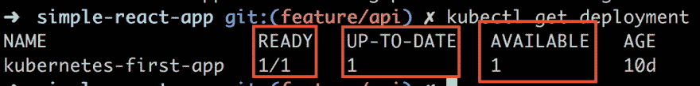](https://res.cloudinary.com/practicaldev/image/fetch/s--7xbSyAz3--/c_limit%2Cf_auto%2Cfl_progressive%2Cq_auto%2Cw_880/https://thepracticaldev.s3.amazonaws.com/i/4aaumkq7u6b7i4dmms1z.png)

我们有三条对我们很重要的信息。首先，我们有一个`READY`列，我们应该以下面的方式读取其中的值，`CURRENT STATE/DESIRED STATE`。接下来是`UP_TO_DATE`列，它显示了为匹配所需状态而更新的副本的数量。
最后，我们有`AVAILABLE`列显示我们有多少副本可以工作。

### 让我们称称

现在，让我们做一些缩放。为此，我们将像这样使用`scale`命令:

```
kubectl scale deployments/kubernetes-first-app --replicas=4 
```

Enter fullscreen mode Exit fullscreen mode

[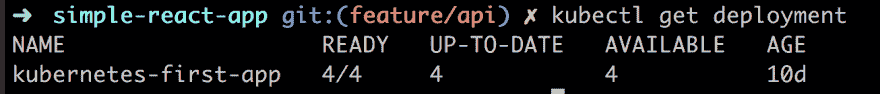](https://res.cloudinary.com/practicaldev/image/fetch/s--iOHg1ky_--/c_limit%2Cf_auto%2Cfl_progressive%2Cq_auto%2Cw_880/https://thepracticaldev.s3.amazonaws.com/i/jvvpqmon3r2ttqt5tc06.png)

正如我们在上面看到的，副本的数量增加到了`4`，kubernetes 因此可以对任何传入的请求进行负载平衡。

接下来让我们看看我们的豆荚:

[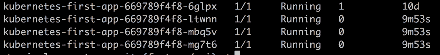](https://res.cloudinary.com/practicaldev/image/fetch/s--VI7_cp5z--/c_limit%2Cf_auto%2Cfl_progressive%2Cq_auto%2Cw_880/https://thepracticaldev.s3.amazonaws.com/i/upzhxkfxlmbt23nr52z3.png)

当我们要求`4`复制品时，我们得到了`4`豆荚。

我们可以看到这个缩放操作是通过使用`describe`命令进行的，就像这样:

```
kubectl describe deployments/kubernetes-first-app 
```

Enter fullscreen mode Exit fullscreen mode

[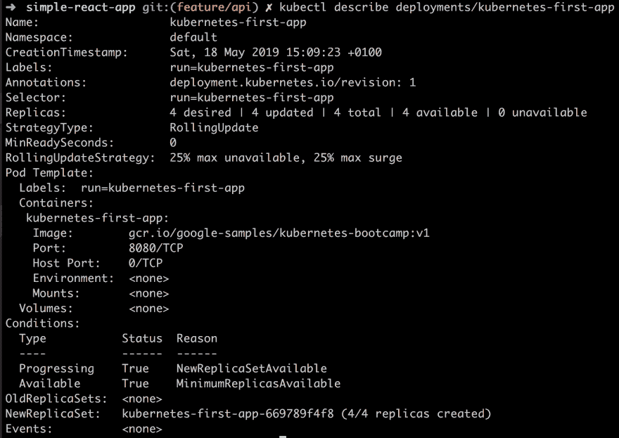](https://res.cloudinary.com/practicaldev/image/fetch/s--IBqT5WMZ--/c_limit%2Cf_auto%2Cfl_progressive%2Cq_auto%2Cw_880/https://thepracticaldev.s3.amazonaws.com/i/4q17yyfnkf7ahtfbzxn9.png)

例如，在上面的图像中，我们得到了很多关于`Replicas`的信息，但是还有一些其他的信息，我们将在后面解释。

### 它负载均衡吗？

扩展的全部目的是让我们能够平衡传入请求的负载。这意味着不是同一个 Pod 会处理所有的请求，而是不同的 Pod 会被击中。
我们可以很容易地尝试这一点，因为我们已经扩展了我们的应用程序，使其包含自身的`4`副本。

到目前为止，我们使用了`describe`命令来描述部署，但是我们可以使用它来描述的 IP 和端口。一旦我们有了 IP 和端口，我们就可以用不同的 HTTP 请求来访问它。

```
kubectl describe services/kubernetes-first-app 
```

Enter fullscreen mode Exit fullscreen mode

[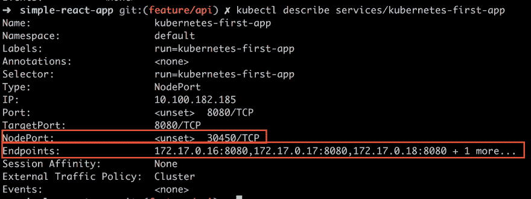](https://res.cloudinary.com/practicaldev/image/fetch/s--WKkLWRDw--/c_limit%2Cf_auto%2Cfl_progressive%2Cq_auto%2Cw_880/https://thepracticaldev.s3.amazonaws.com/i/ulqxs3mgl0pbjxozvtxo.png)

尤其是看`NodePort`和`Endpoints`。`NodePort`是我们希望 HTTP 请求命中的端口值。

现在，我们将实际调用 cURL 命令，并确保它每次都命中不同的端口，从而证明我们的负载平衡正在工作。让我们做以下事情:

```
NODE_PORT=30450 
```

Enter fullscreen mode Exit fullscreen mode

接下来是 cURL 调用:

```
curl $(minikube ip):$NODE_PORT 
```

Enter fullscreen mode Exit fullscreen mode

[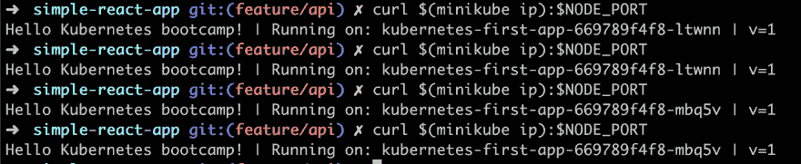](https://res.cloudinary.com/practicaldev/image/fetch/s--iXPYCPVH--/c_limit%2Cf_auto%2Cfl_progressive%2Cq_auto%2Cw_880/https://thepracticaldev.s3.amazonaws.com/i/nl053zu36v7kjnhg2ou0.png)

正如你在上面看到的，我们打了 4 次电话。根据输出和实例的名称判断，我们看到每个请求都遇到了不同的 Pod。因此，我们看到负载平衡正在工作。

### 缩小比例

迄今为止，我们已经扩大了规模。多亏了`scale`命令，我们设法从一个吊舱增加到了四个吊舱。我们可以使用相同的命令来缩小，就像这样:

```
kubectl scale deployments/kubernetes-first-app --replicas=2 
```

Enter fullscreen mode Exit fullscreen mode

[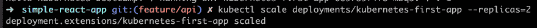](https://res.cloudinary.com/practicaldev/image/fetch/s--WusEPcS_--/c_limit%2Cf_auto%2Cfl_progressive%2Cq_auto%2Cw_880/https://thepracticaldev.s3.amazonaws.com/i/vjg7bi5l1jr2c5uznmf3.png)

现在，如果我们真的快速添加下一个命令，我们可以看到当 Kubernetes 试图调整到*期望的状态*时，吊舱是如何被移除的。

[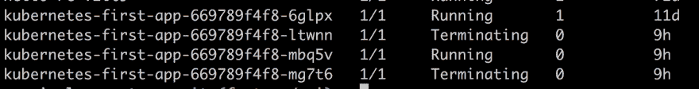](https://res.cloudinary.com/practicaldev/image/fetch/s--F31oY-3f--/c_limit%2Cf_auto%2Cfl_progressive%2Cq_auto%2Cw_880/https://thepracticaldev.s3.amazonaws.com/i/z2u4j326zqfv71d3dehx.png)

4 个吊舱中有 2 个在说`Terminating`，因为只需要 2 个吊舱来维持新的*期望状态*。

再次运行我们的命令，我们看到只剩下 2 个吊舱，从而达到了我们新的*期望状态*:

[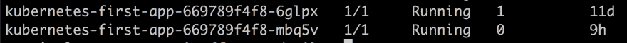](https://res.cloudinary.com/practicaldev/image/fetch/s--tw819ohi--/c_limit%2Cf_auto%2Cfl_progressive%2Cq_auto%2Cw_880/https://thepracticaldev.s3.amazonaws.com/i/ezqizyogxg36qu4tux2r.png)

我们还可以查看我们的部署，看看我们的`scale`指令是否已经被正确解析:

[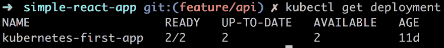](https://res.cloudinary.com/practicaldev/image/fetch/s--Bg1bL0Yt--/c_limit%2Cf_auto%2Cfl_progressive%2Cq_auto%2Cw_880/https://thepracticaldev.s3.amazonaws.com/i/cqdvsh1adbgbl82ntkfw.png)

## 自愈

*自我修复*是 Kubernetes 确保维持*期望状态*的方式。荚果不会自我愈合，因为荚果会死亡。多亏了 Kubernetes，一个新的豆荚出现了。

> 那么我们如何测试这个呢？

很高兴你问，我们可以删除一个 Pod，看看会发生什么。那么我们该怎么做呢？我们使用`delete`命令。但是我们需要知道我们的 Pod 的名称，所以我们需要调用`get pods`来获得它。让我们从这个开始:

```
kubectl get pods 
```

Enter fullscreen mode Exit fullscreen mode

然后让我们从两个 pod`kubernetes-first-app-669789f4f8-6glpx`中选择一个，并将其赋给一个变量:

```
POD_NAME=kubernetes-first-app-669789f4f8-6glpx 
```

Enter fullscreen mode Exit fullscreen mode

现在移除它:

```
kubectl delete pods $POD_NAME 
```

Enter fullscreen mode Exit fullscreen mode

让我们快点，用`get pods`检查我们的 Pod 状态。应该这么说*心狠手辣*:

[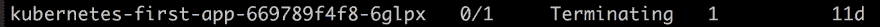](https://res.cloudinary.com/practicaldev/image/fetch/s--rsbRzCtv--/c_limit%2Cf_auto%2Cfl_progressive%2Cq_auto%2Cw_880/https://thepracticaldev.s3.amazonaws.com/i/yh5unu9kijodhrvpnx91.png)

等待一段时间，然后回显我们的变量`$POD_NAME`，后跟`get pods`。这应该会给你一个类似下面的结果。

[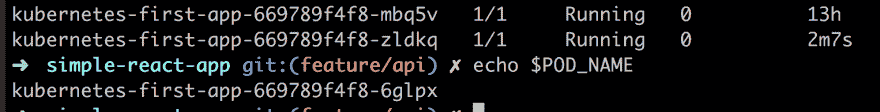](https://res.cloudinary.com/practicaldev/image/fetch/s--jdQMOrTK--/c_limit%2Cf_auto%2Cfl_progressive%2Cq_auto%2Cw_880/https://thepracticaldev.s3.amazonaws.com/i/qv87cbtz76bzkr2s0yfr.png)

那么上面的图像告诉我们什么呢？它告诉我们，我们删除的 Pod 确实被删除了，但它也告诉我们，两个副本的*期望状态*已经通过旋转新的 Pod 实现。我们看到的是“自我修复”在起作用。

## 不同的缩放方式

好了，我们看到了一种扩展方式，即明确说明我们需要某个部署的多少个副本。然而，有时我们可能想要一种不同的缩放方式，即*自动缩放*。自动缩放是指您不必设置想要的副本的确切数量，而是依靠 Kubernetes 来创建它认为需要的副本数量。那么 Kubernetes 是怎么知道的呢？它可以关注多个方面，但一个常见的指标是 CPU 利用率。比方说，你有一个订票网站，突然有人发布布鲁斯·斯普林斯汀的机票，你可能希望依靠自动缩放，因为第二天当机票全部售完时，你希望 pod 的数量恢复正常，而你不会希望手动这样做。

自动缩放是一个我打算在以后的文章中更详细讨论的话题，所以如果你真的很好奇这是如何实现的，我推荐你看一下这里的

## 总结

好的。所以我们做了。我们通过创建应用的副本来扩展应用。这并不难实现。我们展示了我们只需要为 Kubernetes 提供一个*期望状态*，它就会尽最大努力保持这种状态，也称为*自我修复*。此外，我们提到还有另一种扩展方式，即*自动扩展*，但是我们决定将这个话题留给另一篇文章。希望你现在对 Kubernetes 的惊人之处和扩展你的应用程序的容易程度更加敬畏。