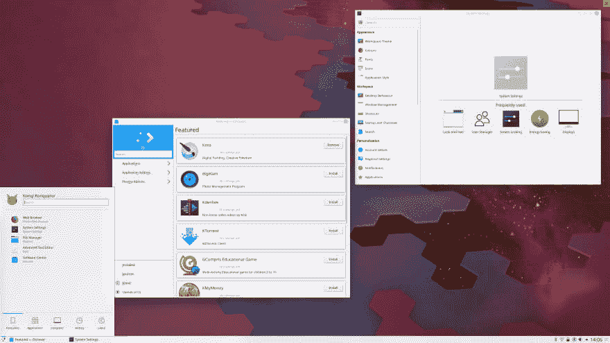
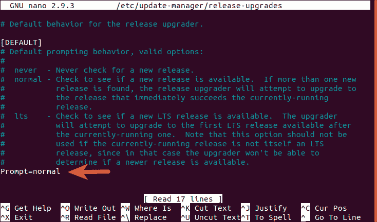
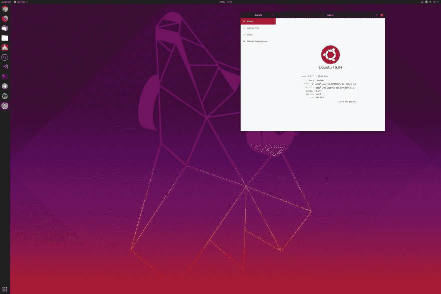

# 库班图:从 18.04 到 19.04

> 原文：<https://dev.to/kasuken/kubuntu-from-18-04-to-19-04-eon>

我不是一个真正的 linux 专家，但是我强迫自己每周至少一天学习 Linux。

为了工作，我选择了 Kubuntu，因为它是一个易于使用的 Linux 发行版。几周前，Kubuntu 19.04 带来了一些新的特性和应用。

其中之一就是基于[等离子 5.15](https://www.kde.org/announcements/plasma-5.15.0.php) 的新接口。

[](https://res.cloudinary.com/practicaldev/image/fetch/s--Lgd4IUvd--/c_limit%2Cf_auto%2Cfl_progressive%2Cq_auto%2Cw_880/https://kde.org/announcements/plasma-5.15/plasma-5.15-apps.png)

Kubuntu 从 18.04 更新到 19.04 有很多方法。对于我的 Surface Book 2，我选择了命令行工具。

## 为微软 Surface 笔记本电脑家族安装合适的内核

Kubuntu(和其他 Linux 发行版)没有针对微软 Surface 笔记本电脑硬件进行优化。我有一台 Surface Book 2 作为主要 pc，我也有同样的问题。但是，多亏了开源项目，你可以为这类笔记本电脑安装一个兼容的内核。

您可以按照此[链接](https://github.com/jakeday/linux-surface)上的说明安装最新版本，以在您的机器上获得最佳性能。

## 从命令行将 Kubuntu 更新到 19.04

首先，您必须用这个命令更新您的系统上所有安装的应用程序(它需要重新启动):

```
sudo apt update && sudo apt dist-upgrade 
```

Enter fullscreen mode Exit fullscreen mode

使用以下命令检查您的更新管理器是否已安装:

```
sudo apt install update-manager-core 
```

Enter fullscreen mode Exit fullscreen mode

在您最喜欢的文本编辑器中打开*/etc/update-manager/release-upgrades*，将最后一行修改为:Prompt=normal
或者，您可以使用以下命令:

```
sudo nano /etc/update-manager/release-upgrades 
```

Enter fullscreen mode Exit fullscreen mode

[](https://res.cloudinary.com/practicaldev/image/fetch/s--Vt-T8sQy--/c_limit%2Cf_auto%2Cfl_progressive%2Cq_auto%2Cw_880/https://thepracticaldev.s3.amazonaws.com/i/6brz8x3em109mouomxem.png)

现在，您可以使用以下命令升级到 19.04:

```
do-release-upgrade 
```

Enter fullscreen mode Exit fullscreen mode

[](https://res.cloudinary.com/practicaldev/image/fetch/s--O2gvUsLV--/c_limit%2Cf_auto%2Cfl_progressive%2Cq_auto%2Cw_880/https://thepracticaldev.s3.amazonaws.com/i/44zk8i6g56if3a5prw56.png)

*注意:*如果您的当前版本是 18.04，您必须启动该命令两次，第一次是为了获得 18.10 版本，第二次是为了获得最新版本 19.04