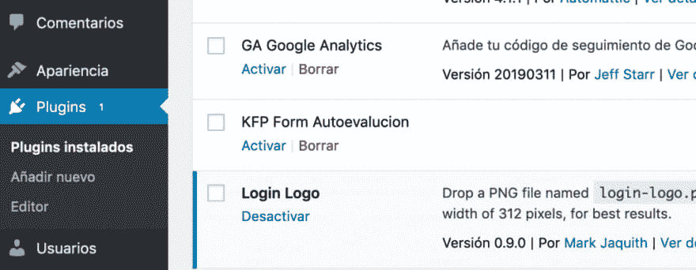
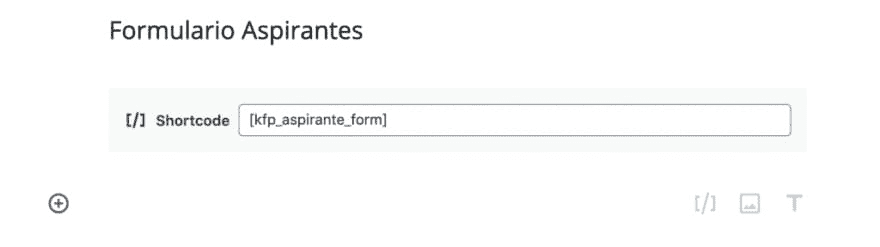
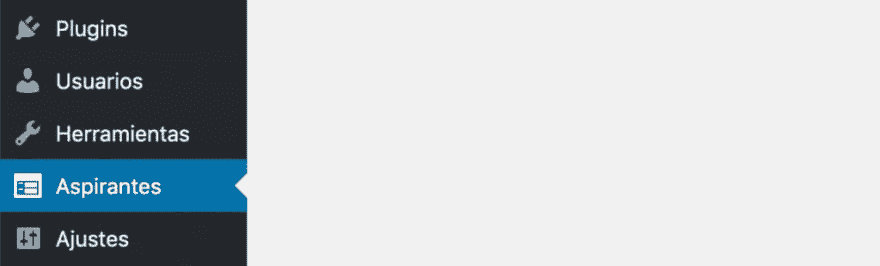
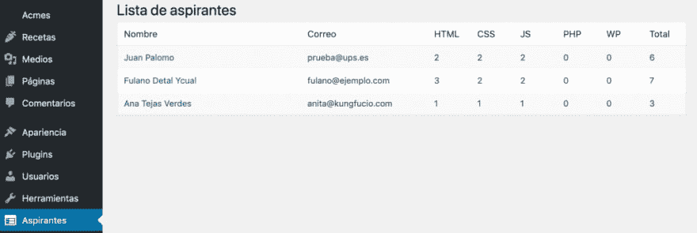

# 在 WordPress 中编程表单而不使用插件？

> [https://dev . to/juananuiz/how-programmer-un-form-in-WordPress-sin-using plug-ins-3977](https://dev.to/juananruiz/como-programar-un-formulario-en-wordpress-sin-utilizar-plugins-3977)；

### 为什么要开发表格而不是使用插件

创建表单有很多插件，但如果您是 WordPress 程序员，只需创建一对特定的表单，您可以通过创建一个小的自定义开发插件来提供更个性化的解决方案，此外还可以节省更大的插件的加载，从而提高站点速度

如果是你的情况，而且你正在阅读这篇文章来学习，我建议你不要去剪和粘贴代码，而是通过打字来更好地吸收它。

### 从哪里开始≤是我表格代码的最佳位置？

WordPress 中有三个不同的站点来开发您的代码:

*   **在**(擅长子主题):推荐您所做的是更改布局，还是在页面上添加信息，在其中您将主要使用 WordPress 函数，少用自己的代码，少用 HTML，少用 CSS，也许用 JS，少用 PHP。
*   **在主题(子主题)的 functions.php 文件**中:与上一个相同，但您将在多个模板中使用这些更改，或者添加的代码的大小说明函数是合理的。
*   **在插件**中:如果你需要更多的逻辑，你必须写很多 PHP，与其说是关于美学或表达方式，不如说是机械或行为的问题，这是在要求一个尖叫插件。此外，无论您使用哪个主题，您都可以使用插件。在这种情况下，您显然需要一个插件。

### 插件创建

建立外挂程式就像在外挂程式资料夹中建立新目录一样简单，并且在其中建立一个与资料夹名称相同且副档名为**的档案。php**

资料夹与档案名称必须具有描述性但简短，不要使用空格，而要使用底线，并避免与冲突

就我而言，文件夹将是**【kfp _ form _ self-assessment】**和主文件**【kfp _ form _ self-evaluation . PHP】**。但是我鼓励你把你自己的后缀，如果你要用表格做别的事情，你也必须改变剩下的名字。

档案的第一个版本必须包含最小标头，WordPress 才能将其视为外挂程式。此功能最小值为**外挂程式名称**，它必须反映外挂程式的资料夹名称和主要档案名称。不要忘记开头的标签 **<？PHP〔t15〕**

```
<?php 
/**
 * Plugin Name: KFP Form Autoevaluacion
 */ 
```

如果您现在转到 WordPress 管理面板的菜单**插件**，您应该在那里看到您的插件**【kfp 表单自我评估】**，您可以激活它，并验证它在您的 web 上没有爆炸。如果您想要更好地记录您的插件，可以在标题中添加其他字段，如 **Description** 、 **Author** 或 **Version**

[](https://res.cloudinary.com/practicaldev/image/fetch/s--bml9Z_6O--/c_limit%2Cf_auto%2Cfl_progressive%2Cq_auto%2Cw_880/https://kungfupress.com/wp-content/uploads/2019/04/kfp_form_aspirante_activacion_plugin-1024x398.png)

### 开始画表格

你已经很清楚想开发一个表格来收集一系列数据并将其写入表中，但你仍然不知道将它放在哪里。在 WordPress 页面或帖子中插入表单的最佳方法是使用短代码。

短代码是一个用方括号[]括起来的小文本标签。猁唇善珜酦笢ㄛ斛剕植价挂晤怃腔 HTML 耀宒么妏蚚杻忷腔 gutemberg 输ㄗ备峈 shortcode 辆俴唇﹝

要编写快捷方式代码，您需要使用一个特殊的 WordPress 函数，您必须将一个由您定义的函数传递给它，它将完成所有工作。到目前为止，shortcode 只会在您放置它的页面或条目上画出表格，而无法处理提交，您就可以做到这一点。

为了更有教育意义，我会把你将要工作的代码片段放在你身上，但是如果你在开始之前某个时候迷路了或者想看到最后的结果，你就把所有的代码都放在[kungfupress github](https://github.com/kungfupress/kfp_formulario_aspirantes)存储库里了。

几乎所有的代码都被注释掉了，所以我希望你在写作的时候能理解它，如果你不明白为什么要做一些具体的事情，我请你用注释来问我，以改进本教程。

我唯一没有评论的是表单的参数**action**，它调用 WordPress 的函数**【get _ the _ permalink】**，此函数返回当前条目的 url(或 permalink)，因此当用户提交表单时，将再次调用当前条目，如下所示以后你会放一个通知，通知用户你的发货结果。

```
<?php
/**
* Plugin Name: KFP Form Autoevaluacion
*/

// Define el shortcode y lo asocia a una función
add_shortcode('kfp_aspirante_form', 'Kfp_Aspirante_form');

/** 
 * Define la función que ejecutará el shortcode
 * De momento sólo pinta un formulario que no hace nada
 * 
 * @return string
 */
function Kfp_Aspirante_form() 
{
    // Esta función de PHP activa el almacenamiento en búfer de salida (output buffer)
    // Cuando termine el formulario lo imprime con la función ob_get_clean
    ob_start();
    ?>
    <form action="<?php get_the_permalink(); ?>" method="post" id="form_aspirante"
class="cuestionario">
        <div class="form-input">
            <label for="nombre">Nombre</label>
            <input type="text" name="nombre" id="nombre" required>
        </div>
        <div class="form-input">
            <label for='correo'>Correo</label>
            <input type="email" name="correo" id="correo" required>
        </div>
        <div class="form-input">
            <label for="nivel_html">¿Cuál es tu nivel de HTML?</label>
            <input type="radio" name="nivel_html" value="1" required> Nada
            <br><input type="radio" name="nivel_html" value="2" required> Estoy 
                aprendiendo
            <br><input type="radio" name="nivel_html" value="3" required> Tengo 
                experiencia
            <br><input type="radio" name="nivel_html" value="4" required> Lo 
                domino al dedillo
        </div>
        <div class="form-input">
            <label for="nivel_css">¿Cuál es tu nivel de CSS?</label>
            <input type="radio" name="nivel_css" value="1" required> Nada
            <br><input type="radio" name="nivel_css" value="2" required> Estoy 
                aprendiendo
            <br><input type="radio" name="nivel_css" value="3" required> Tengo 
                experiencia
            <br><input type="radio" name="nivel_css" value="4" required> Lo 
                domino al dedillo
        </div>
        <div class="form-input">
            <label for="nivel_js">¿Cuál es tu nivel de JavaScript?</label>
            <input type="radio" name="nivel_js" value="1" required> Nada
            <br><input type="radio" name="nivel_js" value="2" required> Estoy 
                aprendiendo
            <br><input type="radio" name="nivel_js" value="3" required> Tengo 
                experiencia
            <br><input type="radio" name="nivel_js" value="4" required> Lo domino 
al dedillo
        </div>
        <div class="form-input">
            <label for="aceptacion">La información facilitada se tratará 
            con respeto y admiración.</label>
            <input type="checkbox" id="aceptacion" name="aceptacion"
value="1" required> Entiendo y acepto las condiciones
        </div>
        <div class="form-input">
            <input type="submit" value="Enviar">
        </div>
    </form>
    <?php

    // Devuelve el contenido del buffer de salida
    return ob_get_clean();
} 
```

通过将短代码“**”[kfp _ candidate _ form]**放在博客的一个条目上，验证您是否正确地这样做。

[](https://res.cloudinary.com/practicaldev/image/fetch/s--5aQrzUTE--/c_limit%2Cf_auto%2Cfl_progressive%2Cq_auto%2Cw_880/https://kungfupress.com/wp-content/uploads/2019/04/kfp_form_aspirante_insertando_shortcode-1024x287.png)

当你进入你的条目时，你应该看到一个像图片中的表格。

[](https://res.cloudinary.com/practicaldev/image/fetch/s--GnJtgR8P--/c_limit%2Cf_auto%2Cfl_progressive%2Cq_auto%2Cw_880/https://kungfupress.com/wp-content/uploads/2019/04/kfp_form_aspirante_formulario_sin_formato-1024x928.png)

好吧，这不是你在表格上看到的最有美感的东西，但是…∞你的！

#### 有点风格

如果看到这个表格眼睛很疼，您可以插入一个小样式表，以便从插件本身进行填充。在插件文件夹中创建一个名为“**style . CSS**”的文件，其内容如下:

```
form.cuestionario {
    width: 600px;
}
form.cuestionario label {
    font-weight: bold;
    display: block;
    margin-bottom: 5px;
}
form.cuestionario .form-input {
    padding: 1em;
}
form.cuestionario .form-input input[type='text'],
form.cuestionario .form-input input[type='email'] {
    display: block;
    width: 100%;
}
p.exito {
    font-size: 1.5em;
    padding: 1em;
    border: 2px solid green;
    background: lightgreen;
}
p.error {
    font-size: 1.5em;
    padding: 1em;
    border: 2px solid red;
    background: #ff8787;
} 
```

Luegon 在打开打印表单的输出缓冲区**【ob _ start】**之前，将函数 **wp_enqueue_style** 插入函数**【kfp _ candidate _ form】**。

```
// Carga esta hoja de estilo para poner más bonito el formulario
wp_enqueue_style('css_aspirante', plugins_url('style.css', __FILE__));

// Esta función de PHP activa el almacenamiento en búfer de salida (output buffer)
// Cuando termine el formulario lo imprime con la función ob_get_clean
ob_start(); 
```

### 创建表来收集数据

WordPress 博客的几乎所有内容，无论是条目、页面甚至图片；它们记录在数据库的同一个表中:表**【WP _ posts】**。这既有优点又有缺点，也许记录表格数据最合适的方法是创建一个 **[自定义 post type 或自定义 type](https://kungfupress.com/como-crear-tipos-y-campos-personalizados-en-wordpress/)**及其相应的**自定义字段或自定义字段**。

在这种情况下，我宁愿创建一个单独的表来收集数据。创建此表或验证此表是否已存在的最佳时间是插件本身激活的时间。您可以使用功能**【register _ activation _ hook】**和简单的表创建 SQL 查询来执行此操作。你在维基书中有一本很好的《T2》MySQL 手册，如果你想要更快的东西，请看维基百科中关于 [SQL 的文章](https://es.wikipedia.org/wiki/SQL)。

您可以将此代码放在插件文件中的任何位置，我更喜欢将其放在几乎开头、标题后面和定义短代码之前。

```
// Cuando el plugin se active se crea la tabla para recoger los datos si no existe
register_activation_hook(__FILE__, 'Kfp_Aspirante_init');

/**
 * Crea la tabla para recoger los datos del formulario
 *
 * @return void
 */
function Kfp_Aspirante_init() 
{
    global $wpdb; // Este objeto global permite acceder a la base de datos de WP
    // Crea la tabla sólo si no existe
    // Utiliza el mismo prefijo del resto de tablas
    $tabla_aspirantes = $wpdb->prefix . 'aspirante';
    // Utiliza el mismo tipo de orden de la base de datos
    $charset_collate = $wpdb->get_charset_collate();
    // Prepara la consulta
    $query = "CREATE TABLE IF NOT EXISTS $tabla_aspirantes (
        id mediumint(9) NOT NULL AUTO_INCREMENT,
        nombre varchar(40) NOT NULL,
        correo varchar(100) NOT NULL,
        nivel_html smallint(4) NOT NULL,
        nivel_css smallint(4) NOT NULL,
        nivel_js smallint(4) NOT NULL,
        aceptacion smallint(4) NOT NULL,
        created_at datetime NOT NULL,
        UNIQUE (id)
        ) $charset_collate;";
    // La función dbDelta permite crear tablas de manera segura se
    // define en el fichero upgrade.php que se incluye a continuación
    include_once ABSPATH . 'wp-admin/includes/upgrade.php';
    dbDelta($query); // Lanza la consulta para crear la tabla de manera segura
} 
```

键入此代码后(请记住，我总是建议您键入代码而不是复制和粘贴)，您必须禁用插件，然后重新启用它才能运行函数**【register _ activation _ hook】**。如果一切顺利的话，你应该可以在你的数据库里看到新的表格(类似于**WP _ candidate**。

### 记录数据

你已经定义好表格和准备好的表格了，如果你进入表格并填写数据，这些数据会保存在表格中，那将是多么美妙啊？那就是你现在要做的。

您必须在定义短代码时创建的函数**【kfp _ candidate _ form】**内编写此代码。你可以把它放在开头或结尾，但在函数中，我更喜欢放在开头，前面你刚刚创建的表格。

你应该做的第一件事是确保在表格中标示为“**required”**的所有数据都已填写完毕，假设没有这些数据，将信息保存在数据库中就没有意义了。在这种情况下，每个人都是，所以每个人都要检查。您刚刚在客户端执行了此项检查，但由于并非所有访问者都将使用更新的浏览器进行访问，因此您必须在此处再次检查。这种情况还会发生在您身上，您必须在服务器端重新检查您在客户端检查或修复的任何内容

```
add_shortcode('kfp_aspirante_form', 'Kfp_Aspirante_form');

/** 
 * Define la función que ejecutará el shortcode
 * Comprueba si se han enviado los datos desde el formulario
 * y pinta el formulario
 *
 * @return string
 */
function Kfp_Aspirante_form() 
{
    global $wpdb; // Este objeto global permite acceder a la base de datos de WP
    // Si viene del formulario  graba en la base de datos
    // Cuidado con el último igual de la condición del if que es doble
    if ($_POST['nombre'] != ''
        AND is_email($_POST['correo'])
        AND $_POST['nivel_html'] != ''
        AND $_POST['nivel_css'] != ''
        AND $_POST['nivel_js'] != ''      
        AND $_POST['aceptacion'] == '1'
    ) {
        $tabla_aspirantes = $wpdb->prefix . 'aspirante'; 
        $nombre = sanitize_text_field($_POST['nombre']);
        $correo = $_POST['correo'];
        $nivel_html = (int)$_POST['nivel_html'];
        $nivel_css = (int)$_POST['nivel_css'];
        $nivel_js = (int)$_POST['nivel_js'];
        $aceptacion = (int)$_POST['aceptacion'];
        $created_at = date('Y-m-d H:i:s');
        $wpdb->insert(
            $tabla_aspirantes,
            array(
                'nombre' => $nombre,
                'correo' => $correo,
                'nivel_html' => $nivel_html,
                'nivel_css' => $nivel_css,
                'nivel_js' => $nivel_js,
                'aceptacion' => $aceptacion,
                'created_at' => $created_at,
            )
        );
        echo "<p class='exito'><b>Tus datos han sido registrados</b>. Gracias 
            por tu interés. En breve contactaré contigo.<p>";
    }
// Esto que viene ya lo debes tener escrito del primer paso    
    ob_start();
    ?>
<form action="<?php get_the_permalink(); ?>" method="post" id="form_aspirante"
    class="cuestionario">
// ...y continúa el formulario que escribiste 
```

在编辑器中记录代码并重新加载显示表单的页面，如果一切顺利，应该会显示确认消息，并且您应该在数据库中查看记录的信息。

### 验证和清理数据

请注意，您刚才输入的程式码会在储存资料之前，先对资料进行多项检查。列出使用的函数:

*   **sanitize_text_field** :防止标签或字符在文本字段内移动。
*   **is _ email**:WordPress 函数，用于验证字符串是否为格式正确的邮件。
*   (int):是 php 的一个参数，它尝试将下面的变量转换为类型为**的变量。他会很健康的。**

 **最后，在您开发的任何表单中，都应尝试避免使用 cross-site request forgery(csrf)攻击。为此，您将插入一个字段“**nonce**”，以帮助您使用 WordPress 的功能“**WP _ nonce**”验证正在处理的表单来自您自己的 web。你在文章[中对此类攻击有很好的解释；](https://igmoweb.com/2017/11/29/cross-site-request-forgery-dos-ejemplos-para-entenderlo/)的请求伪造:两个例子。

所以你必须在紧接标签之后和第一个**输入**之前输入此代码(或类似代码)。

```
<form action="<?php get_the_permalink(); ?>" method="post" id="form_aspirante"
      class="cuestionario">
    <?php wp_nonce_field('graba_aspirante', 'aspirante_nonce'); ?> 
```

最后，您必须在检查表单中的所有必需数据时添加一个附加条件

```
AND $_POST['aceptacion'] == '1'
AND wp_verify_nonce($_POST['aspirante_nonce'], 'graba_aspirante') 
```

关于审定和卫生问题，我正在准备一篇文章，希望不久能发表。

### 额外球:在你的表格中符合 RGPD

许多表单插件(至少是免费版本)不做的一件事是，通过要求同意保留同意者的姓名、接受、IP 地址、日期和时间来满足 RGPD(一般数据保护条例)的基本要求。

虽然我把它包含在插件的完整代码中，您可以从 Github 下载，但我让您作为练习自行开发。由于您已经保存了名称、日期和时间，因此只需保存 IP 即可。

据我所知，WordPress 中没有任何函数会返回用户的 IP 地址，因此我鼓励您在 web 上寻找一些解决方案，以便在插件中实现您自己的函数，您可以在保存数据之前调用该函数，以便返回用户的 IP 地址。

### 为插件创建管理菜单

最后，您将需要某种方式来查询从已存储在数据库中的表格中收集的数据。由于此数据只能由站点管理员访问，因此您将在管理区域内创建一个特定的菜单。

为此，您将使用调用函数**kfp _ candidate _ menu**的 admin _ menu】挂接。

此函数又使用 WordPress 的 **add_menu_page** 函数，该函数在用户具有足够权限时负责创建菜单。函数 **add_menu_page** 接收各种参数:

*   选取功能表时要载入的页面标题。
*   菜单项的节点。
*   用户加载菜单所需的容量(或权限)，在本例中为“**”manage _ options。**
*   将出现在管理页 URL 中的 **slug** 或别名。
*   选取功能表时，要载入之页面的建构函数名称。
*   与功能表关联的图示。做到这一点有几种方法，为了简化，你会使用 dash icon，在本例中 **dashicon 反馈**
*   菜单项在菜单上的位置，在这种情况下，我已经把 **75** 。虽然这取决于 WordPress 的版本和您已经安装的插件，但为了避免头晕，最好不要戴上它，最后一个就会出来

```
// El hook "admin_menu" permite agregar un nuevo item al menú de administración
add_action("admin_menu", "Kfp_Aspirante_menu");

/**
 * Agrega el menú del plugin al panel de administración
 *
 * @return void
 */
function Kfp_Aspirante_menu() 
{
    add_menu_page(
        'Formulario Aspirantes', 'Aspirantes', 'manage_options', 
        'kfp_aspirante_menu', 'Kfp_Aspirante_admin', 'dashicons-feedback', 75
    );
} 
```

录制程式码后，请前往 WordPress management panel(WordPress 管理面板)，新功能表项目名称应为**candidate**，按一下即可载入右侧面板，目前不会显示任何内容。现在，您将在那里显示您从表格中捕获的数据(我希望您已经填写了几次表格，以便有东西要显示)。

[](https://res.cloudinary.com/practicaldev/image/fetch/s--tJTVQNX9--/c_limit%2Cf_auto%2Cfl_progressive%2Cq_auto%2Cw_880/https://kungfupress.com/wp-content/uploads/2019/04/menus_apirantes-1024x309.png)

### **创建一个表，从管理面板**显示插件数据

函数**【add _ menu _ page】**的一个参数是在单击新菜单时要加载的仪表板或管理页的函数名称。您现在要定义的函数负责生成显示在页面上的 HTML 代码。

功能 kfp _ candidate _ admin 将做四件事:

*   打印 HTML 表格标题以显示数据
*   运行 SQL 查询以从插件自身生成的数据库表中获取数据。
*   循环浏览通过在 HTML 表中绘画获得的记录
*   打印 HTML 表格关闭

请注意，当您要显示数据库字段**的内容**时，不会给用户带来任何惊喜。尽管在数据收集阶段采取了所有的预防措施，但你永远不能百分之百地肯定有人把‘T2’注入了‘T3’你的表中，所以你必须‘T4’逃离‘t5’。

```
/**
 * Crea el contenido del panel de administración para el plugin
 *
 * @return void
 */
function Kfp_Aspirante_admin()
{
    global $wpdb;
    $tabla_aspirantes = $wpdb->prefix . 'aspirante';
    echo '<div class="wrap"><h1>Lista de aspirantes</h1>';
    echo '<table class="wp-list-table widefat fixed striped">';
    echo '<thead><tr><th width="30%">Nombre</th><th width="20%">Correo</th>
        <th>HTML</th><th>CSS</th><th>JS</th>
        <th>PHP</th><th>WP</th><th>Total</th></tr></thead>';
    echo '<tbody id="the-list">';
    $aspirantes = $wpdb->get_results("SELECT * FROM $tabla_aspirantes");
    foreach ( $aspirantes as $aspirante ) {
        $nombre = esc_textarea($aspirante->nombre);
        $correo = esc_textarea($aspirante->correo);
        $motivacion = esc_textarea($aspirante->motivacion);
        $nivel_html = (int)$aspirante->nivel_html;
        $nivel_css = (int)$aspirante->nivel_css;
        $nivel_js = (int)$aspirante->nivel_js;
        $nivel_php = (int)$aspirante->nivel_php;
        $nivel_wp = (int)$aspirante->nivel_wp;
        $total = $nivel_html + $nivel_css + $nivel_js + $nivel_php + $nivel_wp;
        echo "<tr><td><a href='#' title='$motivacion'>$nombre</a></td>
            <td>$correo</td><td>$nivel_html</td><td>$nivel_css</td>
            <td>$nivel_js</td><td>$nivel_php</td><td>$nivel_wp</td>
            <td>$total</td></tr>";
    }
    echo '</tbody></table></div>';
} 
```

保存插件代码并再次选择**候补**菜单，如果一切顺利的话，应该可以看到所收集的数据。

[](https://res.cloudinary.com/practicaldev/image/fetch/s--WcX0BDX2--/c_limit%2Cf_auto%2Cfl_progressive%2Cq_auto%2Cw_880/https://kungfupress.com/wp-content/uploads/2019/04/panel_admin_aspirantes-1024x343.png)

#### 对位注释

管理面板中的表格可以使用类别**【WP _ list _ table】**，但必须采取某些预防措施。在[https://clearintelligence . MX/WP-list-table-one-guide-step-to-step/](https://clearintelligence.mx/wp-list-table-una-guia-paso-a-paso/)和[https://www . smashing magazine . com/2011/11/native-admin-tables-WordPress/](https://www.smashingmagazine.com/2011/11/native-admin-tables-wordpress/)中有一个很好的例子

## 最后思考

我希望您能顺利完成本教程，而且您的表单运行良好，如果您给我 URL，我很乐意看到它在操作中！

我鼓励你从这种做法中学到的东西中探索其他主题。考虑一些需要通过 WordPress 解决的问题，开发这样简单的插件并尝试解决。

如果你被困在某个地方，不要犹豫问我你的疑虑，我们可以一起试试。如果你发现了什么错误或者想出了什么可以改进的东西也不要留着。

不耐烦你的评论！

### 参考文献

*   [kungfupress github 存储库中的完整代码](https://github.com/kungfupress/kfp_formulario_aspirantes)。
*   维基书中 MySQL 手册
*   [SQL en 维基百科](https://es.wikipedia.org/wiki/SQL)
*   文章:[请求伪造:以](https://igmoweb.com/2017/11/29/cross-site-request-forgery-dos-ejemplos-para-entenderlo/)为例
*   [https://www . arsys . es/blog/programmer/generate-menus-admin-WordPress/](https://www.arsys.es/blog/programacion/generar-menus-admin-wordpress/)
*   获取访问者 IP 的函数示例:
    *   [https://mvkoen . com/显示-wordpress/](https://mvkoen.com/mostrar-la-direccion-ip-de-usuarios-y-visitantes-en-wordpress/) 用户和访问者的 ip 地址
    *   [https://stack overflow . com/questions/6717926/function-to-get-user-IP-address](https://stackoverflow.com/questions/6717926/function-to-get-user-ip-address)
    *   [https://www . WP beginner . com/WP-tutorials/how-to-display-a-users-IP-address-in-WordPress/](https://www.wpbeginner.com/wp-tutorials/how-to-display-a-users-ip-address-in-wordpress/)
*   使用的 WordPress 挂接和函数:
    *   [add_shortcode](https://codex.wordpress.org/Function_Reference/add_shortcode)
    *   [_ permalink](https://codex.wordpress.org/Function_Reference/the_permalink)
    *   [注册 _ 激活 _ 挂钩](https://codex.wordpress.org/Function_Reference/register_activation_hook)
    *   [添加 _ 动作](https://developer.wordpress.org/reference/functions/add_action/)
    *   [管理菜单](https://codex.wordpress.org/Plugin_API/Action_Reference/admin_menu)
    *   [添加 _ 菜单 _ 页面](https://developer.wordpress.org/reference/functions/add_menu_page/)
    *   [sanitize_text_field](https://developer.wordpress.org/reference/functions/sanitize_text_field/)
    *   [is_email](https://codex.wordpress.org/Function_Reference/is_email)
    *   [esc_textarea](https://developer.wordpress.org/reference/functions/esc_textarea/)
    *   [获取永久链接](https://developer.wordpress.org/reference/functions/get_the_permalink/)
    *   [注册 _ 激活 _ 挂钩](https://codex.wordpress.org/Function_Reference/register_activation_hook)**