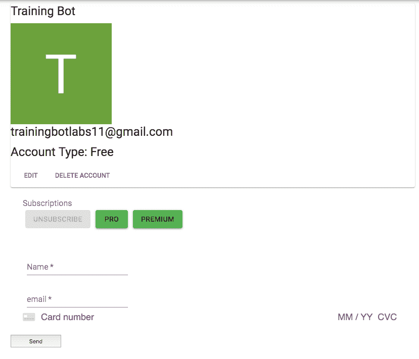

# 实验第 2 周:回顾

> 原文：<https://dev.to/mlanders/labs-week-2-a-review-pnd>

## 多好的一周啊！

这是迄今为止我在 Lambda 学校度过的最具挑战性的一周。从这周开始的感觉是骗子综合症，到周中感觉很好，然后今天就卡住了。

本周，我着手将 Stripe 整合到我们的项目中。开始阅读文档，但不理解它们是如何组合在一起的。这是我第一次集成前端、后端和第三方 API。理解所有的部分是如何组合在一起的是最大的挑战。周中，我开始掌握一些东西，到了周末，我开始重构代码，添加 redux。

* * *

本周，我最大的成就之一就是在根据订阅状态进行更新的同时，让前端看起来更体面。

当用户选择订阅类型时，付款表单出现。在输入他们的卡信息后，后端处理向 stripe 注册用户(如果他们还没有注册),并将 Stripe 用户 ID 发送到我们的数据库。然后，它获取 Stripe 用户 id，为用户订阅计划，并更新我们数据库中的用户帐户类型，以反映在前端。我目前在集成 redux 以更好地处理个人资料页面的状态更新时遇到了一些承诺问题。

* * *

我的团队在整个过程中表现得非常出色。我一直努力参加我们的变焦会议，尽我所能帮忙。我认为作为一名团队成员，很大一部分是当有人有问题或想向你提出一个想法时，呆在房间里。当我觉得自己有一个有价值的想法时，我会加入讨论，并倾听我所知之外的讨论

总的来说，我们的团队相当悠闲，没有人对设计或技术决策有强烈的意见。如果有人想承担一项任务，我们都相信他们的决定，如果有事情发生，我们会像团队一样处理。这使得整个过程几乎没有摩擦。我确实觉得我个人在寻求帮助方面做得不太好，而只是努力去解决一些我不确定的事情。这是我想在最后三周的实验中做的事情。