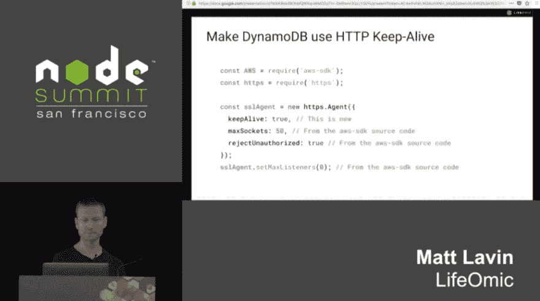
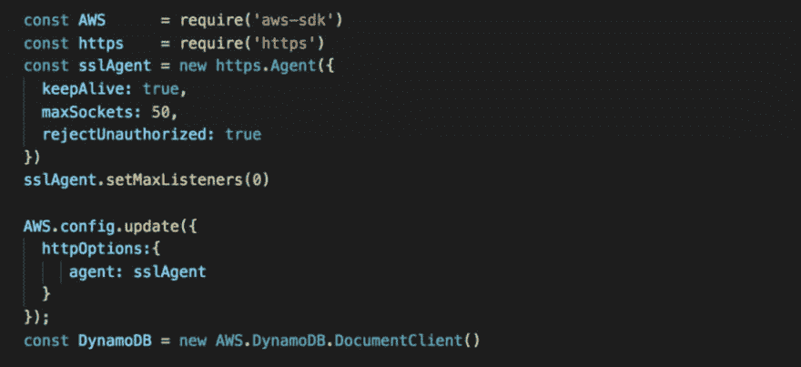
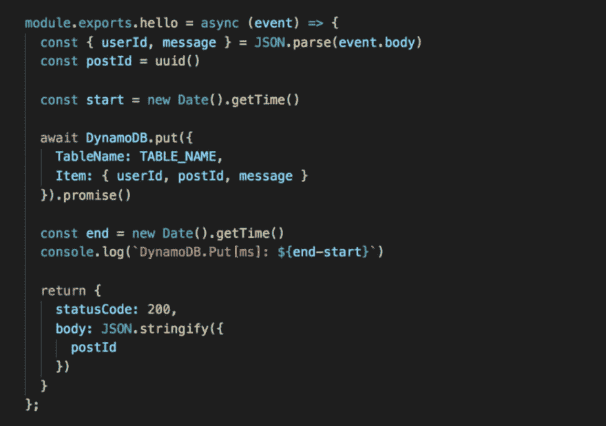
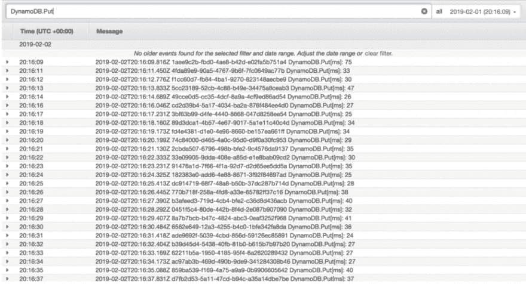
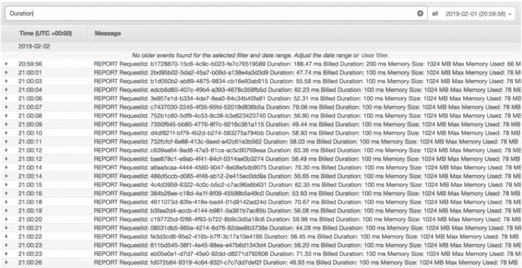
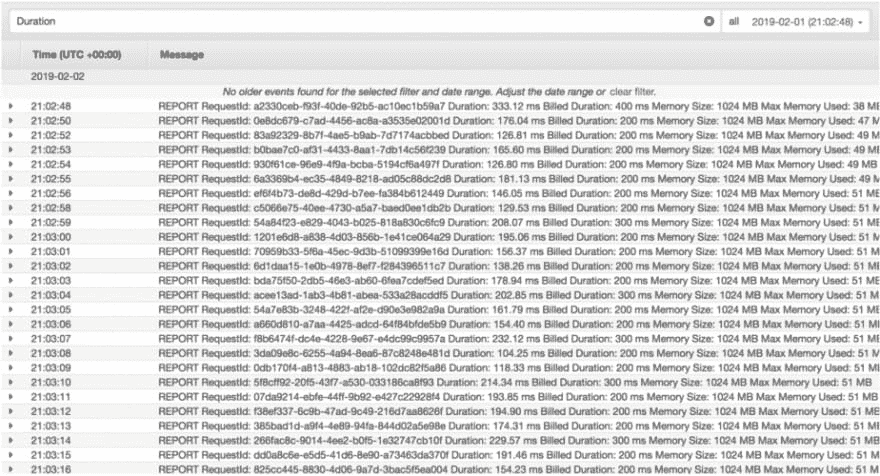

# Lambda 优化提示–启用 HTTP 保持活动

> 原文：<https://dev.to/theburningmonk/lambda-optimization-tip-enable-http-keep-alive-3pkh>

我最近看了 Matt Lavin 关于 Lambda 优化技巧的精彩演讲，还看了一张让 DynamoDB 使用 HTTP keep-alive 的幻灯片。这让我想起了我和塞巴斯蒂安·科宁的一次谈话，所以我开始测试这个简单优化的效果。

## 这是怎么回事？

事实证明，Node.js 的默认 HTTP 代理不使用 keep-alive，因此每个请求都会产生建立新的 TCP 连接的成本。这显然是低效的，因为您需要执行[三次握手](https://www.inetdaemon.com/tutorials/internet/tcp/3-way_handshake.shtml)来建立 TCP 连接。对于短期操作(如 DynamoDB 操作，通常在一位数毫秒内完成)，建立 TCP 连接的延迟开销可能大于操作本身。

使用 Node.js AWS SDK，您只需几行代码就可以覆盖 HTTP 代理以用于所有客户端。您也可以覆盖单个客户端的设置。

## 测试

为了测试启用 HTTP keep-alive 的效果，我在 API Gateway 后面设置了一个简单的 Lambda 函数。本质上，这个函数将一个项目放入 DynamoDB 表中，就这样。

对于这个实验，我想看看 HTTP 保持活动在多次调用中的表现如何，以及这个简单的改变带来了多大的不同。

## 结果

如果没有 HTTP keep-alive，DynamoDB 操作的平均时间大约为**33 毫秒**。

有了 HTTP keep-alive，这个平均值下降到大约 10 毫秒。

正如我们所怀疑的，开销(33 毫秒-10 毫秒= 23 毫秒)大于操作本身的成本。实验表明，该连接在多次调用中被很好地重用。通过一个非常简单的改变，我们能够将执行时间缩短约 20 毫秒，或者更令人印象深刻的是，将响应时间减少了 70%。在我看来，这是不错的投资回报，但人眼仍然看不出差别。

但是如果我们在一个函数中扩展到 10 个连续的 DynamoDB 操作呢？

使用 HTTP keep-alive，该函数的执行时间平均约为**60 毫秒**。

没有 HTTP keep-alive，平均执行时间上升到 **180ms** 。

当我弯曲终点时， **120ms** 的差异是明显的。这种差异可能会开始影响用户体验，正如亚马逊 10 年前发现的那样，[增加 100 毫秒的延迟可以减少多达 1%的销售额](https://blog.gigaspaces.com/amazon-found-every-100ms-of-latency-cost-them-1-in-sales/)。