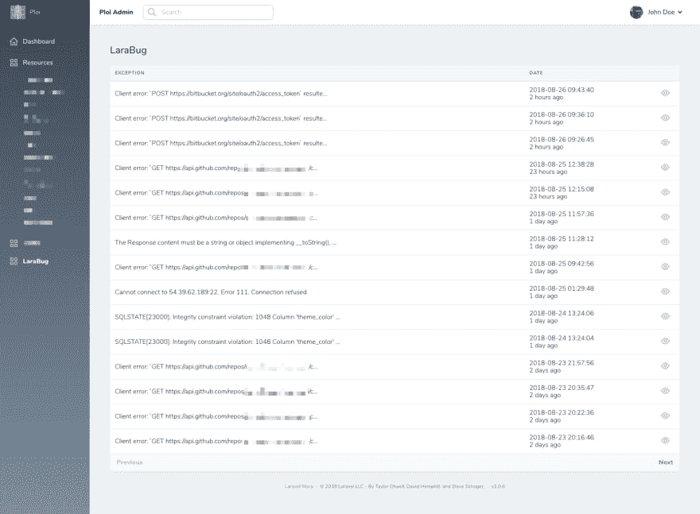

# Lara bug——Laravel 异常工具助手

> 原文：<https://dev.to/dennis_smink/larabug-a-laravel-exception-tool-helper-2mci>

当创建和开发网站时，最常见的是你的用户不总是报告错误，当然，如果你不解决这些错误，你将失去(潜在的)客户。

这就是 LaraBug 出现的地方，我在 2016 年创建了这个工具，基本上是为了挠自己的痒。我需要一个清晰明了的工具来阅读我的错误，我必须知道出问题时发生了什么。(呜呜，出问题了😰)

LaraBug 将捕获应用程序中生成的任何异常，并将其收集到一个漂亮的仪表板中。

您可以全面了解每个项目的例外情况。您可以查看关于异常的完整细节，包括堆栈跟踪和突出显示实际行的代码段，这样您就可以知道代码中断的位置。

如果可以的话，LaraBug 的包也会发送用户的详细信息(有哨兵支持！)所以你知道是关于谁的。

与队友或同事共享要解决的异常也没有问题，只需在 LaraBug 的选项选项卡中“公开”您的异常，这将允许 URL 共享您的异常。

Nova 工具包
我们还为新发布的 Laravel Nova 面板提供了一个 LaraBug 包！这允许您从 Laravel Nova 面板查看您的错误。

github . com:[https://github.com/LaraBug/nova-larabug-tool](https://github.com/LaraBug/nova-larabug-tool)

nova packages . com:[https://novapackages.com/packages/larabug/nova-larabug-tool](https://novapackages.com/packages/larabug/nova-larabug-tool)

拉拉格网站:[https://www.larabug.com](https://www.larabug.com)

就是这样！让我知道它是否对你有帮助，以及我是否能在任何方面有所改进。

注意:请记住，我是一名荷兰开发人员，英语不是我的母语，所以这篇文章可能包含任何语法错误。