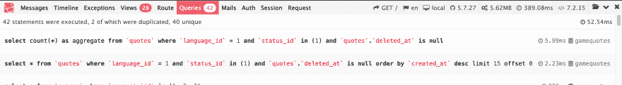
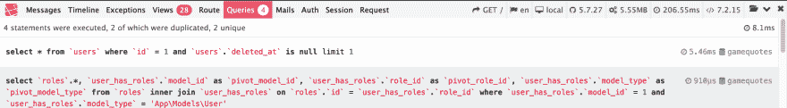

# Laravel 5:使用查询缓存让你的应用程序非常快

> 原文：<https://dev.to/kovah/laravel-5-use-query-caching-to-make-your-app-really-fast-gk9>

我目前正在重建我最老的副业之一，[游戏报价网](https://game-quotes.com/)。作为一个内容密集型应用程序，数据库中存储了大量内容，要在缓存站点和向用户提供最新内容之间找到最佳平衡并不容易。有几种方法可以实现内容缓存，以 a)最大限度地减少基础设施上的负载，b)加快应用程序的加载速度，但今天它不是关于 nginx 缓存或手动将内容存储在 Laravel 缓存中，并在需要时检索它。今天我想介绍一下**查询缓存**，它将数据库调用的次数减少到几乎为零。

## 在我们开始之前:查询缓存能够做什么？

因此，在启用查询缓存之前，游戏报价的 frontpage 使用 42 个数据库查询，使用 5.562MB RAM，在 389 毫秒内加载。

[](https://res.cloudinary.com/practicaldev/image/fetch/s--cHs-HGyv--/c_limit%2Cf_auto%2Cfl_progressive%2Cq_auto%2Cw_880/https://thepracticaldev.s3.amazonaws.com/i/wy921srffbcxzr7eyv0s.png)

通过为大多数使用的实体实现查询缓存，我能够将查询缓存减少到 4 个查询，加载时间减少了近 50%,达到 206 毫秒。

[](https://res.cloudinary.com/practicaldev/image/fetch/s--vJSzQMMT--/c_limit%2Cf_auto%2Cfl_progressive%2Cq_auto%2Cw_880/https://thepracticaldev.s3.amazonaws.com/i/ph2wngseuohatn9wqoqr.png)

如您所见，您能够显著降低应用程序和数据库的负载。一个主要的优点是:缓存可以保持有效，直到内容发生变化，这进一步减少了负载，因为在缓存失效后，不必再次获取内容。我认为这真的令人印象深刻，那么我们如何实现这一点呢？

## 为 Laravel 实现查询缓存

老实说，实现查询缓存一点也不神奇。主要原因是由[德怀特·沃森](https://github.com/dwightwatson)维护的[可记忆包](https://github.com/dwightwatson/rememberable)。该套件维护良好，易于使用，并且已经**与 Laravel 5.8** 兼容。我会告诉你如何使用它。

首先，简单地使用
安装软件包

```
composer require watson/rememberable 
```

Enter fullscreen mode Exit fullscreen mode

之后，您必须准备想要启用查询缓存的模型。为此，修改如下:

```
use Watson\Rememberable\Rememberable;

class Quote extends Model
{
    use Rememberable;
    ...
} 
```

Enter fullscreen mode Exit fullscreen mode

我们现在已经告诉 Rememberable 包自动缓存该模型的所有数据库查询。对此要非常小心。如果您只是插入这一行而没有任何进一步的配置，那么如果您想要清除您的模型的查询缓存，您将不得不清除整个 Laravel 缓存！为了防止这里出现任何问题，我们现在将配置模型。

### 查询缓存的标记

第一步是告诉 Rememberable 为这个特定的模型标记缓存。注意:这只适用于也支持标记的缓存，如 Redis 或 Memcached，[，但不适用于文件缓存](https://laravel.com/docs/5.7/cache#cache-tags)。

```
class Quote extends Model
{
    use Rememberable;

    public $rememberCacheTag = 'quote_queries';
} 
```

Enter fullscreen mode Exit fullscreen mode

这个选项使得只删除模型的查询缓存成为可能，如果内容发生变化，这一点很重要。我们可以这样做:

```
Cache::tags('quote_queries')->flush(); 
```

Enter fullscreen mode Exit fullscreen mode

为了使事情变得简单，你也可以使用 Rememberable 包的一个特殊方法，这样你就不必记住 cache 标签。在您的模型上调用`flushCache()`来清除它的查询缓存:

```
Quote::flushCache();
// or
$quote->flushCache() 
```

Enter fullscreen mode Exit fullscreen mode

### 缓存自动过期

这一步是可选的，因为您可能只需要在内容更改时使缓存无效。但是，如果查询缓存不会永远存在，您可能会更安全。只需添加以下选项，该值是以分钟为单位的缓存生存期。

```
class Quote extends Model
{
    use Rememberable;

    public $rememberCacheTag = 'quote_queries';
    public $rememberFor = 60; // 1 hour
} 
```

Enter fullscreen mode Exit fullscreen mode

所以，就这样了。您的应用程序现在应该缓存所有查询。

### 小心模型关系

让我头疼的一件事是:模型关系。如果模型 A 与模型 B 有关系，那么在处理这些关系时，很可能会遇到查询缓存问题。为了保存，如果一个模型更新，清除两个模型的缓存。

* * *

*这篇文章首先出现在[博客上。](https://blog.kovah.de/en/n7hs3x-laravel-5-use-query-caching-to-make-your-app-really-fast/)kovah . de*