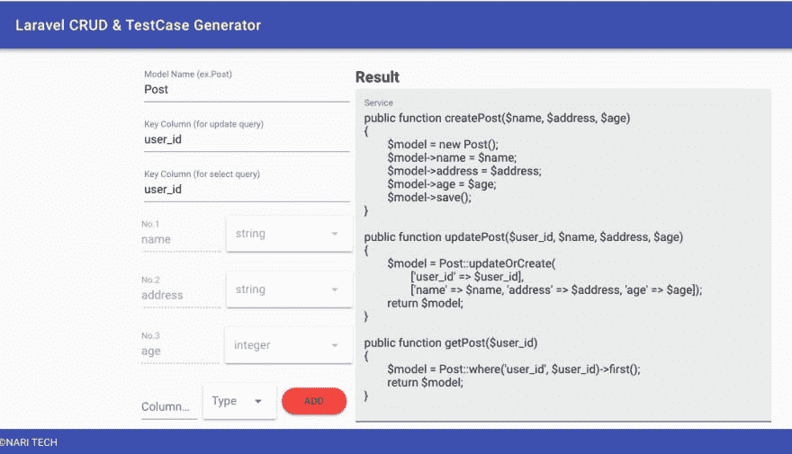
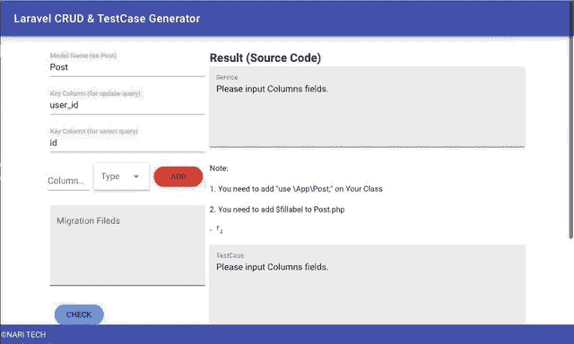

# Laravel CRUD 和测试用例代码生成器

> 原文：<https://dev.to/narith/laravel-crud-and-testcase-code-generator-40l2>

我的工具将变得比 Laravel 开发人员编写基本的 CRUD 方法更容易。

> NARI🏕フリーエンジニア/team kit@ nari _ creator嗨，伙计们！！(针对高级开发人员)
> 
> 我开发了 [@laravelphp](https://twitter.com/laravelphp) CRUD 和测试用例代码 generator✨
> 
> 你可以输入你的模型信息，然后代码就很快生成了！！
> 
> 👇请查收:)
> [7k 095 M9 l6 q . code sandbox . io](https://t.co/KAY1bNoNeK)
> 
> [# Laravelphp](https://twitter.com/hashtag/Laravelphp)[# phpunit](https://twitter.com/hashtag/phpunit)
> [# codesandox](https://twitter.com/hashtag/codesandox)
> [# 100 daysofcode](https://twitter.com/hashtag/100DaysOfCode)03:46AM-03 Feb 2019[](https://twitter.com/intent/tweet?in_reply_to=1091905637573750784)【T45

> <video loop="" controls=""><source src="https://video.twimg.com/tweet_video/DydMKxCUYAE0xY2.mp4" type="video/mp4"></video> T10-t11-T12-t13-t14-t15-nari 自由工程师/ Teamkit@nari_creator【== 功能添加==】
> Laravel CRUD &对 TestCase 生成工具进行了改进，可以更容易使用、编写代码
> 
> ①从①migration 文件复制生成(★) 8 .
> 免费使用的工具在这里
> [7k095m9l6q.codesandbox.io](https://t.co/KAY1bNoNeK)
> 
> [#Laravel](https://twitter.com/hashtag/Laravel) Laravel php05:09 AM - 03 Feb 2019[](https://twitter.com/intent/tweet?in_reply_to=1091926537119494145) 图 46 是3 [](https://twitter.com/intent/like?tweet_id=1091926537119494145)6

## 使用框架工作

vuetify.js

## GitHub

##  [纳里斯-米南](https://github.com/narith-minami) / [拉韦尔-克鲁德-测试代码生成器](https://github.com/narith-minami/laravel-crud-and-test-code-generator)

### 使用 CodeSandbox 创建

<article class="markdown-body entry-content container-lg" itemprop="text">

# 统一资源定位器

[https://7k095m9l6q.codesandbox.io/](https://7k095m9l6q.codesandbox.io/)

> Vue.js 和 vuetify 项目

## 构建设置

```
# install dependencies
npm install

# serve with hot reload at localhost:8080
npm run dev

# build for production with minification
npm run build

# build for production and view the bundle analyzer report
npm run build --report

# run unit tests
npm run unit

# run all tests
npm test
```

关于如何工作的详细解释，请查看 vue-loader 的[指南](http://vuejs-templates.github.io/webpack/)和[文档。](http://vuejs.github.io/vue-loader)

</article>

[View on GitHub](https://github.com/narith-minami/laravel-crud-and-test-code-generator)

## 网址

[https://7k095m9l6q.codesandbox.io/](https://7k095m9l6q.codesandbox.io/)

让我们享受你的编程生活:)