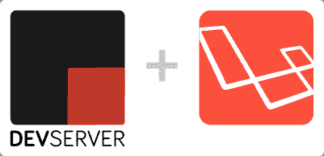
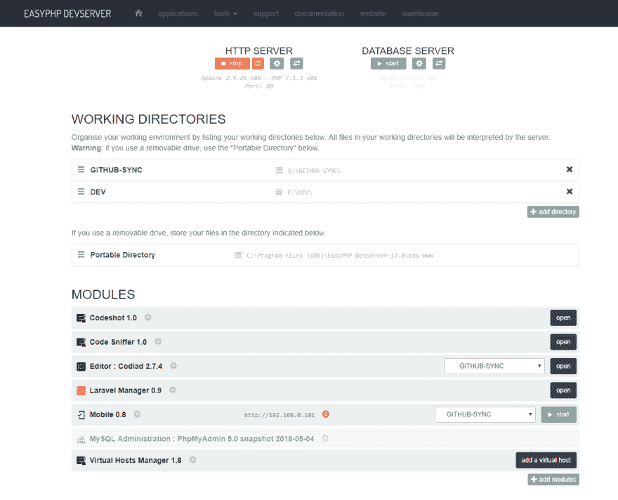
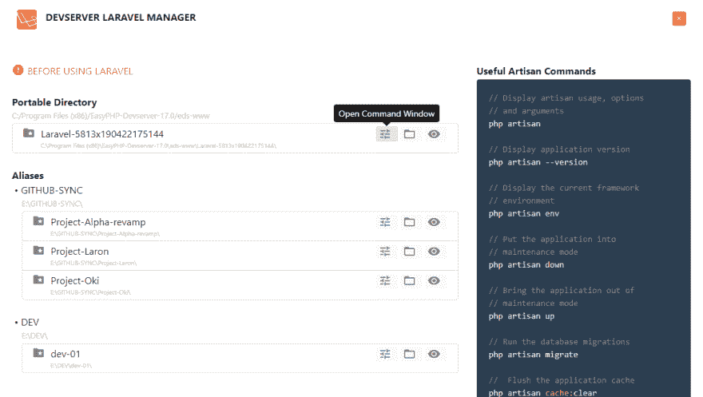
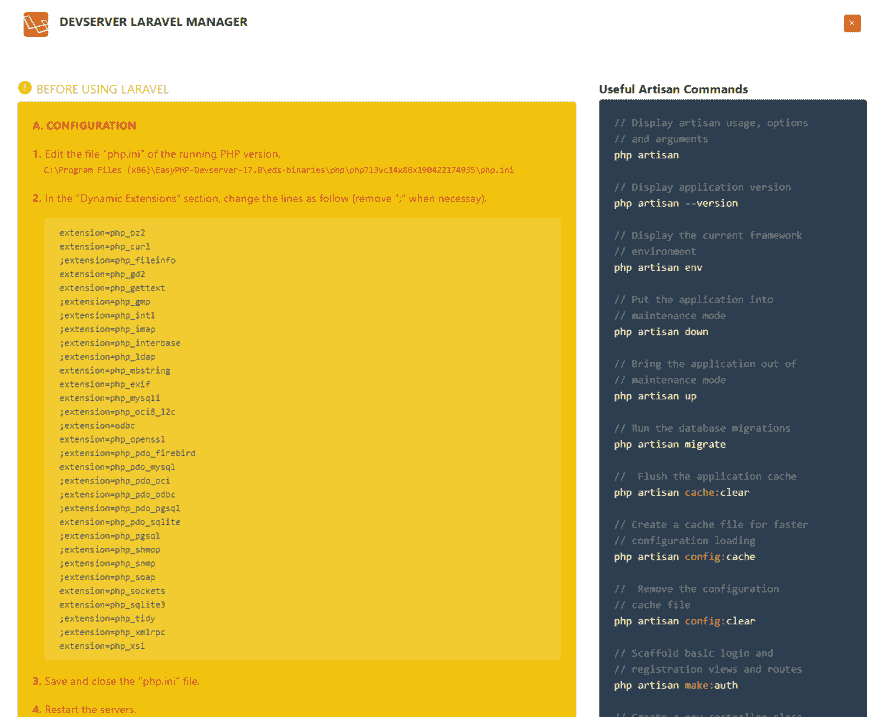
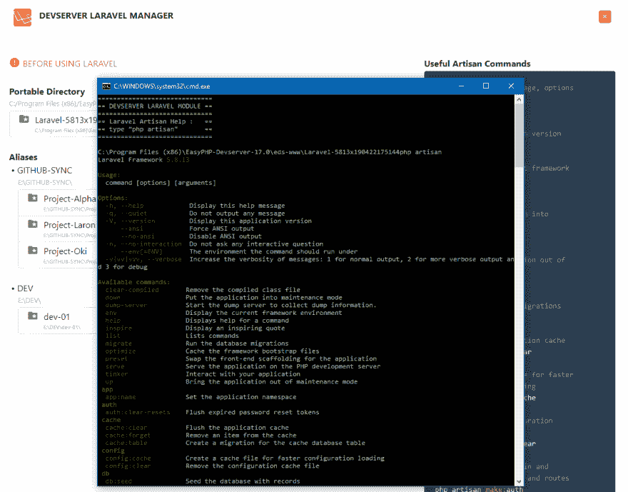

# DEVSERVER 的 LARAVEL & LARAVEL 管理器

> 原文：<https://dev.to/laurentabbal/laravel-laravel-manager-for-devserver-3ii2>

类型:**模块**

需求: [**Devserver**](https://www.easyphp.org/easyphp-devserver.php)

### 1。[计] 下载

本模块安装 Laravel 和 Laravel 管理器。

T6】

### 2。拉韦尔&拉韦尔管理器模块

安装完成后，您会在“eds-www”文件夹中找到一个新的 Laravel 文件夹(您可以移动和/或重命名该文件夹),并在模块列表中找到一个“Laravel 管理器”。

### 3。拉勒韦尔框架

这个模块立刻安装一个新的 Laravel 项目。

" Laravel 是一个免费的开源 PHP web 框架，由 Taylor Otwell 创建，旨在开发遵循模型-视图-控制器(MVC)架构模式并基于 Symfony 的 web 应用程序"[...更多](https://en.wikipedia.org/wiki/Laravel)

### 4。拉勒维尔经理

这个模块也安装了 Laravel 管理器。Laravel 管理器会自动列出文件夹中的所有 Laravel 项目。使用 Laravel Manager，您可以从一个页面管理所有 Laravel 项目，打开每个项目的“命令窗口”，浏览文件，打开您的 Laravel 网站，并检查“有用的 Artisan 命令”。

#### 1。Laravel 管理器模块

管理你所有的 Laravel 项目。

#### 2。在使用 Laravel 之前

为 Laravel 配置 Devserver。

#### 3。Laravel &工匠

对于每个项目，您可以自动打开其“命令窗口”并使用 Artisan。

### 5。从计算机上卸载

简单:删除模块文件夹。就是这样！