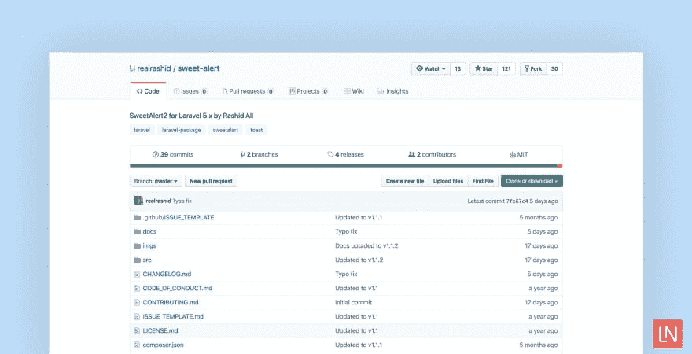

# 拉那史威特

> 原文：<https://dev.to/realrashid/laravel-sweetalert-36kd>

[](https://res.cloudinary.com/practicaldev/image/fetch/s--dAe9jYhw--/c_limit%2Cf_auto%2Cfl_progressive%2Cq_auto%2Cw_880/https://thepracticaldev.s3.amazonaws.com/i/2w2r3dv3nveb6hem7ply.jpg)

Laravel SweetAlert 2 是一个 Laravel 包，集成了流行的 JavaScript SweetAlert 2 和 Laravel。

使用包的 Alert facade 或 Alert()助手，您可以在前端从控制器排队 SweetAlert 2 警报:

它如此容易实现和易于使用，给一个镜头，留下你的想法。

安装

要开始使用 Laravel SweetAlert，
使用 Composer 将包添加到项目的依赖项:

```
composer require realrashid/sweet-alert 
```

#### 预警

*   `alert('Title','Lorem Lorem Lorem', 'success');`

*   `alert()->success('Title','Lorem Lorem Lorem');`

*   `alert()->info('Title','Lorem Lorem Lorem');`

*   `alert()->warning('Title','Lorem Lorem Lorem');`

*   `alert()->question('Title','Lorem Lorem Lorem');`

*   `alert()->error('Title','Lorem Lorem Lorem');`

*   `alert()->html('<i>HTML</i> <u>example</u>'," You can use <b>bold text</b>, <a href='//github.com'>links</a> and other HTML tags ",'success');`

#### 敬酒

*   `toast('Your Post as been submited!','success','top-right');`

您还可以配置软件包的 ToSweetAlert 中间件，以便在中间件处理程序期间处理 SweetAlert 2 消息:

```
public function someFunction(Request $request)
{
    return redirect('login')->with('success', 'Login Successfully!');
} 
```

你应该查看一下[文档](https://realrashid.github.io/sweet-alert/)，看看有哪些方法可用。
你可以在 [realrashid/sweet-alert](https://github.com/realrashid/sweet-alert/) 的 GitHub 上了解更多关于这个包的信息并查看源代码

特色在

[](https://laravel-news.com/laravel-sweetalert)