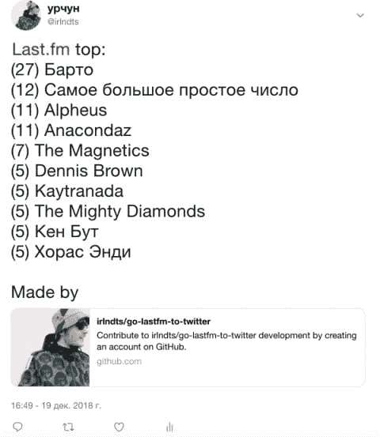

# Last.fm to Twitter 工具 on Go

> 原文：<https://dev.to/irlndts/lastfm-to-twitter-tool-on-go-2pi2>

基于 Golagn 和 Cobra CLI 的项目放在[这里](github.com/irlndts/go-lastfm-to-twitte)

[](https://res.cloudinary.com/practicaldev/image/fetch/s--K-kf74Vt--/c_limit%2Cf_auto%2Cfl_progressive%2Cq_auto%2Cw_880/http://s3-eu-central-1.amazonaws.com/irlndts.moscow/wp-content/uploads/2018/12/19171411/2018-12-19_17-13-30-e1545228962769.png)

### 安装

```
go get -u github.com/irlndts/go-lastfm-to-twitter 
```

### 跑步

```
go-lastfm-to-twitter list --user=<USERNAME> --publish=true  --lastfm-key=<KEY> --twitter-consumer=<CONSUMER> --twitter-token=<TOKEN> --twitter-secret=<SECRET> --twitter-token-secret=<TOKEN-SECRET> 
```

生成你的 lastfm 密匙[这里](https://www.last.fm/api/account/create)推特密匙正在生成[这里](https://developer.twitter.com/en/apps)

有一些可用的选项，请通过

```
go-lastfm-to-twitter list -h 
```