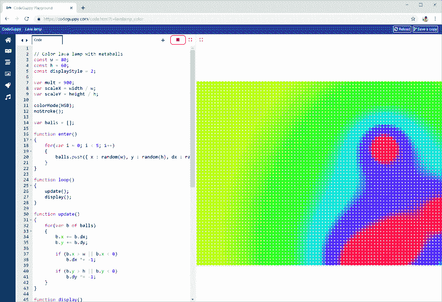

# 熔岩灯色

> 原文：<https://dev.to/codeguppy/lava-lamp-color-6l9>

# [T1】简介](#intro)

这是一个用“变形球”实现的很酷的熔岩灯模拟。这次熔岩灯是彩色的。

# 需要什么？

要运行本文中的代码，您不需要在本地计算机上安装任何东西。

只需从[codeguppy.com/code.html](https://codeguppy.com/code.html)打开在线 JavaScript playground，在集成编辑器中复制并粘贴以下代码。

准备就绪后，按“播放”按钮运行代码。

[](https://res.cloudinary.com/practicaldev/image/fetch/s--Sqig5USS--/c_limit%2Cf_auto%2Cfl_progressive%2Cq_auto%2Cw_880/https://thepracticaldev.s3.amazonaws.com/i/6gx3po207zw2vnz0wl5p.png)

# 源代码

```
// Color lava lamp with metaballs
const w = 80;
const h = 60;
const displayStyle = 2;

var mult = 900;
var scaleX = width / w;
var scaleY = height / h;

colorMode(HSB);
noStroke();

var balls = [];

function enter()
{
    for(var i = 0; i < 5; i++)
    {
        balls.push({ x : random(w), y : random(h), dx : random(1, 2), dy : random(1,2)});
    }
}

function loop()
{
    update();
    display();
}

function update()
{
    for(var b of balls)
    {
        b.x += b.dx;
        b.y += b.dy;

        if (b.x > w || b.x < 0)
            b.dx *= -1;

        if (b.y > h || b.y < 0)
            b.dy *= -1;
    }
}

function display()
{
    for(var x = 0; x < w; x++)
    {
        for(var y = 0; y < h; y++)
        {
            var sum = 0;

            for(var b of balls)
            {
                sum += 1 / dist(x, y, b.x, b.y);
            }

            var col = mult * sum;
            displayDot(x, y, col);
        }
    }
}

function displayDot(x, y, col)
{
    fill(col, 255, 255);

    switch(displayStyle)
    {
        case 0:
            rect(x, y, 1, 1);
            break;
        case 1:
            rect(x * scaleX, y * scaleY, scaleX, scaleY);
            break;
        case 2:
            ellipse(x * scaleX + scaleX / 2, y * scaleY + scaleY / 2, scaleX, scaleY);
            break;
    }
} 
```

# 反馈

如果你喜欢这篇文章，请在 Twitter 上关注 [@codeguppy](https://twitter.com/codeguppy) 和/或访问 codeguppy.com[获得更多教程和项目。](https://codeguppy.com)

另外，如果你想用详细的说明来扩展这篇文章，解释如何一步一步地构建程序，请在评论中留下反馈。