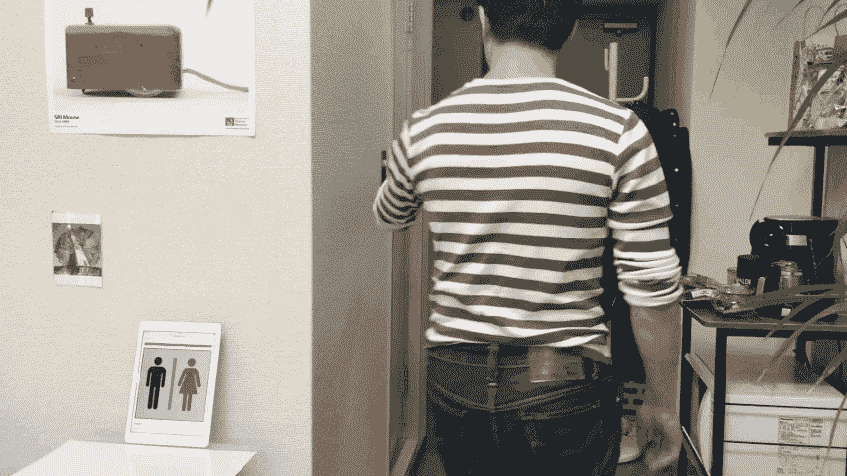
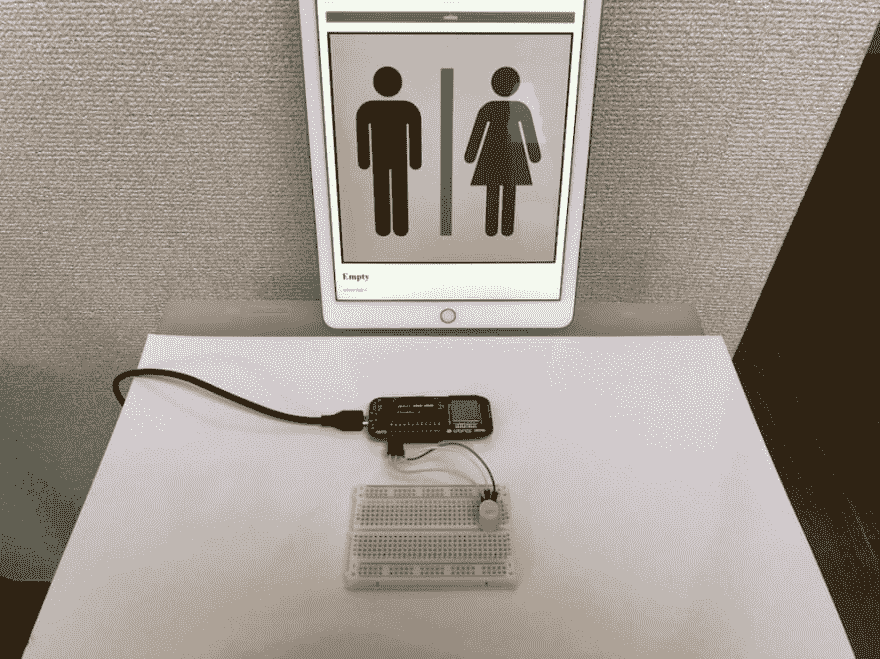
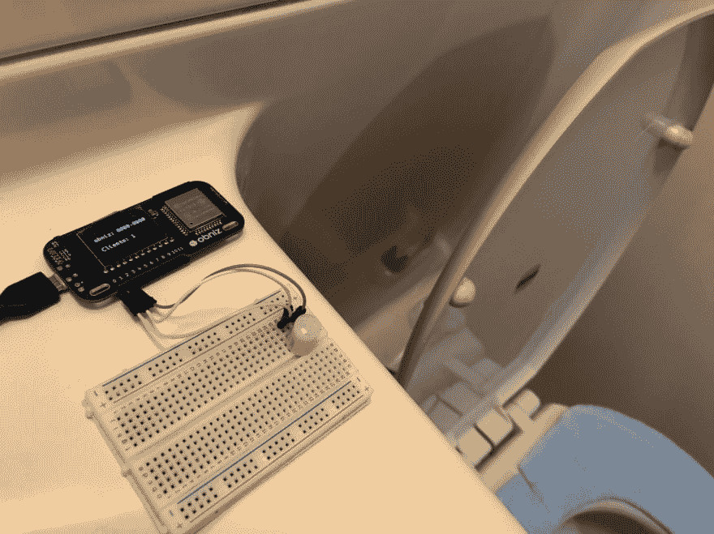

# 厕所信号

> 原文：<https://dev.to/obniz_io/lavatory-signal-123g>

## 工作原理

有时候，一个厕所是否被占用是很方便的。有一种类似 EKMC1601111 的人体探测传感器。
通过与该传感器合作，我们创建了显示厕所信号(像在飞机上一样)的 html。

## 材料

*   ob niz–1
*   ekmc 1601111–1
*   电池或 usb 适配器和电缆–1
*   第一步
*   将 EKMC1601111 连接到 obniz。

## 现在我们连起来像

io0: GND，
io1:信号，
io2: VDD

## 第二步

把这个放在马桶上。

[https://youtu.be/W78GLS1e1Rs](https://youtu.be/W78GLS1e1Rs)

## 程序

[https://obniz.io/explore/3](https://obniz.io/explore/3)