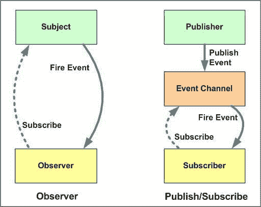

# 快速发布-订阅 python 实现:开始(I)

> 原文：<https://dev.to/mandrewcito/lazy-pub-sub-python-implementation-3fi8>

## 简要说明

首先，在开始编码之前。你必须阅读这篇文章，这是一篇很好的文章，解释了发布订阅和观察者之间的区别。如果你不想看这篇文章，我认为这张图片足够了
[](https://res.cloudinary.com/practicaldev/image/fetch/s--vZ1GvZYI--/c_limit%2Cf_auto%2Cfl_progressive%2Cq_auto%2Cw_880/https://cdn-images-1.medium.com/max/1600/1%2ANcicKEqwUaI8VEc-Ejk6Dg.jpeg)

正如我们在此图中看到的，一个订户(回调函数)将被附加到一个事件。完成此步骤后，发布者将向事件通道添加一个新事件，触发附加到该事件的所有订阅者。

### 我们班

```
class EventChannel(object):
    def __init__(self):
        self.subscribers = {}

    def unsubscribe(self, event, callback):
        if event is not None or event != ""\
                and event in self.subscribers.keys():
            self.subscribers[event] = list(
                filter(
                    lambda x: x is not callback,
                    self.subscribers[event]
                )
            )

    def subscribe(self, event, callback):
        if not callable(callback):
            raise ValueError("callback must be callable")

        if event is None or event == "":
            raise ValueError("Event cant be empty")

        if event not in self.subscribers.keys():
            self.subscribers[event] = [callback]
        else:
            self.subscribers[event].append(callback)

    def publish(self, event, args):
        if event in self.subscribers.keys():
            for callback in self.subscribers[event]:
                callback(args) 
```

Enter fullscreen mode Exit fullscreen mode

### 测试

```
event_channel = EventChannel()

callback = lambda x: print(x)

event_channel.subscribe("myevent", callback)

event_channel.publish("myevent", "Hello, world!")

# out: "Hello, world!" 
event_channel.unsubscribe("myevent", callback)

bus_instance.publish("myevent", "Hello, world!")

# No output 
```

Enter fullscreen mode Exit fullscreen mode

### 链接

*   [黑桃](https://pypi.org/project/event-channel/)
*   [Github](https://github.com/mandrewcito/event_channel)

你会在哪些方面有所改进？。感谢您的阅读，并在:D 下面写下您的任何想法