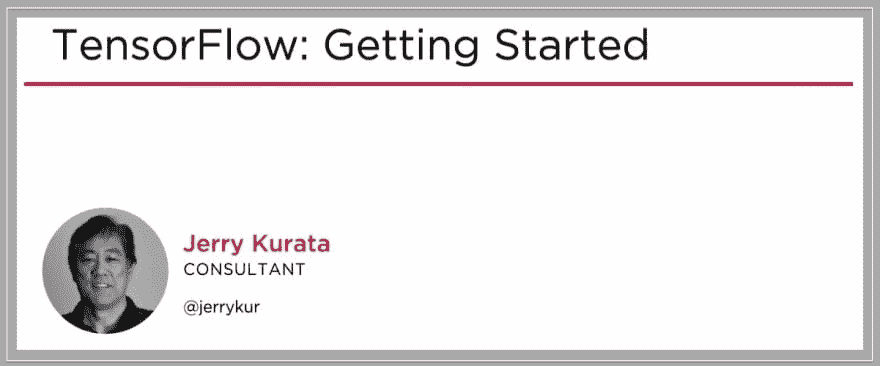
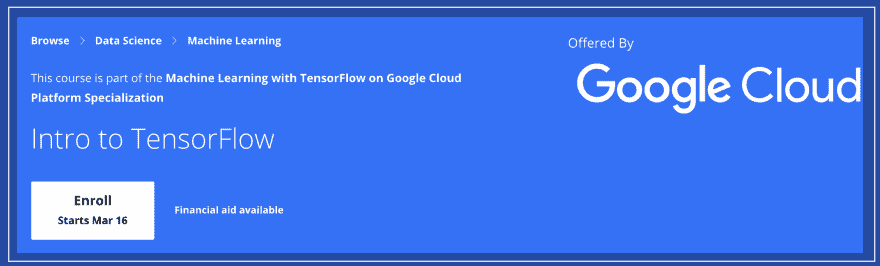

# 根据你的评论，我在网上列出了最好的 TensorFlow 课程

> 原文：<https://dev.to/sinxloud/learn-best-tensorflow-courses-tutorial-509m>

我知道有哪些选择，也知道学习者需要哪些技能。

无论您是专家还是初学者，TensorFlow 都可以轻松开发和训练 ML 模型。

作为初学者，您可能正在寻找一种方法来深入了解 TensorFlow，这种方法不仅严谨实用，而且简洁快速。所以事不宜迟，我们开始吧。

**此篇为原创，将在此更新> > [最佳张量流课程](https://sinxloud.com/best-tensorflow-courses-beginners-experts/)。**

还有，数学和算法对 TensorFlow 非常重要。因此，如果你需要复习或想学习基础知识，我会在这篇文章中为你介绍用于机器学习的数学和数据科学，以及用于数据科学和机器学习的 T2 算法。

* * *

## 5 门最佳 TensorFlow 课程和认证专业

下面，我为初学者和渴望拓展思维的专家们精选了一些最好的 TensorFlow。

* * *

### 1。[面向人工智能、机器学习和深度学习的 TensorFlow 简介](https://sinxloud.com/best-tensorflow-courses-beginners-experts/#1-introduction-to-tensorflow-for-artificial-intelligence-machine-learning-and-deep-learning)

在本课程中，您将获得关于人工智能、机器学习和深度学习的 TensforFlow 学习的广泛介绍。

#### 适合你吗？

完成本课程后，您将对神经网络的工作原理有更深入的了解，并能够构建和应用可扩展的模型来解决 TensorFlow 的实际问题。

##### [前往航线](https://sinxloud.com/fly/introduction-to-tensorflow-for-artificial-intelligence-machine-learning-and-deep-learning-coursera/)

* * *

### 2。[张量流:入门](https://sinxloud.com/best-tensorflow-courses-beginners-experts/#2-tensorflow-getting-started)

在本课程中，您将学习使用 TensorFlow 并创建一系列机器学习和深度学习模型，从简单的线性回归到复杂的深度神经网络。

#### 适合你吗？

顺利完成本课程后，您将能够采取有效的方法解决问题，并与同事交流工作成果。

##### [前往航线](https://sinxloud.com/fly/tensorflow-getting-started-jerry-kurata-pluralsight/)

* * *

### 3。[张量流简介](https://sinxloud.com/best-tensorflow-courses-beginners-experts/#3-intro-to-tensorflow)

在本课程中，您将获得一个 TensorFlow 模型来扩展该模型的训练，并学习使用云机器学习引擎提供高性能预测的关键概念。

#### 适合你吗？

完成本课程后，您将能够在 TensorFlow 中创建机器学习模型和构建神经网络。

##### [前往航线](https://sinxloud.com/fly/intro-to-tensorflow-google-cloud-tensorflow/)

* * *

### 4。【TensorFlow 深度学习的创造性应用

* * *

### 5。 [AI &深度学习用 TensorFlow](https://sinxloud.com/best-tensorflow-courses-beginners-experts/#5-ai-deep-learning-with-tensorflow)

* * *

###### 感谢坚持到最后:-)

如果你喜欢这篇文章，我为你准备了一些非常实用的读物。一个关于互联网上最好的[机器学习课程](https://sinxloud.com/best-machine-learning-python-course-beginner-learn/)和一个关于最好的[深度学习课程](https://sinxloud.com/best-ai-deep-learning-courses/)。

我还有这份[数据科学简讯](https://landing.mailerlite.com/webforms/landing/g9o7c8)，你可能会感兴趣。我每两周发一封小小的电子邮件(如果有的话),里面有一些我发现/制作的有用和酷的东西。 ***别担心，我和你一样讨厌垃圾邮件。***