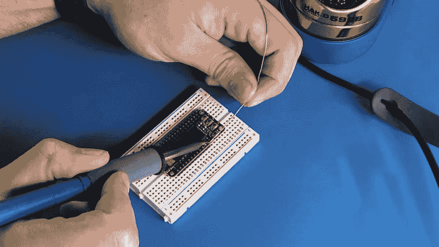
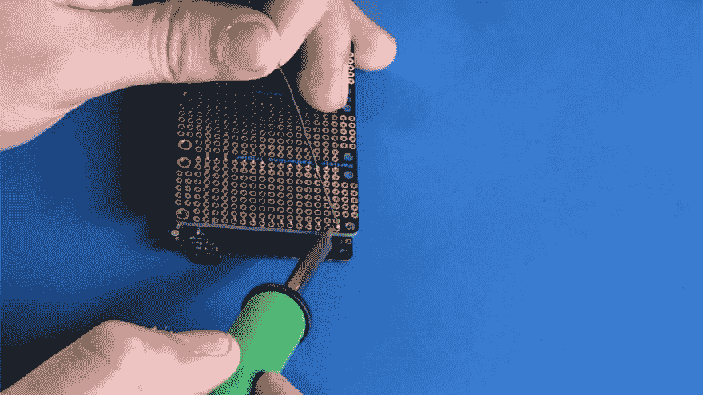
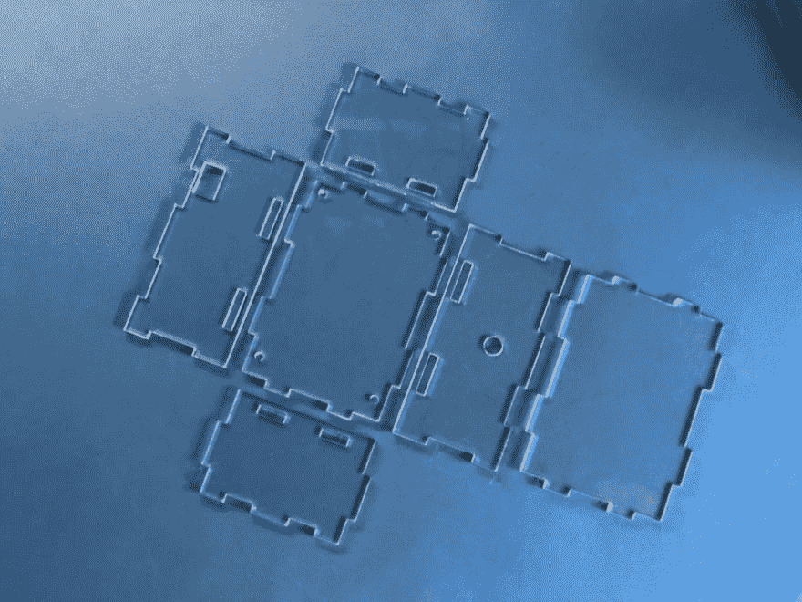
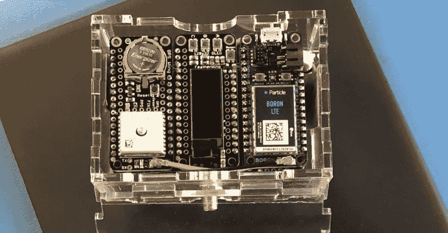
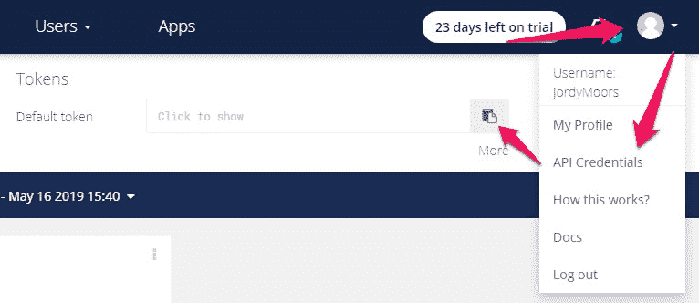
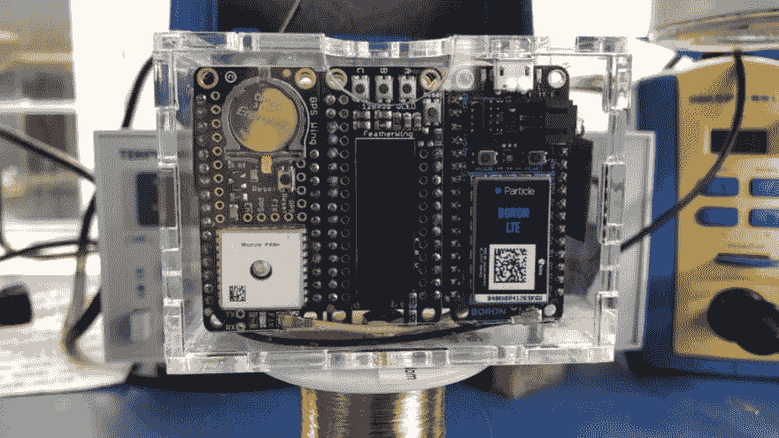

# 了解如何使用粒子硼构建这种蜂窝资产跟踪器

> 原文：<https://dev.to/particle/learn-how-to-build-this-cellular-asset-tracker-with-a-particle-boron-519h>

在生活中的某个时刻，你可能遇到过这样的情况，你希望可以使用手机资产跟踪器来帮助跟踪你的东西。你在音乐会上把车停在哪里，三周前你订购的包裹的实际位置，或者帮助你完成最后一英里工作的踏板车的位置，知道你在生活中关心的事情在哪里是有价值的事情。

虽然可能有一些通用的解决方案，但我将向您展示如何构建一个通用的蜂窝资产跟踪器，您可以快速调整其功能以满足您的特定需求。为了建造这个跟踪器，该项目使用了来自 [Adafruit 羽毛系统](https://www.adafruit.com/feather)的羽毛翼附件板，允许你通过更换不同的传感器或致动器来轻松定制该项目——不需要跳线。

这个项目将是一个相对简单的手机资产跟踪解决方案，但它是一个伟大的基础，以定制您的需求。它从一个粒子硼开始，作为建造的大脑。硼查询位置数据从一个附加的全球定位系统模块，并显示坐标在一个小有机发光二极管显示器。所有三个羽翼兼容设备使用一个羽翼三倍频器连接在一起，这意味着不需要布线。由于有数百个 FeatherWings，您可以通过更换一个翅膀并修改代码来轻松扩展功能。

**注意**:如果你不熟悉 GPS 和物联网中使用的其他地理定位技术，那么[地理定位终极指南](https://dev.to/particle/what-every-iot-engineer-needs-to-know-about-navigation-gps-dead-reckoning-cellular-wi-fi-and-ble-3k33)会有所帮助。了解每个物联网工程师需要了解的关于 GPS、推算定位、蜂窝、Wi-Fi 和 BLE 的信息。

## 项目部件&工具

[](https://res.cloudinary.com/practicaldev/image/fetch/s--C9GTirHt--/c_limit%2Cf_auto%2Cfl_progressive%2Cq_auto%2Cw_880/https://blog.particle.io/wp-content/uploads/2019/05/conclusion-169-crop-1024x576.jpg)

**所需零件:**

*   [粒子硼](https://store.particle.io/products/boron-lte-kit) —这个项目假设你已经[设置好你的硼](https://docs.particle.io/boron/)。如果你还没有这样做，在你开始这个项目之前，请按照这里的指示做。
*   [粒子羽翼三倍增器](https://store.particle.io/products/particle-featherwing-tripler)
*   阿达果羽翼有机发光二极管
*   [阿达果终极 GPS 羽翼](https://www.adafruit.com/product/3133)

**可选但强烈推荐的零件**

*   [CR1220 3V 锂纽扣电池](https://www.adafruit.com/product/380)——与 GPS 模块一起使用，以保持实时时钟(RTC)通电并允许*热启动*。
*   [SMA-to-uFL RF 适配器电缆](https://www.adafruit.com/product/851) —大多数 GPS 天线使用 SMA 连接器，但大多数电路板使用更小的 uFL 连接器。这根电缆可以让你把它们连接在一起。
*   GPS 天线——一种更大、更强的天线，可以更快、更好地定位卫星。

**工具**

*   需要焊接设备将一些接头连接到羽状翼和三层板。

**注意:**你很可能也想要某种外壳。在这个项目中，我们使用了定制的激光切割外壳，但是您可以 3D 打印一些东西，或者使用现成的解决方案。你可以[在这里](https://github.com/moors7/Boron-asset-tracker/blob/master/2dcase.svg)下载我的设计文件。

## 硬件组装

## 第一步。焊接接头

这个项目中的一些羽状翼需要你将插头焊接到电路板上。以保持头部与电路板垂直。将它们放在一个备用的试验板上，要添加管脚的板放在上面。这将有助于您获得正确的对齐，并且在零件牢固就位的情况下进行焊接会更加方便。

<figure>[](https://res.cloudinary.com/practicaldev/image/fetch/s--Cfls_GIr--/c_limit%2Cf_auto%2Cfl_progressive%2Cq_auto%2Cw_880/https://blog.particle.io/wp-content/uploads/2019/05/soldering-oled.jpg) 

<figcaption>你需要将头部焊接到阿达果有机发光二极管羽翼上。</figcaption>

</figure>

FeatherWing Tripler 使用母接头，但您可以使用与试验板类似的技巧。将母接头放在另一个羽翅上各自的引脚上，然后将它们放在顶部的三层中进行焊接。这样，所有的接头都会正确排列，焊接起来也容易多了。

注意:确保正确焊接三倍频器，否则有损坏电路板的危险。

<figure>[](https://res.cloudinary.com/practicaldev/image/fetch/s--TrBIxkIL--/c_limit%2Cf_auto%2Cfl_progressive%2Cq_auto%2Cw_880/https://blog.particle.io/wp-content/uploads/2019/05/soldering-tripler.jpg) 

<figcaption>焊接三倍增器不需要帮手，但需要一双稳定的手。</figcaption>

</figure>

## 第二步。组装你的羽翼

随着焊接的方式，你可以继续组装项目。羽翼的位置很重要。为了确保能够接触到硼上的电池端口，您必须将其放置在三倍频器的右侧。中间是有机发光二极管羽毛，GPS 机翼在左侧。

**注意:**如果您不使用这种订购方式，您将很难布线天线和电池电缆。

此时，您可以小心地将天线连接到各自的连接器上，确保使用顶部的蜂窝连接器，并将电池插入硼。

## 第三步。激光切割您的外壳或构建您自己的外壳

[](https://res.cloudinary.com/practicaldev/image/fetch/s--wkmirxrH--/c_limit%2Cf_auto%2Cfl_progressive%2Cq_auto%2Cw_880/https://blog.particle.io/wp-content/uploads/2019/05/enclosure-crop-1024x768.jpg)

如果您已经制作或购买了一个附件，现在就可以开始在里面安装项目了。

## 导航硼资产跟踪器源代码

这个项目的代码保持相对简单，因此可以很容易地进行定制，以满足您的个人需求。该代码利用 TinyGPS++库来抽象处理 GPS 数据的困难部分，并提供易于使用的函数来提取您需要的数据。这样，您就不必重新发明轮子，并经历处理原始 GPS 数据的麻烦。

[](https://res.cloudinary.com/practicaldev/image/fetch/s--RM0nKfa_--/c_limit%2Cf_auto%2Cfl_progressive%2Cq_auto%2Cw_880/https://blog.particle.io/wp-content/uploads/2019/05/Tracker-hero.jpg)

在鸟瞰图中，代码循环查看是否有可用的 GPS 数据，如果有，就把它交给 tinyGPS 库进行解析。然后，它检查输出的数据是否合理。如果不是这种情况，它会在显示器上给出一个错误输出，通知您还没有找到修复。如果数据有意义，它会以一种很好的格式打包，并在显示器上显示 GPS 坐标。这也是您可以对显示的信息进行更改的地方。

最后，代码将向云发布一条带有 GPS 信息的消息，可以在那端使用 [webhooks](https://docs.particle.io/tutorials/device-cloud/webhooks/) 或其他[集成](https://docs.particle.io/tutorials/device-cloud/console/#integrations)对其进行操作。

[点击此处，将代码加载到您的 WebIDE](https://go.particle.io/shared_apps/5cd9a8733035ef0023871896%0A) 中，无需额外输入。

如果您没有使用 Web IDE 共享链接，请确保手动包含 TinyGPS++和 oled-wing-adafruit 库。

## 代码集锦和注释

这个项目的代码都是开源的，但我想快速突出几个最重要的部分，以帮助您了解哪里可以修改以满足您的需求。请特别注意行号，因为我将在下面介绍代码片段。

下面的代码将连续循环运行，检查新的 GPS 信息是否可用。如果有新的数据，它会调用`displayInfo()`函数开始处理。

```
void loop()
{
    display.loop();
    while (Serial1.available() > 0) {
        if (gps.encode(Serial1.read())) {
            displayInfo();
        }
    }
} 
```

下面显示的代码取自`displayInfo()`函数。

获取 GPS 数据并确保其有效后，信息被打包到缓冲区并显示在有机发光二极管上。

```
display.clearDisplay();
display.setTextSize(2);
display.setTextColor(WHITE);
display.setCursor(0,0);
snprintf(buf, sizeof(buf), "%f", gps.location.lat());
display.println(buf);
snprintf(buf, sizeof(buf), "%f", gps.location.lng());
display.println(buf);
display.display(); 
```

接下来，代码将数据打包到新的缓冲区中，这样它就有了一个很好的串行输出格式。

```
snprintf(buf, sizeof(buf), "%f,%f,%f", gps.location.lat(), gps.location.lng(), gps.altitude.meters()); // Format for Serial logging 
```

最后，检查一下我们是否发布得不太频繁。如果不是这样，那么将数据发布到云中。

```
if (Particle.connected()) {
    if (millis() - lastPublish >= PUBLISH_PERIOD) {
        lastPublish = millis();
        Particle.publish("gps", pubbuf, PRIVATE);
    }
} 
```

## 使用 Ubidots 可视化您的数据

[](https://res.cloudinary.com/practicaldev/image/fetch/s---_ZBAwgO--/c_limit%2Cf_auto%2Cfl_progressive%2Cq_auto%2Cw_880/https://blog.particle.io/wp-content/uploads/2019/05/ubidots-map.jpg)

为了使该项目比在有机发光二极管上显示坐标更进一步，您可以将数据发送到在线平台以在地图上显示。有各种各样的服务可以提供这样的功能，比如[粒子谷歌地图集成](https://docs.particle.io/tutorials/integrations/google-maps/)。

对于本教程，我选择使用 [Ubidots](https://ubidots.com/) 。他们为获取数据和在地图上绘制数据提供了很好的服务。加上很容易集成。你可以通过使用控制台中的 webhook 和设备上的特定`Particle.publish()`来获取数据。

首先，在 Ubidots 上创建一个帐户。为了让 Ubidots 接受数据作为 GPS 位置，它将在接收到的数据中寻找特定的格式。它期望找到一个 JSON 对象，该对象包含一个`lat`和`lng`键，以及它们各自的值。

#### 在设备上:

为了以 Ubidots 期望的格式获取数据，您必须在代码中添加一些位。这里要看的关键行是第`71`行和第`86`行，它们为 Ubidots 创建并填充一个缓冲区。

```
char pubbuf[120];
if (gps.location.isValid() && gps.location.age() < MAX_GPS_AGE_MS) {
    display.clearDisplay();
    display.setTextSize(2);
    display.setTextColor(WHITE);
    display.setCursor(0,0);
    snprintf(buf, sizeof(buf), "%f", gps.location.lat());
    display.println(buf);
    snprintf(buf, sizeof(buf), "%f", gps.location.lng());
    display.println(buf);
    display.display();
    snprintf(buf, sizeof(buf), "%f,%f,%f", gps.location.lat(), gps.location.lng(), gps.altitude.meters());
    snprintf(pubbuf, sizeof(pubbuf), "{\"position\": {\"value\":1, \"context\":{\"lat\": \"%f\", \"lng\": \"%f\"}}}", gps.location.lat(), gps.location.lng()); 
```

创建一个新的缓冲区来存储 Ubidots 格式的数据。然后，用 JSON 内容和 GPS 数据填充缓冲区。最后，将缓冲区发布为一个`Particle.publish()`。

#### 控制台中的  :

要将发布的数据发送到 Ubidots，您可以使用他们的 API。为此，您必须创建一个 [webhook](https://docs.particle.io/tutorials/device-cloud/webhooks/) 。进入[控制台](https://console.particle.io/integrations)，在左侧找到集成选项卡。创建一个新的集成并选择一个 webhook。在左上角，找到并选择自定义模板选项。复制并粘贴以下代码片段。

```
{
    "event": "gps",
    "url": "https://industrial.api.ubidots.com/api/v1.6/devices/{{{PARTICLE_DEVICE_ID}}}",
    "requestType": "POST",
    "noDefaults": false,
    "rejectUnauthorized": true,
    "headers": {
        "X-Auth-Token": "replace-this-with-your-token",
        "Content-Type": "application/json"
    },
    "body": "{{{PARTICLE_EVENT_VALUE}}}"
} 
```

确保用您自己的替换高亮显示的`X-Auth-Token`。你可以通过进入你的 Ubidots 账户，点击你的个人资料图标并选择 API 证书来找到这个令牌。

[](https://res.cloudinary.com/practicaldev/image/fetch/s--XoMgoYTS--/c_limit%2Cf_auto%2Cfl_progressive%2Cq_auto%2Cw_880/https://blog.particle.io/wp-content/uploads/2019/05/ubidots-config-crop.jpg)

在您成功完成每个步骤后，您现在应该有一个正常工作的蜂窝资产追踪器，它将在屏幕上显示其 GPS 坐标，并将其发布到云，您可以通过不同的方式使用它们来达到您的目的。

## 你会带着你的资产追踪器去哪里？

从这个项目开始，你可以用它作为汽车跟踪系统的基础，为你的宠物或孩子设置地理围栏，跟踪集装箱或做一些普通的事情，如制作互联网连接的踏板车。可能性当然是存在的，基础也是如此。

[](https://res.cloudinary.com/practicaldev/image/fetch/s--GWgNhD9e--/c_limit%2Cf_auto%2Cfl_progressive%2Cq_auto%2Cw_880/https://blog.particle.io/wp-content/uploads/2019/05/tracker-front-on-169-crop-1024x576.jpg)

查看一下 [Hackster](https://www.hackster.io/particle) 网站，为你下一步的项目寻找灵感。此外，在我们的[粒子论坛](https://community.particle.io/)上分享你的想法和观点，在这里你可以集思广益，获得项目建议。这也是一个提问的好地方，我们的许多会员都很乐意帮忙。

现在往前走，追踪对你来说重要的事情。

帖子[学习如何用粒子硼](https://blog.particle.io/2019/05/17/learn-how-to-build-this-cellular-asset-tracker-with-a-particle-boron/)建造这个细胞资产追踪器首先出现在[粒子博客](https://blog.particle.io)上。