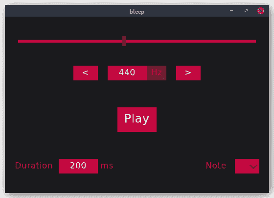
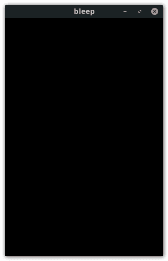

# 通过示例学习 LambdaNative:桌面 GUI

> 原文：<https://dev.to/goober99/learn-lambdanative-by-example-desktop-gui-277l>

本教程于 2021 年 1 月 10 日更新，使用 LambdaNative 生成音调，而不仅仅是包装一个控制 PC 扬声器的 Linux 专用命令行程序 beep。现在应该可以在 LambdaNative 支持的任何操作系统上遵循本教程了。本教程也可以在 [GitHub repo](https://github.com/goober99/lisp-gui-examples/blob/master/examples/lambdanative/tutorial.md) 中找到，并附有示例代码。欢迎提出改进示例和教程的请求。

LambdaNative 是一个使用 Scheme 开发桌面和移动应用的跨平台框架(构建在 Gambit 之上)。LambdaNative 上的资源似乎极其匮乏。我找不到一个使用 LambdaNative 的一步一步的教程，所以希望我的小小贡献将有利于其他试图开始使用 LambdaNative 的人。

LambdaNative 已经包含了一个计算器演示程序，坦率地说，我觉得制作第一百万个计算器示例有点乏味。相反，我将建立一个 GUI 来生成音调。我们只打算构建一个桌面 GUI，所以我们不会挖掘 LambdaNative 的全部功能。LambdaNative 真正有用的地方是让你能够用 Scheme 编写跨平台的移动应用程序！不幸的是，这超出了本教程的范围。也许将来我会重新访问 LambdaNative，并用它来创建一个移动应用程序。

[](https://res.cloudinary.com/practicaldev/image/fetch/s--z6TxUug---/c_limit%2Cf_auto%2Cfl_progressive%2Cq_auto%2Cw_880/https://github.com/goober99/lisp-gui-examples/blob/master/screenshots/lambdanative.png%3Fraw%3Dtrue)

## 安装 LambdaNative

LambdaNative wiki 给出了在安装 LambdaNative 之前需要用发行版的软件包管理器安装的依赖项的列表。他们给出一个`apt`命令，你可以复制并粘贴到你的终端上，在 Ubuntu 上安装所有需要的依赖项。

*   下载最新的[版本](https://github.com/part-cw/lambdanative/releases)。

*   将版本解压缩到系统范围的位置，如`/opt`或`/usr/local`。

```
sudo unzip lambdanative-*.zip -d /opt 
```

Enter fullscreen mode Exit fullscreen mode

*   重命名解压缩的目录。

```
cd /opt
sudo mv lambdanative* lambdanative 
```

Enter fullscreen mode Exit fullscreen mode

*   创建文件`SETUP`和`PROFILE`。如果您正在开发一个移动应用程序，您将需要为各自的 SDK 配置这些文件。因为这超出了本教程的范围，所以留给读者作为练习。

```
cd lambdanative
sudo cp SETUP.template SETUP
sudo cp PROFILE.template PROFILE 
```

Enter fullscreen mode Exit fullscreen mode

*   编辑`scripts/lambdanative`并用`/opt/lambdanative`填充`LAMBDANATIVE`变量。

```
LAMBDANATIVE=/opt/lambdanative 
```

Enter fullscreen mode Exit fullscreen mode

*   将 LambdaNative 初始化脚本放在系统路径中。

```
sudo ln -s /opt/lambdanative/scripts/lambdanative /usr/bin/lambdanative 
```

Enter fullscreen mode Exit fullscreen mode

*   创建并初始化本地构建目录。

```
mkdir ~/lambdanative
cd ~/lambdanative
lambdanative init 
```

Enter fullscreen mode Exit fullscreen mode

## 创建新的 GUI 应用程序

您新启动的构建目录将如下所示:

```
apps/
modules/
configure
Makefile 
```

Enter fullscreen mode Exit fullscreen mode

您的应用程序将进入`apps`中自己的子目录。创建新应用:

```
lambdanative create <appname> <apptype> 
```

Enter fullscreen mode Exit fullscreen mode

`<apptype>`的选项有`console`、`gui`和`eventloop`。我创建了一个新的 GUI 应用程序，名为哔哔声:

```
lambdanative create bleep gui 
```

Enter fullscreen mode Exit fullscreen mode

这将在`apps`中创建一个名为`bleep`的目录，其中包含几个文件。

## 编译 App

LambdaNative 利用了 GNU 构建系统。

```
./configure bleep
make
make install 
```

Enter fullscreen mode Exit fullscreen mode

默认情况下，构建将针对本地主机。第一次这样做需要一段时间，因为这是下载和编译先决条件。这些先决条件被缓存起来，以加速后续的编译。如果在初始构建期间出现任何错误，您可能错过了安装一个依赖项。用发行版的软件包管理器安装它，然后再次尝试编译。

您也可以在调试模式下配置。你会想用`make scrub`清理缓存，这样一切都重建了。这将需要一段时间，因为一切都在重建。

```
./configure bleep debug
make scrub
make
make install 
```

Enter fullscreen mode Exit fullscreen mode

以我的经验，调试模式帮助不大。运行时错误被记录到`~/Desktop/log/*.txt`。

```
[SYSTEM] 2019-03-16 00:59:21: Application bleep built 2019-03-16 00:59:14
[SYSTEM] 2019-03-16 00:59:21: Git hash
[ERROR] 2019-03-16 00:59:22: primordial: (assoc 49 #f): (Argument 2) LIST expected
[ERROR] 2019-03-16 00:59:22: HALT 
```

Enter fullscreen mode Exit fullscreen mode

不是很有帮助，是吗？所以我启用了调试模式。

```
[SYSTEM] 2019-03-16 01:16:44: Application bleep built 2019-03-16 01:16:34
[SYSTEM] 2019-03-16 01:16:44: Git hash
[ERROR] 2019-03-16 01:16:44: primordial: (assoc 49 #f): (Argument 2) LIST expected
[ERROR] 2019-03-16 01:16:44: trace: /opt/lambdanative/modules/ln_glgui/primitives.scm line=230 col=21
[ERROR] 2019-03-16 01:16:44: trace: /opt/lambdanative/modules/ln_glgui/primitives.scm line=273 col=21
[ERROR] 2019-03-16 01:16:44: trace: /opt/lambdanative/modules/ln_glgui/slider.scm line=80 col=8
[ERROR] 2019-03-16 01:16:44: trace: /opt/lambdanative/modules/ln_glgui/glgui.scm line=151 col=36
[ERROR] 2019-03-16 01:16:44: trace: /opt/lambdanative/modules/ln_glgui/glgui.scm line=145 col=11
[ERROR] 2019-03-16 01:16:44: trace: /opt/lambdanative/modules/ln_glgui/glgui.scm line=183 col=3
[ERROR] 2019-03-16 01:16:44: trace: /opt/lambdanative/modules/eventloop/eventloop.scm line=151 col=9
[ERROR] 2019-03-16 01:16:44: HALT 
```

Enter fullscreen mode Exit fullscreen mode

肯定是长了但还是没多大帮助。它实际上包括行号，这看起来很有希望，但它们都是 LambdaNative 模块中的行号。它实际上并不一直跟踪错误到我的应用程序中导致错误的那一行。我花了很多时间阅读 LambdaNative 模块的源代码，这超出了我的预期。

这时日志文件甚至包含一个错误。有时应用程序因分段错误而失败，日志中根本没有错误。我经常用日志文件中的`(log-status "reached here")`和`tail -f`来调试和隔离错误。

另一方面，编译时捕获的错误要好得多。如果编译时出现错误，错误消息会包含我的应用程序中的行号。

开发工作流更类似于传统的编译语言，如 c。我怀念在 REPL 上开发 Scheme 时习惯的快速反馈。在初次编译之后，后续的编译要快得多。

```
$ time make

real  0m3.877s
user  0m2.652s
sys   0m0.605s 
```

Enter fullscreen mode Exit fullscreen mode

当你做一系列小的改变或者追踪一个 bug 的时候，四秒钟似乎是很长的时间。有一个[模块](https://github.com/part-cw/lambdanative/wiki/Using-Emacs)用于 Emacs 的 REPL 编辑。因为我不使用 Emacs，所以我没有尝试过，但是如果我正在开发一个更大的应用程序，我可能会尝试一下。

`install`步骤会将可执行文件移动到`~/Desktop/bleep/bleep`并启动它。这将启动一个矩形窗口。

[](https://res.cloudinary.com/practicaldev/image/fetch/s--U2ECGKBl--/c_limit%2Cf_auto%2Cfl_progressive%2Cq_auto%2Cw_880/https://github.com/goober99/lisp-gui-examples/blob/master/screenshots/lambdanative-rectangle.png%3Fraw%3Dtrue%2522Rectangular%2520window%2522)

这扇窗户看起来非常孤独。让我们添加一些小部件！

## 编码 App

如果您的界面将使用文本(如按钮上的标签)，您必须在您的应用程序子目录中包含一个`FONTS`文件。我只是从 LambdaNative 附带的一个演示中复制了`FONTS`文件。

```
cd apps/bleep
cp /opt/lambdanative/apps/LineDrop/FONTS . 
```

Enter fullscreen mode Exit fullscreen mode

文件看起来是这样的:

```
DejaVuSans.ttf 8 18,25 ascii 
```

Enter fullscreen mode Exit fullscreen mode

有关文件格式的描述，请参见[本地维基](https://github.com/part-cw/lambdanative/wiki/FONTS)上的文件文档。

您的应用程序子目录将已经包含一个`main.scm`。这个文件包含了一个 GUI 应用程序的基本框架(上面的黑色矩形):

```
;; LambdaNative gui template

(define gui #f)

(main
;; initialization
  (lambda (w h)
    (make-window 320 480)
    (glgui-orientation-set! GUI_PORTRAIT)
    (set! gui (make-glgui))

    ;; initialize gui here

  )
;; events
  (lambda (t x y)
    (if (= t EVENT_KEYPRESS) (begin
      (if (= x EVENT_KEYESCAPE) (terminate))))
    (glgui-event gui t x y))
;; termination
  (lambda () #t)
;; suspend
  (lambda () (glgui-suspend) (terminate))
;; resume
  (lambda () (glgui-resume))
)

;; eof 
```

Enter fullscreen mode Exit fullscreen mode

我首先将顶部的注释改为

```
;; bleep - GUI for generating a tone made with LambdaNative 
```

Enter fullscreen mode Exit fullscreen mode

骨架的大部分由[事件循环](https://github.com/part-cw/lambdanative/wiki/Index-of-Module-eventloop)组成。`(main p1 p2 p3 p4 p5)`循环将五个函数作为参数:

| 参数 | 描述 |
| --- | --- |
| 第一亲代 | 主循环初始化前要运行的函数。这是您设置 GUI 的地方。 |
| p2 | 主循环函数，在应用程序的整个生命周期中不断被调用。这是您监听按键等事件的地方。由于大多数小部件都接受回调，所以您不需要在这方面做太多工作。 |
| p3 | 终止应用程序时要运行的函数。 |
| p4 | 函数，该函数在应用程序挂起时被调用。 |
| 孕烯醇酮 | 函数，该函数在应用程序恢复时被调用。 |

框架中为 p3、p4 和 p5 提供的功能对于大多数应用程序来说应该足够了。我们不需要碰它们。

```
(make-window 540 360)
(glgui-orientation-set! GUI_LANDSCAPE) 
```

Enter fullscreen mode Exit fullscreen mode

我从改变窗户的尺寸和方向开始。现在让我们给初始化`lambda`添加一些小部件。我从[滑块文档页面](https://github.com/part-cw/lambdanative/wiki/glgui-slider)的底部复制并粘贴了这个例子。

```
(set! sl (glgui-slider gui 20 20 280 60 1 5 #f White White Orange Black num_25.fnt num_20.fnt #f White))
(glgui-widget-set! gui sl 'showvalue #t) 
```

Enter fullscreen mode Exit fullscreen mode

如果你熟悉这个方案，那`set!`可能会让你踌躇不前。我的 Scheme 代码中感叹号太多总是让我紧张。我立即开始思考是否有更好的方式来编写代码。理应如此。应尽可能避免副作用。我尝试将`set!`改为`define`，并在重新编译时得到以下错误:

```
*** ERROR IN "/home/matthew/lambdanative/apps/bleep/main.scm"@97.5 -- Ill-placed 'define' 
```

Enter fullscreen mode Exit fullscreen mode

gambit(lambda native 使用的底层方案实现)只允许在一个`lambda`体的开头有`define` s。这实际上符合 R[5-7]RS 规范，但是我习惯于允许`define`在`lambda`主体的任何地方的方案实现(比如球拍、小鸡和 MIT/GNU 方案)。所有生动的例子和演示都使用`set!`，所以我也用了它。

我们必须为滑块的几个元素指定颜色。LambdaNative 不使用原生小部件，而是用 OpenGL 绘制自己的小部件。我在谷歌上搜索“配色方案”来寻找灵感，并在脚本顶部的`(main)`循环上方指定了一些颜色，我可以在整个程序中引用它们。

```
;; UI color palette
(define *background-color* (color-rgb 26 26 29))
(define *foreground-color* (color-rgb 195 7 63))
(define *accent-color* (color-rgb 111 34 50))
(define *text-color* (color-rgb 255 255 255))
;; Scale used by slider
(define *min-position* 0)
(define *max-position* 2000)
;; Range of frequencies
(define *min-frequency* 20)
(define *max-frequency* 20000) 
```

Enter fullscreen mode Exit fullscreen mode

变量名`*background-color*`只是全局参数的 Lisp 命名约定。LambdaNative 提供了用于创建颜色的`(color-rgb r g b)`。我还为滑块使用的标度和 beep 接受的频率范围定义了变量。

我们还需要指定滑块的位置和大小。两者都以像素为单位。CSS 中没有您可能熟悉的百分比或其他可伸缩单位。有一些函数可以获得窗口的宽度和高度，所以你可以编写一个数学代码，让一个小部件的宽度为窗口的 80%。因为我们正在处理一个简单的硬编码窗口尺寸的例子，所以我也硬编码了位置和大小。请注意，您将 y 轴上的位置指定为距离窗口底部的像素。这似乎违背了我的直觉，我不断地发现自己试图从窗口顶部指定像素。

```
;; Background color
(let ((w (glgui-width-get))
      (h (glgui-height-get)))
(glgui-box gui 0 0 w h *background-color*))

;; Frequency slider
(set! slider (glgui-slider gui 20 280 500 60 *min-position* *max-position* #f White *foreground-color* *accent-color* #f ascii_18.fnt ascii_18.fnt #f White))
(glgui-widget-set! gui slider 'showlabels #f) 
```

Enter fullscreen mode Exit fullscreen mode

我为整个窗口设置了背景色。我能找到的唯一方法是创建一个整个窗口大小的`glgui-box`并设置盒子的颜色。我还将变量从`sl`重命名为`slider`。LambdaNative 倾向于在其示例和文档中使用简短的、非描述性的变量名。我更喜欢使用更具描述性的变量名。用我们在`FONTS`文件中指定的字体替换示例滑块代码中的字体。我还禁用了滑块标签。

人类可听到的频率范围通常在 20 赫兹到 20 千赫兹之间(随着年龄的增长，我们失去了听到一些更高频率的能力)。中 C 上方的[音符 A](https://en.wikipedia.org/wiki/A440_(pitch_standard))为 440 Hz。因为 A4 是一个通用的调优标准，所以它似乎是一个合理的缺省值。

20 到 20，000 的比例很大，440 看起来根本不会移动滑块。理想情况下，440 将落在滑块的中间。为了做到这一点，让我们使用对数标度。

我找到了一个关于如何将滑块映射到对数刻度的[堆栈溢出答案](https://stackoverflow.com/questions/846221/logarithmic-slider/846249#846249)。答案中给出的代码是 JavaScript，但是很容易移植到 Scheme。

```
;; Logarithmic scale for frequency (so middle A [440] falls about in the middle)
;; Adapted from https://stackoverflow.com/questions/846221/logarithmic-slider

(define min-freq (log *min-frequency*))
(define max-freq (log *max-frequency*))
(define frequency-scale (/ (- max-freq min-freq) (- *max-position* *min-position*)))
;; Convert slider position to frequency
(define (position->frequency position)
  (inexact->exact (round (exp (+ min-freq (* frequency-scale (- position *min-position*)))))))
;; Convert frequency to slider position
(define (frequency->position freq) (/ (- (log freq) min-freq) (+ frequency-scale *min-position*))) 
```

Enter fullscreen mode Exit fullscreen mode

我创建了两个函数:一个获取滑块上的位置并返回频率(`position->frequency`)，另一个获取频率并返回滑块上的位置(`frequency-position`)。现在让我们用`frequency->position`函数设置滑块的初始位置。

```
(glgui-widget-set! gui slider 'value (frequency->position 440)) 
```

Enter fullscreen mode Exit fullscreen mode

滑块下方是显示当前频率的文本栏、将频率增加/降低一个八度的按钮以及播放按钮。

```
;; Frequency display
(set! frequency-field (glgui-inputlabel gui 210 230 80 30 "440" ascii_18.fnt *text-color* *foreground-color*))
(glgui-widget-set! gui frequency-field 'align GUI_ALIGNCENTER)
(set! frequency-label (glgui-label gui 290 230 40 30 "Hz" ascii_18.fnt *foreground-color* *accent-color*))
(glgui-widget-set! gui frequency-label 'align GUI_ALIGNCENTER)

;; Octave buttons
(set! lower-button (glgui-button-string gui 140 230 50 30 "<" ascii_18.fnt (lambda (g w t x y) #t)))
(set! higher-button (glgui-button-string gui 350 230 50 30 ">" ascii_18.fnt (lambda (g w t x y) #t)))

;; Play button
(set! play-button (glgui-button-string gui 230 125 80 50 "Play" ascii_25.fnt (lambda (g w t x y) #t))) 
```

Enter fullscreen mode Exit fullscreen mode

`glgui-button-string`的最后一个参数是回调函数。这是一个按下按钮时调用的函数。我现在只是想把这些小部件展示出来。我还不关心按钮的功能，所以我使用了匿名函数(lambdas ),它现在不做任何事情。

按钮确实有一些默认的样式，但是您可能想要调整外观以适合您的配色方案和 UI 设计。我们可以使用`glgui-widget-set!`来设置一个小部件的参数。按钮有各种可以设置的参数，如`'button-normal-color`和`'button-selected-color`。

```
(glgui-widget-set! gui play-button 'button-normal-color *foreground-color*)
(glgui-widget-set! gui play-button 'button-selected-color *accent-color*)
(glgui-widget-set! gui play-button 'solid-color #t)
(glgui-widget-set! gui play-button 'rounded #f) 
```

Enter fullscreen mode Exit fullscreen mode

对于每个按钮来说，似乎需要键入(或复制粘贴)很多内容。使用 CSS，我可以为所有的按钮定义一个样式，或者为按钮应用一个类。我使用了一个`for-each`循环来遍历所有的按钮，并应用上面的样式:

```
;; Style buttons
(for-each (lambda (button)
            (glgui-widget-set! gui button 'button-normal-color *foreground-color*)
            (glgui-widget-set! gui button 'button-selected-color *accent-color*)
            (glgui-widget-set! gui button 'solid-color #t)
            (glgui-widget-set! gui button 'rounded #f))
          (list lower-button higher-button play-button)) 
```

Enter fullscreen mode Exit fullscreen mode

在这一点上，我们开始有一个好看的界面，但它没有做任何事情。如果您点按按钮或滑动滑块，什么都不会发生。虽然按钮接受回调函数参数，但我找不到将滑块连接到函数的方法。我把 [`glgui-slider`文档页](https://github.com/part-cw/lambdanative/wiki/glgui-slider)看了好几遍，寻找线索。

最后，我求助于查看`glgui-slider`的源代码。每个小部件文档页面都直接链接到它们在 LambdaNative GitHub repo 中的实现。我已经提到过，我最终阅读 LambdaNative 源代码的次数超过了调试所需的次数。文档是 LambdaNative 确实可以改进的一个领域。我扫描了`slider.scm`，发现它有一个`'callback`参数。我创建了一个函数，将`glgui-inputlabel`中显示的频率设置为与`glgui-slider`的位置相对应的频率。

```
;; Link slider to text field display of frequency
(define (adjust-frequency)
  (glgui-widget-set! gui frequency-field 'label (number->string
    (position->frequency (glgui-widget-get gui slider 'value))))) 
```

Enter fullscreen mode Exit fullscreen mode

并将其连接到滑块:

```
(glgui-widget-set! gui slider 'callback (lambda (parent widget event x y) (adjust-frequency))) 
```

Enter fullscreen mode Exit fullscreen mode

回调函数有五个参数。在 LambdaNative 文档中的代码示例中，这些总是显示为`(lambda (g w t x y))`。这些一个字母的变量不太具有描述性，回调函数的参数似乎也没有记录。通过实验和阅读源代码和示例，我得出了以下结论:

| 参数 | 描述 |
| --- | --- |
| g | 小部件所属的[G]UI。我在回调函数中使用了这个变量的名字`parent`。 |
| w | 触发回调函数的 idget。我在回调函数中使用了这个变量的名字`widget`。 |
| t | 事件的类型。我在回调函数中使用了这个变量的名字`event`。 |
| x | 事件的第一个参数(x 坐标，以像素为单位，键盘字符等。) |
| y | 事件的第二个参数(以像素为单位的 y 坐标、修改器标志等。) |

回调函数只有在用户释放滑块句柄时才会被调用。我希望用户在拖动滑块时得到反馈。您可以在构成`(main)`的第二个参数的`lambda`中编写自己的事件处理代码。生成的框架已经包含了当按下`Esc`键时终止应用程序的代码。我添加了一些代码来调用滑动手柄被拖动时的`adjust-frequency`:

```
;; events
  (lambda (t x y)
    (if (= t EVENT_KEYPRESS) (begin
      (if (= x EVENT_KEYESCAPE) (terminate))))
    ;; Also update frequency when dragging slider (callback is only on release)
    (if (and (glgui-widget-get gui slider 'downval) (= t EVENT_MOTION)) (adjust-frequency))
    (glgui-event gui t x y)) 
```

Enter fullscreen mode Exit fullscreen mode

通过查看`slider.scm`中`glgui-slider`的实现，我注意到每当用户在滑动手柄上按住鼠标按钮时，LambdaNative 就会设置一个`'downval`参数。每当这个参数为真时，我就监听一个调用`adjust-frequency`的`EVENT_MOTION`事件。

我用名为`decrease-octave`和`increase-octave`的回调函数替换了 octave 按钮声明中的匿名 lambdas。一个[八度音程](https://en.wikipedia.org/wiki/Octave)是“一个音高和另一个两倍频率的音高之间的间隔”

```
;; Set frequency slider and display
(define (set-frequency freq)
  (glgui-widget-set! gui slider 'value (frequency->position freq))
  (glgui-widget-set! gui frequency-field 'label (number->string freq)))
;; Buttons increase and decrease frequency by one octave
(define (adjust-octave modifier)
  (let ((new-freq (* (string->number (glgui-widget-get gui frequency-field 'label)) modifier)))
    (if (and (>= new-freq *min-frequency*) (<= new-freq *max-frequency*)) (set-frequency new-freq))))
(define (decrease-octave parent widget event x y) (adjust-octave 0.5))
(define (increase-octave parent widget event x y) (adjust-octave 2)) 
```

Enter fullscreen mode Exit fullscreen mode

`glgui-inputlabel`的`'aftercharcb`回调在每个字符被键入或删除后被调用。当用户输入频率时，我们可以用它来更新滑块。如果用户(你知道他们会)输入一个高于 20，000 的数字或一个字母会怎么样？我们需要一个只允许给定范围内的数字的函数。

```
;; Only allow numbers within range of min-value and max-value
(define (num-only min-value max-value old-value)
  (lambda (parent widget)
    (let* ((current-value (glgui-widget-get parent widget 'label))
           (current-numified (string->number current-value)))
      (if (or (= (string-length current-value) 0) ; Allow field to be empty
              (and current-numified (>= current-numified min-value) (<= current-numified max-value)))
          (set! old-value current-value)
          (glgui-widget-set! parent widget 'label old-value))))) 
```

Enter fullscreen mode Exit fullscreen mode

如果用户键入一个使值无效的字符，我们希望恢复到最后一个已知的正确值。为此，我使用了一个闭包来记住最后一个已知的值。今天许多编程语言都有闭包，但是 Scheme 实际上发明了它们。闭包使变量能够与函数相关联，并在函数的所有调用中保持不变。

现在我们可以将`glgui-inputlabel`回调连接到这些函数。

```
(set! frequency-range (num-only *min-frequency* *max-frequency* (glgui-widget-get gui frequency-field 'label)))
(glgui-widget-set! gui frequency-field 'aftercharcb (lambda (parent widget event x y)
  (frequency-range parent widget)
  (let ((freq (string->number (glgui-widget-get parent widget 'label))))
    (if freq (glgui-widget-set! parent slider 'value (frequency->position freq)))))) 
```

Enter fullscreen mode Exit fullscreen mode

我们调用`num-only`闭包，指定允许的范围和初始值，返回一个可以在回调中使用的新函数。在我们使用闭包(`frequency-range`)创建的函数确保该值不存在过高的值之后，我们使用文本字段的当前值来更新滑块的位置。

我们可以再次使用`num-only`闭包来创建一个字段，以毫秒为单位指定哔哔声的持续时间:

```
;; General Controls
(glgui-label gui 20 40 80 30 "Duration" ascii_18.fnt *foreground-color*)
(set! duration-field (glgui-inputlabel gui 110 40 80 30 "200" ascii_18.fnt *text-color* *foreground-color*))
(glgui-widget-set! gui duration-field 'align GUI_ALIGNCENTER)
(set! duration-range (num-only 1 600000 (glgui-widget-get gui duration-field 'label)))
(glgui-widget-set! gui duration-field 'aftercharcb (lambda (parent widget event x y) (duration-range parent widget)))
(glgui-label gui 195 40 40 30 "ms" ascii_18.fnt *foreground-color*) 
```

Enter fullscreen mode Exit fullscreen mode

频率比较抽象。让我们也给用户选择音符的能力。我们可以在表格中存储 A4-G4 的相应频率。

```
;; Notes -> frequency (middle A-G [A4-G4])
;; http://pages.mtu.edu/~suits/notefreqs.html
(define notes (list->table '((0 . 440.00)    ; A
                             (1 . 493.88)    ; B
                             (2 . 261.63)    ; C
                             (3 . 293.66)    ; D
                             (4 . 329.63)    ; E
                             (5 . 349.23)    ; F
                             (6 . 292.00)))) ; G 
```

Enter fullscreen mode Exit fullscreen mode

我们将给用户一个下拉菜单。每当从下拉菜单中选择一个音符时，我们将在表格中查找频率，并使用我们为八度音阶按钮创建的`set-frequency`辅助函数来设置它。

```
(glgui-label gui 410 40 60 30 "Note" ascii_18.fnt *foreground-color*)
(set! note (glgui-dropdownbox gui 470 40 50 30
  (map (lambda (str)
    (lambda (lg lw x y w h s) (if s (glgui:draw-box x y w h *foreground-color*))
      (glgui:draw-text-left (+ x 5) y (- w 10) h str ascii_18.fnt *text-color*)))
    (list "A" "B" "C" "D" "E" "F" "G"))
  *accent-color* *foreground-color* *accent-color*))
(glgui-widget-set! gui note 'scrollcolor *accent-color*)
(glgui-widget-set! gui note 'callback (lambda (parent widget event x y)
  (set-frequency (table-ref notes (glgui-widget-get parent widget 'current))))) 
```

Enter fullscreen mode Exit fullscreen mode

现在，让我们制造一些噪音。LambdaNative 有一个 rtaudio 模块。我们将用它来产生一个正弦波音调。编辑应用程序子目录中的`MODULES`文件，并将 rtaudio 添加到列表中。rtaudio 模块的 Scheme API 基本上只包含两个函数:`rtaudio-start`和`rtaudio-stop`。您必须首先在 Scheme 代码中嵌入的一块 C 代码中注册四个实时钩子(初始化钩子、输入钩子、输出钩子和关闭钩子)。我希望 rtaudio 模块有一个 API，允许在 pure Scheme 中实现这些钩子。幸运的是，LambdaNative 附带的 [DemoRTAudio](https://github.com/part-cw/lambdanative/tree/master/apps/DemoRTAudio) 应用程序实现了一个正弦波，我可以从那里复制并粘贴我需要的大部分内容，而不用花很多时间尝试用 C 语言编写一个正弦波。

```
;; Register C-side real-time audio hooks
(c-declare  #<<end-of-c-declare

#include <math.h>

void rtaudio_register(void (*)(int), void (*)(float), void (*)(float*,float*), void (*)(void));

double f;
double srate=0;
float buffer;

void my_realtime_init(int samplerate) { srate=(double)samplerate; buffer=0; }
void my_realtime_input(float v) { }
void my_realtime_output(float *v1,float *v2) {
  static double t=0;
  buffer = 0.95*sin(2*M_PI*f*t);
  *v1=*v2=(float)buffer;
  t+=1/srate;
}
void my_realtime_close() { buffer=0; }

end-of-c-declare
)
(c-initialize "rtaudio_register(my_realtime_init,my_realtime_input,my_realtime_output,my_realtime_close);") 
```

Enter fullscreen mode Exit fullscreen mode

正弦波的[基本公式是 sin(2πft)，其中 *A* 是振幅， *f* 是频率， *t* 是时间。我们需要一种方法将频率从 scheme 中的滑块传递到 C 中的输出钩子。Gambit scheme 有一种特殊的形式`c-lambda`,可以创建一个代表 C 函数或代码序列的 Scheme 函数。](http://pld.cs.luc.edu/telecom/mnotes/digitized_sound.html) 

```
(define rtaudio-frequency (c-lambda (double) void "f=___arg1;")) 
```

Enter fullscreen mode Exit fullscreen mode

这就创建了一个 Scheme 函数来设置 C 程序块中的 f 变量。现在让我们创建一个 Schem 函数，它将设置频率并启动和停止实时音频子系统。

```
;; Generate a tone using the rtaudio module
(define (generate-tone parent widget event x y)
  ; Make sure neither frequency or duration were left blank
  (if (= (string-length (glgui-widget-get parent frequency-field 'label)) 0) (set-frequency 1))
  (if (= (string-length (glgui-widget-get parent duration-field 'label)) 0) (glgui-widget-set! parent duration-field 'label "1"))
  (rtaudio-frequency (exact->inexact (string->number (glgui-widget-get parent frequency-field 'label))))
  (rtaudio-start 44100 0.5)
  (thread-sleep! (/ (string->number (glgui-widget-get parent duration-field 'label)) 1000))
  (rtaudio-stop)) 
```

Enter fullscreen mode Exit fullscreen mode

在弹奏 B4 (493.88 Hz)这类有小数点的音符时，从 Scheme 传到 C 的类型与 C 类型`float`对齐，但在传整数(如 440)时会出错。`exact->inexact`转换强制 Scheme 将值作为`float`传递。把这个接到播放按钮上，你就可以开始制造噪音了。

```
(set! play-button (glgui-button-string gui 230 125 80 50 "Play" ascii_25.fnt generate-tone)) 
```

Enter fullscreen mode Exit fullscreen mode

LambdaNative 有很多粗糙的地方，尤其是文档(或者说缺少文档)。查看小部件的源代码似乎是确定该小部件所有可用参数的唯一方法。如果你和我一样，能够用 Lisp 编写移动应用程序就是梦想成真！LambdaNative 可能不是现在最顺利的开发体验，但我希望将来能再次重温它。它正在积极开发中(并且有一个大学研究团队的支持)，所以我对 LambdaNative 的未来寄予厚望。

你可以在 GitHub 上查看整个例子。这开始是一个个人学习项目，探索 Lisp 中 GUI 编程的状态，现在已经成为一系列关于用各种 Lisp 方言构建 GUI 的教程。