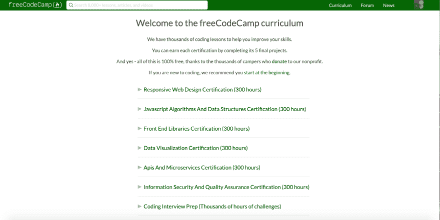
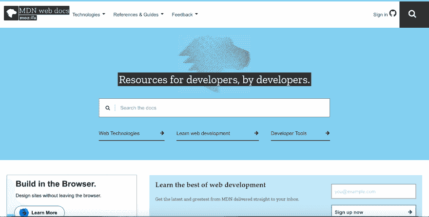
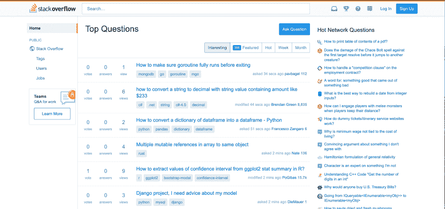

# 学习编码(免费)

> 原文：<https://dev.to/dannydore35/learn-to-code-for-free-581a>

在 21 世纪，编码能力是一个人能够拥有的最有价值的技能之一。来自 [Burning Glass](https://www.burning-glass.com/research-project/coding-skills/) 的一份报告称，越来越多的职位空缺重视编码，编码技能提供了一条高收入工作的道路，编码工作的增长速度快于就业市场。学习编码技能帮助改变了人们的生活，也为他们提供了一项不仅有价值而且有趣的技能。

然而，许多人在试图学习编码时面临障碍，因为专门从事编码的大学学位昂贵且耗时，编码训练营和在线课程价格昂贵，教科书也可能花费人们一大笔钱。但是大学教育、编码训练营和昂贵的教科书并不是唯一可用的资源，因为互联网上有许多免费的高质量资源。

通过本指南，您将了解一些高质量的编码资源，以及一些关于如何充分利用您的编码体验的提示和建议。我不是这些资源的发言人，我提到它们是因为它们具有很高的价值，而且它们不会让你付出任何学习的代价。

这篇文章将分为以下几个部分:

1.  编码基础
2.  Web 开发
3.  文档和工具
4.  援助地点
5.  掌握面试并获得工作

## 编码基础知识

当你在学习如何玩一个游戏时，在投入游戏之前了解游戏的工作原理是很重要的——同样的标准也适用于学习如何编码。学习这些编码的基础会让你成为一个更好的程序员。

**[可汗学院](https://www.khanacademy.org/computing/computer-science)**
对于本指南，我最想关注可汗学院的两个部分:算法和计算机如何工作。通过学习算法部分，你将会了解到一些常见的基本算法。在后面提到的参考资料中，您将在更高的层次上了解更多关于算法的知识，并且通过前面的学习，您将更容易理解重新引入的算法。除了学习算法，学习计算机如何工作将为您提供计算机如何在低水平上运行的介绍。当你以后知道计算机的某些部分是如何工作的时候，就更容易理解计算机是如何执行某些你以前可能不熟悉的任务的。

**[认为 Python 2e](https://greenteapress.com/wp/think-python-2e/)**
Python 是一门很棒的教人的第一语言，因为它的可读性和语言的可用性。对于一些人来说，一开始学习 C++、Java 或 JavaScript 比学习 Python 更容易阻止他们学习编码。 *Think Python* 不仅会教你如何用 Python 编程，还会教你典型编程语言和基本线性数据结构的基础知识。一旦你完成了 *Think Python* ，你不仅会对 Python 有一个基本的了解，而且还会更容易学习任何其他的编程语言，因为你已经学习了一种编程语言！

免责声明:本指南的下两部分可能会受到许多人的高度批评，但我发现学习离散结构、数据结构和算法很重要，因为了解这些主题将使你成为一名更好的程序员，如果你想进入就业市场，你将知道许多面试测试你的主题。

**[离散结构——玛格丽特·弗莱克](http://mfleck.cs.illinois.edu/building-blocks/)**
**注:本书要求具备大学代数知识。如果你不知道大学代数，我建议回到可汗学院，并通过前 calculus 部分。否则，你将很难学习离散结构。**

这个来源可能有点偏颇，因为它是我的大学(伊利诺伊大学香槟分校)的一位教授写的一本书，但它是学习离散结构的一个极好的资源。通过阅读和做玛格丽特·弗莱克的《离散结构》的练习，你将学到学习数据结构和算法的基础。你以后会感谢我的。

**[【开放数据结构(伪代码版)](http://opendatastructures.org/)**
学习数据结构和算法不仅能帮助你学会如何提高你的程序质量和务实思维，还能帮助你通过大多数编码面试。我建议浏览伪代码版，用 Python 编写书中的例子和练习。完成这一部分后，你将准备好征服任何与编程相关的东西，你将为自己打开大门。

## 网页开发

 
Web 开发是目前软件开发中最热门的领域之一，人们可以通过学习成为前端开发人员、后端开发人员，甚至是全栈开发人员。我们将重点学习 web 开发的资源是免费代码营，因为它可以说是学习 web 开发的最佳资源，并且可以将您与其他程序员组成的热情的社区联系起来(除了 DEV 社区之外)。

**[免费代码营](https://www.freecodecamp.org/)**
免费代码营是学习如何编码和 web 开发的最佳免费资源，因为它包含高质量的课程、社区、关于编码主题的中等文章、为非营利组织赚取编码经验的能力、1049 个编码挑战、30 个项目和 6 个备受尊重的认证，这些都可以推进你的编码之旅。

我在《编码基础》中要求你学习的所有东西在这里都会有帮助，因为你将学习另一种叫做 JavaScript 的语言，而且因为你已经知道 Python，所以学习 JavaScript 会更容易。此外，你将在自由代码营中实现关于数据结构和算法的挑战，这是你从开放数据结构中学到的主题。

如果你只能从本指南中获得一个资源，我希望是这个。自由代码营改变了许多人的生活，有些人甚至在完成自由代码营的课程后找到了工作。

## 文档和工具

**文献**
文献*所以乐于助人*。每当你遇到编码问题，比如用 JavaScript 调用一个函数，文档都可以帮助你。阅读文档来帮助解决问题的最佳起点是您所使用产品的官方文档。如果你需要更多的文档，下面是一些其他的好地方: [Mozilla Web Docs](https://developer.mozilla.org/en-US/) 、 [W3Schools](https://www.w3schools.com/) 和 [Geeks for Geeks](https://www.geeksforgeeks.org/) 。

还有其他好的资源，当你有疑问时，只要使用谷歌/whatever search engine 就能找到你问题的答案！

在 notes 应用程序中编写所有代码不会是一种愉快的体验。文本编辑器为编写代码和保存文件提供了增强的体验。我越来越喜欢的一个文本编辑器是 [Visual Studio Code](https://code.visualstudio.com/) ，这是一个由微软开发的开源文本编辑器。IDE 代表 Integrated Development Environment，它们在编码方面非常有效，因为 IDE 允许您拥有文本编辑器的所有功能，还允许您调试(查找和修复错误)、编写单元测试并在代码上运行它们，以及集成框架和库以增强您的编码项目的可访问性。我发现 ide 的一个缺点是它们会让你的计算机运行得更慢(偶尔会占用大量 RAM)，但是它们确实可以改善编程体验，这取决于程序员正在构建什么。在大多数情况下，许多 IDE 都是基于某些编程语言的，但是我将包含一个到 [Visual Studio](https://visualstudio.microsoft.com/vs/) 的链接，因为 IDE 中有集成其他语言的插件。

**[Git 和 GitHub](https://guides.github.com/introduction/git-handbook/)**
学习编码是一个有趣的过程，但有时也会令人沮丧。我可以在哪里保存我的文件，以便他们可以在任何地方访问，向任何人展示，并开放协作？输入解决方案:版本控制。Git 是一个版本控制系统，GitHub 是一个使用 Git 进行版本控制的托管服务。我建议学习 Git 和 GitHub，因为它们会让你的编码体验更加高效，GitHub 让你可以恢复到以前提交的项目，GitHub 让你能够轻松地在项目上合作，GitHub 为雇主提供了一个方便的位置来找到你的工作，GitHub 还允许你为开源做出贡献！“Git 和 GitHub”上的链接提供了学习 Git 和 GitHub 基础知识的链接。

终端
学习如何使用终端会非常有效，并有助于你的编程体验。如果你在 macOS/Linux 上，你应该在你的机器上安装一个你可以学习使用的 shell。[这里的](http://www.linuxcommand.org/tlcl.php/)是学习码头的好资源。Windows 有一个独立的 shell，但是有一种方法可以安装虚拟 bash 环境，这里的[是一个关于如何安装的链接。我相信上面的书也会对学习 Windows 上的虚拟终端有所帮助。](https://docs.microsoft.com/en-us/windows/wsl/install-win10)

通过自由代码营，你学会了如何使用许多其他工具，所以文档和工具部分到此结束。

## 援助地点

**[栈溢出](https://thepracticaldev.s3.amazonaws.com/i/hbyid3iktnbhmzsum5js.png)**
如果你曾经需要找到在代码中实现某些东西的快速答案，栈溢出就是你要去的地方！那里有很多已经回答的问题，如果你的问题还没有得到回答，你可以在那里提问！

**[Reddit:r/learn programming](https://www.reddit.com/r/learnprogramming/)**
r/learn programming subred dit 是另一个社区，在这里您可以找到编程问题的答案，或者如果您对代码相关的事情感到好奇或者需要帮助实现代码，可以提出问题！

## 掌握面试并获得工作

如前所述，编程是一个非常赚钱和有趣的领域。许多人对编程作为职业感兴趣，但面试过程可能会很难！这些资源应该可以帮助你通过这个过程，找到你想要的工作！

**[LinkedIn](https://www.linkedin.com)**
LinkedIn 是一个面向职场人士的社交网络。确保你有一个最新的个人资料！这是一个寻找入门级工作或实习的好地方。

**[HackerRank](https://www.hackerrank.com)**
这是你的数据结构和算法知识将变得至关重要的领域，因为 HackerRank 为你提供了你可能在求职面试过程中看到的编码挑战！我可以告诉你，在软件开发职位的面试中，我不得不在 HackerRank 上完成编码挑战。这是一个非常受欢迎的编码挑战网站，许多雇主也利用它！

**作品集**
一个编码作品集对于任何一个开发者都很重要，对于自学成才的程序员更是如此！一个作品集包含了你所从事的、你充满热情的个人编码项目！在面试过程中，你可以提出你引以为豪的项目，将你的两个最好/最相关的项目放在简历上是很好的做法！创建个人网站甚至可以成为你作品集的一部分！[这里的](https://dannyddore.github.io/)是一个投资组合网站的例子。[这里的](https://dev.to/emmawedekind/how-to-build-a-great-technical-portfolio-53bb)是一个来自开发者伙伴的帖子，关于编写一个伟大的作品集展示网站。

扎实的简历
扎实的简历会帮你脱颖而出。关于技巧，我推荐阅读一个用户指南！[这里的](https://dev.to/emmawedekind/how-to-write-a-kick-ass-technical-resume-3mb1)是他们关于技术简历写作的链接。

可选:Twitter 和 Slack
加入 Twitter，关注受欢迎的开发者和公司，可以帮助你获得更多关于编程的知识。此外，加入一个与技术相关的 Slack 频道也可以帮助你获得成功。我建议加入这两个平台并积极行动起来，但据我所知，社交媒体并不适合所有人。

## 期末笔记

首先，感谢大家阅读本指南！我知道它很长，但我真的相信它对任何类型的程序员都有帮助！我还想指出，这是我在 dev.to 上的第一个帖子，我希望能发更多！

对于新的编码员:我希望这个指南能让你达到你想要的编码智慧！如果你不想学习 web 开发，而更关注于其他领域，在网上搜索你感兴趣的内容，你会发现不同领域的代码教程。如果你在评论区下面提出一个关于如何学习的问题(填题目)我也可以帮忙！请记住，总有其他资源可供学习，还有许多工具我没有在这里讨论。如果你对什么感兴趣，就去了解一下吧！

对于已建立的编码员:非常感谢您的阅读！我很感谢你花时间阅读这篇文章！

致所有人:如果您有任何问题、意见或反馈，请发表！我会回应任何不得不说的话！在 GitHub、LinkedIn、Twitter 上，可以找到我@DannyDDore！