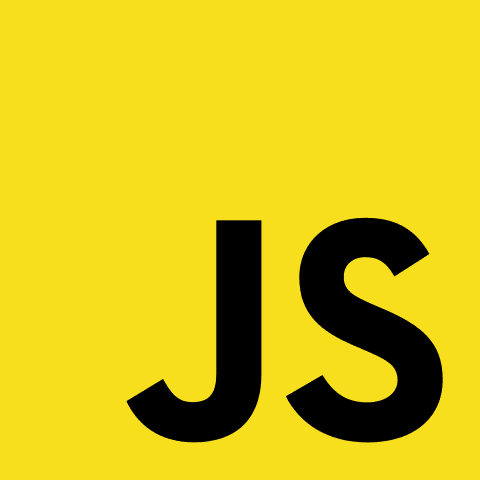

# 2019 年学编码，被录用，一路走好

> 原文：<https://dev.to/andreineagoie/learn-to-code-in-2019-get-hired-and-have-fun-along-the-way-28mp>

去年，我写了一篇[帖子](https://medium.com/zerotomastery/learn-to-code-in-2018-get-hired-and-have-fun-along-the-way-b338247eed6a)在网上疯传，给你一步一步的指导，告诉你如何从零开始成为一名网络开发者，还有免费的**。从那以后发生了很多变化，因为我是不浪费时间的支持者，所以我想与你分享更新的文章，因为 2019 年有很多变化！重点是效率:学习现在有需求的正确主题，这样你就能尽快被录用。**

 **如果你想在 2019 年学习编码，改变你的职业生涯，成为一名网页开发者，这些是你应该采取的步骤。

这是 2 部分系列的第 1 部分。你可以在这里阅读第二部[。](https://medium.com/zerotomastery/dont-be-a-junior-developer-608c255b3056)

如果你是一个完全的初学者，初级开发人员，或者对这个行业很好奇，这篇文章适合你。然而，如果你是一名资深开发人员，你可能会在这里找到一些有用的链接，因为我列出了最好的免费资源来增强你的技能，但我也写了一篇关于如何成为高级软件开发人员的帖子。

如果觉得这个帖子太长，可以跳过，从 **5 个月开始，一步一步的小节**。但是你会伤害我的感情…所以你知道，你可以带着内疚生活。

> # It's a good thing you're still here. Great! I already like you. Let's move on …

只使用免费的在线课程、教程和免费工具，你可以获得一项有价值的技能，让你受雇于一个伟大的行业，这个行业是有益的、具有挑战性的，并且有很多在世界各地流动的选择(稍后将有更多介绍)。最棒的部分？你不需要大学文凭或者昂贵的训练营。

**重要提示:**这篇文章看起来像是成为一名开发人员的一步一步的指南，但是如果你仔细看，这是一个你可以应用于任何学习的策略。

## 为什么编码？

在我们进入成为一名开发人员的步骤之前，我们必须首先深入了解为什么你会想走这条路。每一个需要你生命中大量时间的决定都应该是合理的。毕竟，时间是我们拥有的最重要的资源:

你想在一个对技能有很高需求的行业工作，并且有很多机会成为食物链顶端非常重要的角色。

你喜欢不受地点限制。你想要一项技能，让你去世界上任何地方，仍然能够很容易地找到工作。如果你决定明天搬到冰岛，你要确保你不会有找工作的问题。

* * C. * *您已经注意到了 2004 年和 2019 年之间的差异，以及我们在这短短的 15 年里取得了多大的技术进步。你想站在一个影响世界的行业的最前沿。

* * D. * *在过去几年中，最大的行业增长出现在[加密货币(比特币)](https://coinmarketcap.com/currencies/bitcoin/#charts)和[人工智能(机器学习)](https://deepmind.com/blog/alphago-zero-learning-scratch/)领域。我们每天都与技术互动，当这些技术接管我们的未来时，你不想落在后面。你想要理解并能够掌握所有这些技能的基础:编程。Web 开发是进入这些行业的重要一步。

* * E. * *你觉得改变是好的，学习永远不要停止。那么为什么不做点新的呢？

> # But I don't have a degree in computer science, and I don't even know how the internet works! Don't worry, we'll take advantage of this. Continue reading …

在选择新的职业道路时，这里有一些好的必备条件:

**1。**它必须与未来 10 年相关。这项技能应该在未来的许多年里受到重视，保证你的工作安全。

**2。**对这种技能的人的需求一定是高于供给的。这个行业的熟练工人越少，你对自己的工作和工作的公司就越有控制权。

**3。**无论在行业中工作多少年，都有能力获得高薪。除非你过上体面的生活，否则你不会想花很多年爬上公司的阶梯。

**4。**不需要大学专业学位的行业。在你开始赚钱之前，你不想在接下来的 4 年里负债累累，去读研究生。是的，我认为有比去昂贵的编码训练营更好的选择。

**5。**有能力在最短的时间内赶上行业中的顶级表现者。经验少还能让你就业吗？你能尽快缩小差距，成为该领域的资深人士或专家吗？

**6。**它必须让你建立基础技能，无论未来如何，这些技能都将为你提供多种职业选择。例如，通过学习编码，你能够更好地理解分布式应用、机器学习和云计算等新兴技术，并选择你下一步想进入的领域。

7 .**。**玩得开心。最重要的一个。你能想象自己一周 40 个小时长时间这样做吗？

根据我的经验，编码符合上面的每一点。您的里程可能会有所不同。

我最喜欢的一本书名叫[好到他们不能忽视你](http://calnewport.com/books/so-good/)。在那里，作者认为激情是一个神话。你不应该进入旅游行业，因为你对旅游“充满热情”。大多数人通过奋斗和努力掌握一项技能来找到激情。一旦人们开始承认你有价值的技能，并且你能够因为这些技能而感受到尊重，那就是你对你所做的事情产生热情的时候了。

> # Still with me? I didn't scare you away, did I? Well, let's keep going.

**要点读完**:记住，前 2 个月会觉得自己在爬一座不可逾越的大山。你做的每一个教程、课程或教训都会让你觉得你是世界上唯一一个不知道这些东西的人。保持坚强。你会到达那里，你会有越来越多的‘啊哈！’随着时间的推移。我们称之为冒名顶替综合症:你觉得自己是唯一一个不知道这些信息的人，你被自我怀疑所包围。请放心，当我们学习新东西时，我们都会有这种感觉。

在这一切结束时，你将会学到，成为一名优秀的开发人员并不一定要记住一大堆文档。它是关于学习如何使用所有可用的工具来解决问题。而是成为一个解决问题的人，从不知道的状态到知道的状态。

## 你是谁，我为什么要听你的？

哇，你很直接，但我想这是一个公平的问题。首先，我是一名高级软件开发人员，曾在包括硅谷在内的多个地方的一些顶级科技公司工作过。在我的职业生涯中，我非常幸运，事实上，我去年一整年都在帮助全世界 6 万多人从零开始成为开发人员。但是我并不是天生的电脑奇才。我毕业时没有计算机科学学位。我完全是自学的。

*P.S .这部分都是关于我的，所以如果你不在乎(完全公平点)，就跳过这部分吧。我最终会克服它的。*

这一切都是从很多年前开始的…我想换个职业，决定自学计算机编程。

我花了第一个月避免任何教程或书籍。相反，我花了一个月的时间来寻找我学习和被雇佣的最佳方式。我想变得高效，而不是浪费时间去学习过时的技术，或者学习那些一个月后就会忘记的东西。我研究了其他人的经历，查看了招聘信息，与成熟的开发人员进行了交谈，回顾了在线课程，查看了训练营，甚至阅读了未来学家关于 20 年后我们将在技术领域处于何种地位的文章。基于这些，我为自己创建了一个专注于效率的课程:**为了在最短的时间内被雇用，学习的临界量。**

如果你和我一样喜欢蒂姆·菲利斯的作品，你会喜欢这个的。课程的重点不是做最少量的工作。相反，它专注于在最重要的事情上非常努力地工作，以便以最佳的方式被利用。这并不意味着做最低限度的工作，并被聘为初级开发人员。如果你能努力工作，跳过这条线，直接进入中级开发人员角色，那是一个更好的结果。你很幸运，我已经把所有东西都筛选过了。

虽然我花了一个月的时间来计划我的学习，而不是真正的学习，但从长远来看，这是一个好处，因为我没有瞎跑。我知道我要去哪里，我有一张到达终点的地图。你也会的。

所以，是的，我经历过你的处境，我知道需要付出什么。当我开始的时候，我希望有这样的东西一步一步地为我概述事情。我还发现很多教程是由拥有很多技术知识的人来教的，但是他们却不能很好地教一个新手。在时间允许的情况下，我已经阅读和研究了每一个视频、教程和课程，现在仍然如此。

从那以后，我为财富 500 强科技公司提供咨询，开办编码讲习班，咨询出版的科技书籍，举办技术讲座，我还帮助那些没有编程经验的人在短短几个月内找到了工作。主要是因为我觉得训练营多收了你的钱。别担心，你可以免费做这件事，正如你将在下面看到的。我现在处于一个不用为任何人工作的位置。我热爱这个职业，我认为许多人会喜欢它，并从中受益。所以我的使命是帮助那些想要实现这一飞跃的人。

好吧，最后一句有点戏剧性…🤔

## 我们要学什么语言？

 *没错，这一个在这里。*

你将成为一名 Javascript 忍者，原因如下:

→ Javascript 无处不在。每个拥有网站或应用程序的公司都需要具备 Javascript 知识的人。这种语言是大量招聘信息的必备条件(如果你不相信我，可以在 LinkedIn 上搜索你所在地区的 Javascript)。

→随着 Node.js 的引入，你可以使用 javascript 创建一个全栈 app(英文=你可以使用 Javascript 构建你的整个项目)。使用像 [Electron](https://electronjs.org/) 、 [React Native](https://facebook.github.io/react-native/) 和许多其他工具，Javascript 允许你构建桌面应用、移动应用、网络应用，甚至虚拟现实应用。你可以通过使用类似 [Jonny-Five](http://johnny-five.io/) 的东西来控制机器人。你可以[建造自己的区块链](http://www.darrenbeck.co.uk/blockchain/nodejs/nodejscrypto/)。类似以太坊的平台 Lisk 使用 javascript。想用 AI 和机器学习？太好了，你也可以用 Javascript 来做所有的事情。

→如果你没有看第一点，你在想别的，让我重申一下:行业对 Javascript 专家的需求是巨大的。这是雇主最需要的语言。对于开发人员来说，招聘人员和猎头一周多次联系他们寻求工作机会并不罕见。

→ Javascript 社区正在以疯狂的速度增长。这个社区有许多新的发展。一些人抱怨 Javascript 疲劳，因为每天都有越来越多的新工具被开发出来。然而，我们可以利用这一点。你将和在这个行业工作多年的人同时学习这些新技术。

相信我，这是一个有很多需求的伟大社区。如果你不相信我，这里有一个[趋势开发者技能分析](https://medium.freecodecamp.org/trending-developer-skills-based-on-my-analysis-of-ask-hn-whos-hiring-26c02a3ca1fd)。

废话少说，我们开始吧。下面你会发现我认为最适合你充分利用时间的方法。到 5 个月结束时，你应该可以得到你的第一份真正的非入门级编程工作。没有训练营。只有你和你的决心。

## 5 个月——循序渐进

2019 年，我们将关注最具就业价值和最受欢迎的技能。没有时间考虑过时的技术，比如 PHP 或 jQuery。他们没有错，我完全尊重他们，但是根据这些年来我从你那里收到的一些电子邮件，很多人都有经济困难，有家庭需要他们来养活。时间对你很重要，你想尽快找到工作并学习现代技能。

### 1 月:大局

** *要回答的大问题:**计算机、互联网和网站是如何工作的？怎么才能建一个网站？*

*   理解费曼技巧，这样你就能在接下来的 5 个月里真正学到东西，而不仅仅是利用你的短期记忆。

*   互联网是如何工作的:LearnCode.academy 的这个和 newboston 的[这个](https://www.youtube.com/playlist?list=PL6gx4Cwl9DGBpuvPW0aHa7mKdn_k9SPKO)。

*   计算机科学最佳概述:[计算机科学速成班](https://www.youtube.com/playlist?list=PLME-KWdxI8dcaHSzzRsNuOLXtM2Ep_C7a)

*   在 youtube 上关注[这门哈佛课程](https://www.youtube.com/watch?v=y62zj9ozPOM&list=PLhQjrBD2T3828ZVcVzEIhsHVgjANGZveu)。这可能是来自最好的计算机科学讲师的纯金。没有必要做练习。

*   如何使用命令行:[这个](https://learnpythonthehardway.org/book/appendixa.html)由 Zed Shaw 编写。

*   如何建立一个网站/获得一个域名/并让它运行起来: [LearnCode.academy 视频](https://www.youtube.com/watch?v=tq7dqdHCc7U&feature=youtu.be&list=PLoYCgNOIyGAB_8_iq1cL8MVeun7cB6eNc)。

*   HTML，CSS 是如何结合在一起的:观看这个伟大的播放列表。

*   学会用 Bootstrap 建立网站。从[这个](https://www.youtube.com/watch?v=no-Ntkc836w)开始，然后转到 [Bootstrap 4 文档](https://v4-alpha.getbootstrap.com/getting-started/introduction/)，将你在那里看到的组件添加到一个示例网站。了解它提供的好处，而不是自己编写 CSS。但是不要在这一点上卡住，因为相反，我们想更多地关注下两个更具就业能力的技能:

*   了解如何使用 [Flexbox](https://css-tricks.com/snippets/css/a-guide-to-flexbox/) 和 [CSS Grid](https://scrimba.com/g/gR8PTE) 进行网站布局。然后做[这个](https://flexboxfroggy.com/)和[这个](http://cssgridgarden.com/)的练习。从头开始构建自己的网站布局。

*   了解如何使用模板，使用免费的[主题](https://pikock.github.io/bootstrap-magic/)和[模板](http://mashup-template.com/)来构建网站。

*   如果你有时间，你可以在 [freeCodeCamp](https://www.freecodecamp.com/) 学习一些关于 HTML 和 CSS 的课程。

*   * *这很重要:* *不要试图记住所有的 HTML 和 CSS 属性和标签。这也是我犯的一个错误。你想尽快开始学习 Javascript，这是成为一名 web 开发人员的主要部分。不管你感觉如何“没有准备好”或者你对 CSS 的了解有多不全面，进入下一部分，因为你将在接下来的几个月中使用 HTML 和 CSS。相信我。

### 第二个月:Javascript

** *要回答的大问题:* * JavaScript 如何让机器做你想做的事情？*

*   在接下来的几个月里，这也是你最关注的地方。Javascript 解决什么问题？开始用 Javascript 编写小程序，让你的网站以某种方式运行。这种语言让你的网站不仅仅看起来漂亮。先从这两门课开始:[一门](http://javascript.info/)和[两门](https://watchandcode.com/p/practical-javascript)

*   了解一下 [DOM 操作](https://www.w3schools.com/js/js_htmldom.asp)。

*   阅读[这篇关于编程的伟大文章](https://medium.freecodecamp.org/a-gentler-introduction-to-programming-1f57383a1b2c)。

*   [这是一个很长的系列，你不会读完](https://github.com/getify/You-Dont-Know-JS)但是当你在 javascript 中遇到不懂的东西时，可以用它作为参考。

*   了解如何使用 chrome 开发者控制台编写 javascript。只做控制台部分的代码学校课程。然后学习在 html 中注入脚本标签来运行 javascript 文件。

*   如果您在这 5 个月中有任何疑问，请使用 freeCodeCamp 的本[指南](https://guide.freecodecamp.org/)进行简短查找。

*   通过本教程了解 ES6、ES7、ES8 和 ES9 的新功能。如果您没有掌握这里的所有内容，不要担心，下个月我们将讨论另一个资源，主题是“异步”。

*   用这个[40 分钟教程](https://www.youtube.com/watch?v=6bjCvZEX52w)学习 Git 和 Github(没错就是我)。创建一个 Github 配置文件，开始每天提交。开始开发一个样本网站。使用 Github pages 将您的网站放到网上。

*   术语/行话:[这个视频](https://www.youtube.com/watch?v=gVXcqO9A1vo&t=6s)和[这个](http://jargon.js.org/)。

*   最后，在 youtube 上观看这个[伟大的播放列表。忽略 jQuery 和 Grunt 部分。](https://www.youtube.com/watch?v=gQojMIhELvM&list=PLoYCgNOIyGABDU532eesybur5HPBVfC1G)

*   每当你有问题并且想深入了解某个话题时，就开始使用本指南。

### 第三个月:Javascript + NPM +建立你的网站

** *要回答的大问题:* *我能建立一个看起来专业的网站并了解整个过程吗？*

*   谷歌开发者工具→学习如何使用谷歌浏览器调试你的程序和网站。完成这个简短的小课程。

*   开始参加当地的编码和 Javascript 会议。

*   了解同步和异步 javascript 的[区别。](https://blog.risingstack.com/asynchronous-javascript/)

*   什么是事件循环？→一旦你很好地掌握了 Javascript [，这个](https://www.youtube.com/watch?v=8aGhZQkoFbQ)演讲将会改变游戏规则。毫无疑问，这是关于 javascript 的最好的演讲。在接下来的 3 个月里，每个月都看这个视频。然后看这个我做的的[免费视频。](https://www.youtube.com/watch?v=hGSHfObcVf4)

*   了解承诺，在 ES7 [这里](https://www.youtube.com/watch?v=568g8hxJJp4&t)异步等待。

*   最后，看道格拉斯·克洛克福特的这个课程。

*   点击了解 Javascript [中模块的历史。](https://medium.freecodecamp.org/javascript-modules-a-beginner-s-guide-783f7d7a5fcc)

*   [下载 node.js 和 npm](https://www.sitepoint.com/beginners-guide-node-package-manager/) 。从 npm 下载 [lodash](https://www.npmjs.com/package/lodash) 并使用 [browserify](http://browserify.org/) 使用普通 Js 导入。了解一下[这里](https://scotch.io/tutorials/getting-started-with-browserify)。理解为什么 npm 对开发者来说是如此神奇的工具。现在了解为什么我们不再使用 Browserify，并了解本机[导入](https://developer.mozilla.org/en-US/docs/Web/JavaScript/Reference/Statements/import)和[导出](https://developer.mozilla.org/en-US/docs/web/javascript/reference/statements/export)。

### 第 4 个月:React.js(或 Vue.js)

** *要回答的大问题:** React 或 Vue 解决什么问题？*

我有严重的偏见。我喜欢 React.js。事实上，我把它教给了其他人，并开办了关于它的研讨会。所以这次请相信我。学习 React，除非你有一个很好的理由学习 Vue.js. Vue 是新的和令人兴奋的，但平均来说工作需求还没有那么高。

*   反应→依次做这些:[一](https://www.youtube.com/watch?v=MhkGQAoc7bc&list=PLoYCgNOIyGABj2GQSlDRjgvXtqfDxKm5b)、[二](https://egghead.io/courses/the-beginner-s-guide-to-reactjs)、[三](https://egghead.io/courses/advanced-react-component-patterns)。然后前往官方[文档](https://reactjs.org/tutorial/tutorial.html)通读所有内容。

*   如果你有时间，并且想要更深入的关于 react [的教程，这里是](https://btholt.github.io/complete-intro-to-react/)

*   可选:学习 Redux →观看[本](https://egghead.io/courses/getting-started-with-redux)课程。不要让你的头爆炸。然后同样阅读[文档](http://redux.js.org/docs/introduction/)。

*   使用 [create-react-app](https://github.com/facebookincubator/create-react-app/blob/master/packages/react-scripts/template/README.md) 2 构建一个示例 React 应用程序。创建-反应-应用程序会让你大吃一惊。它将为你打开一个新的世界。

*   在 [Heroku](https://devcenter.heroku.com/articles/git) 上部署您的应用。

*   在 [GitHub 页面](https://pages.github.com/)上部署您的应用。

*   开始关注[媒体上的前 10 篇文章](https://datantify.com/trendbar/last-30-days/javascript) +阅读[这里的所有文章](https://medium.com/zerotomastery)。注册这些电子邮件列表，随时了解行业动态: [Javascript](http://javascriptweekly.com/) 和 [React](https://react.statuscode.com/) 和 [Web Developer Monthly](https://medium.com/zerotomastery/web-developer-monthly-october-2018-c7fb0a6f0572) 。

*   开始建立你的在线简历。在这个问题上，有人比我给出了更好的建议。检查[这个](https://medium.freecodecamp.com/how-to-write-a-good-resume-in-2017-b8ea9dfdd3b9#.nifu8uw1m)和[这个](https://medium.freecodecamp.com/5-key-learnings-from-the-post-bootcamp-job-search-9a07468d2331#.4kjyb4763)出来。或者你可以全力以赴，[看看](https://www.udemy.com/master-the-coding-interview-data-structures-algorithms/?couponCode=LEVELUPZTM)这个，但是这个帖子已经太长了，你已经开始用邪恶的眼光看我了。

### 上个月:服务器、数据库和连接点

** *要回答的大问题:* *服务器、数据库和 raspberryPis 在这一切中扮演什么角色？*

*   [HTTP](https://developer.mozilla.org/en-US/docs/Web/HTTP) 、 [JSON](https://www.w3schools.com/js/js_json_intro.asp) 和 [AJAX](https://www.w3schools.com/xml/ajax_intro.asp) 。了解这些如何让您与服务器通信。

*   了解如何构建 API 服务器。然后再进一步，在这里掌握 Node.js 和 Express.js [。了解什么是 RESTful API。](https://frontendmasters.com/courses/api-design-nodejs/)

*   一旦你完成了这些，使用一个有趣的 API，比如[这个](https://swapi.co/)并构建一个简单的应用程序。

*   订阅 [computerphile](https://www.youtube.com/channel/UC9-y-6csu5WGm29I7JiwpnA) youtube 频道，观看他们的视频。即使主题可能很难，它也会向你介绍一些令人惊奇的事情。

*   什么是计算机/服务器/操作系统:买一个 [raspberryPi](https://www.raspberrypi.org/products/) 自己搭建服务器。在 youtube 上查找你可以用 raspberryPi 做的不同项目。最后，构建一个简单的脚本，让连接到 raspberryPi 的灯光闪烁。跟随[这条航线](https://www.youtube.com/watch?v=Jj4pjfU_-jo&list=PLsa31gkyINsly6N_usaeHrtDPYnwxO-1Y)。把你的网站放在覆盆子馅饼上。惊讶于你有多酷。

*   使用 [firebase](https://firebase.google.com/docs/web/setup) 作为数据库构建一个小项目。

*   阅读 JavaScript 第一部分的两大支柱和[JavaScript 第二部分的两大支柱](https://medium.com/javascript-scene/the-two-pillars-of-javascript-pt-2-functional-programming-a63aa53a41a4)。

*   每个人花一天时间在以下主题上。你不需要很好地掌握它们。只要了解他们为什么在那里，他们在解决什么问题:测试，机器学习，时间复杂度(大 O)， [SQL](https://sqlbolt.com/) ，UX/UI，持续交付，基本数据结构(你应该能够解释什么是数据结构。提示:数组和对象是两种流行的 Javascript 数据结构)。

* ***我已经可以听到有人用上面的建议来骂我了。“你疯了吗？！你觉得不重要吗？”但是听我说完。我同意，为了成为一名优秀的开发人员，这些都是重要的主题，每个人都应该学习这些技能。然而，我们试图在这里建立一个基础主干。开始深入一个主题是很容易的，但是如果没有基础，你实际上不会知道它为什么重要，或者它与你正在做的事情有什么关系。此外，在我发现的大多数招聘信息中，很少提到上述技能。把这些知识留到你工作的时候再学。*** *

记住:你的目标是以最有效的方式获得工作。

## 我们来回顾一下

在 5 个月结束时，您应该完成以下要求:

**1** 。学习 HTML 和 CSS。然后，买域名，从 [BlueHost](https://www.bluehost.com/) 或者 [HostGator](https://www.hostgator.com) 这样的地方买主机，得到最便宜的选项，做个网站，放到网上。如果您想使用免费的 [Github 页面](https://pages.github.com/)，您可以跳过此选项。但是如果你负担得起，就买一个以上的托管平台，这样你就能了解它们是如何工作的。从现在开始这将是你的作品集。了解如何更新和编辑它。当你学习新事物时，继续让它变得越来越好。不要在这上面花太多时间。这足以表明你能够把一些东西放到网上，并让它看起来很漂亮。专注于在你的投资组合中有 1~2 个真正好的大项目，而不是 30 个任何人都可以在一天内完成的小项目(因为雇主不会觉得这令人印象深刻)。

**2** 。开始学习 Javascript。现在你如何使你的网站具有互动性？浏览以上资源，看看 Javascript 是做什么的。

**3** 。开始把你的小项目推到 GitHub。雇主会查看你的 GitHub 个人资料，以及你在上面的活跃程度。试着在你的个人项目上一周提交 5 次。也试着通读一下[这个](https://github.com/freeCodeCamp/how-to-contribute-to-open-source)，为一些开源项目做贡献，比如 freeCodeCamp 或者 [zerotomastery](https://github.com/zero-to-mastery) 。

**4** 。当你遇到问题时，学会谷歌和使用[栈溢出](https://stackoverflow.com/)。你在创业时遇到的 99%的问题都可以在网上找到。或者加入 [Javascript IRC 频道](http://irc.lc/freenode/javascript)，遇到问题就提问。你当地的社区也可能有一个松弛的频道。如果没有，从[这里](https://techbeacon.com/46-slack-groups-developers)选一个，和其他开发者聊聊。关键是找出如何解决你自己的问题，而不是总是遵循教程，看着别人回答你的问题。

**5** 。习惯使用命令行来做事情。练习时，请始终打开它，并尝试使用它来代替 GUI(图形用户界面)。

**6** 。学习 Javascript 最新的语言特性和趋势，学习用它们解决问题(即 Promises，ES6，ES7，ES8，ES9，[函数式编程技术](https://github.com/hemanth/functional-programming-jargon))。

**7** 。参加当地聚会，开始与人交谈。你会被所有你不知道的事情弄得不知所措，不知所措。不要担心，因为这是自然的。开始接触其他程序员，这样你就可以被术语和行话所包围。

**8** 。开始听播客: [Javascript Jabber](https://devchat.tv/js-jabber) 。这会让你熟悉术语，这样当面试的时候，你就不会不知所措。头几次你听的时候，你会不知道他们在说什么。不要失去希望。最终，一切都会变得有意义。 [FunFunFunction](https://www.youtube.com/channel/UCO1cgjhGzsSYb1rsB4bFe4Q) 也是你应该关注的一个很棒的每周 youtube 频道，尽管旧的视频(最受欢迎的)比新的更好看。对于更复杂的播客，但可能是最好的软件，请查看[软件工程日报](https://softwareengineeringdaily.com/)。另外，请留意每年的 javascript 调查[状态，了解行业趋势。](https://stateofjs.com/)

**9** 。早点开始向招聘机构申请。我们将把它们作为练习。其中大多数都有与专业程序员的练习面试，这样他们可以对你的技能进行排名，但是你可以用这些来练习编程问题，并问这些专家任何你想问的问题！

**10** 。开始申请你完全不胜任的工作。你会得到一些面试机会。你不应该满足于一份工作。如果你从来不问，答案总是否定的。[关于这个](https://medium.com/zerotomastery/dont-be-a-junior-developer-608c255b3056)的更多细节请见第二部分。

**11** 让你的 LinkedIn 个人资料看起来不错。不要在简历上花太多时间。做成一页，言简意赅，把前几个月学到的技巧都写下来。像这样使用一个预建的模板。自学显示出很大的勇气。请记住，你的简历只是让你得到一个面试机会，之后，他们就像纸巾一样好…好吧，这个比喻不好，因为纸巾非常有用。我在简历上花了不到 2 个小时。让你与其他开发者不同的是，你来自不同的领域和背景。这将如何让你脱颖而出？

**12** 。面试并惊讶于你的就业能力。并不是所有的人都会很顺利，但话说回来，没有多少开发人员在过去的 5 个月里学会了所有的东西。它显示了野心。只适用于 LinkedIn 上的工作，其余的应该只是你直接发电子邮件，推荐，或打电话给你想工作的公司。不要把你的时间浪费在 Craigslist、Kijiji、Monster.com 或其他招聘广告上。如果你愿意，你也可以使用像[真命天子](https://www.indeed.com/prime)或[雇佣](https://hired.ca/)这样的服务。

## 什么是能让我获得 80%结果的 20%

大多数人都有一个想法，你需要 100%的努力才能进入下一步。然而，对于大多数技能，包括编程，你越接近 100%，就需要越长的时间。你只有 5 个月时间。最后的 20%在团队中工作会更好，在真实的项目中工作(并获得报酬)。所以我们只专注于获得 80%的知识来有效地利用我们的时间。

## 这一切的最大收获

技术总是在变化。对于 web 开发来说尤其如此。现在事情发展得如此之快，以至于不可能了解每一个库、语法或框架。你需要知道的是所有的东西是如何组合在一起的，以及每种技术试图解决什么问题。最重要的是，你只需要知道它的存在，这样你就可以研究它，并在工作中找到它。程序员是问题的解决者。学会用可用的工具解决问题。我们大多数人花大量时间在 StackOverflow 或搜索 google 这样的页面上，因为那里有太多的资源。一旦你建立了知识的基础，你就可以去任何地方。你只需要知道如何寻找答案和提出问题。

## 结论

注重效率。我们大多数人放弃目标的原因是因为我们看不到结果。通过关注重要的事情，它使学习变得有趣。但这并没有结束。学习永远不会停止，你的目标是尽快找到工作，这样从那时起，你每天都有工资可以用来学习。

随着每一天的过去，编码变得越来越有趣，当你每天都得到报酬来解决问题和发展你的技能时，这就更好了。真正的成长发生在你开始和真正的团队一起做真正的项目的时候。这就是为什么我强烈认为，你希望你的‘学习’期尽可能短，以避免负债，并增加你在最佳学习环境中的时间:在团队中工作。我甚至不建议一开始就从事自由职业。你想让自己置身于一个每个人都比你聪明、你每天都和他们一起工作的环境中。从那里开始，做一块海绵，吸收所有的信息。

我们正在建造那个箱子。当树干变得又大又壮，树根也全部就位，你学习新事物的速度将会是指数级的。随着时间的推移，你会越来越快地长出知识的叶子。

> # Let 2019 be your year of adventure. You learn a very popular skill, you feel scared, you have new experiences, and you get new opportunities. Good luck!

## 最后一件事……

我创建了一个在线课程:[* * 2019 年完整的 Web 开发人员](https://www.udemy.com/the-complete-web-developer-zero-to-mastery/?couponCode=LEVELUPZTM) **如果您希望所有东西都在一个地方，或者想要额外的帮助，或者想要支持我的工作，我会带您完成我上面提到的整个步骤。我们还有一个由数千名开发人员组成的私人社区，他们每天都在学习课程，互相帮助。超过 200 个高清视频和 30 多个小时的内容。它花了疯狂的#小时来制作。但我真的为一切的结果感到骄傲。它在假期打折到 10 美元，开始新的一年**(前 100 名注册)**，我强烈认为它比任何训练营的材料都好。

更新:我们已经有超过 191 个国家的 60，000 名学生报名了！T3】

转到本文的第 2 部分:[不要成为初级开发人员](https://medium.com/zerotomastery/dont-be-a-junior-developer-608c255b3056)

谢谢你读到这里。抱歉写了这么长的帖子，但是如果你喜欢这个帖子，请分享、评论并发表👏几次(最多 50！).。。也许它会激励一些人开始新的职业生涯。

如果你将来对这些更深入、信息更丰富的文章感兴趣，请在 [Twitter](https://twitter.com/AndreiNeagoie) 和 Medium 上关注我！顺便说一下，我的全职工作是教人们如何以最有效的方式编码。你可以在下面看到我的课程(使用优惠券代码 LEVELUPZTM 可以享受不错的折扣):
[**2019 年完全 Web 开发者:零到精通**
*短短几个月成为全栈开发者！](https://www.udemy.com/the-complete-web-developer-in-2018/?couponCode=MEDIUMJUMP18763)**