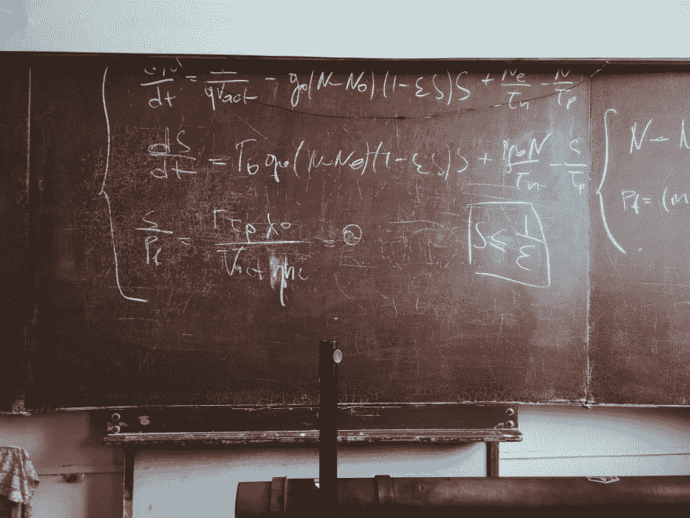

# 学习高等数学

> 原文：<https://dev.to/pmuens/learning-advanced-mathematics-5e3o>

对我个人来说，数学是我在学校必须经历的神秘学科之一，但从未真正理解，更不用说欣赏了。它太抽象，涉及冗长的计算，死记硬背公式，很少甚至没有解释它为什么有用以及如何在现实世界中应用。坦率地说，数学是我的弱项之一。当我告诉父母我打算学习计算机科学时，他们感到惊讶和震惊，计算机科学是应用数学的一个分支。在我的一生中，我对数学又爱又恨。我仍然记得我通过大学最后一次数学考试时那种如释重负的感觉。

在我作为软件工程师的职业生涯中，我几乎没有数学课。我不时查阅旧的计算机科学书籍，对我后来实现的算法做一些研究。然而，这些通常是我与数学的唯一接触点。

过去几年发生了一些变化。在寻找下一个个人挑战和成长目标时，我发现大多数真正令人兴奋的成就都在很大程度上利用数学作为基本的构建模块。事实上，这适用于许多科学领域，包括计量经济学、数据科学和人工智能。跟踪新闻并大致了解事情可能如何运作是很容易的，但一旦你试图深入挖掘并深入了解真相，事情就会变得非常棘手。

我发现自己经常迷失在线性代数、微积分和统计学的黑暗小巷中。去年我终于走到了岔路口。我想从根本上改变我的认识，决定从头重新学习数学。经过无数个深夜、清晨和周末的上课、练习和证明，我终于对高等数学有了相当不错的理解。现在，我正在这个基础上学习更多。

在这个过程中我学到了一件重要的事情:**数学真的很神奇！**

数学是自然的语言。理解它有助于你理解我们的世界是如何运作的！

在这篇博文中，我想分享我是如何从“什么是多项式的根？”到“广义自回归条件异方差”(至少在某种程度上)。我将分享我创建和遵循的课程，我犯的错误(剧透:我犯了很多)和我在整个旅程中使用的最有用的资源。

在我们开始之前，我想对你说实话:数学是一门非常复杂的学科。外面有很多…

这肯定会让人不知所措。然而，如果你真的很投入，想要投入这些时间，你会成功的！如果我能做到，你也能！

请记住，这是为我工作的道路。这并不一定意味着它对你来说会同样有效。就我而言，我需要学习、自我解释、练习、练习，才能真正理解手头的主题。我认识一些人，他们可以坐在教室里听，并最终理解。我绝对不是这么操作的。

好吧。我们开始吧！

## 课程表

数学是那些你会发现几乎无穷无尽的资源的学科之一。仔细观察，它们在质量、密度和可理解性方面都有很大差异。

我提高数学技能的第一个方法是浏览一篇有趣的研究论文，写下所有我不懂的数学，并查找这些术语以更详细地研究它们。这在很多层面上都是错误的。经过一些尝试和错误之后，我后退一步，做了大量的研究，以找出我应该学习哪些主题来支持我的目标，以及这些主题之间的关系。

我最终整理出来的课程是一个很好的基础，如果你想跳到其他[【硬科学】](https://www.thoughtco.com/hard-vs-soft-science-3975989)。我的个人目标是学习深入研究人工智能所需的知识。更具体地说，我真的对深度学习和机器智能方向的下一步感到兴奋。

本课程涵盖的每个主题都使用 3 个基本支柱来构建坚实的数学基础:

**直觉**

视频，互动可视化和其他有用的资源，概述了数学是如何来的，以及它是如何在直观的水平上工作的。

**深潜**

一个足够好的“深度潜水”来熟悉基本概念，同时避免由于过度使用定理、证明、引理等而引起的混淆。

**实用性**

练习，练习，练习。有大量练习的书籍等资源来巩固知识。

### 代数

代数是第一个应该广泛学习的课题。

对代数有很好的理解会让一切变得容易得多！微积分大部分时间归结为 90%的代数。如果你知道如何解决代数问题，你在微积分方面也不会有困难。

你们大多数人可能记得一个类似于

> "解这个 x 的方程"

这就是代数的内容。在代数课上，你将学习以下主题:

*   解方程
*   解决不等式
*   多项式
*   因子分解
*   功能
*   绘制图形
*   对称
*   分数
*   激进分子
*   倡导者
*   对数
*   线性方程组
*   非线性方程组

如上所述，真正磨练你的代数技能是非常重要的。我在重复我自己，但是代数是高等数学的主要组成部分之一。

#### 资源

*   [保罗的在线笔记——代数](http://tutorial.math.lamar.edu/Classes/Alg/Alg.aspx)
*   [没有废话的数学指南](https://www.goodreads.com/book/show/41838051-no-bullshit-guide-to-mathematics)
*   [绍姆大纲-大学代数](https://www.mhprofessional.com/9781260120769-usa-schaums-outline-of-college-algebra-fifth-edition)

### 三角学

在三角学中，你将学习三角形的长度和角度的关系。

你将学习单位圆及其与正弦和余弦的关系，圆锥及其与圆、椭圆、抛物线和双曲线的关系，毕达哥拉斯定理等等。三角学本身很有趣，因为它可以直接应用于现实生活中的问题。

以下是你通常会在三角学课上学到的主题列表:

*   毕达哥拉斯定理
*   罪恶和罪恶
*   单位圆
*   三角恒等式
*   弧度与度数的关系

总的来说，这门课相当短。然而，这是一个很好的微积分预备课。

#### 资源

*   [保罗的在线笔记——代数三角复习](http://tutorial.math.lamar.edu/Extras/AlgebraTrigReview/AlgebraTrigIntro.aspx)
*   [没有废话的数学指南](https://www.goodreads.com/book/show/41838051-no-bullshit-guide-to-mathematics)
*   [绍姆的提纲——三角学](https://www.mhprofessional.com/9781260011487-usa-schaums-outline-of-trigonometry-sixth-edition-group)

### 微积分

连续变化的研究是微积分中的主要焦点领域之一。

这听起来可能相当抽象，如果你仔细想想，它背后的直觉确实是悖论(见下面的*“微积分的本质】*)。然而，你可能记得你处理了函数的导数、极限和面积计算。

通常有 3 种不同的微积分课程(即微积分 I，II 和 II)可供选择。这 3 门课从简单的题目如“导数”和“极限”到高级的题目如“球坐标中的三重积分”。如果时间允许的话，我建议你一定要上第一堂课(微积分 I)，然后继续上第二堂课(微积分 II)。如果你急着学微积分，我通常就够了。

在微积分 I 中，你会学到:

*   限制
*   连续性
*   医院法则
*   派生物
*   幂、积、商、链式法则
*   高阶导数
*   最小/最大值
*   凹面
*   积分
*   替代规则

微积分是一个重要的话题，因为它在最优化问题中被大量用于寻找局部最小值。[“梯度下降”](https://en.wikipedia.org/wiki/Gradient_descent)算法使用导数等微积分技术，并在现代(深度)神经网络中用于在[反向传播](https://en.wikipedia.org/wiki/Backpropagation)期间调整神经元的权重。

#### 资源

*   [3Blue1Brown -微积分的精髓](https://www.youtube.com/playlist?list=PLZHQObOWTQDMsr9K-rj53DwVRMYO3t5Yr)
*   [学习机——微积分](https://the-learning-machine.com/article/machine-learning/calculus)
*   [保罗的在线笔记——微积分 I](http://tutorial.math.lamar.edu/Classes/CalcI/CalcI.aspx)
*   [没有废话的数学和物理指南](https://www.goodreads.com/book/show/22876442-no-bullshit-guide-to-math-and-physics)
*   [绍姆大纲——微积分](https://www.mhprofessional.com/9780071795531-usa-schaums-outline-of-calculus-6th-edition-group)

### 线性代数

在学习数据科学、人工智能和深度学习的数学时，线性代数是最重要的主题之一。

线性代数在现代计算中几乎无处不在，因为它能让你有效地对多维数据进行计算。童年时，你可能花了相当长的时间在电脑屏幕前，在虚拟世界中跋涉。由于数学，尤其是线性代数，真实感 3D 渲染成为可能。

线性代数课程通常包括:

*   方程组
*   向量
*   矩阵
*   逆矩阵
*   单位矩阵
*   矩阵运算
*   决定因素
*   点叉积
*   向量空间
*   基础和维度
*   线性转换
*   特征向量和特征值

如上所述，线性代数是现代计算中最重要的课题之一。图像识别等许多问题都可以分解为对多维数据的计算。

你可能听说过机器学习框架 [TensorFlow](https://www.tensorflow.org/) ，它是由[谷歌](https://google.com/)开发并公开发布的。嗯，一个[张量](https://en.wikipedia.org/wiki/Tensor)只是一个组织信息的高维方式的花哨词汇。因此，标量是秩为 0 的张量，向量是秩为 1 的张量，N×N 矩阵是秩为 2 的张量，等等。

另一个有趣的事实是，深度神经网络通常是在[GPU](https://en.wikipedia.org/wiki/Graphics_processing_unit)(图形处理单元)或  (张量处理单元)上训练的。简单的原因是，与 CPU 相比，GPU 和 TPU 在处理线性代数计算方面更好，因为(至少 GPU)是作为专用硬件单元发明的，在渲染计算机图形时正是如此。

旁白:[这里是](http://robotics.stanford.edu/~ang/papers/icml09-LargeScaleUnsupervisedDeepLearningGPU.pdf)吴恩达等人的原始论文，其中首次探索了 GPU 来执行深度学习计算。

#### 资源

*   [3Blue1Brown -线性代数的精髓](https://www.youtube.com/playlist?list=PLZHQObOWTQDPD3MizzM2xVFitgF8hE_ab)
*   [学习机——线性代数](https://the-learning-machine.com/article/machine-learning/linear-algebra)
*   [保罗在线笔记-线性代数](https://www.cs.cornell.edu/courses/cs485/2006sp/LinAlg_Complete.pdf)
*   [没有废话线性代数指南](https://www.goodreads.com/book/show/34760208-no-bullshit-guide-to-linear-algebra)
*   [绍姆大纲-线性代数](https://www.mhprofessional.com/9781260011456-usa-schaums-outline-of-linear-algebra-sixth-edition)

### 统计&概率

本课程最后一个应该涉及的主题是统计学和概率。

虽然这两个主题有时是分开教授的，但一起学习是有意义的，因为统计和概率有着深刻的潜在关系。

典型的统计与概率课程包括:

*   制图和绘图
*   可能性
*   条件概率
*   贝叶斯规则
*   概率分布
*   平均的
*   差异
*   二项分布
*   中心极限定理
*   正态分布
*   置信区间
*   假设检验
*   回归
*   相互关系

在数据科学中，人们通常必须处理统计分析，以查看计算是否真正有意义。此外，它有助于计算和可视化数据和某些事件之间的相关性。贝叶斯法则是另一个重要的工具，当更多的证据可用时，它帮助我们更新我们对“世界”的看法。机器学习和深度学习的领域通常会处理大量的不确定性。有一个好的工具箱来处理这个问题会让我们的生活变得轻松很多。

应用统计学的一个非常流行的例子是[蒙特卡罗树搜索](https://en.wikipedia.org/wiki/Monte_Carlo_tree_search)算法。这种启发式算法被用于 [DeepMinds](https://deepmind.com/) 人工智能突破“AlphaGo”，以确定它在玩[围棋游戏](https://en.wikipedia.org/wiki/Go_(game))时应该考虑哪些步骤。

请随意通读[官方文件](https://storage.googleapis.com/deepmind-media/alphago/AlphaGoNaturePaper.pdf)以获得关于底层技术的更多信息。相信我，阅读和理解数学是如何发挥如此巨大的作用来打造如此强大的参赛者是令人惊讶的。

#### 资源

*   [路易斯维尔大学-概率和数理统计](http://www.math.louisville.edu/~pksaho01/teaching/Math662TB-09S.pdf)
*   [Jarkko Isotalo -统计学基础](https://www.mv.helsinki.fi/home/jmisotal/BoS.pdf)
*   [约瑟夫·沃特金斯-统计学导论](https://www.math.arizona.edu/~jwatkins/statbook.pdf)
*   [统计学-概率基础](https://www.youtube.com/playlist?list=PLvxOuBpazmsOGOursPoofaHyz_1NpxbhA)
*   [布朗大学——看理论](https://seeing-theory.brown.edu/)
*   [绍姆大纲-概率和统计](https://www.mhprofessional.com/9780071795579-usa-schaums-outline-of-probability-and-statistics-4th-edition-group)

## 失误

正如我在上面已经说过的，这是一段相当长的旅程，我一路上犯了很多错误。

在这一部分，我想分享一些这样的错误，这样你就不用自己经历这些了。

我犯的第一个错误是在没有明确的计划/课程和更重要的目标的情况下直接进入数学。我一头扎进我在阅读研究论文时挑选的某些主题，很快发现其中一些太深奥了，因为我只懂一点点(如果有的话)。我的方法是后退，从别的地方开始。“试错了”这么说。从时间和资源的角度来看，这显然非常昂贵。

这里的解决方案是实际上有一个明确的目标(学习数学以理解人工智能的基本原理)，并花时间进行大量研究，以提出一个合理的课程，并从那里开始。解决了这个问题，我只需要沿着这条路走，我知道我很好。

在前面提到的试错阶段，我犯了一个错误，做了太多的 MOOCs。别误会，MOOCs 很棒！以前，在你的沙发上学习麻省理工学院的课程是不可能的。对我来说，这正是问题所在。大部分时间我都是被动地看着课程内容点头附和。在完成了几门“完整的课程”并有了了解来龙去脉的感觉后，我跳入了更复杂的问题中，认为自己掌握了相当浅薄的知识。

在回顾“已完成的课程”时，我发现我的学习方式并不适合 MOOCs。我决定将我的注意力转移到优秀的旧物理教科书上。我特别关注那些有着好的教学方法、大量例子和带解决方案的练习的教科书(Schaum 的大纲系列在这里很受欢迎)。对我来说，从被动消费转变为主动参与，通过大量的练习来工作，是一个真正的突破。这确保了我离开了自己的舒适区，深入到战壕中，并真正考验了我对手头主题的知识。

使用教科书的另一个好处是，它使得在一个不受干扰的环境中学习成为可能。没有电脑，没有通知，没有干扰。只有我，一杯黑咖啡和我的数学课本！

我想分享的另一个，也是最后一个建议是，你应该在学习的时候记录你的感觉和投入。你感到激动吗？你兴奋吗？或者你只是在消费，你的思想不断地游离，因为你真的不在乎吗？如果是这样，那么通常是时候继续前进了。不要试图强行通过。没有什么比仅仅为了完成一门课程而完成这门课程更糟糕的了。如果感觉不对或者对你不起作用，重要的是放手，继续前进。有足够的材料，也许下一个适合你的需要。

## 结论

在这篇博文中，我分享了我从一个承认数学是应该听说过的东西的人到一个学会热爱数学及其应用来解决复杂问题的人的旅程。为了真正理解和学习更多关于人工智能和深度学习的知识，我创建了一个课程，该课程不仅涵盖了这些学科的基础数学概念，还将在学生学习更多关于其他“硬科学”的知识时为他们服务，例如一般的计算机科学、物理学、气象学、生物学等。

我的数学之旅仍处于初级阶段，还有无数令人兴奋的东西要学。有了给定的课程，我相信我已经获得了坚实的基础，可以在学习人工智能、深度学习和高等数学时遇到更复杂的主题。