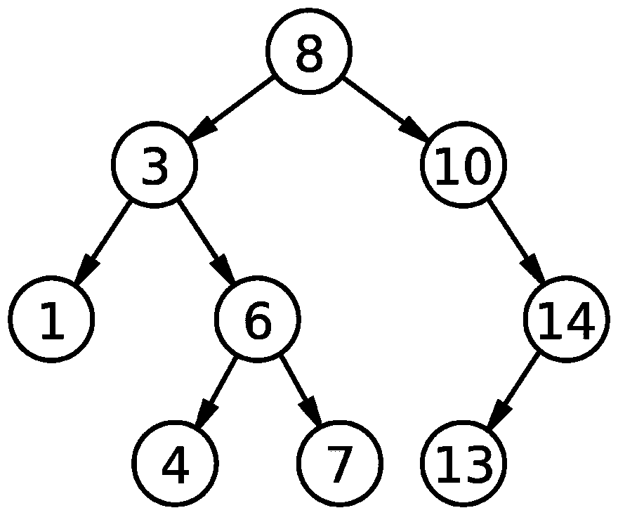

# 学习 F# —二叉查找树

> 原文：<https://dev.to/citizen428/learning-f-binary-search-tree-311j>

*最初发表于[我的博客](https://citizen428.net/blog/learning-fsharp-binary-search-tree/)。*

众所周知，我是函数式编程语言的忠实粉丝。我非常迷恋 Ocaml，一直想加入 T2 F #，但是它与 Windows 生态系统的紧密联系让我在很长一段时间内都没有加入。然而，随着[的开源发布，这种情况发生了变化。NET Core](https://github.com/dotnet/core) ，所以不到一个月前我终于开始认真学习 F#了。

我主要使用[F #的书](https://nostarch.com/fsharp)、 [F#的趣味和利润](https://fsharpforfunandprofit.com/)网站和[官方文件](https://docs.microsoft.com/en-us/dotnet/fsharp/language-reference/)作为学习材料，但是为了真正学习一门语言，一个人必须使用它。于是我报名参加了[exercisem](https://exercism.io)的 [F# track](https://exercism.io/tracks/fsharp/) ，目前已经解决了大约 20 个问题。为了展示 F#的一些特性，我将挑选一些更有趣的解决方案并写下来。

## 二分搜索法树

[二分搜索法树](https://en.wikipedia.org/wiki/Binary_search_tree) (BST)是保持其数据有序的数据结构，允许平均时间复杂度为`O(log n)`的查找、插入和删除操作。这是通过执行二分搜索法来完成的，其中从根到叶遍历树，比当前节点小的元素进入左子树，而较大的元素进入右子树:

[](https://res.cloudinary.com/practicaldev/image/fetch/s--ZYg4hG7z--/c_limit%2Cf_auto%2Cfl_progressive%2Cq_auto%2Cw_880/https://thepracticaldev.s3.amazonaws.com/i/59ah5zd9h2zbavbuy4xf.png)

### F#解

为了在我的解决方案中表示一棵树，我选择定义一个通用的[记录](https://docs.microsoft.com/en-us/dotnet/fsharp/language-reference/records)类型，它由可选的`left`和`right`子树以及一个指定当前节点值的`data`属性构成:

```
type Node<'T> = {
    left: Node<'T> option;
    data: 'T;
    right: Node<'T> option
} 
```

Enter fullscreen mode Exit fullscreen mode

Exercism 的单元测试期望 3 个函数来访问一个节点的元素，这些元素映射到记录的属性:

```
let left node = node.left

let right node = node.right

let data node = node.data 
```

Enter fullscreen mode Exit fullscreen mode

`create`函数用于从一个项目列表中构建一个 BST。单元测试没有指定空输入数组的行为，因为我是以 TDD 的方式做这个练习的，所以我选择忽略这种情况。虽然一个空的搜索树首先没有多大意义，但它不是一个特别健壮的解决方案，所以对于生产代码，我可能会把树做成一个带有`Empty`和`Node<'T>`构造函数的[区别联合](https://docs.microsoft.com/en-us/dotnet/fsharp/language-reference/discriminated-unions)。

我使用本地`insert`函数实现了`create`，该函数使用[模式匹配](https://docs.microsoft.com/en-us/dotnet/fsharp/language-reference/pattern-matching)和守卫来构建树。该功能应用于输入列表中的[`List.fold`:](https://msdn.microsoft.com/en-us/visualfsharpdocs/conceptual/list.fold%5B%27t%2C%27state%5D-function-%5Bfsharp%5D):

```
let create items =
    let rec insert x = function
    | None -> {left = None; data = x; right = None}
    | Some(t) when x <= t.data -> {t with left = Some(t.left |> insert x)}
    | Some(t) -> {t with right = Some(t.right |> insert x)}

    items
    |> List.fold (fun bst x -> Some(insert x bst)) None
    |> Option.get 
```

Enter fullscreen mode Exit fullscreen mode

单元测试的最后一个需求是提取二叉查找树的数据作为排序列表。这是通过嵌套的`sort`函数完成的，该函数递归地对节点的左右子树进行排序，直到它到达叶节点，并连接结果列表:

```
let rec sortedData node =
   let rec sort = function
       | None -> []
       | Some(node) -> (sort node.left) @ [node.data] @ (sort node.right)
   node |> Some |> sort 
```

Enter fullscreen mode Exit fullscreen mode

## 结论

F#证明了自己非常适合这个任务，因为它的表达语法、记录类型和模式匹配为这个问题提供了一个简洁和声明性的解决方案。