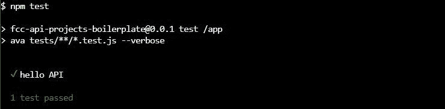
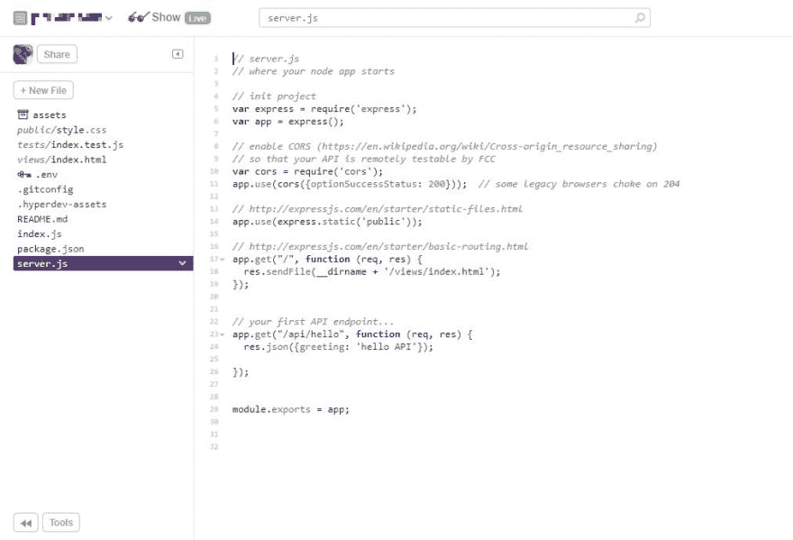
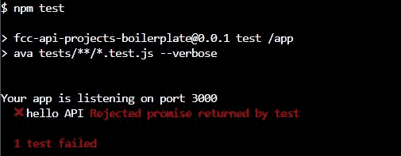
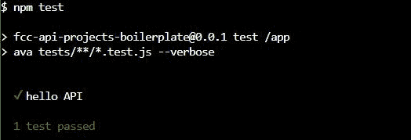

# 与 AVA、格林奇和 freeCodeCamp 一起学习 JavaScript TDD

> 原文：<https://dev.to/letmypeoplecode/learning-javascript-tdd-with-ava-glitch-and-freecodecamp-2njo>

为了提高水平和练习一些基础知识，我一直在参加 [freeCodeCamp](https://www.freecodecamp.com) 的“API 和微服务”认证项目。我已经完成了教程，现在正在构建完成认证所需的项目，使用推荐的平台来共享这些项目[故障](https://glitch.com)。

如果这还不够难的话，我决定强迫自己学习测试驱动开发(TDD ),在我编写代码的时候用 [AVA](https://github.com/avajs/ava) 。因为对我来说，巩固技能的最好方法是解释它们，所以我把它写在博客上。这将是几周内的六篇文章，从如何设置整个故障和 AVA 测试环境开始。

## **那是沙拉一词。什么是 TDD、AVA 和毛刺？**

已经知道这些了？跳过解释…

### **什么是 TDD？**

使用测试驱动开发(TDD ),你可以在编写软件之前**编写测试来验证你的软件的工作方式。然后编写代码使测试通过。**

> 测试:`myFunction()`的结果应该为真。
> 
> 代码:`const myFunction = () => { return true; }`
> 
> **测试通过！**

这听起来有点奇怪，但是计划测试为编写代码创建了一个有效的路线图。测试的集合也有助于确保代码的质量。

它已经被越来越多的公司采用，如果你想提交一些开源项目，你不仅需要提交你的代码，还要提交测试。

### **什么是 [AVA](https://github.com/avajs/ava) ？**

[AVA](https://github.com/avajs/ava) 是 [node.js](https://nodejs.org) JavaScript 应用程序的测试人员。它有一个帮助指导你如何编写测试的结构，然后它运行测试并报告结果。

<figure>[](https://res.cloudinary.com/practicaldev/image/fetch/s--uA89W7Tm--/c_limit%2Cf_auto%2Cfl_progressive%2Cq_auto%2Cw_880/http://yiddish.ninja/wp-content/uploads/2019/04/goodresult.jpg) 

<figcaption id="caption-attachment-1173"><small>这就是我们在这篇文章中的目标。</small></figcaption>

</figure>

### 什么是[小故障](https://glitch.com)？

Glitch 是一项建立和分享网站和网络应用的服务。你得到一个小型的容器化的网络服务器，一个基于网络的界面来管理和编辑文件，以及一个分享由此产生的网络好处的 URL。你可以在 [Glitch](https://glitch.com) 上构建并运行它们，而不必为 [freeCodeCamp](https://www.freecodecamp.com) 的项目设置并运行服务器。

[](https://res.cloudinary.com/practicaldev/image/fetch/s--n9GRJHOx--/c_limit%2Cf_auto%2Cfl_progressive%2Cq_auto%2Cw_880/http://yiddish.ninja/wp-content/uploads/2019/04/glitch.jpg)

## **AVA 故障入门**

这篇文章将涵盖配置和基本测试。我将在以后的文章中介绍如何创建初始的[时间戳微服务](https://learn.freecodecamp.org/apis-and-microservices/apis-and-microservices-projects/timestamp-microservice)项目。

### **第一步:在 Glitch 上克隆时间戳微服务模板**

启动 Glitch 项目。

克隆的项目将是一个工作 node.js web 应用程序，它提供一个主页，其中包含 https://[project-name]. glitch . me 中的项目详细信息，以及一个简单的 API，当您在 URL 的末尾添加/api/hello 时，它会返回一个问候。

### **第二步:将测试资源添加到`package.json`**

更新`package.json`文件，添加必要的配置更改。在`dependencies`部分添加 AVA 和超级测试，在`scripts`部分添加测试运行命令。这两个部分应该如下所示。

```
"scripts": 
  { "start": "node index.js", 
    "test": "node\_modules/.bin/ava tests/\*\*/\*.test.js --verbose"},
"dependencies": 
  { "express": "^4.12.4", 
    "cors": "^2.8.0", 
    "ava": "^1.4.1", 
    "supertest": "^4.0.2"}, 
```

Enter fullscreen mode Exit fullscreen mode

### **3:创建你的第一个测试**

为了简洁起见，我们稍微作弊一下，测试一下“hello”API。但是为了模拟这个过程，我们将首先编写测试，看着它失败，然后编写/编辑代码，直到它通过。

点击“+新文件”按钮，输入`tests/index.test.js`。这将创建你的`tests`文件夹和一个`index.test.js`文件。将以下代码添加到空文件中。

```
import test from 'ava';
const request = require('supertest');
const app = require('./../server.js');

test('hello API', async t => { 
  const response = await request(app) 
  .get('/api/hello'); 
  t.is(response.body.greeting, 'hello API');
}) 
```

Enter fullscreen mode Exit fullscreen mode

点击`Tools`按钮，打开控制台。它将在另一个标签中打开。运行`npm test`。

[](https://res.cloudinary.com/practicaldev/image/fetch/s--Jo06QgkT--/c_limit%2Cf_auto%2Cfl_progressive%2Cq_auto%2Cw_880/http://yiddish.ninja/wp-content/uploads/2019/04/test1.jpg)

测试失败，出现“测试返回的拒绝承诺”那是因为 app 需要两样东西。

### **4:编辑`server.js`**

取出`server.js`中的最后一个代码块。

```
// listen for requests :)
var listener = app.listen(process.env.PORT, function () { 
  console.log('Your app is listening on port ' + listener.address().port);
}); 
```

Enter fullscreen mode Exit fullscreen mode

用将应用程序导出为模块的代码行替换它。

```
module.exports = app; 
```

Enter fullscreen mode Exit fullscreen mode

我们需要这样做，这样我们添加的超级测试库就可以孤立地实例化应用程序，并帮助 AVA 对它进行测试，而不是对一个实时的公共应用程序进行测试。它还可以根据需要实例化一个干净的应用程序副本，而不是在测试过程中针对不断变化的应用程序状态运行测试。

### **4:添加`index.js`**

点击“+新文件”按钮，添加一个名为`index.js`的文件。添加你从`server.js`
中删除的代码

```
const app = require('./server.js');
// listen for requests :)
var listener = app.listen(process.env.PORT, function () { 
  console.log('Your app is listening on port ' + listener.address().port);
}); 
```

Enter fullscreen mode Exit fullscreen mode

这实际上是为了让应用程序为你的访问者运行，这样你就可以在浏览器中手动测试它。模块化让 SuperTest 实例化它并提供给 AVA 进行测试，但是面向公众的应用程序也需要实例化该模块。

### **5:再次测试**

返回控制台。运行`npm test`。

[](https://res.cloudinary.com/practicaldev/image/fetch/s--DYNCEIm9--/c_limit%2Cf_auto%2Cfl_progressive%2Cq_auto%2Cw_880/http://yiddish.ninja/wp-content/uploads/2019/04/test2.jps_.jpg)

现在你测试成功了。

您已经准备好使用 TDD、AVA 和 Glitch 创建您的第一个 freeCodeCamp 微服务项目了。这是我的下一篇文章。在 Twitter 上关注我，了解最新消息。