# 学习制作视频游戏

> 原文：<https://dev.to/_darrenburns/learning-to-create-video-games-504n>

当我 5 岁的时候，在一个圣诞节的早晨，我打开了我的第一台游戏机 SEGA Dreamcast，从那以后，视频游戏就成了我生活中的一个重要部分。对我来说，它们是讲故事、艺术和技术的终极结合。

当我刚开始学习编码时，开发视频游戏的过程成了我最早的努力之一。不幸的是，这是一次令人沮丧的经历，就像学画画却不知道如何握铅笔一样，我的动力很快就消失了。在那个时候，我的编程知识已经扩展到知道什么是`for`循环。经过几个星期的尝试和失败，不明白为什么几乎没有工作，我放弃了，感到泄气和失败。

一年后，我去大学学习计算机科学，这激发了我对视频游戏开发之外的编程的热情。

## 编码和创意

尽管我是一名工程师和“科学”型的人，但我总是被创造力所驱使。直到我大约 13 岁的时候，我都无法决定自己是想成为一名动画师还是平面设计师，也无法想象自己会成为一名软件工程师。像编程这样技术性的东西怎么会被认为是令人愉快的呢？

我所意识到的是，编码是一个很大程度上创造性的过程，一个可以让我同时抓住技术和艺术两方面的痒处的过程。随着编码满足了我表达创造力的需要，我从未发现自己又回到了视频游戏开发中。

几周前，我在 YouTube 上发现了塞巴斯蒂安·拉格(Sebastian Lague)精彩的“编码冒险”系列，他在流行的视频游戏引擎 [Unity](https://unity.com/) 中探索编码概念。我看的第一个[视频](https://www.youtube.com/watch?v=Cp5WWtMoeKg)让我着迷。在其中，Sebastian 使用“光线行进”算法生成了令人惊叹的 [Mandelbulb](https://en.wikipedia.org/wiki/Mandelbulb) 分形:

[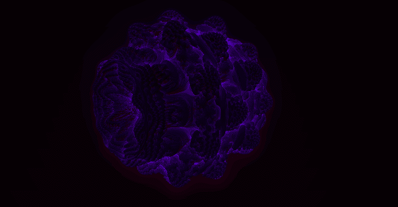](https://res.cloudinary.com/practicaldev/image/fetch/s--hCFxIdQb--/c_limit%2Cf_auto%2Cfl_progressive%2Cq_66%2Cw_880/https://thepracticaldev.s3.amazonaws.com/i/y6nl0r20mow4rcyupisj.gif)

虽然在编码中总是可以找到创造力，但我通常编写的代码的输出不会像上面的一幅艺术作品那样唤起同样的感觉，也不会唤起你在玩你最喜欢的视频游戏时获得的快乐。在我的例子中，最终结果通常是将一个值写入数据库，或者通过网络发送一些数据。

我总是会从这些事情中获得某种程度的满足，就像我第一次在我的终端窗口弹出`"Hello, World!"`的时候一样。然而，当你今天写的代码与你昨天和前天写的代码在目的上相似时，你的视野会变窄，你可能会忘记计算机可以做更多的事情。很容易忘记代码可以创造出真正美好的东西；艺术，从字面上来说。

## 制造行星

在发现 Sebastian 的系列时，我受到启发，从我停止的地方重新开始游戏开发，并向自己证明我现在有能力做一些曾经让我感到失败的事情。我下载了 Unity 游戏引擎，在看了来自同一作者的另一个教程后，我决定尝试一下程序生成行星表面。

我使用 Unity 提供的脚本 API 构建了一个球形**网格**(一个网格是由三角形连接在一起的点的集合，这些点一起形成一个三维对象)。我们可以通过提供一组三维向量(称为**顶点**)来实现这一点，这些向量代表世界上的点，一些整数表示我们希望如何使用三角形将这些点连接在一起。有了这些看似原始的工具，我们可以创造任何可以想象的三维形状。

为了生成行星的山脉，我将每个顶点的位置传递给一个**梯度噪声**函数。出于各种目的，渐变噪声已经在计算机图形中使用了多年，它看起来像这样:

[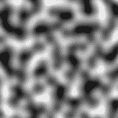](https://res.cloudinary.com/practicaldev/image/fetch/s--BlkTxfFQ--/c_limit%2Cf_auto%2Cfl_progressive%2Cq_auto%2Cw_880/https://thepracticaldev.s3.amazonaws.com/i/r64e3ro0s2l1ggt5g372.PNG)

对于上图中的每个像素，想象它越亮，像素的高度就越大。所以，我们可以把纯白的区域想象成一座山的顶点，灰色区域代表半山腰，最暗的区域代表海拔最低的地方。

现在让我们把这种噪音“包裹”在我们的球体周围，就像你用包装纸包裹篮球一样。

[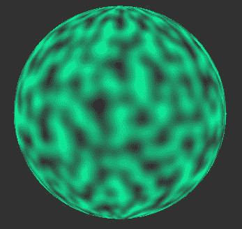](https://res.cloudinary.com/practicaldev/image/fetch/s--JLEi-8zZ--/c_limit%2Cf_auto%2Cfl_progressive%2Cq_auto%2Cw_880/https://thepracticaldev.s3.amazonaws.com/i/m9tt431lp763crwqnt0m.PNG)

如果我们把球体的亮点从圆心移开，我们会发现自己是一个“凹凸不平”的球体。我们可以自定义噪波来增加其密度(通过“缩小”噪波)，这将导致更粗糙的表面。同样，我们可以放大噪波，使球体表面看起来更平滑。

[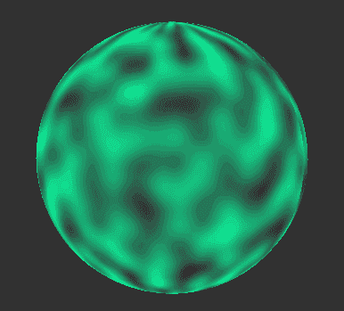](https://res.cloudinary.com/practicaldev/image/fetch/s---5MnOqOq--/c_limit%2Cf_auto%2Cfl_progressive%2Cq_66%2Cw_880/https://thepracticaldev.s3.amazonaws.com/i/f5yjtl762kivygw2l0im.gif)

此时，球体上的噪声分布是完全均匀的。我们这个“星球”的表面，很像爱丁堡，在谈到丘陵时有点过于一致。因此，为了生成更真实的行星表面，我们在几层中应用了噪波。一层将模拟海洋；另一个将塑造土地；三分之一将形成山丘；最后一层粗糙的噪音将塑造我们星球上最高的山峰。

Sebastian 在系列中解释了几个更小的附加技巧，但最终结果是一个生成器创建了相对真实的行星表面。下图显示了当我操作一些关于如何将噪波应用到表面球体的参数时的样子。

[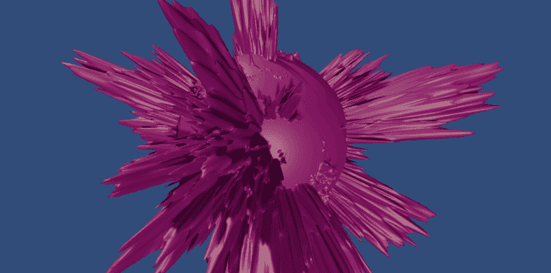](https://res.cloudinary.com/practicaldev/image/fetch/s--bf1Ii2ZQ--/c_limit%2Cf_auto%2Cfl_progressive%2Cq_66%2Cw_880/https://thepracticaldev.s3.amazonaws.com/i/zafj2ju2phf2t6aeet8m.gif)

最终，我没有完成这个系列的所有教程。矛盾的是，在达到这一点后，我的动机是如此之高，以至于我不想让 T1 当场完成这个系列。相反，我想尽可能快地探索团结的其他领域。

## 行星之舞

接下来，我将模拟行星运动。这次我想让事情变得更现实一点，所以我在 Unity asset store 上给自己找了一个空间 **skybox** 。天空盒由六个图像组成，这些图像以立方体形状放置在玩家周围，这样玩家就完全被它们包围了。在这种情况下，这意味着无论玩家看哪里，它看起来都像空间。

然后，我在 Unity 中创建了一个球体，并在上面应用了一张火星表面的图像(来自太阳系望远镜)。这张图像被称为**等矩形投影**，这意味着它是通过将火星的球形表面投影到一个平面上形成的。

[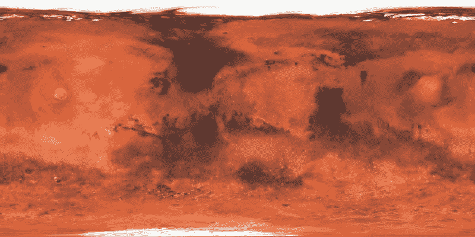](https://res.cloudinary.com/practicaldev/image/fetch/s--Q6aKPQcN--/c_limit%2Cf_auto%2Cfl_progressive%2Cq_auto%2Cw_880/https://thepracticaldev.s3.amazonaws.com/i/hxol75ga1sxnywrkhlzq.jpg)

我写了一个脚本，把它贴在行星上，以便让它根据行星的质量对周围的物体施加拉力。你知道，重力。我在场景周围放置了一些这样的“行星”,然后在它们周围添加了一个发光的效果，原因是我刚刚发现这是可能的，并且我认为它看起来很酷。

场景设置完毕后，我坐了下来，为行星舞蹈的优雅做准备。

事情是这样的...

[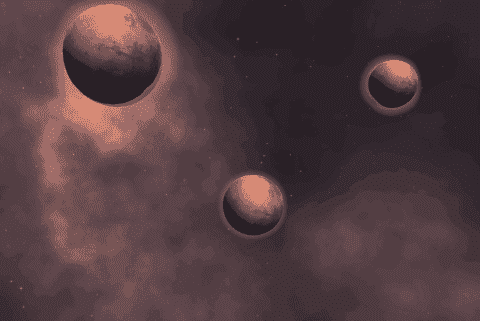](https://res.cloudinary.com/practicaldev/image/fetch/s--fKZ4biNX--/c_limit%2Cf_auto%2Cfl_progressive%2Cq_66%2Cw_880/https://thepracticaldev.s3.amazonaws.com/i/ilj8htsgvs7x0pb833xg.gif)

然后我想起了万有引力的基本定律，即当苹果从树上掉下来时，它会掉到地上。苹果没有从树上掉下来，并立即开始绕着地球转。意识到这种舞蹈过于依赖编舞的物理知识，我决定开始我的下一次冒险。

## 交互性

这两个实验都很有趣，让我有了使用 Unity 的感觉，但“游戏”也不是。没有互动，他们真的只是模拟。

尽管事实上这基本上是一个广告，说明为什么美国国家航空航天局不应该雇用我，但我很享受前一个场景的“感觉”。我决定把东西留在太空。这也意味着我不必为了获得真实感而在场景中填充资产。毕竟空间大多是空的。

我想在即时战略(RTS)游戏中加入一些机制。虽然我当时对我的游戏发展方向没有一个目标，但是实现有趣的游戏机制是一种很好的体验，不管你最终是否会使用它们。我会学习创建机制背后的概念，并找出什么可行，什么不可行。

我开始创建一个立方体来代表一艘宇宙飞船。然后我添加了点击立方体来选择它的功能。这包括学习**光线投射**，你向一个方向发射一束光线，并检查它与什么碰撞。为了实现单位选择，我必须从相机发出一条光线，通过光标位置，并检测光线是否与我的立方体相撞。然后，在立方体被选中的情况下，我做了一个立方体，这样你就可以右击它，让它在旋转到正确的方向后移动到空间中的一个点。

[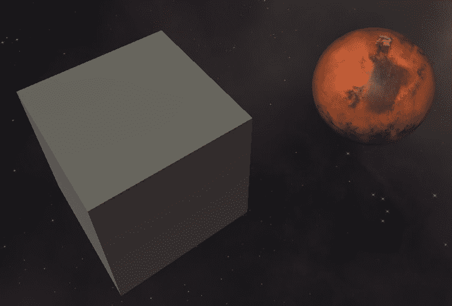](https://res.cloudinary.com/practicaldev/image/fetch/s--maJs0ftc--/c_limit%2Cf_auto%2Cfl_progressive%2Cq_auto%2Cw_880/https://thepracticaldev.s3.amazonaws.com/i/yz1jya8rwuk74br8zmaq.PNG)

在得到移动之后，我将我的立方体升级为我在 [Unity 资产商店](https://assetstore.unity.com/)上找到的[酷船资产](https://assetstore.unity.com/packages/3d/luminaris-starship-71439)，并添加了平移、缩放和旋转相机的功能。我花了将近两个小时才想出如何让我的飞船不机头朝下飞行。经过一些研究，我发现这是因为 3D 建模软件 Blender 使用了不同于 Unity 的坐标系。船模型感知到的“向前”的轴，是 Unity 的“向下”的想法。为了解决这个问题，我将船模型放在一个空的 Unity 游戏对象中，调整它使它面向前方(这次是真的)，并将所有未来的旋转应用于父对象，而不是直接应用于船。

我写了一个名为`Rotator`的小脚本，通过在每次物理更新时略微增加旋转来使行星缓慢旋转，这使场景感觉不那么静态。

```
public class Rotator : MonoBehaviour {
    void FixedUpdate() {
        transform.Rotate(Vector3.up, .01f);
    }
} 
```

## 框选择

大多数自上而下的策略游戏允许你通过拖动一个矩形来一次选择多个单位。我使用了从行星生成教程中学到的技巧，在你点击和拖动鼠标时动态构建了一个平面。我将一个**着色器**应用到生成的网格上，使它稍微有点色彩，有点透明。着色器是计算机图形学中的一个概念，它可以让你使用 GPU 对对象应用特殊效果，使它们非常有效。

着色器通常使用特殊的脚本语言编写，这看起来有点令人生畏。然而，在 Unity 中，你可以使用一种叫做 Shader Graph 的令人惊叹的可视化工具来构建着色器，这种工具使用起来非常有趣，我肯定会在未来更深入地研究它。

[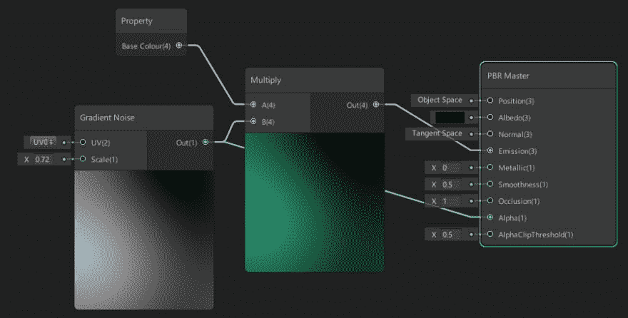](https://res.cloudinary.com/practicaldev/image/fetch/s--h6KBP4QT--/c_limit%2Cf_auto%2Cfl_progressive%2Cq_auto%2Cw_880/https://thepracticaldev.s3.amazonaws.com/i/u60zwvhk8n3x2o3kapr5.PNG)

实现这个之后，我意识到在 3 维空间中执行选择可能有点棘手，特别是如果你在屏幕上有多个单元，并且相机已经旋转了。大脑可能很难快速理解相机当前的旋转角度，也很难知道当你开始拖动时，盒子的边缘将出现的角度。

[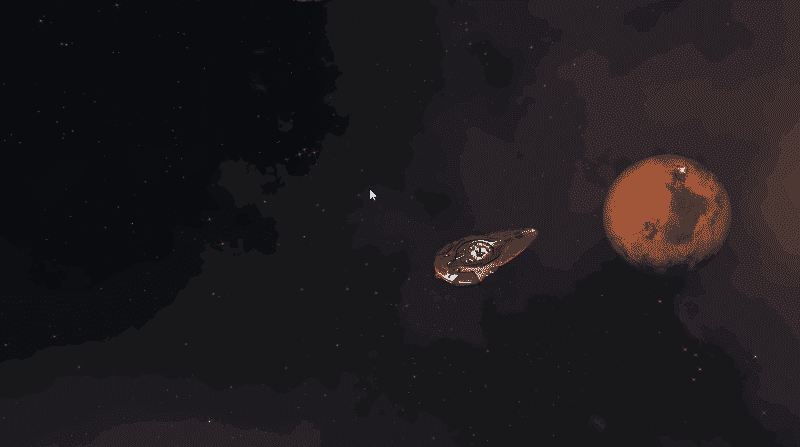](https://res.cloudinary.com/practicaldev/image/fetch/s--EHYfpIYO--/c_limit%2Cf_auto%2Cfl_progressive%2Cq_66%2Cw_880/https://thepracticaldev.s3.amazonaws.com/i/znd7qkem6n75jax5e8rm.gif)

将来，我可能会更新我的矩形选择代码，以便您在二维空间中绘制矩形，并将其投影到游戏世界的三维空间中。这就是它在《星际争霸 2》这样的游戏中的工作方式，而且它*肯定*感觉更直观。

[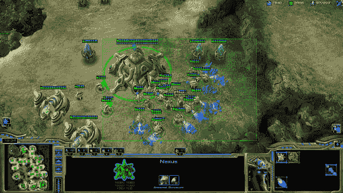](https://res.cloudinary.com/practicaldev/image/fetch/s--wAtMMjec--/c_limit%2Cf_auto%2Cfl_progressive%2Cq_auto%2Cw_880/https://thepracticaldev.s3.amazonaws.com/i/ecsfknk0fxpzf9ztqojt.png)

现在也不清楚你目前选择了哪些单位。将来我会决定如何向玩家传达这些信息。这是一个棘手的问题，尤其是许多单位同时出现在屏幕上的可能性。

## 战斗

一个有宇宙飞船的游戏*显然*要求他们有能力向对方发射一连串的导弹！我写了一个名为`BasicAttack`的脚本，并将其附加到我的飞船预制体上。这个脚本定义了诸如“我的攻击造成多大伤害”之类的东西。起初，攻击是使用光线投射进行的。一条看不见的光线从选中的船上向鼠标点击的方向射出。如果射线与另一艘船相撞，它会立即从受到伤害的船的生命值中扣除攻击船的攻击伤害。如果一艘船的生命值降到零或更低，它会立即从世界中消失。

没有任何视觉反馈，这是一个相当枯燥的体验。所以我增加了一些新的功能，让事情变得生动一些。

我在我的船**预制体**上安装了一个`LineRenderer`(用来画线，和 Unity 一起提供)组件。Unity 中的一个预置类似于编程中的一个类。它为它的实例定义了一个蓝图，可以很容易地在任何地方重用。线的起点设置为所选船只的中心，终点设置为光标的位置。如果选中一艘船，用户按下`A`，该船将进入“攻击模式”，`LineRenderer`将出现在屏幕上。我使用着色器图形创建了一个着色器，并将其应用于线条，使其随着时间的推移慢慢淡入淡出，只是为了让事情在视觉上更有趣一点。

[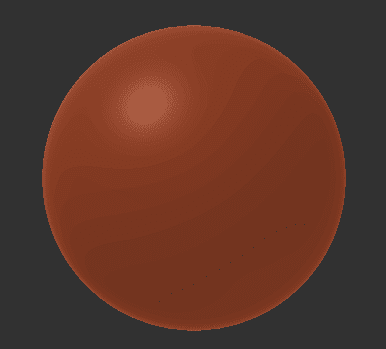](https://res.cloudinary.com/practicaldev/image/fetch/s--nsqgVd6v--/c_limit%2Cf_auto%2Cfl_progressive%2Cq_66%2Cw_880/https://thepracticaldev.s3.amazonaws.com/i/7vf2ihg4nllw99y1q0lm.gif)

然后，我更新了`BasicAttack`代码来产生一枚导弹，而不是施放一种看不见的射线。导弹只是一个胶囊，附有一个`TrailRenderer`(Unity 内置的)，这导致了一条光迹，随着导弹向目标行进。目前，导弹总是以 3 秒钟到达目标的速度飞行。3 秒后，目标受到伤害。这不是最现实的方法，但是很有效。

[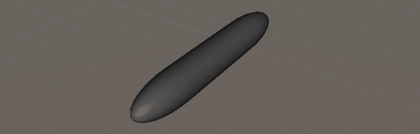](https://res.cloudinary.com/practicaldev/image/fetch/s--Bodvt0ep--/c_limit%2Cf_auto%2Cfl_progressive%2Cq_auto%2Cw_880/https://thepracticaldev.s3.amazonaws.com/i/azzr39oao3ti9d62sxc8.PNG)

为了让玩家知道目标受到了多少伤害，我(在头疼了*小时*之后)在目标上方设置了浮动伤害数字。我绝对*喜欢电子游戏中的这种效果。当一个目标受到伤害时，它受到的伤害会短暂的出现在单位上方。字体的大小也会根据受到的伤害而动态调整。*

在我的实现中，对于 1 到 50 之间的损坏数，使用标准字体大小(它导致`fontScaleFactor`为 1)。当我们开始造成超过 50 点的伤害时，用来显示伤害数字的字体大小会增加，直到最大伤害达到 300。如果一次攻击造成 300 或更多的伤害，字体大小将是标准大小的两倍。

```
var fontScaleFactor = 1 + Mathf.InverseLerp(50, 300, damage);
damageText.fontSize *= fontScaleFactor; 
```

由于一艘船可以在短时间内连续承受多个伤害，我给这些伤害数值产生的位置增加了一些随机变量。如果没有这种变化，数字完全重叠，就不可能确定这艘船受到了多少次损坏。这是我写的将随机性应用于浮动伤害数字的产卵位置的函数:

```
private Vector3 ApplyRandomOffsets(Vector3 vec, float minOffset, float maxOffset) {
    var xOff = Random.Range(minOffset, maxOffset);
    var yOff = Random.Range(minOffset, maxOffset);
    var zOff = Random.Range(minOffset, maxOffset);
    return new Vector3(vec.x + xOff, vec.y + yOff, vec.z + zOff);
} 
```

有了这些改变，事情在视觉上变得更加令人兴奋:

[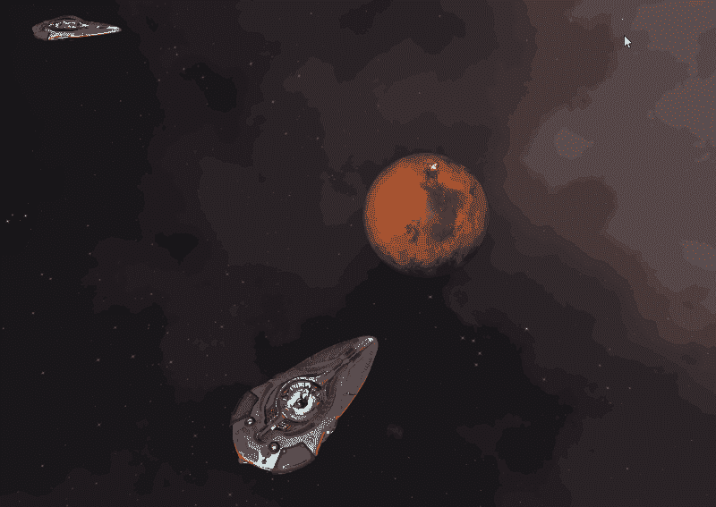](https://res.cloudinary.com/practicaldev/image/fetch/s--5RdyFEEM--/c_limit%2Cf_auto%2Cfl_progressive%2Cq_66%2Cw_880/https://thepracticaldev.s3.amazonaws.com/i/rma8fzxul63c9ypqk72o.gif)

## 爆炸

为了给玩家更多的视觉反馈，他们的攻击会造成伤害，我添加了当导弹到达目标时触发的爆炸。Unity 中的爆炸通常是通过使用 Unity 粒子系统来实现的，它可以让你创造出令人惊叹的基于物理的粒子效果。我没有尝试创建自己的纹理和粒子系统，而是使用了一些在 [Unity 粒子包](https://assetstore.unity.com/packages/essentials/tutorial-projects/unity-particle-pack-127325)中可用的粒子系统。

我最初让东西爆炸的尝试并没有真正按照计划进行。

[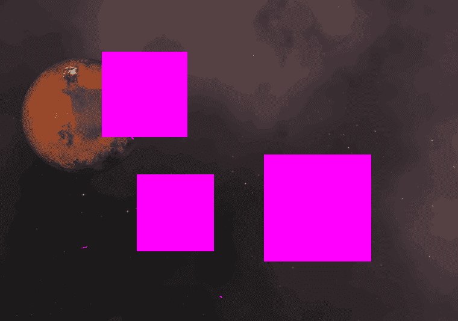](https://res.cloudinary.com/practicaldev/image/fetch/s--uzAZ6XHx--/c_limit%2Cf_auto%2Cfl_progressive%2Cq_66%2Cw_880/https://thepracticaldev.s3.amazonaws.com/i/24sk0pqwwgtpudu50tke.gif)

经过一番折腾，我升级了奇怪的粉红色盒子形状，得到了看起来有点像烟花的东西。这并不是我想要的高冲击效果，但肯定是朝着正确方向迈出的一步。

[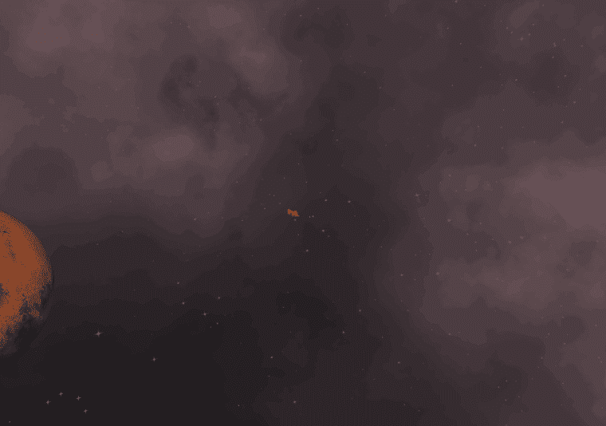](https://res.cloudinary.com/practicaldev/image/fetch/s--vhonEnUX--/c_limit%2Cf_auto%2Cfl_progressive%2Cq_66%2Cw_880/https://thepracticaldev.s3.amazonaws.com/i/g8baf26oicke7sbk922d.gif)

一点谷歌和一些更多的设置，我终于意识到我的问题的原因是我使用了 Unity 的新的轻量级渲染管道(LWRP)。爆炸使用的着色器不受支持。将它们更新到 LWRP 支持的版本后，粒子系统实际上开始看起来像一场真实的爆炸:

[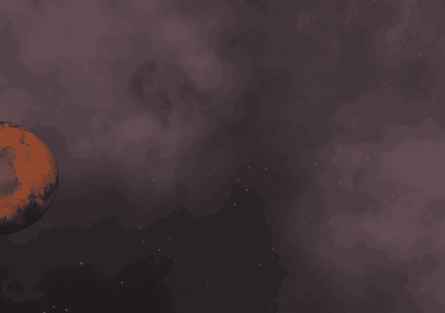](https://res.cloudinary.com/practicaldev/image/fetch/s--7RvJRJkS--/c_limit%2Cf_auto%2Cfl_progressive%2Cq_66%2Cw_880/https://thepracticaldev.s3.amazonaws.com/i/dr520cwjxsh3ato4mxbx.gif)

当导弹到达目标时，目标会产生爆炸效果。作为额外的挑战，我给了每艘船“盾牌”，这是一个额外的生命值层。如果一枚导弹击中了一艘船，它仍然有护盾，爆炸是蓝色的。当一艘船的护盾能量耗尽后，爆炸会变成橙色，以此向玩家暗示这艘船的总生命值很低。

[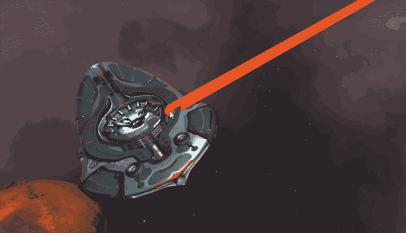](https://res.cloudinary.com/practicaldev/image/fetch/s--ncTNjq28--/c_limit%2Cf_auto%2Cfl_progressive%2Cq_66%2Cw_880/https://thepracticaldev.s3.amazonaws.com/i/poklgtpdsegptb7x6uac.gif)

关于如何提高这里的效果，我还有很多想法。随机改变导弹攻击的位置，并使爆炸效果在这些位置产生，将增加真实感。取代在导弹发射 3 秒后爆炸出现在目标船中心的硬编码，转向基于碰撞的系统将允许导弹在击中目标后立即爆炸。蓝色爆炸也不是电影或电子游戏中典型的“盾牌”效果，所以模拟“力场”效果的着色器可能会更好。

## 向前移动

还有很多东西要学，但我对过去几周的进步感到非常高兴。虽然除了“飞来飞去和攻击船只”之外，这个项目没有真正的游戏性，但这是一次不可思议的学习经历，仍然让我觉得我完成了学习创建视频游戏的目标。

展望未来，我想学习如何将 UI 添加到上面的项目中，也许还会实现一些有趣的游戏系统。我有一堆关于游戏如何运作的笔记，还有一些我想尝试的想法。我也可能会转移到其他项目上，比如实现我从其他游戏中体验到的有趣的游戏机制，比如来自*门户*的门户之枪，或者来自*战神*的利维坦之斧。

不管怎样，学习 Unity 的基础知识为我打开了一个全新的创造力世界。现在有太多的东西我想要探索和学习创造，我现在对自己有信心，我将能够成功地学习它们！

在未来，我可能会创建更多这样的开发/学习日志，讨论我已经建立的东西，以及我在这个过程中学到了什么。如果你感兴趣，请在 [DEV](https://dev.to/_darrenburns) 、 [Twitter](https://twitter.com/_darrenburns) 上关注我，并在【darrenburns.net】的[查看我的个人博客](https://darrenburns.net)。