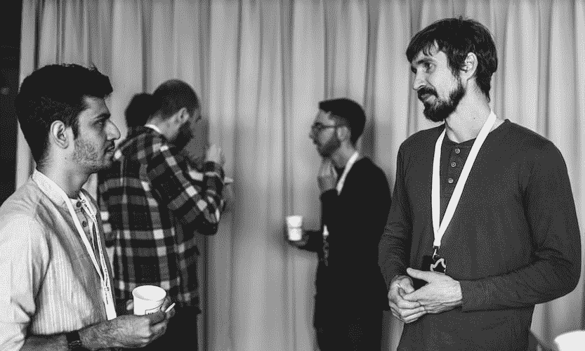
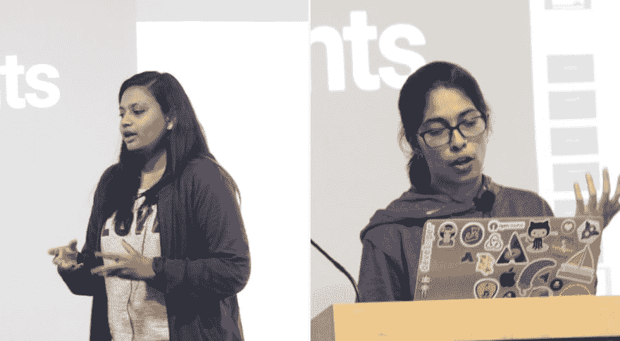
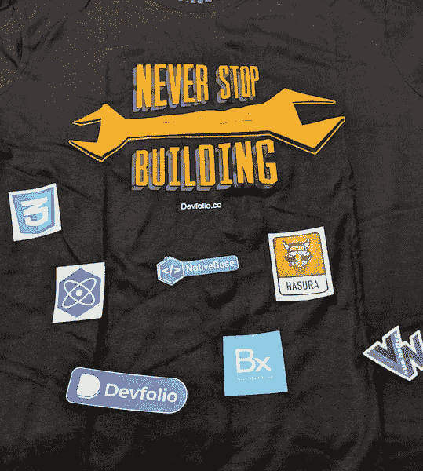
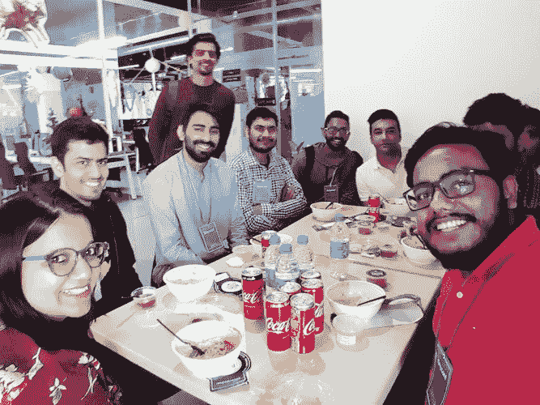
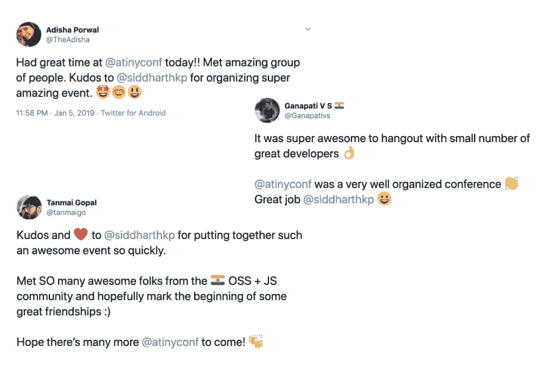

# 从启动小型会议中获得的经验教训

> 原文：<https://dev.to/siddharthkp/lessons-learned-from-starting-a-small-conference-o61>

我为我的时事通讯写了这篇文章，[在这里注册](https://sid.studio/newsletter)每周都会收到这样的邮件。

我正在为一个大项目做准备。这绝对超出了我的专业范围。我的心很兴奋，但我的大脑告诉我，我甚至没有理由尝试这样做。我想告诉你(和我自己)一个我最后一次认为我应该“呆在我的车道上”的故事。

去年我参加了一系列会议，在大多数会议中我都过得很愉快。会议是从谈话中获得灵感、会见老朋友和结交新朋友的好地方。

但是，事实是，我只看了一半的演讲。坐着听一个接一个的演讲很快就会变得无聊。你可以随时在 youtube 上以 1.5 倍观看剩下的演讲。

相反，我喜欢花时间和不常见面的人聊天。

 
<small>我不知道为什么我们看起来如此悲伤，那是一次愉快的谈话！</small>

作为一个内向的人，我发现走向一个陌生人并介绍自己真的很难。但是，当我演讲的时候，这是一个邀请，邀请其他人在我已经喜欢的话题之后来和我交谈，这使它变得容易得多😇

大多数会议的日程安排得满满的，每几次会谈后都有短暂的休息时间。这迫使你做出选择——你要么和某人长谈，要么缩短谈话时间，参加下一次谈话。我通常会错过我想参加的讲座。

我意识到，通过对我真正关心的话题进行更深入的对话，并从中获得灵感，我从会议中获得了最大的价值。这可以是在演讲结束后和演讲者或者其他与会者。

这是我对会议有偏见的经验，我也知道有些人喜欢参加所有的演讲，像海绵一样吸收一切，然后综合它们。对你有用的就行！

我想参加一个专注于我喜欢的部分的会议——更长的有意义的对话。像我这样的人会喜欢的活动。

找不到。根据我帮助第一反应堆的经验，我知道组织一次会议不是一件小事。

它需要赞助商、门票销售、演讲者、市场营销、礼堂、餐饮、视听设备等等。直到我参加了另一个会议，我才真正考虑了几个月。

> 去他的，我要去做-我

我总是从网站开始我所有的项目，因为它迫使我用几句话解释清楚这个想法。

我知道我想主持什么样的会议。

> 本次会议旨在让每个人都参与到讨论中，进行简短的谈话，并有足够的时间进行讨论和后续对话。

创建一个涉及 400 人的团队真的很难。小团体、有意义的谈话似乎更像是我喜欢的经历。

我真的在为自己创建一个会议，并希望我能找到一些其他人，他们会享受同样的体验。

会议需要发言人，对吗？可以作为对话起点的东西。

我写下了“8 位演讲者，25 位与会者”。称之为 [tinyconf](https://tinyconf.in) 。

你不需要一个 25 人的礼堂，我联系了我在[极客蚂蚁](https://geekyants.com)的朋友，他们的办公地点，他们有一个可以容纳所有人的聚会空间。(对 Maheshwari 的所有帮助大声喊出来！)

为了创造一个可以进行有意义对话的空间，我们取消了演讲后的问答环节。问答总是太匆忙，无法得到一个健康的答案。

取而代之的是，我们在每两次谈话(整整 20 分钟)和一个小时的午餐后休息 30 分钟。

谈到午餐，你不需要餐饮来养活一小群人，我们只是使用其中一个食品交付应用程序订购午餐。

下一步，说服 8 个人来演讲。如果我想创造完美的会议体验，我希望有一组多样化的演讲者。我联系了几个朋友寻求帮助。

我们没有国际演讲者，但我们有一个性别平衡的阵容，既有初次演讲的人，也有经验丰富的演讲者。

##### 好吧，我们算是做到了。[帕薇思拉](https://twitter.com/PKodmad)已经从澳洲来到这里。

我在网站上添加了演讲者，并在开放销售的前一天在 twitter 上宣布了会议的消息，以制造一些宣传。第二天早鸟票 20 分钟就卖光了！这证明了有像我一样的人真的想要类似的经历。

因为这是一个非常小的活动，门票不需要定价很高。我们甚至不需要找赞助商！无论如何，Hashnode 提出要赞助，我们可以增加一些多样性的门票。

我仍然感到很不自信。这不像人们习惯的其他会议那样花哨。他们会很失望，会叫我出来骗他们！形式太不一样了，人们会在谈话之间感到厌烦，等等。

但是，现在临阵退缩已经太晚了，人们已经买了票！

我很惊讶事情会变得这么好。

我们讨论了状态管理、React Native、Animation、GraphQL，甚至还讨论了从 Vue.js 中窃取创意😋。有很多事情要谈！休息一点也不觉得长，每个人都很兴奋，对细节都很紧张，这太棒了。

我们没有任何会议纪念品，我从我的[贴纸项目](http://stackstickers.shop)带了一些贴纸，T2·纳什(一位演讲者)带了 t 恤衫🙌

食物还不错，我们只吃素食，因为我忘了提前询问喜好。🤷

总的来说，感觉每个人都玩得很开心。

我和一些人谈过反馈，他们并不太难过。推特证实了这种感觉。

这里的教训是什么？

在我们的脑海中，我们有时会创造出一幅完美到似乎无法实现的画面。但是如果你把恐惧推到一边 5 分钟，你就可以把它分解，看看哪些部分是你真正需要的，哪些部分是为了满足你的恐惧而存在的。

我刚从 React Amsterdam 回来，那里有 1200 多人参加！要举办这么大的活动并卖出尽可能多的门票，你确实需要国际演讲者和赞助商带他们去那里，还需要一个非常大的场地。这是一个伟大的会议，但这不是唯一的方式。tinyconfs 也有足够的空间。

就我而言，我不需要一个礼堂或赞助商来举办一场好的会议，我需要一个约会和一些兴奋的人。其他的都是肉汁。最难的部分是开始，在那之后，其他的事情就水到渠成了。

下次你觉得你不行的时候，[看看这个视频](https://www.youtube.com/watch?v=jG7dSXcfVqE)。

希望这对你的旅途有帮助

（同 suddenionosphericdisturbance）电离层的突然骚扰

* * *

