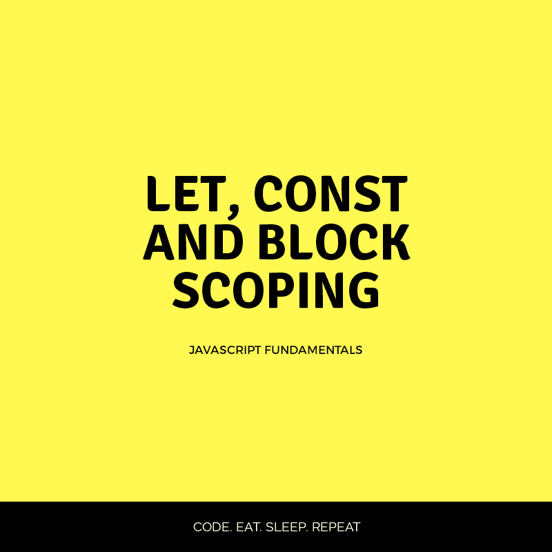

# let，const & Block 作用域

> 原文：<https://dev.to/runosaduwa/let-const--block-scoping-5ca4>

[](https://res.cloudinary.com/practicaldev/image/fetch/s--9YMbw3bp--/c_limit%2Cf_auto%2Cfl_progressive%2Cq_auto%2Cw_880/https://thepracticaldev.s3.amazonaws.com/i/y9zb6hktm7ndk6oi920x.png)

# 什么是块范围？！

很简单，这意味着在一对`{}`之间创建了一个新的作用域。与`var keyword`不同，用`let`和`const`声明的变量只能存在于包围它们的最里面的块中。

在下面的例子中，当代码被执行时，你认为什么会被打印到控制台。

```
 let name = 'Runo';
    {
     let name = 'Tega';
    }
   console.log(name) 
```

值`Runo`被打印到控制台，因为第二个变量`name`在块外不可见，它在块外根本不存在。

## 相似性

在这一节中，我们将看看不同用例中的关键字`let`和`const`之间的相似之处:

### 块作用域

我们知道`var keyword`被绑定到`function scope`，而`let`和`const`是
`block scoped`，这意味着如果你有一组花括号`{}`，你就有一个`block scope`。

### 每个作用域一个声明

这意味着`let`和`const`只能在一个特定变量的作用域内声明一次，让我们看一个例子来加深理解:

```
 let name = "Runo";
    let name = "Tega";
    console.log(name); //error 
```

同样适用于`const`

```
 const name = "Runo";
   const name = "Tega";
   console.log(name); //error 
```

**注意:**`var keyword`的作用不同，它允许一个变量被声明两次，然后取最近一次声明的值，参见下面的代码片段:

```
 var name = "Runo";
   var name = "Tega";
   console.log(name) // Tega 
```

## Let & const:差异

在这一节中，我们将看看`let`和`const`之间的区别以及何时使用它们。

### 变量初始化

`const`变量**必须**用一个值初始化，但是`let`变量并不总是需要初始化变量。

```
 const a; //Syntax error

  let a; 
```

### 变量再分配

`let`变量可以被重新分配给另一个值，而`const`变量则不能。请看下面:

```
 let name = "Runo";
       name = "Tega";
       console.log(name) // Tega 
```

`const`变量**不能被**重新分配，见下文:

```
 const pi = 3.142;
            pi = 3.14; //uncaught typeError 
```

`const`应该用来保存在整个程序中值保持不变的变量。它可以用来创建保存 DOM 引用的变量。

# 总结

`const and let`关键字支持块作用域(词法绑定),`const`关键字用于声明具有常量值的变量，而`let`关键字用于声明其值在编程过程中可以改变的变量。`let`关键字是传统 ES5 `var`关键字的一个很好的替代品。