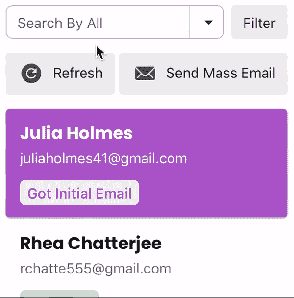
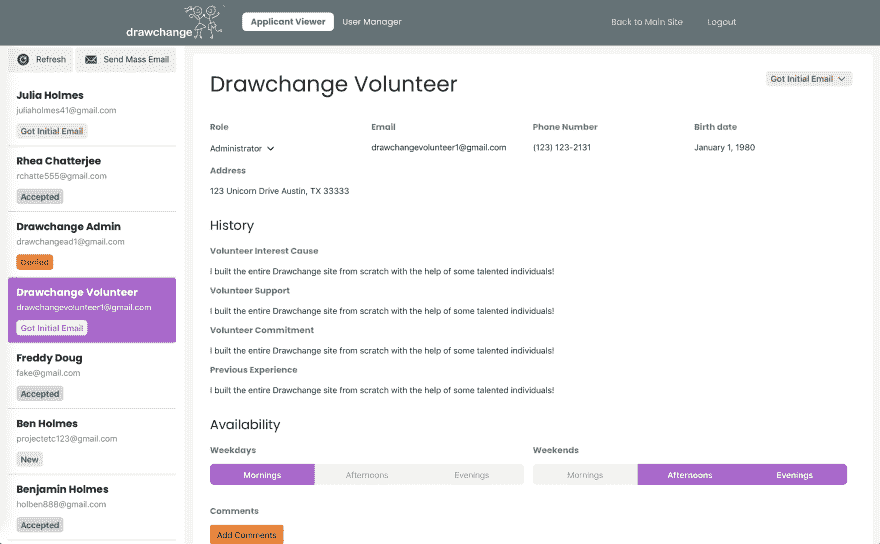

# 让 CSS 框架赋予你力量，而不是控制你

> 原文：<https://dev.to/bholmesdev/let-css-frameworks-empower-you-not-control-you-3hm0>

许多处理 CSS 框架问题的文章要么争论[它们是否应该在项目中使用](https://dev.to/teamxenox/do-we-really-need-a-css-framework-4ma6)，要么深入挖掘每个潜在选项的陷阱。从我的经验来看，有更多的细微差别。CSS 框架有一个明确的地方来处理所有变得难以维护的庞大 CSS 逻辑，比如可访问性问题、模态/弹出窗口可见性、桌面与移动导航条，等等。

但是，对于什么应该是框架注入的，什么应该是定制的，你在哪里划线呢？更重要的是，你如何停止被框架控制的感觉，以至于你做的任何东西都没有那种特别的感觉？

## 我的哲学

我最近在我的大学乔治亚理工学院加入一个项目团队时遇到了这个问题。🐝).我接手了一个进行了一个学期的项目，它需要一些强劲的动力才能到达终点，但是有一个小问题:这个网站完全陷入了 Bootstrap。

我个人喜欢为新项目开发小型设计系统，所以一开始切换到 CSS 框架感觉有点麻烦。然而，我发现它有一些明显的用处:比如说，现在可以更容易地包含背景渐变的弹出模式，或者使用得体的按钮和下拉框，而不用担心 tab 键的焦点。有了这个，我发现调和我的定制万能世界和我团队的乐高积木方法的最好方法是**把框架当作一个工具。**

CSS 框架不应该是元素外观和感觉背后的驱动力，也不应该控制网站在不同屏幕尺寸下的灵活性。相反，当定制解决方案不再有意义时，它们应该是一个抓住那些小零碎的地方。我理解，当一些人需要在昨天之前完成主页时，这种哲学很难被证明是正确的；尽管如此，我认为只要稍微调整一下自定义的终止点和框架实用程序的开始点，就可以在任何级别上工作。至此，以下是我想详细阐述的要点。

## 不要依赖千篇一律的布局。

这是我见过的一个相当大的问题，因为框架布局样式的限制使得相当简单的布局变得过于复杂。尽管最近像语义 UI 这样的努力在增加灵活性方面做得更好，但仍然有一些严重的粗糙边缘会使编写标记花费不必要的时间。

我最近看到一个这样的例子，当时我的一个队友正在为我们的应用程序开发一个非常简单的屏幕:申请人信息视图。这只是一个标题和段落的列表，用来描述某人的姓名、电子邮件、地址、个人简历等等。然而，Bootstrap 的诅咒导致文档变成了...这个。

```
<Container>
  <Row>
    <Col>
      <Heading>{`${applicant.bio.first_name} ${applicant.bio.last_name}`}</Heading>
    </Col>
  </Row>
  <Row>
    <Col>
      <h5>
        <Label for="email">Email</Label>
      </h5>
      <p className="content">{applicant.bio.email}</p>
    </Col>
    <Col>
      <h5>
        <Label for="phoneNumber">Phone Number</Label>
      </h5>
      <p className="content">{applicant.bio.phone_number}</p>
    </Col>
    <Col>
      <h5>
        <Label for="birthDate">Birth Date</Label>
      </h5>
      <p className="content">{applicant.bio.date_of_birth}</p>
    </Col>
  </Row>
... a lot more row / columns 
```

Enter fullscreen mode Exit fullscreen mode

这就是我所说的“电子表格地狱”，页面上的所有东西看起来都像是定义网站的大表格中的一行或一列。幸运的是，这是使用流行的组件框架 React，所以我可以省去你在每个标签上更多的麻烦😉

是的，从头开始制作容器可能很困难。但是一旦你开始更频繁地使用 [Flexbox](https://medium.freecodecamp.org/an-animated-guide-to-flexbox-d280cf6afc35) 或 [CSS grid](https://cssgridgarden.com) ，让你的 HTML 块出现在你想要的地方会开始感觉直接写 CSS 要快得多。

总之，为了减少开销并使布局工作良好，在让框架为您做之前，尝试一些定制样式。

## 如果感觉合适，调整边框半径

CSS 框架的另一个问题是它们如何鼓励“橱窗购物”，即你开始围绕默认组件设计你的网站。这对于快速启动和运行是有效的，但是我相信你已经访问了无数的网站，感觉有点过了...自举-y。

这是一个更困难的障碍，可能是特定于框架的。大多数都提供了颜色和字体覆盖的主题选项，但除此之外几乎没有。因此，我发现开始挑选网站的哪些组件可以有更独特的感觉，哪些可以留在框架中是有帮助的。这是一个相当随意的选择，我认为最好留给你的设计偏好和你可以用你的 CSS 技能构建的东西。然而，改变一些小的东西，比如添加一个纹理背景或者一个带有戏剧性阴影的号召按钮，可以让一个网站感觉像你自己的一样。

这里有一个来自我们自己网站的简单例子。我们刚刚为申请人查看器添加了内容搜索功能，连接了所有的前端和后端逻辑，让它按照我们想要的方式工作。然而，在提交给我们的客户时，我们发现了一个问题:不清楚如何改变你正在搜索的内容。这是因为我们为下拉图标使用了默认的引导按钮，所以不清楚它是如何与搜索框相关联的。因此，我们开发了一些定制的 CSS 来改变按钮的背景颜色，并把它推到更靠近输入框的位置，完成统一的边框半径。最终的结果感觉干净多了！

[](https://res.cloudinary.com/practicaldev/image/fetch/s--Z02TlD_p--/c_limit%2Cf_auto%2Cfl_progressive%2Cq_66%2Cw_880/https://thepracticaldev.s3.amazonaws.com/i/w5cu0izo08fgnf4jmumn.gif)

## 不要让框架决定你的功能

这是最重要的一点，因为一个 CSS 框架很少会涵盖你网站上所有可能的元素。

我们的团队在构建管理员仪表板时很早就遇到了这个问题。简而言之，我们设计了一个申请人查看器，管理员可以在志愿申请之间快速切换，以查看申请人信息并更改他们的批准状态。经过一番讨论，我们认为类似于电子邮件面板的东西可能效果最好，左边是申请人及其状态的概述，右边是每个完整申请的空间。

我们当然可以浏览 bootstrap 组件的海洋来寻找灵感。然而，这可能会将我们引向一些子可选的下拉菜单或标签视图，它们并不太符合要求。这又回到了我的观点，框架实际上是一种实用工具；如果他们帮不了你，就不要去找他们！

[](https://res.cloudinary.com/practicaldev/image/fetch/s--gKb4swjT--/c_limit%2Cf_auto%2Cfl_progressive%2Cq_auto%2Cw_880/https://thepracticaldev.s3.amazonaws.com/i/gxb9hn7cxyuz980muvqv.png)

*这是我们最终的管理员控制面板，包含迷人的重复虚拟数据！*

## 总而言之

建立网站很难。这不应该让任何人感到惊讶。很容易把 CSS 框架看作是一个包罗万象的东西，可以从零开始构建一个网站，不需要任何经验，但是它们都有自己的缺陷和局限性，会影响网站的质量。当在一个新的页面上工作时，我想说只要考虑以下几点:

1.  你想让这个做什么？
2.  什么导航，布局，按钮等。最能帮助你做到这一点。
3.  这和你正在使用的 CSS 框架有什么重叠吗？
4.  如果是这样，样式是否最适合您的需求，或者是否可以使用🌶调包？

## 学点小东西？

很高兴听到。如果你错过了，我发布了一个[我的“网络魔法”时事通讯](https://tinyletter.com/bholmesdev)来探索更多像这样的知识金块！

这个东西解决了 web 开发的[【首要原则】](https://www.swyx.io/first-principles-approach/)。换句话说，是什么让我们所有的 web 项目运转起来的所有 janky 浏览器 API、弯曲的 CSS 规则和半可访问的 HTML？如果你正在寻找超越框架的*，这是给你亲爱的网络巫师的🔮*

 *[立即在此订阅](https://tinyletter.com/bholmesdev)。我保证永远教，永远不会垃圾邮件❤️*