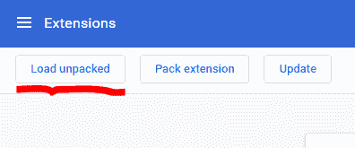
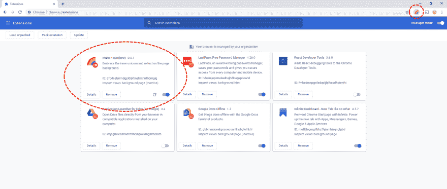
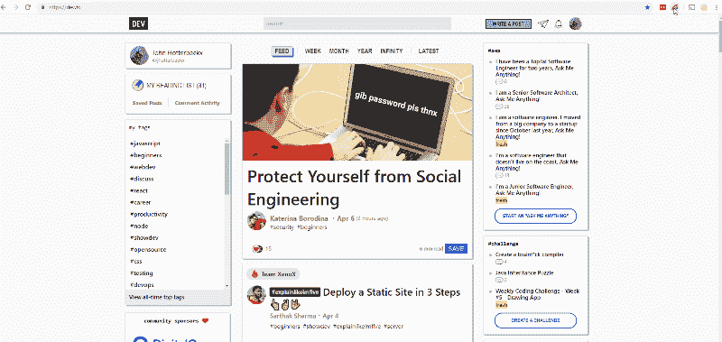
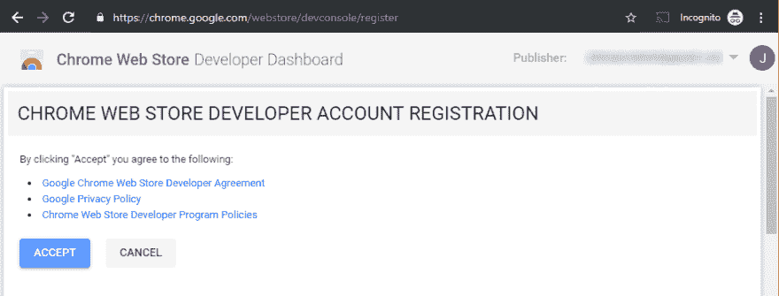
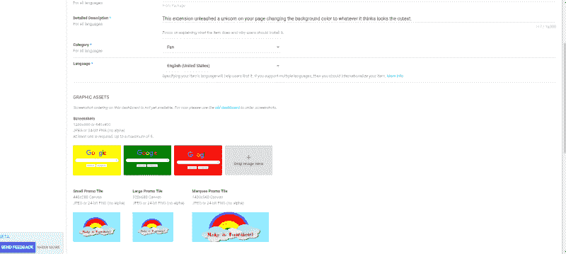
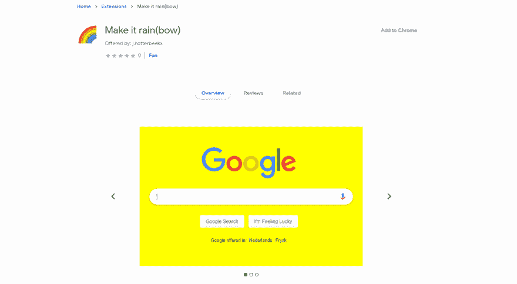

# 让我们建立一个 Chrome 扩展！

> 原文：<https://dev.to/jhotterbeekx/let-s-build-a-chrome-extension-3n3k>

最近我创建了我的第一个 chrome 扩展。它叫做 [Catify](https://chrome.google.com/webstore/detail/ihjgbjdkgnploojjhjepdaigkoigianp/publish-accepted?authuser=0&hl=en-US) ，它用一只猫的图像替换你页面上的每一张图像。现在每个猫崇拜者在向他或她的猫神祈祷时可以得到更多的支持。这是我第一次尝试 Chrome 扩展，这是一次有趣的旅程。你也想创建你自己的 Chrome 扩展吗？太棒了，我来告诉你怎么做。让我们一起建造吧，所以穿上你的霍比特人的脚，大声喊着“我要去冒险了！”。别担心，你会在第二顿早餐前做完的。

## 什么是 Chrome 扩展

尽管 Chrome 本身就是一个很棒的浏览器，但你可以把它做得更好。通过添加扩展。要查看哪些扩展可用，你可以去 Chrome 网上商店。只要去看看所有可用的惊人的扩展。现在想象一下你自己在商店里的延伸。让我们实现它吧。

## 我们在建造什么？

虽然您可能已经有了几十个要构建的伟大扩展的想法，但是我们应该先看看基础。因此，对于我们的第一个扩展，我们将从谷歌自己的基本例子之一，页面更红，我们增加了一点情趣。我们将创建一个扩展，每当你按下扩展图标时，它将页面的背景颜色变成随机颜色。

## 入门，创建清单

确保你设置了你的源码控制，并把你最喜欢的编辑器指向正确的位置。我们首先创建一个清单，这个文件告诉 Chrome 它需要知道的关于你的扩展的一切。比如名称、图标，还有它需要的权限和它的代码在哪里。让我们创建一个，创建一个名为`manifest.json`的新文件，并用下面的内容填充它:

```
{  "name":  "Make it rain(bow)",  "description":  "Embrace the inner unicorn and reflect on the page background.",  "version":  "0.0.1",  "manifest_version":  2  } 
```

那么，我们在这里看到了什么？首先是`name`。这就是扩展在商店中的显示方式，在扩展概述中，除非特别说明，否则当你将图标悬停在浏览器中时，你会看到什么。然后就是`description`，这个就跟标题一样，商店里显示的一个描述和扩展概述。接下来是你分机的`version`。您应该在您的扩展上使用语义版本控制，并在每次更新您的扩展时增加语义版本控制。最后我们看到`manifest_version`，这告诉 Chrome 这个文件是在清单版本 2 中编写的。如果你想在版本 18 之前支持 Chrome，你应该使用清单版本 1，但是你会失去一些新的功能。现在基础已经就绪，我们可以慢慢地添加更多的东西。

## 悬停图标时改变标题

默认情况下，它显示扩展名，但不必相同。让我们改变它！将以下内容添加到您的`manifest.json`的根目录中。

```
"browser_action":  {  "default_title":  "Unleash the unicorn dust!"  }, 
```

现在，当用户悬停图标时，它会显示文本`Unleash the unicorn dust!`。

## 权限和脚本

在我们为扩展构建实际代码之前，我们需要向清单中添加两件事情。首先，我们需要定义它需要拥有的权限。在这种情况下，我们只需要一个权限，即访问当前选项卡。我们来定义一下这个。将以下内容添加到您的`manifest.json`的根目录中。

```
"permissions":  [  "activeTab"  ], 
```

接下来，我们需要运行一些脚本来执行背景的实际变化。我们将在后台脚本中执行此操作，我们也需要在`manifest.json`中定义它。把这个加到根目录。

```
"background":  {  "scripts":  ["background.js"],  "persistent":  false  }, 
```

所以我们将在一个名为`background.js`的文件中定义我们的逻辑。其次，它将不会是持久性的，只有当扩展使用 chrome.webRequest API 来阻止或修改网络请求时，您才应该使它持久。是时候构建实际的逻辑了！

## 改变页面背景颜色

好了，我们告诉 Chrome，逻辑放在`background.js`中，所以让我们制作这个文件并构建逻辑。

```
chrome.browserAction.onClicked.addListener(function(tab) {
  const colors = ['red', 'orange', 'yellow', 'green', 'blue', 'violet'];

  const colorPicker = () => {
    const randomIndex = Math.floor(Math.random() * colors.length);
    return colors[randomIndex];
  }

  chrome.tabs.executeScript({
    code: 'document.body.style.backgroundColor="' + colorPicker() + '"',
  });
});
}); 
```

让我们简短地看一下代码。第一行告诉我们，我们向 browserAction 的 onClick 事件添加了一个侦听器。什么，什么，什么？！？browserAction 是您在 chrome 中添加扩展时看到的按钮，onClick 是您单击该按钮时发生的事件，添加侦听器意味着当执行该单击操作时触发该事件。所以这个方法是在你点击 chrome 里面的按钮的时候执行的。

代码本身并不存在。我们有一个颜色列表，一个从列表中选择随机颜色的方法和一个改变背景颜色的脚本执行。我们通过在浏览器选项卡中执行一段 javascript 来实现这一点，这段 JavaScript 在实际页面中执行这个操作。

## 添加图标

在我们尝试我们的扩展之前，我们会给它一些好看的东西。我们将为该扩展定义显示在浏览器顶部的图标。首先创建您想要的任何 128x128 的图像。现在，您需要将该图像保存为几种格式:

*   128x128，用于 chrome 商店
*   48x48，在安装过程中使用
*   windows 常用的 32x32
*   16x16，在 chrome 中用作显示在屏幕顶部的图标。

为了添加这些图像，我们在`manifest.json`中修改了以下内容。将此添加到`browser_action`部分:

```
"default_icon":  "icon16.png" 
```

我们只需要在这里指定 16x16 的图像，因为这个图标在任何设备上都是 16x16 的。并把这一块加到根:

```
"icons":  {  "16":  "icon16.png",  "32":  "icon32.png",  "48":  "icon48.png",  "128":  "icon128.png"  }, 
```

这些图标可以在您的应用程序中使用，并且具有所有可用的所需大小。

## 让我们来试试吧！

你兴奋吗？你应该担心，因为我们将在自己的浏览器中测试我们的扩展！点击菜单按钮，选择**更多工具** > **扩展**，打开你的 chrome，进入你的扩展。您应该做的第一件事是启用开发人员模式。你可以在右上角找到这个。启用此功能。

[](https://res.cloudinary.com/practicaldev/image/fetch/s--2qWZ6hH1--/c_limit%2Cf_auto%2Cfl_progressive%2Cq_auto%2Cw_880/https://thepracticaldev.s3.amazonaws.com/i/nl1wvb2dngjj9z4jg0ds.PNG)

现在，您应该看到页面的左上角出现了三个按钮。允许您加载未打包的扩展、打包扩展或强制更新。单击第一个按钮，加载一个解压缩的扩展。

[](https://res.cloudinary.com/practicaldev/image/fetch/s--BQ5f0PHH--/c_limit%2Cf_auto%2Cfl_progressive%2Cq_auto%2Cw_880/https://thepracticaldev.s3.amazonaws.com/i/aj62n8qn3x1ei5by7smo.PNG)

现在浏览到您创建扩展的文件夹，并按下`Select folder`。你的分机现在就要安装了，多么令人兴奋啊！安装完成后，你应该会在你的扩展页面和浏览器顶部看到它。

[](https://res.cloudinary.com/practicaldev/image/fetch/s---O_5R4k1--/c_limit%2Cf_auto%2Cfl_progressive%2Cq_auto%2Cw_880/https://thepracticaldev.s3.amazonaws.com/i/v6ve5y61bxfxvggwaysb.png)

让我们试试吧！打开一个新标签，转到 dev.to 并按下彩虹图标。然后再按一次...再一次...再一次...品尝彩虹！

[](https://res.cloudinary.com/practicaldev/image/fetch/s--MihElBZk--/c_limit%2Cf_auto%2Cfl_progressive%2Cq_66%2Cw_880/https://thepracticaldev.s3.amazonaws.com/i/bn3siwfoq1er8aurglab.gif)

有用！

## 发布您的扩展

只剩下一件事要做了，那就是发布你惊人的`Make it rain(bow)`扩展。让我们走一遍这些步骤。

*   创建一个 zip 文件，其中包含您创建的所有文件。所以`manifest.json`、`background.js`和所有的图标都应该在那里。
*   前往[https://chrome.google.com/webstore/devconsole/](https://chrome.google.com/webstore/devconsole/)，用您的谷歌账户登录。

[](https://res.cloudinary.com/practicaldev/image/fetch/s--efsZY0vp--/c_limit%2Cf_auto%2Cfl_progressive%2Cq_auto%2Cw_880/https://thepracticaldev.s3.amazonaws.com/i/dsupsfongaex116sjbe8.png)

接受许可后，您可以继续扩展。

*   按下右上角的`NEW ITEM`按钮，这将打开一个对话框，您可以在其中选择。您在步骤 1 中创建的 zip 文件。

*   上传后，将打开一个表单，需要一些详细信息，然后您才能使用您的扩展。您至少需要填写:

    *   标题
    *   摘要
    *   详细描述
    *   种类
    *   语言
    *   一张截图，让我们填写这些。

[](https://res.cloudinary.com/practicaldev/image/fetch/s--m9_BWYXG--/c_limit%2Cf_auto%2Cfl_progressive%2Cq_auto%2Cw_880/https://thepracticaldev.s3.amazonaws.com/i/74m1w9azico1jbs1twx3.png)

*   点击“保存草稿”,如果所有内容都填写正确，您现在应该可以点击“发布项目”了。点击它，现在只有一个确认等待。当你寻找你内心的独角兽时，你感到你的胃在咕咕叫着要第二份早餐，所以你迅速按下`PUBLISH`键，你的冒险就完成了。你刚刚完成了第一次延期！

[](https://res.cloudinary.com/practicaldev/image/fetch/s--yl04rWDS--/c_limit%2Cf_auto%2Cfl_progressive%2Cq_auto%2Cw_880/https://thepracticaldev.s3.amazonaws.com/i/0f4kh3ns4e5kjjybjads.png)

## 整理完毕

谢谢你和我一起冒险，我希望你能从中学到一些东西。如你所见，创建一个 Chrome 扩展并不难。为一个还不可用的扩展提出一个好主意，那是一个完全不同的故事。我只能祝你好运，并希望很快看到你的一个扩展！

## 资源

虽然在互联网上可以找到很多关于扩展的东西，但是我主要使用 google 文档，因为它非常清晰和完整。这里也有很多例子:

[https://developer.chrome.com/extensions](https://developer.chrome.com/extensions)

并且可以找到这里使用的示例代码:
[https://github . com/JHotterbeekx/make-it-rainbow-chrome-extension](https://github.com/JHotterbeekx/make-it-rainbow-chrome-extension)