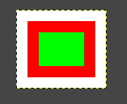
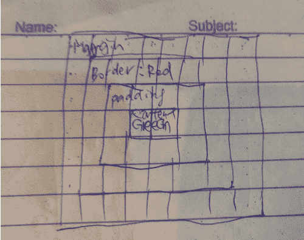
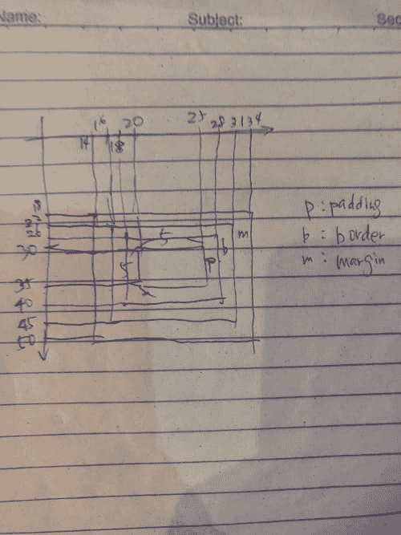

# 让我们建立浏览器引擎！在 typescript vol4 布局树中显示列表

> 原文：<https://dev.to/sanemat/let-s-build-browser-engine-in-typescript-vol4-layout-tree-to-display-list-c54>

显示列表的布局树。

```
// node_modules/.bin/ts-node example/layout-tree.ts | display

import * as Jimp from "jimp";

import { BoxType, Dimensions, EdgeSizes, LayoutBox, Rect } from "../src/layout";
import { paint } from "../src/painting";
import { Color, CssValue } from "../src/css";
import { StyledNode } from "../src/style";
import { DomNode } from "../src/dom";

const red = new Color(255, 0, 0, 255);
const green = new Color(0, 255, 0, 255);

const canvas = paint(
  new LayoutBox(
    new Dimensions(
      new Rect(3, 3, 2, 1),
      new EdgeSizes(1, 1, 1, 1),
      new EdgeSizes(1, 1, 1, 1),
      new EdgeSizes(1, 1, 1, 1)
    ),
    new BoxType.BlockNode(
      new StyledNode(
        new DomNode(),
        new Map([
          ["border-color", new CssValue.ColorValue(red)],
          ["background", new CssValue.ColorValue(green)]
        ]),
        []
      )
    ),
    []
  ),
  new Rect(0, 0, 8, 7)
);

Jimp.create(canvas.width, canvas.height)
  .then((value) => {
    let buffer = value.bitmap.data;
    for (let i = 0; i < canvas.pixels.length; i++) {
      buffer[i * 4] = canvas.pixels[i].r;
      buffer[i * 4 + 1] = canvas.pixels[i].g;
      buffer[i * 4 + 2] = canvas.pixels[i].b;
      buffer[i * 4 + 3] = canvas.pixels[i].a;
    }
    return value.getBufferAsync(Jimp.MIME_PNG);
  })
  .then((value) => {
    process.stdout.write(value);
  })
  .catch((error) => {
    console.error(error);
  }); 
```

Enter fullscreen mode Exit fullscreen mode

[](https://res.cloudinary.com/practicaldev/image/fetch/s--t7O8X6ar--/c_limit%2Cf_auto%2Cfl_progressive%2Cq_auto%2Cw_880/https://thepracticaldev.s3.amazonaws.com/i/xpfuiw5fbnp68bcmxn7u.png)
[T6】](https://res.cloudinary.com/practicaldev/image/fetch/s--p09UoMjC--/c_limit%2Cf_auto%2Cfl_progressive%2Cq_auto%2Cw_880/https://thepracticaldev.s3.amazonaws.com/i/4blz0fsjojx6k5908i87.png)

我们走吧！

*   样式节点#值
*   getColor
*   渲染背景
*   渲染边框
*   renderLayoutBox
*   buildDisplayList

渲染需要 StyledNode #值。
值(名称:字符串):CssValue | null

```
test("styled node hits", () => {
  const expected = new CssValue.Keyword("example");
  expect(
    new StyledNode(new DomNode(), new Map([["target", expected]]), []).value("target")
  ).toEqual(expected);
});

test("styled node does not hit", () => {
  expect(
    new StyledNode(new DomNode(), new Map([["some", new CssValue.Keyword("example")]]), []).value(
      "different"
    )
  ).toEqual(null);
}); 
```

Enter fullscreen mode Exit fullscreen mode

```
export class StyledNode {
  (snip)

  value(name: string): CssValue | null {
    return this.specifiedValues.get(name) || null;
  }
} 
```

Enter fullscreen mode Exit fullscreen mode

getColor(layoutBox: LayoutBox，name: string): Color | null
也很有用。

```
test("get color", () => {
  const expectedColor = new Color(255, 255, 255, 255);
  expect(
    getColor(
      LayoutBox.Create(
        new BoxType.BlockNode(
          new StyledNode(
            new DomNode(),
            new Map([["target", new CssValue.ColorValue(expectedColor)]]),
            []
          )
        )
      ),
      "target"
    )
  ).toEqual(expectedColor);
});

test("get no color", () => {
  expect(
    getColor(
      LayoutBox.Create(new BoxType.BlockNode(new StyledNode(new DomNode(), new Map([]), []))),
      "target"
    )
  ).toEqual(null);
});

test("get no color2", () => {
  expect(getColor(LayoutBox.Create(new BoxType.AnonymousBlock()), "target")).toEqual(null);
});

test("get no color3", () => {
  const notColor = new CssValue.Keyword("example");
  expect(
    getColor(
      LayoutBox.Create(
        new BoxType.BlockNode(new StyledNode(new DomNode(), new Map([["target", notColor]]), []))
      ),
      "target"
    )
  ).toEqual(null);
}); 
```

Enter fullscreen mode Exit fullscreen mode

```
export function getColor(layoutBox: LayoutBox, name: string): Color | null {
  switch (layoutBox.boxType.format) {
    case BoxType.Format.BlockNode:
    case BoxType.Format.InlineNode:
      const style = layoutBox.boxType.styledNode.value(name);
      if (style === null) {
        return null;
      }
      switch (style.format) {
        case CssValue.Format.ColorValue:
          return style.colorValue;
        default:
          return null;
      }
    case BoxType.Format.AnonymousBlock:
      return null;
  }
} 
```

Enter fullscreen mode Exit fullscreen mode

[](https://res.cloudinary.com/practicaldev/image/fetch/s--FoXBJKvG--/c_limit%2Cf_auto%2Cfl_progressive%2Cq_auto%2Cw_880/https://thepracticaldev.s3.amazonaws.com/i/az9bggtd8kqugk7s59qk.png)

render background(list:display list，layoutBox: LayoutBox)
是关键特征。

```
test("render background with color", () => {
  const displayList: DisplayCommand[] = [];
  renderBackground(
    displayList,
    new LayoutBox(
      new Dimensions(
        new Rect(20, 30, 5, 5),
        new EdgeSizes(2, 3, 4, 5),
        new EdgeSizes(2, 3, 4, 5),
        new EdgeSizes(2, 3, 4, 5)
      ),
      new BoxType.BlockNode(
        new StyledNode(
          new DomNode(),
          new Map([["background", new CssValue.ColorValue(new Color(0, 0, 0, 0))]]),
          []
        )
      ),
      []
    )
  )
;
  expect(displayList[0]).toEqual(
    new DisplayCommand.SolidColor(new Color(0, 0, 0, 0), new Rect(16, 22, 15, 23))
;
});

test("render background no color", () => {
  const displayList: DisplayCommand[] = [];
  renderBackground(
    displayList,
    LayoutBox.Create(new BoxType.BlockNode(new StyledNode(new DomNode(), new Map(), [])))
  );
  expect(displayList.length).toEqual(0);
}); 
```

Enter fullscreen mode Exit fullscreen mode

```
export function renderBackground(list: DisplayList, layoutBox: LayoutBox) {
  const color = getColor(layoutBox, "background");
  if (!color) {
    return;
  }
  list.push(new DisplayCommand.SolidColor(color, layoutBox.dimensions.borderBox()));
} 
```

Enter fullscreen mode Exit fullscreen mode

renderBorders(list: DisplayList，layoutBox: LayoutBox)
也是关键特性。

```
test("render border no border", () => {
  const displayList: DisplayCommand[] = [];
  renderBorders(
    displayList,
    LayoutBox.Create(new BoxType.BlockNode(new StyledNode(new DomNode(), new Map(), [])))
  );
  expect(displayList.length).toEqual(0);
});

test("render border with color", () => {
  const displayList: DisplayCommand[] = [];
  renderBorders(
    displayList,
    new LayoutBox(
      exampleDimensions,
      new BoxType.BlockNode(
        new StyledNode(
          new DomNode(),
          new Map([["border-color", new CssValue.ColorValue(black)]]),
          []
        )
      ),
      []
    )
  );
  expect(displayList).toEqual([
    // left
    new DisplayCommand.SolidColor(black, new Rect(16, 22, 2, 23)),
    // right
    new DisplayCommand.SolidColor(black, new Rect(28, 22, 3, 23)),
    // top
    new DisplayCommand.SolidColor(black, new Rect(16, 22, 15, 4)),
    // bottom
    new DisplayCommand.SolidColor(black, new Rect(16, 40, 15, 5))
  ]);
}); 
```

Enter fullscreen mode Exit fullscreen mode

```
export function renderBorders(list: DisplayList, layoutBox: LayoutBox) {
  const color = getColor(layoutBox, "border-color");
  if (!color) {
    return;
  }
  const dimensions = layoutBox.dimensions;
  const borderBox = dimensions.borderBox();

  // left border
  list.push(
    new DisplayCommand.SolidColor(
      color,
      new Rect(borderBox.x, borderBox.y, dimensions.border.left, borderBox.height)
    )
  );

  // right border
  list.push(
    new DisplayCommand.SolidColor(
      color,
      new Rect(
        borderBox.x + borderBox.width - dimensions.border.right,
        borderBox.y,
        dimensions.border.right,
        borderBox.height
      )
    )
  );

  // top border
  list.push(
    new DisplayCommand.SolidColor(
      color,
      new Rect(borderBox.x, borderBox.y, borderBox.width, dimensions.border.top)
    )
  );

  // bottom border
  list.push(
    new DisplayCommand.SolidColor(
      color,
      new Rect(
        borderBox.x,
        borderBox.y + borderBox.height - dimensions.border.bottom,
        borderBox.width,
        dimensions.border.bottom
      )
    )
  );
} 
```

Enter fullscreen mode Exit fullscreen mode

renderLayoutBox(list:display list，layoutBox: LayoutBox)
递归应用。

```
test("render layout box", () => {
  const displayList: DisplayCommand[] = [];
  renderLayoutBox(
    displayList,
    new LayoutBox(
      exampleDimensions,
      new BoxType.BlockNode(
        new StyledNode(
          new DomNode(),
          new Map([
            ["border-color", new CssValue.ColorValue(black)],
            ["background", new CssValue.ColorValue(blue)]
          ]),
          []
        )
      ),
      []
    )
  );
  expect(displayList).toEqual([
    // background
    new DisplayCommand.SolidColor(blue, new Rect(16, 22, 15, 23)),
    // left
    new DisplayCommand.SolidColor(black, new Rect(16, 22, 2, 23)),
    // right
    new DisplayCommand.SolidColor(black, new Rect(28, 22, 3, 23)),
    // top
    new DisplayCommand.SolidColor(black, new Rect(16, 22, 15, 4)),
    // bottom
    new DisplayCommand.SolidColor(black, new Rect(16, 40, 15, 5))
  ]);
});

test("render layout box children", () => {
  const displayList: DisplayCommand[] = [];
  renderLayoutBox(
    displayList,
    new LayoutBox(
      exampleDimensions,
      new BoxType.BlockNode(
        new StyledNode(
          new DomNode(),
          new Map([
            ["border-color", new CssValue.ColorValue(black)],
            ["background", new CssValue.ColorValue(blue)]
          ]),
          []
        )
      ),
      [
        new LayoutBox(
          new Dimensions(
            new Rect(22, 32, 1, 1),
            new EdgeSizes(0, 0, 0, 0),
            new EdgeSizes(0, 0, 0, 0),
            new EdgeSizes(0, 0, 0, 0)
          ),
          new BoxType.BlockNode(
            new StyledNode(
              new DomNode(),
              new Map([
                ["border-color", new CssValue.ColorValue(red)],
                ["background", new CssValue.ColorValue(green)]
              ]),
              []
            )
          ),
          []
        )
      ]
    )
  );
  expect(displayList).toEqual([
    // background
    new DisplayCommand.SolidColor(blue, new Rect(16, 22, 15, 23)),
    // left
    new DisplayCommand.SolidColor(black, new Rect(16, 22, 2, 23)),
    // right
    new DisplayCommand.SolidColor(black, new Rect(28, 22, 3, 23)),
    // top
    new DisplayCommand.SolidColor(black, new Rect(16, 22, 15, 4)),
    // bottom
    new DisplayCommand.SolidColor(black, new Rect(16, 40, 15, 5)),
    // children background
    new DisplayCommand.SolidColor(green, new Rect(22, 32, 1, 1)),
    // children left
    new DisplayCommand.SolidColor(red, new Rect(22, 32, 0, 1)),
    // children right
    new DisplayCommand.SolidColor(red, new Rect(23, 32, 0, 1)),
    // children top
    new DisplayCommand.SolidColor(red, new Rect(22, 32, 1, 0)),
    // children bottom
    new DisplayCommand.SolidColor(red, new Rect(22, 33, 1, 0))
  ]);
}); 
```

Enter fullscreen mode Exit fullscreen mode

```
export function renderLayoutBox(list: DisplayList, layoutBox: LayoutBox) {
  renderBackground(list, layoutBox);
  renderBorders(list, layoutBox);
  for (let child of layoutBox.children) {
    renderLayoutBox(list, child);
  }
} 
```

Enter fullscreen mode Exit fullscreen mode

build DisplayList(layout root:LayoutBox):display list
最后从 LayoutTree 得到 display list。

```
test("build display list", () => {
  expect(
    buildDisplayList(
      new LayoutBox(
        exampleDimensions,
        new BoxType.BlockNode(
          new StyledNode(
            new DomNode(),
            new Map([
              ["border-color", new CssValue.ColorValue(black)],
              ["background", new CssValue.ColorValue(blue)]
            ]),
            []
          )
        ),
        []
      )
    )
  ).toEqual([
    // background
    new DisplayCommand.SolidColor(blue, new Rect(16, 22, 15, 23)),
    // left
    new DisplayCommand.SolidColor(black, new Rect(16, 22, 2, 23)),
    // right
    new DisplayCommand.SolidColor(black, new Rect(28, 22, 3, 23)),
    // top
    new DisplayCommand.SolidColor(black, new Rect(16, 22, 15, 4)),
    // bottom
    new DisplayCommand.SolidColor(black, new Rect(16, 40, 15, 5))
  ]);
});

test("build display list2", () => {
  expect(
    buildDisplayList(
      new LayoutBox(
        new Dimensions(
          new Rect(3, 3, 2, 1),
          new EdgeSizes(1, 1, 1, 1),
          new EdgeSizes(1, 1, 1, 1),
          new EdgeSizes(1, 1, 1, 1)
        ),
        new BoxType.BlockNode(
          new StyledNode(
            new DomNode(),
            new Map([
              ["border-color", new CssValue.ColorValue(red)],
              ["background", new CssValue.ColorValue(green)]
            ]),
            []
          )
        ),
        []
      )
    )
  ).toEqual([
    // background
    new DisplayCommand.SolidColor(green, new Rect(1, 1, 6, 5)),
    // left
    new DisplayCommand.SolidColor(red, new Rect(1, 1, 1, 5)),
    // right
    new DisplayCommand.SolidColor(red, new Rect(6, 1, 1, 5)),
    // top
    new DisplayCommand.SolidColor(red, new Rect(1, 1, 6, 1)),
    // bottom
    new DisplayCommand.SolidColor(red, new Rect(1, 5, 6, 1))
  ]);
}); 
```

Enter fullscreen mode Exit fullscreen mode

```
export function buildDisplayList(layoutRoot: LayoutBox): DisplayList {
  const list: DisplayCommand[] = [];
  renderLayoutBox(list, layoutRoot);
  return list;
} 
```

Enter fullscreen mode Exit fullscreen mode

🎉

## 参考文献

*   [我们来搭建一个浏览器引擎吧！第 1 部分:入门](https://limpet.net/mbrubeck/2014/08/08/toy-layout-engine-1.html)
*   [姆布鲁贝克/罗宾逊](https://github.com/mbrubeck/robinson)
*   [sanemat/js-toy-engine](https://github.com/sanemat/js-toy-engine)
*   [sanemat/ts-toy-engine](https://github.com/sanemat/ts-toy-engine)

## 系列

*   [让我们来打造浏览器引擎吧！在 typescript vol0 玩具浏览器引擎](https://dev.to/sanemat/let-s-build-browser-engine-in-typescript-vol0-toy-browser-engine-egm)
*   [让我们来打造浏览器引擎吧！在 typescript vol1 画布上用颜色](https://dev.to/sanemat/let-s-build-browser-engine-in-typescript-vol1-canvas-with-color-2nd7)
*   [让我们来打造浏览器引擎吧！在 typescript vol2 中显示命令](https://dev.to/sanemat/let-s-build-browser-engine-in-typescript-vol2-display-command-3466)
*   [让我们来打造浏览器引擎吧！在 typescript vol3 布局框中，尺寸](https://dev.to/sanemat/let-s-build-browser-engine-in-typescript-vol3-layout-box-dimensions-4613)
*   [让我们来打造浏览器引擎吧！在 typescript vol4 布局树中显示列表](https://dev.to/sanemat/let-s-build-browser-engine-in-typescript-vol4-layout-tree-to-display-list-c54)