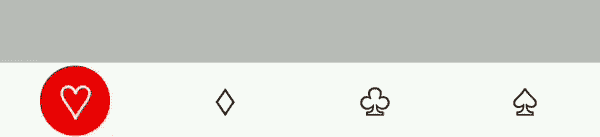
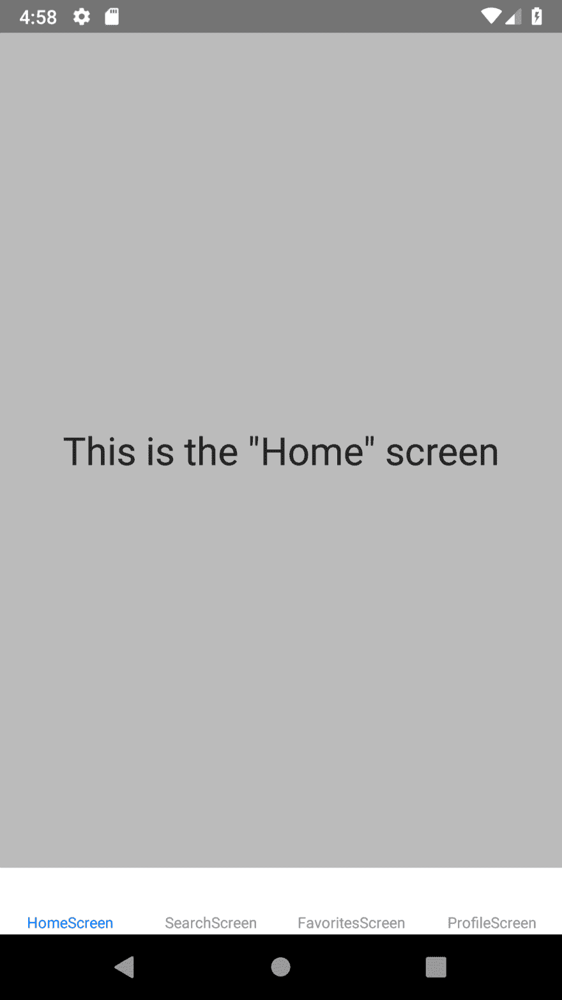
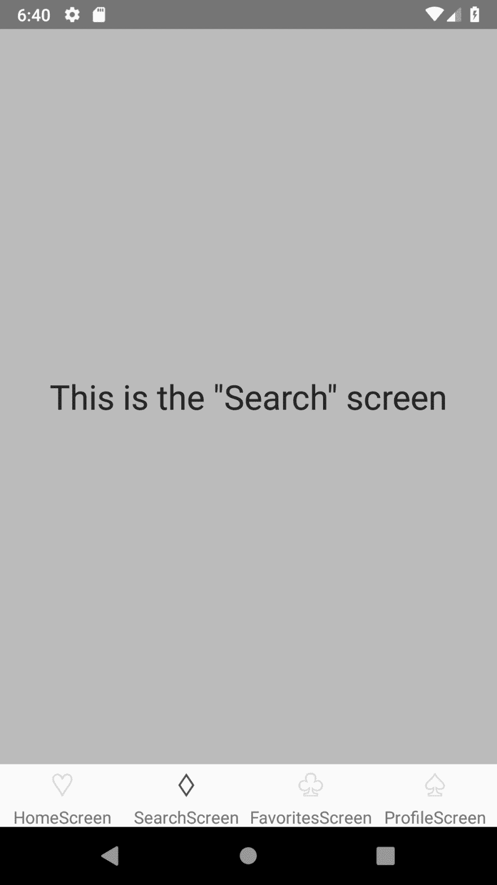
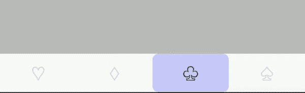
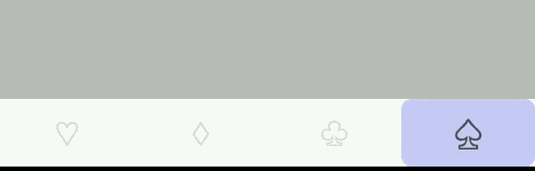

# 让我们用 React Native 创建一个自定义动画标签栏

> 原文：<https://dev.to/hrastnik/lets-create-a-custom-animated-tab-bar-with-react-native-3496>

如果你曾经觉得从 React 导航中得到的默认标签栏组件看起来太乏味，或者只是想创建一些看起来更现代的东西，那么你和我一样。在本指南中，我将向您展示如何创建一个自定义的选项卡栏来使用 React 导航。

编辑:我扩展了这个例子，并在 github 上发布了代码。[链接至回购](https://github.com/hrastnik/react-native-custom-tab-bar)

这是最终产品的样子

[](https://res.cloudinary.com/practicaldev/image/fetch/s--U5y-niHB--/c_limit%2Cf_auto%2Cfl_progressive%2Cq_66%2Cw_880/https://thepracticaldev.s3.amazonaws.com/i/pbd85l10izk4bk48p6g2.gif)

这是到达那里的方法。首先让我们初始化一个新项目并安装几个依赖项。我们将在终端中运行一些命令。

```
$ react-native init CustomTabBar
$ cd CustomTabBar
$ npm install react-navigation react-native-gesture-handler react-native-pose 
```

Enter fullscreen mode Exit fullscreen mode

从 v3 开始，React 导航需要 react-native-gesture-handler，所以我们必须安装它，react-native-pose 是一个很棒的库，我们将使用它来使动画变得非常简单。

现在需要一个链接步骤来让 react-native-手势处理器在 Android 上工作。在[https://react navigation . org/docs/en/getting-started . html #安装](https://dev.toofficial%20React%20Navigation%20docs%20page)上都有解释，我就跳过设置部分了。

现在，我们可以实际启动应用程序，并编写标签栏代码。

首先，我们将创建一个目录结构来帮助组织事情。

```
/android
/ios
...
/src
  /AppEntry.js
  /router
    /router.js
    /index.js
  /components
  /screens
/index.js 
```

Enter fullscreen mode Exit fullscreen mode

首先，我们将创建一个`src`目录，将我们的代码与项目根目录中的其他文件(package.json、app.json、.gitignore 等。).`screens`、`components`和`router`目录是不言自明的。

我们从项目的根中删除默认的`App.js`文件，并将`index.js`更改为导入`/src/AppEntry.js`T3】

```
/* /index.js */

/** @format */

import { AppRegistry } from "react-native";
import App from "./src/AppEntry";
import { name as appName } from "./app.json";

AppRegistry.registerComponent(appName, () => App); 
```

Enter fullscreen mode Exit fullscreen mode

现在我们想使用 react-navigation 创建路由器，但是首先我们需要创建一些虚拟屏幕。我们将创建一个通用的屏幕组件，它接受一个名称并显示它来模拟多个屏幕。

我们向`/src/screens/index.js`文件添加一些导出，就像这样

```
/* /src/screens/index.js */

import React from "react";

import Screen from "./Screen";

export const HomeScreen = () => <Screen name="Home" />;
export const SearchScreen = () => <Screen name="Search" />;
export const FavoritesScreen = () => <Screen name="Favorites" />;
export const ProfileScreen = () => <Screen name="Profile" />; 
```

Enter fullscreen mode Exit fullscreen mode

现在我们创建屏幕组件。

```
/* /src/screens/Screen.js */

import React from "react";
import { Text, View, StyleSheet } from "react-native";

const S = StyleSheet.create({
  container: {
    flex: 1,
    backgroundColor: "#bbbbbb",
    justifyContent: "center",
    alignItems: "center"
  },
  text: { fontSize: 28, color: "#222222", textAlign: "center" }
});

const Screen = ({ name }) => (
  <View style={S.container}>
    <Text style={S.text}>This is the "{name}" screen</Text>
  </View>
);

export default Screen; 
```

Enter fullscreen mode Exit fullscreen mode

是时候创建路由器了。

首先让我们将导出添加到`/src/router/index.js`

```
/* /src/router/index.js */

export { default as Router } from "./router"; 
```

Enter fullscreen mode Exit fullscreen mode

现在让我们在`router.js`中创建基本的 BottomTabNavigator。我们将导入我们的屏幕，并使用`createBottomTabNavigator`创建一个默认的选项卡导航器。

```
/* /src/router/index.js */

import { createAppContainer, createBottomTabNavigator } from "react-navigation";

import {
  HomeScreen,
  SearchScreen,
  FavoritesScreen,
  ProfileScreen
} from "../screens";

const TabNavigator = createBottomTabNavigator({
  HomeScreen,
  SearchScreen,
  FavoritesScreen,
  ProfileScreen
});

export default createAppContainer(TabNavigator); 
```

Enter fullscreen mode Exit fullscreen mode

现在我们在`AppEntry.js`
中渲染我们的路由器

```
/* /src/AppEntry.js */

import React from "react";

import { Router } from "./router";

export default () => <Router />; 
```

Enter fullscreen mode Exit fullscreen mode

当我们重新加载我们的应用程序时，我们应该看到这个屏幕:

[](https://res.cloudinary.com/practicaldev/image/fetch/s--OgNs1nTp--/c_limit%2Cf_auto%2Cfl_progressive%2Cq_auto%2Cw_880/https://thepracticaldev.s3.amazonaws.com/i/ei83dkawejrlf3uofcqh.png)

默认的标签栏支持图标，所以让我们添加一些图标。我们将在本教程中使用 ascii 字符，但是您可以在实际应用中使用 react-native-vector-icons 或自定义图标字体。

让我们创建一个接受道具`name`和`color`并返回图标的图标组件。

```
/* /src/components/index.js */

export { default as Icon } from "./Icon"; 
```

Enter fullscreen mode Exit fullscreen mode

```
/* /src/components/Icon.js */

import React from "react";
import { Text } from "react-native";

const iconMap = {
  home: "♡",
  search: "♢",
  favorites: "♧",
  profile: "♤"
};

const Icon = ({ name, color, style, ...props }) => {
  const icon = iconMap[name];

  return <Text style={[{ fontSize: 26, color }, style]}>{icon}</Text>;
};

export default Icon; 
```

Enter fullscreen mode Exit fullscreen mode

现在我们可以在路由器中使用这个组件了。我们在`router.js`中改变我们的屏幕来接受一个带有`navigationOptions`道具的对象。默认的选项卡栏将 tintColor 传递给我们的图标组件，因此我们使用它来设置图标颜色。

```
/* /src/router/router.js */

const TabNavigator = createBottomTabNavigator({
  HomeScreen: {
    screen: HomeScreen,
    navigationOptions: {
      tabBarIcon: ({ tintColor }) => <Icon name="home" color={tintColor} />
    }
  },
  SearchScreen: {
    screen: SearchScreen,
    navigationOptions: {
      tabBarIcon: ({ tintColor }) => <Icon name="search" color={tintColor} />
    }
  },
  FavoritesScreen: {
    screen: FavoritesScreen,
    navigationOptions: {
      tabBarIcon: ({ tintColor }) => <Icon name="favorites" color={tintColor} />
    }
  },
  ProfileScreen: {
    screen: ProfileScreen,
    navigationOptions: {
      tabBarIcon: ({ tintColor }) => <Icon name="profile" color={tintColor} />
    }
  }
}); 
```

Enter fullscreen mode Exit fullscreen mode

这是它的样子

[](https://res.cloudinary.com/practicaldev/image/fetch/s--5KA5wWpJ--/c_limit%2Cf_auto%2Cfl_progressive%2Cq_auto%2Cw_880/https://thepracticaldev.s3.amazonaws.com/i/wgls4kb9fdhtzfafqmnx.png)

现在我们的标签栏看起来好一点了，但是它仍然是 react-navigation 的默认标签栏。接下来，我们将添加实际的自定义选项卡栏组件。

让我们从创建一个定制的 TabBar 组件开始，它只呈现一些文本并记录属性，这样我们就可以看到我们从导航器中获得了什么属性。

```
/* /src/components/index.js */

export { default as Icon } from "./Icon";
export { default as TabBar } from "./TabBar"; 
```

Enter fullscreen mode Exit fullscreen mode

```
/* /src/components/TabBar.js */

import React from "react";
import { Text } from "react-native";

const TabBar = props => {
  console.log("Props", props);

  return <Text>Custom Tab Bar</Text>;
};

export default TabBar; 
```

Enter fullscreen mode Exit fullscreen mode

我们必须设置路由器，使其使用自定义选项卡栏。我们可以将下面的配置作为第二个参数添加到 createBottomTabNavigator 中。

```
/* /src/router/router.js */

...
import { Icon, TabBar } from "../components";

const TabNavigator = createBottomTabNavigator(
  {
    HomeScreen: { /* ... */ },
    SearchScreen: { /* ... */ }
  },

  {
    tabBarComponent: TabBar,
    tabBarOptions: {
      activeTintColor: "#4F4F4F",
      inactiveTintColor: "#ddd"
    }
  }
);
... 
```

Enter fullscreen mode Exit fullscreen mode

如果我们检查我们的标签栏记录的内容，我们会看到在`navigation.state`中有导航状态，其中也包含路线。还有`renderIcon`函数、`onTabPress`和许多其他我们可能需要的东西。我们还注意到我们在路由器配置中设置的`tabBarOptions`是如何作为道具注入到我们的组件中的。

现在我们可以开始编写标签栏了。首先，让我们尝试重新创建默认的选项卡栏。我们将在容器上设置一些样式，在一行中布局选项卡按钮，并为每条路线呈现一个选项卡按钮。我们可以使用`renderIcon`函数来呈现正确的图标——在源代码中挖掘显示它需要一个形状为`{ route, focused, tintColor }`的对象。我们添加了 onPress 处理程序，可访问性标签，瞧，我们有了默认的标签栏。

```
/* /src/components/TabBar.js */

import React from "react";
import { View, Text, StyleSheet, TouchableOpacity } from "react-native";

const S = StyleSheet.create({
  container: { flexDirection: "row", height: 52, elevation: 2 },
  tabButton: { flex: 1, justifyContent: "center", alignItems: "center" }
});

const TabBar = props => {
  const {
    renderIcon,
    getLabelText,
    activeTintColor,
    inactiveTintColor,
    onTabPress,
    onTabLongPress,
    getAccessibilityLabel,
    navigation
  } = props;

  const { routes, index: activeRouteIndex } = navigation.state;

  return (
    <View style={S.container}>
      {routes.map((route, routeIndex) => {
        const isRouteActive = routeIndex === activeRouteIndex;
        const tintColor = isRouteActive ? activeTintColor : inactiveTintColor;

        return (
          <TouchableOpacity
            key={routeIndex}
            style={S.tabButton}
            onPress={() => {
              onTabPress({ route });
            }}
            onLongPress={() => {
              onTabLongPress({ route });
            }}
            accessibilityLabel={getAccessibilityLabel({ route })}
          >
            {renderIcon({ route, focused: isRouteActive, tintColor })}

            <Text>{getLabelText({ route })}</Text>
          </TouchableOpacity>
        );
      })}
    </View>
  );
};

export default TabBar; 
```

Enter fullscreen mode Exit fullscreen mode

它看起来是这样的:

[](https://res.cloudinary.com/practicaldev/image/fetch/s--EY70pa0k--/c_limit%2Cf_auto%2Cfl_progressive%2Cq_auto%2Cw_880/https://thepracticaldev.s3.amazonaws.com/i/35oxs9lky1bfsmzyxsgo.png)

现在我们知道我们可以灵活地创建自己的标签栏，所以我们可以开始扩展它了。我们将使用 react-native-pose 来创建一个动画视图，该视图将突出显示活动路线——让我们将该视图称为聚光灯。

首先我们可以去掉标签。然后，我们在标签栏后面添加一个绝对视图，它将成为焦点。我们使用 Dimensions API 计算聚光灯的偏移量。

```
/* /src/components/TabBar.js */

import posed from "react-native-pose";

const windowWidth = Dimensions.get("window").width;
const tabWidth = windowWidth / 4;
const SpotLight = posed.View({
  route0: { x: 0 },
  route1: { x: tabWidth },
  route2: { x: tabWidth * 2 },
  route3: { x: tabWidth * 3 }
});

...
const S = StyleSheet.create({
  /* ... */
  spotLight: {
    width: tabWidth,
    height: "100%",
    backgroundColor: "rgba(128,128,255,0.2)",
    borderRadius: 8
  }
});

  /* ... */

    <View style={S.container}>
      <View style={StyleSheet.absoluteFillObject}>
        <SpotLight style={S.spotLight} pose={`route${activeRouteIndex}`} />
      </View>

      {routes.map((route, routeIndex) => {
        /* ... */
      }}
    </View> 
```

Enter fullscreen mode Exit fullscreen mode

它看起来是这样的:

[](https://res.cloudinary.com/practicaldev/image/fetch/s--N3UNaRWf--/c_limit%2Cf_auto%2Cfl_progressive%2Cq_66%2Cw_880/https://thepracticaldev.s3.amazonaws.com/i/rnxzjbkl8gwk87e1udqj.gif)

请注意，我们从未指定动画的持续时间和行为。Pose 在使用合理的默认值时会考虑这一点。

现在，我们将添加一些缩放活动图标。让我们创建另一个造型视图。

```
/* /src/components/TabBar.js */

...

const Scaler = posed.View({
  active: { scale: 1.25 },
  inactive: { scale: 1 }
});

... 
```

Enter fullscreen mode Exit fullscreen mode

现在，我们可以像这样将图标包装在我们的 Scaler 组件中。

```
/* /src/components/TabBar.js */

<Scaler style={S.scaler} pose={isRouteActive ? "active" : "inactive"}>
  {renderIcon({ route, focused: isRouteActive, tintColor })}
</Scaler> 
```

Enter fullscreen mode Exit fullscreen mode

我们得到了这种效果。

[](https://res.cloudinary.com/practicaldev/image/fetch/s--Hilwpll---/c_limit%2Cf_auto%2Cfl_progressive%2Cq_66%2Cw_880/https://thepracticaldev.s3.amazonaws.com/i/5pw6thm3clxngb4pn0ea.gif)

我们的标签栏开始看起来不错了。剩下要做的就是稍微润色一下，改变配色方案，调整我们的聚光灯，我们的组件就完成了。

[](https://res.cloudinary.com/practicaldev/image/fetch/s--U5y-niHB--/c_limit%2Cf_auto%2Cfl_progressive%2Cq_66%2Cw_880/https://thepracticaldev.s3.amazonaws.com/i/pbd85l10izk4bk48p6g2.gif)

现在，有些事情我们可以改进。例如，当前的实现假设 tab navigator 中总是有 4 个屏幕，spotlight 颜色是在 tab bar 组件中硬编码的，并且样式应该可以通过路由器上的 tabBarOptions 配置进行扩展，但我现在不考虑这一点。

TabBar 组件的完整源代码

```
/* /src/components/TabBar.js */

import React from "react";
import {
  View,
  Text,
  StyleSheet,
  TouchableOpacity,
  Dimensions
} from "react-native";
import posed from "react-native-pose";

const windowWidth = Dimensions.get("window").width;
const tabWidth = windowWidth / 4;
const SpotLight = posed.View({
  route0: { x: 0 },
  route1: { x: tabWidth },
  route2: { x: tabWidth * 2 },
  route3: { x: tabWidth * 3 }
});

const Scaler = posed.View({
  active: { scale: 1.25 },
  inactive: { scale: 1 }
});

const S = StyleSheet.create({
  container: {
    flexDirection: "row",
    height: 52,
    elevation: 2,
    alignItems: "center"
  },
  tabButton: { flex: 1 },
  spotLight: {
    width: tabWidth,
    height: "100%",
    justifyContent: "center",
    alignItems: "center"
  },
  spotLightInner: {
    width: 48,
    height: 48,
    backgroundColor: "#ee0000",
    borderRadius: 24
  },
  scaler: { flex: 1, alignItems: "center", justifyContent: "center" }
});

const TabBar = props => {
  const {
    renderIcon,
    activeTintColor,
    inactiveTintColor,
    onTabPress,
    onTabLongPress,
    getAccessibilityLabel,
    navigation
  } = props;

  const { routes, index: activeRouteIndex } = navigation.state;

  return (
    <View style={S.container}>
      <View style={StyleSheet.absoluteFillObject}>
        <SpotLight style={S.spotLight} pose={`route${activeRouteIndex}`}>
          <View style={S.spotLightInner} />
        </SpotLight>
      </View>

      {routes.map((route, routeIndex) => {
        const isRouteActive = routeIndex === activeRouteIndex;
        const tintColor = isRouteActive ? activeTintColor : inactiveTintColor;

        return (
          <TouchableOpacity
            key={routeIndex}
            style={S.tabButton}
            onPress={() => {
              onTabPress({ route });
            }}
            onLongPress={() => {
              onTabLongPress({ route });
            }}
            accessibilityLabel={getAccessibilityLabel({ route })}
          >
            <Scaler
              pose={isRouteActive ? "active" : "inactive"}
              style={S.scaler}
            >
              {renderIcon({ route, focused: isRouteActive, tintColor })}
            </Scaler>
          </TouchableOpacity>
        );
      })}
    </View>
  );
};

export default TabBar; 
```

Enter fullscreen mode Exit fullscreen mode

和路由器配置

```
/* /src/router/router.js */

...

const TabNavigator = createBottomTabNavigator(
  /* screen config ommited */,
  {
    tabBarComponent: TabBar,
    tabBarOptions: {
      activeTintColor: "#eeeeee",
      inactiveTintColor: "#222222"
    }
  }
);

... 
```

Enter fullscreen mode Exit fullscreen mode