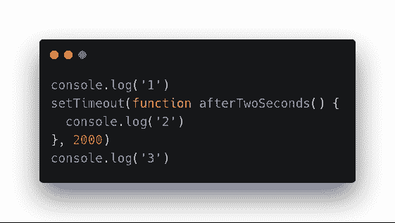
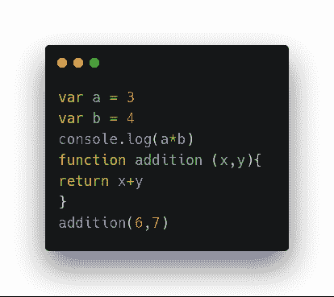
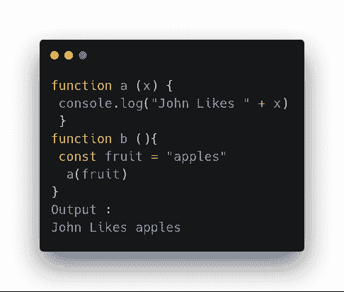
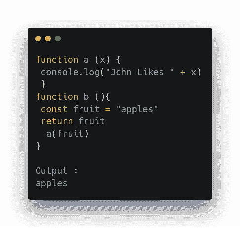
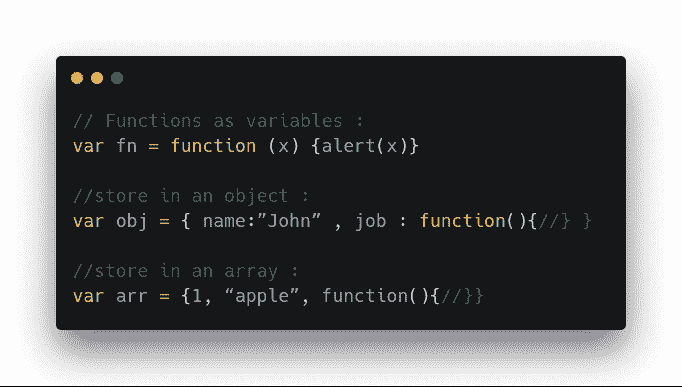
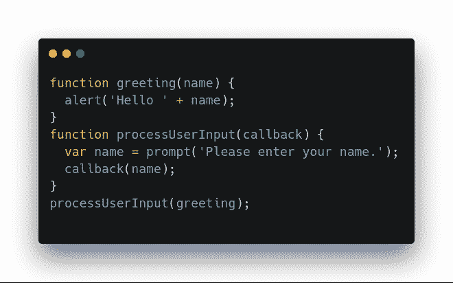
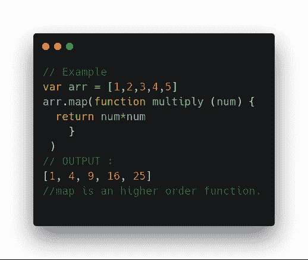
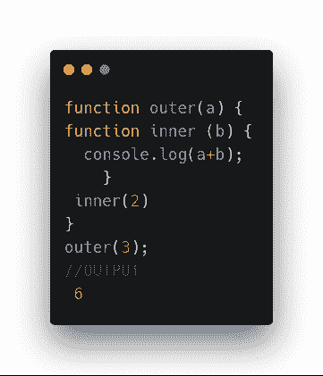
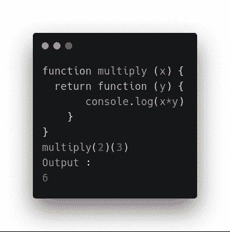

# 让我们向 JavaScript 更近一步——怪异的一面

> 原文：<https://dev.to/aiman_io/lets-take-one-step-closer-towards-javascript-the-weird-side-12am>

***“拿着工具的傻瓜还是傻瓜”——格雷迪·布奇***

在不了解和理解工具的核心及其功能的情况下使用工具总是会导致问题和失败。这是每个初学者的实际问题，包括我，当我向技术世界迈出第一步的时候。

做一个项目，谷歌搜索错误和解决方案，这不是让你成为程序员的原因。编程是所有关于创新，想法，建立和提高逻辑技能。

在使用任何编程语言之前，首先要理解它的行为，深入了解它，通过解决场景建立一些逻辑。这就是我作为初学者所经历的，现在让我们来探索 JavaScript 的一些奇怪的方面。我无法在一篇文章中涵盖所有的概念，但其中一些如下:)

### **目录**

*   同步和异步行为
*   执行上下文和执行堆栈
*   一级函数
*   高阶函数
*   关闭

#### **1:同步&异步行为**

JavaScript 是同步的和单线程的，但是它也是异步的。听起来很奇怪？我们来探索一下。同步语言是指一次只能运行一个操作，或者逐行执行代码的语言。

**例如** :
 
上面的例子展示了 JavaSrcipt 的同步行为。但是我们需要在最后执行第二个。这个问题可以通过 JavaScript 的异步行为来解决
 
这实际上会记录“1 3 2”，因为“2”是在 setTimeout 函数上，该函数只会在两秒钟后执行。您的应用程序不会等待两秒钟就挂起。相反，它继续执行剩余的代码，当超时结束时，它返回到 afterTwoSeconds。

**这就是 JS 异步行为的方式**。

#### **2:执行上下文和执行栈。**

执行上下文被定义为 JavaScript 代码执行的环境。啊。什么？😕

**举例:**
 
任何函数之外的代码都在全局环境中。
任何函数内部的代码都在本地环境中。

#### **执行堆栈。**

局部和全局环境的集合称为执行堆栈。
**注:**
*每当函数返回某个东西时，本地环境就会死亡。它的存在从执行堆栈中移除。
它不再可用于其他功能或全球环境。明白了吗？*

让我们深潜。

考虑一下，我们有两个函数 a 和 b
,函数 a 的工作是记录它的参数。就是这样。
函数 b 的工作是，调用函数“a”，与函数 a 共享自己的变量
 
函数 b 是活的，因为它不返回任何东西。函数 b 的变量可用于其他函数。
但是如果函数 b 返回某个东西，然后把它的变量发给函数 a 呢？
 
现在不出所料，函数“a”不能使用函数“b”的变量，因为函数 b 已经死了。它的执行上下文已被销毁。
**这就是 JS 的行为方式。**

#### **3:一级函数**

JavaScript 是一种函数式编程语言，其中函数被视为任何其他变量。

1.  你可以在变量、对象和数组中存储一个函数
2.  您可以将函数作为参数传递(回调)
3.  你也可以通过另一个函数返回一个函数。

这使得玩函数变得简单而有趣。

 
**2。将函数作为参数传递——回调**
最重要的概念之一。让我们试着理解下面的例子。

**它的作用:**

1.“processUserInput”执行，它执行第一项工作(向用户询问其名称和变量“name”中的存储名称)

2“processuser input”现在做它的第二项工作(调用一个函数“callback ”,它将这个函数作为它的参数，并在函数中传递我们从 user 获取的名称。)

3.现在“回调”函数开始执行，完成它的工作(提醒我们发送给它的变量)。

这就是我们使用函数作为参数的方式。用作参数的函数称为**回调**。

#### **3:将一个函数作为参数传递或者通过另一个函数返回一个函数(高阶函数)**

#### **5。关闭**

现在是休息的时候了，😌JavaScript 中的闭包是许多人难以理解的概念之一。

**闭包是一个内部函数，它可以访问外部函数的变量**

 够简单吗？还没结束，考虑下面这个例子。  
Dayuuum。魔法？😃一个函数死了(它已经返回了一些东西)，但是还有一个函数正在使用它的变量。

这就是闭包的力量。

—闭包允许 JavaScript 程序员编写更好的代码。创造性、表达性和简洁性

**就这样。去写点代码吧。**
如果这是有用的，请点击掌声，并随时与他人分享❤️