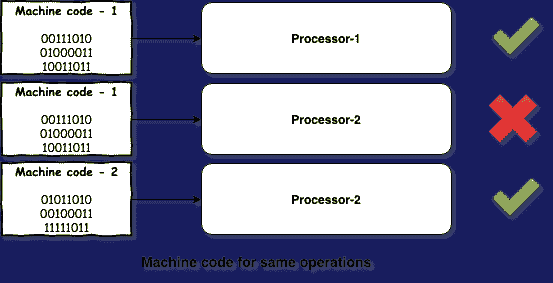
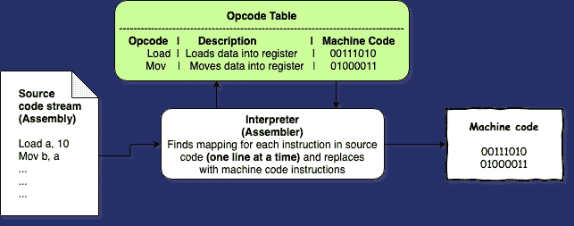
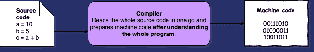
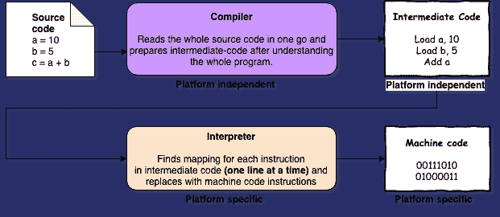

# 汇编中的[升级系列]程序

> 原文：<https://dev.to/saurabhgoyal/level-up-series-program-in-assembly-4i0a>

这是程序员 [**升级系列**](/saurabhgoyal/levelling-up-as-a-developer-3gol) 下要做的实验之一，查看[本帖](/saurabhgoyal/levelling-up-as-a-developer-3gol)了解更多详情。

* * *

按照最初的实验，我的想法是编写一个简单的汇编程序，但在此过程中，我试图全面掌握这门语言，因此从一点历史和非常基础的东西开始。读完所有这些，我有更多的基础知识要分享，而不是汇编语言本身。让我们开始-

## 汇编器|编译器|解释器

我们将讨论这些是什么，为什么需要它们，事情是如何开始的，当人们问我 Python 是解释的还是编译的时，我该怎么回答:p。

*   在早期，不同的处理器/架构(从现在开始我称它们为 **`environments`** )需要它们自己的一套机器代码(0 和 1)指令来执行相同的操作，因为它们的硬件是有线的。即使在今天，情况也是一样的，你想运行的任何类型的程序，在最后一层，任何非机器代码程序被转换成机器代码指令，这个翻译器是特定于环境的。 

*   抛开这些不谈，即使是为一个特定的环境编写机器代码指令也很麻烦，因为它们不容易被人类理解。当然，人们不会记住他们想要执行的每个命令的机器码，他们有一个叫做 [**的操作码表**](https://en.wikipedia.org/wiki/Opcode_table) ，它是人类可读命令(如`Load A, 10`)到机器码命令(如`00111010`)之间的映射，他们用操作码编写程序，然后通过查找该表，他们将其转换为机器码指令。

*   显而易见，需要一个程序来自动执行上述步骤，通过 opcoded(人类可读命令)程序并从中生成机器码程序，一个**翻译器**。一个这样的翻译器被创建并被称为**汇编器**，因为它翻译了第一个被称为**汇编语言**的操作码指令的结构化版本。这里要注意的一点是，它**的工作方式与映射**完全一样，即它接受一条操作码指令并将其转换为一条机器代码指令，没有复杂的转换。这种幼稚的翻译者被称为**翻译者**。所以**汇编程序只不过是汇编语言的解释器。**T12T14】

*   随着它开始加速编程，社区希望有更高层次的抽象，复杂的机器代码指令集可以编写为更简单的高级指令，而无需程序员关注低级别的东西，如内存分配的位置和方式，这就是**编译器**的诞生。编译不是将一种语言的指令直接映射到另一种语言的指令，而是先读取整个程序，然后通过各种优化将其转换为机器代码程序的复杂过程，这极大地扩展了可能性。

*   然而，这方面的主要挑战是，这是一个普遍和真实的看法，即这样一个编译的程序不能达到与手写汇编程序相同的性能水平，主要是因为内存分配逻辑和人类可以根据情况想到的优化。显然，这种表现是在巨大编程门槛的代价下取得的。无论如何，一种这样的语言 **A0** 被创造出来，它被编译成机器代码，而不是一次翻译一行，尽管由于前面提到的观念，它并没有变得很流行。后来，IBM 基于被广泛接受的相同原则创建了 **FORTRAN** 。 

*   现在已经有了自己的编译器并且易于编码的语言，但是仍然存在一个问题——必须为不同的环境编写不同的编译器。提出了包括用于翻译的编译器和解释器的解决方案。这是对**写一次，到处运行**概念的介绍。有两个步骤-

    *   高级源代码将被编译成某种中间代码。这不同于普通的编译，在普通的编译中，源代码被转换成机器码。
    *   该中间代码将由专门为程序必须运行的环境编写的解释程序来解释。
*   这里要注意的一点是，这种解决方案也需要编写环境特定的**解释器**，但仍然比编写环境特定的**编译器**更受欢迎，原因有二

    *   为高级源代码编写环境特定的编译器比为低级中间代码编写环境特定的解释器要麻烦得多。
    *   字节码提供了共享程序的便利，而不需要共享提供某种抽象的源代码。

COBOL 是第一种以这个概念开始的语言，它使得编写和共享程序变得极其简单。

*   在解释过程中，引入了一种主要的优化方法，叫做 **JIT (Just-In-Time)编译**。它所做的是，当解释器逐行进行并翻译成机器代码时，它还将这些行提供给一个名为 JIT-compiler 的模块，该模块开始查找重复的行、复杂的行集和其他类型的可以优化的指令，并不断存储它们的机器代码翻译以供将来使用。有了收集到的见解和数据，就省去了解释器将多行中间代码重复翻译成机器码的工作。当生产线到来时，所有这些都是即时发生的，因此是及时的。它对绩效产生了显著的积极影响。

不用说，实际上关于上面提到的每一点都有更复杂的细节，我只是试图给出所有三件事的概述。

* * *

## 语言的流行实现

经过以上讨论，我们需要明白的一件事是，语言不是编译或解释的，而是采用这种方法的翻译器的实现。一种语言可能有一个或多个使用不同方法的翻译者。我们将介绍一些流行的实现(翻译器)

*   **JAVA**

    *   用 C 实现，它有两个组件——JAVAC，作为编译器工作，JVM，作为(解释器+ JIT 编译器)工作
    *   JAVAC 编译源代码(。java)转换成字节码(。类)
    *   然后，字节码由平台特定的 JVM 逐行解释成机器码，JVM 在应用 JIT 编译时充当解释器。
*   **Python**

    *   CPython 先生

        *   用 C 实现，既作为编译器又作为解释器
        *   隐式编译源代码(。py)转换为中间代码(。pyc)，不需要手动操作
        *   然后将中间代码逐行解释成机器码。
        *   甚至附带的交互式 shell 也遵循同样的过程。
    *   Jython

        *   用 Java 实现，仅作为编译器
        *   编译源代码(。py)转换成 Java 字节码
        *   然后字节码可以输入到任何产生机器代码的 JVM (Java 虚拟机)中。
        *   提供对完整 Java 库的访问。
    *   PyPy

        *   在 Python 本身中实现，充当编译器和(解释器+ JIT 编译器)
        *   编译源代码()。py)转换为中间代码()。pyc)
        *   然后在应用 JIT 编译时，将中间代码逐行解释成机器码。
        *   在某些情况下，它比 CPython 更快，因为它利用了 JIT 编译。
    *   铁皮人

        *   实现于。Net，纯粹作为编译器
        *   编译源代码(。py)直接转换成机器代码
        *   提供对完整。Net 库。
*   C

    *   original——不知道 C 的原编译器的确切名字。

        *   在程序集中实现，仅作为编译器。
        *   编译源代码(。c)转换成机器代码。
    *   （同 groundcontrolcenter）地面控制中心

        *   在 C 语言中实现，充当编译器和汇编器。
        *   编译源代码(。c)转换成程序集(。s)
        *   然后是中间代码(。s)被汇编程序转换成机器代码。

* * *

## 寄存器和存储器

在我们学习汇编语言之前，我想澄清一些事情

*   **内存的物理形式** -就内存而言，最小的数据单位是**位**，它要么是 0，要么是 1，所以基本上我们希望内存系统中有两种可能的状态来标识它是 0 还是 1。在早期，人们使用由微小磁性颗粒制成的磁带，在这些颗粒中可以有两种状态的磁荷方向，从而提供 0 或 1。后来，逻辑门(布尔函数的物理形式)被使用，当以特定方式构造时，如[门控锁存器](https://en.wikipedia.org/wiki/Flip-flop_(electronics))变成**有状态**，即可以存储一位内存。我强烈推荐看看这个视频，它以非常简单的方式详细地解释了记忆。有了构建 1 位内存的机制后，下一个要求是有更多的机制，将 1 位内存系统视为抽象内存块，然后将这些块以网格的网格等形式组合，从而实现我们今天看到的如此高的内存量。一个 1 GB 的 RAM 棒实际上有大约 10 亿个物理内存块来存储这么多位数据，令人惊讶的是技术已经发展到能够在极小的空间内做到这一点。

*   **寄存器** -为了处理器有效地使用、访问和写入存储器，处理器通常拥有非常少量自己的存储器，称为寄存器。它们被处理器用来保存指令、执行指令的数据和其他东西。寄存器也有一个数字表示，它提供了实际内存和它们在程序中的表示之间的虚拟抽象，这些寄存器在程序中被引用，而不是单独的内存地址。

* * *

## 汇编语言

我们终于到了！正如我们现在已经知道的，汇编语言是一种低级语言，它为程序员提供了机器代码的抽象。目前，当程序需要与诸如 OS、处理器和 BIOS 等低级组件交互时，使用汇编。作为低级语言，它比其他高级语言要快得多，因此它的另一个主要用途是在时间紧迫的工作中。/saurabhgoyal/

下面，我给出了这种语言的一个非常高层次的观点，它根本不是一个教程，详细的教程，请查看参考资料部分给出的链接。

*   **寻址存储器中的数据**

    *   执行一条指令有 3 个步骤

        *   将指令和操作数数据从内存加载到寄存器。
        *   识别指令。
        *   执行指令。
    *   寄存器用于保存执行指令所需的数据。为了验证是否复制了正确的数据，对于每个字节的数据，寄存器通常有一个额外的位，称为**奇偶校验位**。使用这种方法，可以确保设置位的正确计数，但这不是完全的证据，因为它对总计数有影响。[点击此处阅读更多](https://www.tutorialspoint.com/what-is-a-parity-bit)。

*   **语法**

    *   部分-汇编程序通常包含以下三个部分-

        *   数据-所有常量值都在这里声明和初始化。
        *   BSS——所有变量内存空间都在这里声明和绑定。
        *   程序逻辑的文本说明在这里。
    *   语句格式

        *   [label]命令[操作数][；评论]
        *   方括号中的部分是可选的
    *   内存段-内存被分成 3 个部分来存储特定类型的数据

        *   数据-存储程序的数据元素，基本上是由`.data`和`.bss`部分表示的元素。
        *   代码-存储程序的指令代码，基本上是由`.text`部分表示的元素。
        *   堆栈-存储程序中传递给函数调用的值。

* * *

## 结论

*   我觉得在这里讨论实际的语法和语言的完整教程是没有用的，我已经给出了一些非常基本的想法。[检查这个回购](https://github.com/SaurabhGoyal/programmer-achievements/tree/master/assembly)看到更详细的代码和说明。到目前为止，我已经添加了三个基本和流行的程序- `hello-world`、`triangle`和`fizzbuzz`。

*   整个实验和这篇文章一起花了大约 4 天时间。

*   这个实验中我最喜欢的部分无疑是阅读关于编译器和解释器的内容。
    /10x-开发

*   点击查看升级系列[中的其他帖子。](/10x-dev/2019/05/30/levelling-up-as-developer.html)

* * *

## 其他学问

*   Makefile 文件(Makefile)——我学会了如何使用它，以及它到底有什么好处。我强烈推荐它，在参考资料部分有一个很好的小教程，看看吧。

*   **Linux 命令** -我学到的一些新的 Linux 命令- `file`(告诉传递文件的文件类型)和`tee`(为命令的输出流提供类似 T 的管道。用法举例。-将输出发送到标准输出和文件)

*   **Linux 文件描述符**——STDIN 用 0 表示，STDOUT 用 1 表示，STDERR 用 2 表示。

*   **Linux 空设备**——我之前也知道`/dev/null`，但不是正式的，它是一个空设备(实际上是一个文件)，丢弃任何给它的输入，所以主要在你不想要命令的输出或错误时使用。

* * *

## 参考文献

*   带实现的资源库-[https://github . com/SaurabhGoyal/programmer-achievements/tree/master/assembly](https://github.com/SaurabhGoyal/programmer-achievements/tree/master/assembly)
*   教程来源-[https://www.tutorialspoint.com/assembly_programming](https://www.tutorialspoint.com/assembly_programming)
*   寄存器和内存视频-[https://www.youtube.com/watch?v=fpnE6UAfbtU](https://www.youtube.com/watch?v=fpnE6UAfbtU)
*   编程语言视频-[https://www.youtube.com/watch?v=RU1u-js7db8](https://www.youtube.com/watch?v=RU1u-js7db8)
*   组装(使用 NASM)于 64 位-[https://cs.lmu.edu/~ray/notes/nasmtutorial/](https://cs.lmu.edu/~ray/notes/nasmtutorial/)
*   makefile-[https://opensource.com/article/18/8/what-how-makefile](https://opensource.com/article/18/8/what-how-makefile)
*   升级系列-
    *   [博文系列](/saurabhgoyal/levelling-up-as-a-developer-3gol)
    *   [成绩依据](https://gist.github.com/SaurabhGoyal/5f911bbef0dd5f11aaf7e8a5f7be1399)